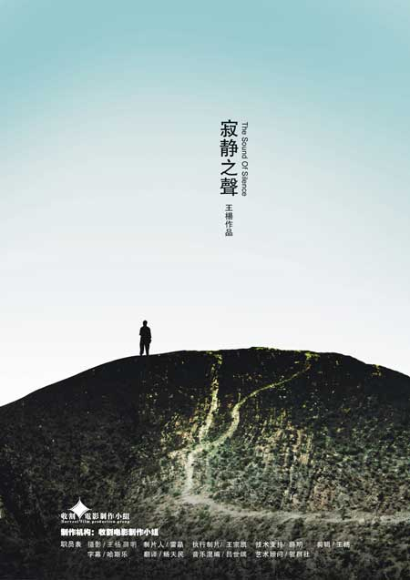
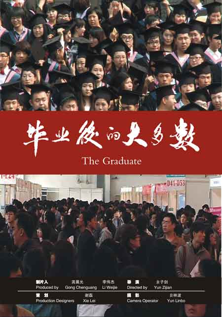

# 三月预告：后大学时代——象牙塔里的骨感理想（十城同映）

当大学生们跨出校门后，有关理想的出路，有关生活的出路，有关爱情的出路。迷茫、现实、压力……等等问题接踵而至。3月主题放映献上两部有关后大学时代的优质纪录片王杨《寂静之声》和《毕业后的大多数》，瓢虫映像十地联映。

有人说考研的学生过得是猪一样的生活，找工作的学生过的是狗一样的生活，不准备考研又找不到工作的过得是猪狗不如的生活。为了摆脱现状和为将来谋一条出路，他们开始漫无目的地去完成从理想到现实的过程。期间，他们丢掉个性，失去理想，埋葬幸福，丧失自我，甘于平庸。

**【放映主题】后大学时代——象牙塔里的骨感理想** **【放映时间】** 2013年03月 **【放映城市】** 十城同步放映！ 北京(导演远程交流)、上海、广州、成都、南京、武汉、重庆、厦门、杭州、西安(待定) **【观影报名】 [报名入口请点击此处](http://site.douban.com/177837/room/2069620/)** （PS：部分站点放映时间暂未确定，请关注瓢虫映像豆瓣小站、微信公众平台，或新浪微博@瓢虫映像，掌握一手活动信息。） **【放映影片】**  《寂静之声》 **故事梗概：**

只有荒野上干枯的风声，等待着主人公七年之后的再次造访。这里是童年记忆里美好的自然乐园，这里是第一次约会，将名字刻在石头上的地放。如今，物是人非，时间如大海般寂静。这里拥有的只有风声，面对着过去与未来搅拌得来的悲伤，年轻人在嬉戏之后，疲惫的打起盹来。与此同时，其他几位年轻人渡过了他们青春最后的焦躁时期。

**导演阐述：**

此片纪录几位年轻人的生活，我在其中不仅仅发现现实的重压，还有面对个人生活与政治生活所产生的愤怒、忧伤、勇气与记忆。时间无声，匆忙赶路，哑口无言的孩子，张大嘴巴试图有所行为，来挽回迅速消逝的青春或者梦想。

**参展、获奖情况：** 第六届中国纪录片交流周-竞赛单元 首届廊桥独立影像节 美国杜克大学、 加州大学正式收藏 德国纽伦堡-埃尔兰根中国电影  《毕业后的大多数》 **故事梗概：**

《毕业后的大多数》拍摄的是一帮出生在八零年代的青年们，随着教育改革，大学的大规模扩招，如今这一庞大的青年文化人群已成为当今社会的主要劳动力。 他们毕业后的生活状况，以考研、公务员、房子、婚姻等社会热点为载体，记录了跨出校门的生活对大学生们意味着什么。展现大学毕业生们看似不同却又相同的生活。

**导演阐述：**

我们出生在八零年代，喝着可乐，玩着电子游戏，听着流行音乐，看着香港电影，在美好预言里成长。我们坚信自己与众不同，坚信世界会因自己而改变，随着大学的大规模扩招，我们都如愿以偿的成了天之骄子。可是之后呢？我们是什么？我也不知道。

我想这些很难归结于是体制的、个人的、还是时代造成的，这些的确是真实存在的。因为这个时代假象和骗局太多，所以我拍的是我看到的，只有真实才能永恒。在这个世界上被遗忘的永远是大多数，也许只有影像才能记录下我们这些平凡的大多数，那时我们那么年轻，那时我们那么惆怅，那时我们那么疯狂。

**参展、获奖记录：** 第五届新人电影节新人奖。 入围凤凰纪录片大奖 

**瓢虫映像(PureMovies)**为一非营利性质的民间组织，由青年人文生活门户北斗网（ibeidou.org）于2012年5月发起并创立。瓢虫映像由来自不同地区的志愿者跨域协作，致力于全球范围内发现和传播反映中国人文生活的纪实影像。

‚**瓢虫映像所放映的一切电影及影像作品，均已获得原版权所有者授权许可。**我们郑重声明不复制、不上传网络、不向他人借阅影像拷贝。

