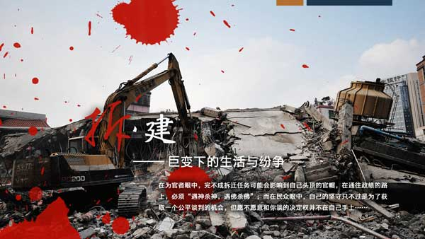
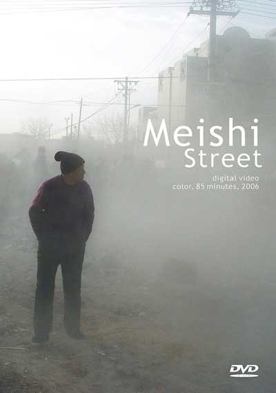
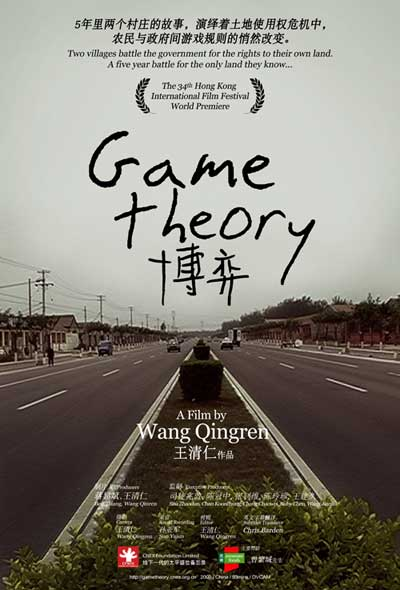
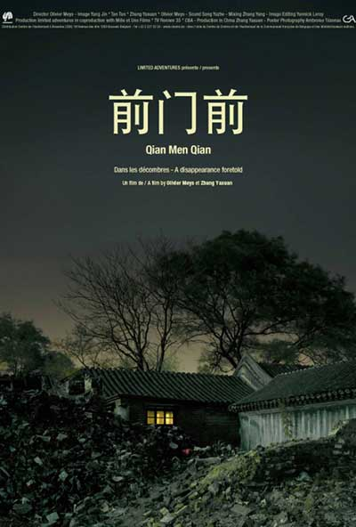

# 四月预告：拆·建——巨变下的生活与纷争（十城同映）

在为官者眼中，完不成拆迁任务可能会影响到自己头顶的官帽，在通往政绩的路上，必须“遇神杀神，遇佛杀佛”；而在民众眼中，自己的坚守只不过是为了获取一个公平谈判的机会，但愿不愿意和你谈的决定权并不在自己手上……

**【本月主题】**拆·建——巨变下的生活与纷争 **【放映时间】**2013年04月 **【放映城市】**北京、上海、广州、成都、南京、武汉、重庆、厦门、杭州、西安 **【观影报名】[报名入口请点击这里](http://site.douban.com/177837/room/2069620/)** （PS：部分站点放映时间暂未确定，请关注瓢虫映像豆瓣小站、微信公众平台，或新浪微博@瓢虫映像，掌握一手活动信息。） **【放映影片】** 一、《煤市街》 

**故事梗概：**

本片是《大栅栏计划》的组成部分，《大栅栏计划》由德国联邦文化基金会和歌德学院北京分院共同支持。

煤市街，位于北京天安门广场西南侧的大栅栏地区，是一条南北走向的街道。为了在2008年奥运会前改善大栅栏地区的交通和市政设施，对这一破败的老旧城区进行改造，从2004年12月27日起，北京市政府启动了煤市街道路改扩建项目，要把原来8米宽的路面扩宽到25米，因此这条街上的多数原住民均面临被拆迁的命运。张金利、孙铁生和刘瑞萍是煤市街的三个拆迁户，他们因为不满政府和拆迁公司的赔偿方案而走上漫长的维权之路，最后均以失败告终，就算是他们之中最顽强的张金利，亦难逃被强拆的结局。这是中国大多数城市在更新发展过程中司空见惯的故事，但这部影片特殊之处在于多数素材由当事人亲自拍摄，那种置身其中的热切以及他们亲历的伤痛，呈现出不可代言的力度。他们的抗争行动改变了煤市街寻常的市井空间，让它焕发出一种新的意味。在剧烈变迁的时代，手持摄影机的张金利们，正在成为另类历史的纪录者。

**导演简介：**

欧宁，艺术家、诗人、策展人、出版人，1969年生于广东，1993年毕业于深圳大学国际文化传播系。1994年创办音乐团体新群众。1999年在深圳、广州两地创办电影团体缘影会。2004年创办艺术空间别馆。2005年创办大声展。曾拍摄纪录片《三元里》、《煤市街》，在世界各地展出、放映并被收藏、研究。2011年创办《天南》文学双月刊并任主编，同时发起致力于乡村建设和共同生活实验的“碧山共同体”计划。现生活工作于北京。

欧宁认为艺术家的参与可以让社会运动更具感染力。有个人的诉求，有人性的闪光，有感情的投入，才会让更多的民众参与其中并最终推动社会的发展。

**二、《博弈》**

**故事梗概：**

故事发生在毗邻北京的麻营村和梨园村。2005年春，某企业要在麻营村耕地上建厂，54户农民住宅面临拆除。村民强烈反对。村书记赵友仓，既是拆迁人员，也是拆迁户。他在官民、亲情之间摇摆、斡旋，扮演着双面角色。在村民赵俊东的带领下，反拆派与管委会干部展开了拉锯战……

同时，相隔3公里的梨园村，20多户农民饱受拆迁之苦。他们在律师帮助下向开发区法院起诉，告开发区管委会在新奥艺术大道拆迁中不给村民宅基地，拖延回迁，违法、违约。

梨园村村民张连仲父母双双瘫痪在床，生活空间的改变在老人心中引起层层涟漪，张母每日以酒浇愁，只求一死。张连仲忍受绝望的生活，悉心照料更加绝望的父母……

拆迁改变了农民的生活空间，空间变化掀动人们心中的巨大波澜……

**导演阐述：**

面对岌岌可危的土地使用权，梨园村和麻营的农民使出浑身解数和争夺者博弈。有面对面的唇枪舌剑，也有不见硝烟的智斗。这折射出当下中国农村及农民的生存状态。

博弈描述了政府和农民之间微妙的互动关系，及中国体制下官与民之间游戏规则的悄然改变。博弈是社会生活的进步，它拉近了今日中国和公民社会的距离。

博弈让官方和农民都失去了很多东西，也让我们感受到了整个社会的成长。

博弈正在继续……

**参展、获奖记录：** ****第34届香港国际电影节 人道纪录片竞赛单元（2010） 第七届中国独立影像年度展影展十佳纪录片展映单元（2010） 第二届澳门国际电影节纪录片竞赛（2010） 第五届“云之南”纪录影像展入围竞赛单元（2011） **三、《前门前》**

**故事梗概：**

"前门"既是天安门广场南侧那座城门楼，也可以指向东南延伸出去的那片地区。它同隔一条前门大街相对的大栅栏经过了类似的发展历程，但作为商业区的那部分早在解放以后就开始衰落。之后的几十年时间，基本把这里变成了一个单纯的生活社区。在2005年9月前门地区的拆迁改造工程展开之前，这里生活着大约8万人口。他们的构成相对大栅栏单纯，多数都是在胡同里生活了几代或半辈子的北京人。因为地处中心的优越位置，这片基础设施陈旧，人口密度高而且往往生活窘迫的社区正在经历一场不可避免的现代化改造。

《前门前》跟随这漫长的改造过程，不动声色地注视这种改变对于那些生活在这里的人们意味着什么。从一个现实到另一个现实，一个段落到另一个段落，它聚合不同的时刻和感性，见证的是态度，行动，拆毁，建设，离去以及坚守；它描述一种似乎是必然的倾覆和消失，不仅仅限于物质的；它并不夸张，但也试图如实传达这个过程里，掩抑的愤怒和不满，无奈和悲伤。它就象一幅拼图，描绘出了城市化进程里，一个老社区不能静止的肖像；其中折射出来的，是今日中国，一个重复了千遍的故事。

**导演简介：**

Olivier Meys, 导演。1974年生于布鲁塞尔，2000年毕业于比利时IAD艺术传播学院电影导演专业。毕业前他完成了一部剧情短片《我行我路》，之后做过一些副导演工作。2001年之后，他制作了一些声音纪录片，包括反映中国河南艾滋病患者状况的《发高烧》（2001）；智利本土印第安人反对西班牙跨国公司抢占他们土地的《土地上的人们》；2004年，他再次来到中国，拍摄了一个三峡移民家庭的父子两代，2005年的纪录片《去不息》和声音作品《猴年》都来自于这次拍摄，之后他来到北京生活。2006年，他完成了第三部中国题材的声音纪录片《地下四季》，它们作为"身份：农民／工人"三部曲，使他获得2007年SCAM（多媒体作者协会）大奖 ;2008年，在一年半的工作之后，他完成了第二部纪录作品《前门前》，它参加了本年度法国真实电影节，亦获得SCAM的国际奖。

张亚璇，影评人，影展策划人。1973年生于河北,2000年毕业于北京师范大学艺术系。之后一直从事独立影像的评介和推广工作。作为影评人，长期为艺术杂志撰写独立电影专栏，与人合著出版《一个人的影像》，《故乡三部曲——贾樟柯的电影》，也是《电影＋》系列丛书的作者之一；作为影展策划人，从2001年首届独立映像节开始，在国内外多个城市策划过多次影展，也参与了不同影像活动的组织，积极推进国内独立影像推广平台的构建。近年来开始介入到纪录片的制作，与Olivier Meys一起完成了《前门前》，也是《秉爱》的合作制片。

**参展、获奖记录：** ****2008年3月法国真实电影节SCAM（国际多媒体作者联盟）大奖； 2008年6月圣彼得堡国际纪录片电影节； 2008年10月德国莱比锡纪录片电影节； 2008年11月比利时FATP纪录片电影节； 意大利佛罗伦萨Popoli纪录片电影节 

**瓢虫映像(PureMovies)**为一非营利性质的民间组织，由青年人文生活门户北斗网（ibeidou.org）于2012年5月发起并创立。瓢虫映像由来自不同地区的志愿者跨域协作，致力于全球范围内发现和传播反映中国人文生活的纪实影像。

‚**瓢虫映像所放映的一切电影及影像作品，均已获得原版权所有者授权许可。**我们郑重声明不复制、不上传网络、不向他人借阅影像拷贝。

