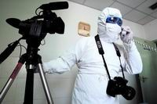
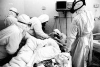
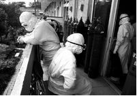
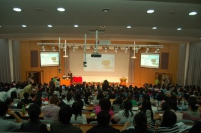

# 回望非典

## **【瓢虫映像】回望非典**

## —— “非典时期的怕与爱”纪录片展映暨导演沙龙

时间的流逝并不能磨灭非典在中国人脑海里留下的烙印，无论是当时的恐惧还是片刻的感动，到今天都仍在影响着我们。2013年，非典十周年之际，瓢虫映像为大家带来三部优秀的非典纪录片，让我们通过当时留下的宝贵影像，再次注目那段阴霾笼罩下的生活，去感受那段遭遇遗留人心底的怕与爱。

### ——现场访谈

**主持人：**在“非典”时期，大家都是处在一个非常不同的状态。那么，我想问一下三位导演，你们当时都分别处在什么样的状态？首先，请汪士卿导演说一下。

**导演简介**：

汪士卿，纪录片导演，电影摄影师。出生于陕西省安康市平利县， 1996年考入北京电影学院摄影本科。摄影作品：故事片《柠檬》《新红河谷》《黎歌》。纪录片《沿江而上》《千锤百炼》，分别获得45届和48届金马奖最佳纪录片。

**汪士卿：**当时拍摄的时候，还是有些恐惧和害怕的，就戴着口罩去拍，一天拍完下来之后，还去医院查过体温什么的。还是请另外两位导演说吧，因为他们在拍摄中的煎熬，比我要长的多。

**主持人**：好，那么请张洪峰导演跟我们分享一下，当时您在医院里面的特殊的经历。

**张洪峰：**我当时在河南做中国艾滋病调查，其实我对北京的情况也不了解。我回到北京以后呢，就直接进入了地坛医院，于是我只了解地坛医院的病房。那么，我觉得正好是刚才他们两位导演的影片，让我补了一课，我现在才弄清楚当时北京城发生了什么事情。

**导演简介**：

张洪峰，《地坛医院60天》导演。1968年生，山西襄垣人。摄影家，纪录片导演。现主要从事纪实、风光、人文题材的图片及电视创作。主要作品有《窑工》《背影》）

摄影师在地坛医院。说：“2003年在很多人的记忆里就是白口罩，但是对我，是生和死。”

**主持人：**对，他们记录了医院以外的正常人的生活，您的记录是关于医院里的医生，还有患者他们。 下面有请杜老师来给我们讲讲。

**杜波：**就首先我们把北京“非典”，包括张老师在的地坛医院，人民医院，北方交大，就是当时有“非典”病例出现的地方，我们基本上都去了。哪有病例，我们往哪儿跑，跟神经病似的。然后，后来我们又去了上海。怎么说呢，十年过去了，看一下吧，我感觉什么都没变，什么都没变。我们周围的环境一点都没变。十年前的SARS，现在的禽流感。唯一变化的是，十年前，房价四千，现在是四万。好像其他都没什么变化。我们依旧还是不懂得互相尊重，既不尊重同类，也不尊重禽类，也不尊重兽类。人间还是这样，大家还是该吃什么吃什么，该喝什么喝什么。

**导演简介：**

杜波，《北京故事》导演。1976年生，陕西西安人。毕业于北京电影学院广告系。

**主持人：**通过您三位的影片，我们不仅是去回顾03年发生的这些事情，我们更多的是要去反思。之前我看过《三联生活周刊》做过的“非典”十周年的专题，标题是“非典改变的中国”。但是刚刚听到您说的，“其实什么都没变”，其实也很有道理。

**杜波：**其实“非典”对北京带来的最大的变化就是多了几条酒吧街。从03年以后，现在我们所看到的后海的酒吧街，都是在那时如雨后春笋一般，一夜冒出来的，就是在5月1号到5月10号那10天。后海大概多了有300多家酒吧。

**主持人：**这是因为什么呢？

**杜波：**就是因为非典。因为当时北京没有人去任何地方，大家都不出门，都躲着。到五一的时候都躲得差不多了，憋得不行了。其实我觉得“非典”为北京市做的贡献，就是多了很多旅游景点，还火了很多饭馆。“非典”的时候，我们在路上开车能开到160码。在4月26号那天，我们从东长安街到西长安街只见了一辆车。当时超市里的东西都被抢光了。人们在“非典”那个时候都疯了、都“变态”了。外地人都跑了，本地人在外面吃不着饭也没地儿去，出去到哪都得量体温。我们到上海，我算了一下，从首都机场上飞机到飞机起飞，我被量了8次体温，我也不知道他们为什么要重复量。给大家讲一个搞笑的事吧。当时到了上海以后，我们几个哥们下了飞机，去打出租车，上海司机一听我们说话就说，“你们北京来的？” 我说是，然后司机就偷偷从旁边摸出一口罩戴上了，然后开进一个院子里，把门一摔就出去了，就说“来人啊，来人啊！”跟我们没有一点商量，直接把我们从机场拉到了虹口区的派出所。

**主持人：**他的第一反应不是把你们送去医院？

**杜波：**不是，直接送去派出所。派出所警察一来就问，“你们是北京来的？你们的身份证呢？你们来干嘛？你们有没有量体温？”当时我们去了3个人，如果有一个人的体温到了38度以上，我们就会被上海的警察送到一个专门的酒店里住15天才能出来。幸亏当时我们没有任何一个人发一点点烧.万一有发烧的情况的话，我们立刻就会被隔离了。我觉得大家当时处于一种神经病的状态，就像刚刚的片子里拍的，两个人可能还没有爱到那一步就决定结婚了。

**主持人：**是。情感在非常态下，都被放大了。

**杜波：**是，每个人的情感都被放大了。然后“非典”一过，大家就跟没发生过一样，就忘了。今年的禽流感也一样，大家都会把过去发生的事情都忘掉。我看了张老师关于医院的那个片子，看得我心里特别难受。其实我觉得作为一个中国人，挺难受的就是，我们现在可能不需要英雄，每一个医务工作者都很可怜的。刚刚张老师说还想做一个纪录片，我也知道，因为治疗造成很多患者股骨头坏死，大剂量地使用激素，后来造成了很多残疾。

**主持人：**对。其实很多患者虽然康复了，但是他们在这之后的十年其实经历了很多，我也关注了这些他们后遗症所带来的痛苦。就好像张老师的电影当中您的那位同事，我看到了一个给他拍的一段宣传片，他意志很坚定也很乐观，去克服他的那个股骨头坏死。老师，我看了您的那个片子里有很多关于“生与死”这个话题的，您在医院里也待了那么长的时间，能跟我们讲一下您在这个过程中的心态变化吗？

**张洪峰：**当时我从河南回到北京，有了这个事情以后，他们说这边不能拍摄了，说是有一种病很严重。当时我们在拍艾滋病的中国的乡村调查，心想还有什么比艾滋病更严重的。我说那要不我去拍“非典”。我当时并不觉得我很勇敢，我只觉得我们应该在我们的岗位上。到了以后，当天我们就按照常规，要和医院去做一个交流，但是没有时间。我们只谈了两分钟，就发现医院里没有口罩没有防护服了，这就特别像战争影片里没有子弹一样。我觉得这个还是非常惊讶的。我觉得那我们就一起去寻找物资。第二天就有一个气管切开手术，我们去拍，可这个人很快就死掉了。我们从阳光下到了生死的边缘，也就24个小时。所以这个片子的第一集就叫24小时。

**主持人：**生与死的边缘？

**张洪峰：**没错。实际上生死是一种常态。我当时一直在不停地拍，照片应该有8000多张。所以等60天结束以后，我觉得非常不真实，觉得经历了那么多惊心动魄的事，突然有一天结束了。

**主持人**：我想再问汪士卿导演，您的片子里最后出现的那两个采访对象，我看到后觉得很惊讶。因为他们两个是“被”传销了。您为什么会选择他们两个来作为结束呢？是觉得他们的出现也让您挺惊讶？

**汪士卿：**我先说一下我拍这部片子的起因和想法吧，我再回答你刚才这个问题。拍这部片子其实有两种准备，第一个是，我当时住得离西客站特别近，并且当时我在公安大学上班，从南广场每天要穿越西客站。所以对这个公共空间特别熟悉。第二个是，我在大四的时候，班里出现了几个拍纪录片的同学，大家搞了一个道光电影小组。当时我们就有拍纪录片的一些计划。“非典”之前就已经策划拍北京西站的纪录片，看看在这个空间里面会发生怎样的故事。DV出现了之后，手段就比较丰富了。那个时候我所关注的点，就是特别希望能拍公共空间里的人。北京“非典”的状况可能你们没经历过。我们那个时候都不让出门，我就在南广场租住的一个22层的楼里面。因为那个时候哪都不让去，也很郁闷，看了很多的书，甚至很多平常不看的书，像叔本华、尼采之类的。有一天当你有所积淀的时候呢，你就会按捺不住，刚好那天我房间里有PD150的摄像机，当时这个摄像机还比较流行。拍这部片子也没有完整的策划，就觉得出去看看会发生一些什么东西。因为我的身份跟他们不一样，他们能进医院是因为他们都是正规的央视的记者，他们的身份感会比我强很多。我想拍纯粹是因为我自己的一个想法，有了这个机会之后，我就去实验了一次。给自己做了伪装，拿了站台票，因为我对这个空间比较熟悉，我就从进站，到站台，到候车室，到出站，形成了一个这样的流程。所以我现在可以回答你之前的问题。进广场的时候人特别多，到最后出站的时候人特别少。因为拍纪录片需要耐心，如果我早早走了的话确实就碰不到这两个人，碰上了他们可以说是一种运气。我必须要等到那些到北京来的人，来问问他们的想法，刚好就碰到了这两个人。他们是想来北京做“非典”的护工，其实跟“非典”没有直接关系，是因为他们搞传销亏欠了家里，然后车票丢了，又被车站的人盘问，最后他们没钱买口罩，说了一番自己的遭遇。其实很简单，就拍了一天，片子也很短，就14分钟的一个小片子。这里面也没有一个一定要表达的大的想法，还是想听听同学们看片子的感受，自己觉得的就这些。

**主持人：**那我们现在把机会交给台下的同学。有什么想要问导演的可以发问了。

**观众1：**三位导演你们好。我想问这样一个问题，就是导演提到的想拍一下关于幸存者的这个话题的影片。在我看来，幸存者包括两个方面，一方面就是您刚才所说的，您自己经历过60天的生与死，零距离的接触，过去之后给心里带来震撼的感觉；另外一个方面就是我们在纪录片中看到的他们痊愈了，但是我不知道他们痊愈之后是一种怎样的状态。可能一方面他们真正的和我们正常人一样了。刚才如主持人所说的您的一个同事，他有什么样的问题。您在下部补拍的时候，会以哪个方面为重点来进行拍摄？

**张洪峰：**因为“非典”的时间比较长，到了最后已经认识医院里的每一个人，患者或是医生。经历了这个过程以后，我觉得我对他们是有义务的。这么多年了我都很想念这些人。刘洪波（音译）作为同事，我会关注他，会去看一看，包括于守平（音译）他们康复出院。其实我更想知道，经历了这场灾难和没经历这场灾难，你的人生会发生怎样的变化。就像经历过一场战争和没经历过一场战争，你的人生会发生怎样的变化。

我的幸存者不单单局限在幸存本身，我更多的是想探讨的是，比如我问一个病人，你是想现在死掉，还是想股骨头坏死然后继续活下来。我们不管是感染也好，没有感染也好，经历过那个时间以后，我们怎样来面对我们余下的生命。当你作为幸存者活下来的时候，你知道你曾经与死神擦肩而过，随着我们人到中年，我们就没有那么从容了。你们很年轻，可以做很多很多计划，但我觉得到了我这个年龄，我不做计划了，要做什么马上就会做。“非典”以后给我带来了很多改变，比如说我在03年因为“非典”，我的关于艾滋病的片子没有拍完。等我再回到河南去拍艾滋病的时候，我的选题发生了很多改变。如果说以前去拍河南的艾滋病，这是个很大的事情，我拍出来得得多少奖啊。但是从“非典”病房康复出院之后，再去河南，我想的已经不是怎样才能惊天动地了，我觉得什么作品什么奖项跟我已经没有什么关系了，我觉得人与人的关系已经发生改变了。到最后我完全成了一个关于艾滋病的志愿者。我要寻找的，就是和我们共同认识的老朋友们，他们不一样的生活。如果能在“非典”病房活着出来，代价是股骨头坏死的话，我非常愿意交换。这是我的一个取材方向。我们是属于亲历者。现在很多同行来采访的话，他们谈的是别人的事，而我们更关心的是我们自己的事。

**观众2：**三位导演好。我觉得“非典”是一个重大的疫情。刚才杜波导演说，十年前十年后，好像没有什么变化。我想问“非典”到底有没有带来一些影响或者启发之类的？那些经历了“非典”的人，“非典”对他们的人生又有怎样的影响？

**杜波：**不知道大家真的了不了解“非典”的整个过程？可能不是很清楚吧。03年的时候，这个病最早是从广州起来的。在佛山，大家发现了一种非常奇怪的病，它的发病的状态和肺炎是一样的，会发生呼吸困难，好像呼吸时血液已经不产氧了。实际北京的“非典”真正开始的时候已经是四月份了。当时所有的医院，包括人民医院，地坛医院，小汤山，都是在试，死马当活马医，没有任何办法地在治。现在禽流感一出来，全国就会把各种各样的血液拿来研究，可在当时根本没有。当全北京市人民开始恐慌的时候，是4月23号，北京人才承认我们已经有“非典”了。所以我们从对待这类事件的态度上来说，我们没有什么变化。当年我们杀的是果子狸，今天我们埋的是鸡。

**主持人：**特别赞同您的说法。其实大家都应该去反思一下，从这个事情当中去反思。

**杜波：**我特别喜欢汪老师的片子里的一个情节。就是火车站里面那个人被采访时说，“哎，你往后退！往后退！”我们的社会不缺少英雄。但是我们应该反思一下，为什么要有一场战争来把你变成英雄。我觉得应该更深层次地去想这样一个问题，而不是说我们怎么样去治，这些人他们怎么样不容易。

**观众3：**前面几位观众问的都是情感方面的问题。我第一个问题想问汪士卿导演和杜波导演。你们的作品有大量的街采部分，那么您在设计街采问题的时候，有没有想过多问几个？比如说里面大家都提到比较恐慌、害怕或者担心，但影片中到这里就戛然而止了。那么你们在采访的时候有没有想过要问他们，为什么会有这种恐慌感。我感觉这样会使影片更立体一些。您二位对这个问题的看法是怎样想的？

**汪士卿：**我没有什么采访的提纲，也不知道会遇到什么样的人，我也不是专业的新闻记者。当时也就问了一些比较感性的问题，也没有进行严谨的梳理。为什么会恐慌？大家都觉得得了这个病会死。就像刚才杜老师说的，在这个现象背后的东西其实更值得关注。这对于现在的食品安全问题对社会的发展的影响，比较有借鉴意义。

**杜波：**我可能跟你拍摄的时候不一样。我是4月24号去的北京站，当时北京站已经被警察包围了。你看影片中有些镜头很晃，实际上都是我们偷拍的。

**张洪峰：**对于刚才这两部片子来说，我觉得我和你（提问者）一样都是观众。我觉得这两部片子很深刻。我希望你一个人回去以后把这两部片子好好看一下。我只是经历了一点，但他们经历了整个事件的本身。假如说我和他们换个位置，我在北京西站的话，我不一定能拍到这些细节。因为我觉得现场是不可以假设的。问题不在于它怎么样才能问得深刻，而在于那个时候能举起摄影机。中国有几十万名记者，举起摄影机的有多少？没有多少。 但是你们还很年轻。我相信当你们有一天面临选择的时候，你们也会有你们自己的选择。

**观众3：**张老师，在您的影片当中，对于医生、护士和病人的看法是通过解说来完成的。我认为这个解说应该不是记者本人的，而是解说员的声音。那么为什么没有直接用这些人的采访？是当时没有做这个采访，还是因为别的原因没有用？我觉得用了的话会更真实，给人的冲击感会更大。

**张洪峰：**在“非典”病房也好，在西客站也好，在北京也好，关键的是那时我们有一个摄影机在表达我们的感受，这是一个很好的选择。医生和护士的采访是后来补的，是希望大家对这个事情有一个相对清晰的了解。我的片子就和电影一样，没有任何的采访。我只能表达我所看到的东西。再说别人都快喘不上气来了，你还去问别人问题，这是没办法实现的。你如果有看我其他的影片的话，你就会发现我从来不用采访。我们当时的感觉就是，我们是志愿者。

**观众3：**我在看过您这部影片之后，我感觉解说非常累赘，它作为一部纪录片，它的画面感没有得到最充分的展示。

**张洪峰：**在现场是没有“如果”的。你看到的这个地坛医院的纪录片，它目前是唯一的，将来也是唯一的，它的价值在于不可替代性。因为它不是戏剧不是电影，它是现场的每一秒钟。因为你没有经历过“非典”，没有经历过灾难，你当然觉得它的解说是累赘的。但如果你是一个幸存者，你会觉得那正是我想说的话。“非典”给我带来的最大的一个感受就是，我很真实。我给别人的感觉是我很坚强，但当我穿上“非典”防护服的时候，我每天都在流眼泪。

**观众4：**首先我想向三位导演和当时的医护人员表示敬意。我想问张导一个问题，刚才主持人提到了“非典”后遗症的问题，是因为当时过量注射激素，导致北京现在有150多个“非典”后遗症的患者。但不管是在“非典”期间还是在“非典”结束之后，没有的媒体提这个大量激素使用所带来的后果。有些患者在“非典”结束之后出现了骨头疼痛的情况，当时媒体的报道是说这些患者应该加强锻炼，应该去爬山。我想问一问张导，当时你们作为媒体工作者是不是知道这个事情，出于各种原因不能报道呢，还是本来就不知道这个激素的事情？

**张洪峰：**首先我现在是一个独立艺术家，我不代表媒体。媒体怎么想，我不知道，我只知道当时我很幸运，我活着出来了。当时为什么要使用激素呢？我不是医学家，但当时使用激素是我们可能找到的唯一的办法。如果我现在感染了，不给我激素的话，很可能我今天晚上就死掉了。用了激素以后，我的症状在缓解，让我能坚持到熬过去的那一天。 在死亡和生的面前，你能以最差的姿态活下来就不错了。我是这么认为的。

**观众5：**我对第一部和第二部影片感受会更深一些，因为它们的纪实性很强。但《地坛医院60天》的歌颂成分好像多了一些。

**张洪峰：**我觉得这并不是歌颂，真的不是歌颂，因为在那个时候真的会死人的。如果没有他们集体堵枪眼的话，我可以这么说，在座的很多人我们都不会存在。

**杜波：**“非典”这个东西有很多面，我们三个人的作品放在一起我觉得是完成了一个事，是一个作品。三个片子合在一起，互相是一个补充。我很遗憾的就是，原来我们拍了很多的东西都没有放进去。我们还拍了一些这样的人，比如说，你是疑似病例，我是盯着你的。每天政府会给我补助20块钱，我每天蹲在你家楼下，你要吃东西你把钱给我，我帮你去买。但是我不能让你出来。这些东西特别有意思，但很遗憾现在都丢掉了。

**张洪峰**：如果当时没有影片当中的医生和护士的话，北京这个城市就会崩溃。我感到很自豪的就是，我们中国还有那么一批人在积极地堵枪眼。不管以后对“非典”怎么解读，对这批人我们始终是保持敬意的。

**观众6：**请问三位导演对于纪录片的理念是什么？

**杜波：**我现在一直在从事影视作品的一些工作，现在倒没怎么介入纪录片。因为做纪录片是一件非常辛苦的事情。我是一个投机分子。从个人经济收入上来讲，做这个行业可能不够划算，所以就去拍电影了。关于纪录片的理解，我记得曾经司徒赵庚（音译）老师在北师大讲课的时候，跟我们讲过什么叫纪录片。他一直被一个问题纠结，就是，你的摄影机在哪里？他有一个理论，最好的纪录片，就是被你拍摄的人，认为你不存在。我拍完这部电影后我去找司徒老师，我说不可能吧，我还得偷拍啊。但司徒老师说，你偷拍就对了！我们就是一面镜子，没有任何的态度，没有任何想要表达的立场。但是我觉得这挺难的。拍任何片子的时候，你都会在无意之中把你的态度加进去，不可能没有态度。

**汪士卿：**在纪录片电影史上，主要分为两大类。一类是法国让路士（音译）的真实电影，一类是美国的米瑟斯（音译）兄弟为代表的直接电影。还有一种就是有参与感，包括你可以提问，把自己的话录进去。当然还有加了解说旁白的，这种一般被称作专题性的影片或者是商业性的纪录片，像Discovery、BBC或者是舌尖上的中国这样的。在中国缺乏的就是社会调查类的纪录片，它主要关心的是人和社会的关系，和公共空间的关系，和政府的关系。这个在美国特别发达，因为这种表达牵扯到自由、民主、公平、正义，这些可能在我们的社会比较缺乏的东西。所以在中国有些东西不让你拍，但在美国却很多。它可以说政府坏话，可以质问官员，甚至可以辱骂官员，这个在我们国家是不可能的。我们国家在这个方面还是比较欠缺。我从99年到2010年一直在做纪录片，从08年到现在一直过渡到做故事片。今年有两部纪录片要上映，但这两部纪录片都是在10年做的。一个是关于一个叫赵半狄（音译)的艺术家，还有一个是关于四川的拳击，叫《千锤百炼》。这两部电影会在电影院里放。纪录片的理念这个话题讨论不完，也不是一句两句能说清楚的。国外的纪录片跟电影工业基本上是齐头并进的，对观众和制作者都是一个很高级的形态。而我们国家在纪录片方面的观念的发展还处于一个比较滞后的、地下的状态。大家现在喜欢看的，还是类似于舌尖上的中国这种关于吃喝玩的纪录片。我们三个的这种关于“非典”的纪录片，现在都不太好找，主流媒体也不会播。所以还有待于提高吧。

**张洪峰：**在2003年的时候，其实每一个医生和护士都是士兵。他们用他们的生命，给我们建立了一道防线。医生和护士们就是拿一份工作，如果他们不尽力的话也可以啊，没有人会说什么，但他们每个人都选择了尽力。如果说我提起他们是为了歌颂的话，那我觉得我很愿意歌颂他们，因为地坛医院是我本人也是他们的再生之地。我们现在作为活着的人，我们去歌颂士兵难道有问题吗？

**主持人：**我觉得这可能是因为处在的立场不同。你可能只是作为一个普通的观影者，没有参与到那个事件当中。

**张洪峰：**所以我觉得大家还是太容易遗忘了。他们当年用血肉之躯让我们每一个人都有一个健康活下来的机会，现在我多给他们一些镜头。我非常理解这位观众的想法，你没有错，但是我觉得我们怎么感谢他们都不为过。因为我们是一家人。我到现在为止我都不觉得，我拍了一部作品，只是我们共同有过一段经历。其实我并不觉得我不拍片了就会有什么大不了的，因为我已经拍了我一生当中最重要的一部作品——《地坛医院60天》。在我的有生之年，和这样一群可爱、普通而又没有姓名的人生活过。所以你今天给我的问题更让我觉得，我从明天开始还应该拿起摄影机拍我的《幸存者》。因为再过10年，他们会被人遗忘。

（根据现场录音整理，有删节）

——导演说： 

“并不是我多想渲染可怕，而是事实就是如此。我要主动表现的，就是生和死的这种临界点上，也许几个小时之后就死，也许几个小时之后就生。”

——张洪峰

“拍摄时心情比较复杂，因为sars病毒的传染和致命性，我是鼓足了勇气戴了三层口罩才上阵的。那天除了我没有其他的摄影师在场，一天中遇到很多的麻烦，都被我巧妙的化解，当然脸皮还要厚，拍纪录片需要随机应变的能力。在那个被称为豆腐渣工程的西站呆了一天，心里有些透不过气来。晚上回去第一件事就是测量体温，在以后的一周时间里重复这一无聊得动作，万一发烧，我就成非典疑似患者了。”

——汪士卿

### ——观众评价：

一部14分钟的短片能讲一个怎样的关于非典的故事呢？在看之前，相比于其它两个片子（北京故事 & 地坛医院60天）我对这部影片并没有抱什么特别的期待。我暗自想象着，十年前的北京西站——这个我每天上班都会经过的地方，可能会发生些什么……人潮，恐慌的面孔，口罩，疏离的彼此……然后呢，还能有什么？测温计？够了吧。

……

这座城市突然就安静了下来。在那些模糊的回答中，我看到的不是恐慌，是深深的无奈——是这座城市抛弃了这群人，这群从来也就不属于也永远都无法真正属于这个城市的人群，潮水一般涌动，他们与这座城市彼此留恋，却生生拉扯。是的，他们中有多少人是真的因为对非典的恐惧而离开呢，if so,在这个城市最密集的地方之一，这群人眼里却看不到一丝一毫的畏惧，高高拉起的口罩或者让呼吸变得有些困难，更困难的是，不得不离开，开始一段不知道什么时候才会结束的，没有工作——也没有了工资的日子。

……

——豆瓣网友梓然•Iris

天呐，当年上初三的我是多么后知后觉。最近H7N9盛行，虽然远不及非典可怕，但是人们啊，只有无知才会像现在这么无畏。天灾不可避，人祸却可免。人活在世上，要有所敬畏。

——豆瓣网友小千

——后记：

回望非典，影像的意义远远不止记录啊、这么简单，跳出悲苦，跳出怕与爱，让我们反思生命的价值，反思人与动物人与自然的关系，反思我们的生活方式生活习惯，反思我们的危机应对机制。回望非典，不是要揭开伤疤，戳击痛苦的记忆，而是希望通过对记忆的梳理，来反思、记取：学会对生命的热爱、对大自然的敬畏、对伟大“抗非”精神的尊崇、对社会文明进步的信心。

特别感谢：豆瓣网友“小千”与“梓然•Iris”（原评论地址：http://movie.douban.com/review/5890019/）。

（编辑:杜玉婧）
