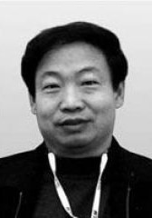
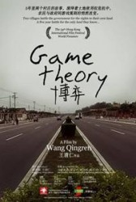
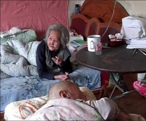

# 王清仁谈《博弈》：我讲的是人和空间的关系

**王清仁其人：**

王清仁， 1987-1999年在廊坊电视台新闻部任职，之后从事专题栏目创作，2002年开始从事纪录片创作，曾任《军训营纪事》和《喧哗的尘土》的制片人。

**纪录片作品：**

2003年， 《军训营纪事》制片人/录音- 入选法国FIPA

《喧哗的尘土》制片人- 入选荷兰IDFA电影节

-2005年获法国马赛纪录片电影节评委会大奖

2004年，《中国夏令营》导演/摄影/剪辑

2005年，《最后的合影》导演/摄影/剪辑

2007年，《合唱》导演/摄影/剪辑

2009年，《博弈》导演/摄影/剪辑

**参展及获奖经历：******

第34届香港国际电影节 人道纪录片竞赛单元

第七届中国独立影像年度展影展十佳纪录片展映单元

第二届澳门国际电影节纪录片竞赛

**《博弈》之路**

**影片梗概：******

2005年春，某企业要在麻营村耕地上建厂，五十四户农民住宅面临拆除，赵俊东等村民强烈反对。赵俊东的侄子赵友仓作为村书记，既是拆迁办的组成人员，同时也是这次的拆迁户。他在官民和亲情之间摇摆、斡旋，扮演着双面角色。 同时，相隔三公里的梨园村，张连仲、陈志刚等二十多户农民也饱受拆迁之苦，在律师邢宪发帮助下向开发区法院起诉，告开发区管委会在新奥艺术大道拆迁工作中不给村民宅基地，拖延回迁，违法、违约。张连仲父母双双瘫痪在床，生活空间的改变在老人心中引起层层涟漪，张母每日以酒浇愁。

麻营村的拆迁农民经过几次拉锯战，赵俊东等反拆派一度占据上风。开发区主任李士祥、赵宗林及时调整策略，重用赵友仓等村干部，6月25日夜，防线崩溃，赵俊东也莫名其妙的签署了拆迁协议。陈志刚、张连仲等起诉开发区管委会的案子三个月后开庭。邢律师舌战管委会雇佣的北京律师，占尽风头。

拆迁改变了农民的生活空间，空间变化掀动人们心中的巨大波澜……

**参展纪录：******

2010香港国际电影节

2010南京中国独立影像年度展

广州国际纪录片大会十佳纪录片

台湾《明日家园》主题纪录片影展

2011云之南纪录影像展

[信息来源]：http://movie.douban.com/subject/6432145/****

**作者阐述：**

面对岌岌可危的土地使用权，梨园村和麻营村的农民使出浑身解数与争夺者博弈。有面对面的唇枪舌剑，也有不见硝烟的智斗。这折射出当下中国农民的生存状态。

本片描述了政府和农民之间微妙的互动关系，及中国体制下官与民之间游戏规则的悄然改变；博弈是社会生活的进步，也让我们感受到了整个社会的成长。

**Q****：您能给我们简单介绍下本片的拍摄背景吗？**

A:“这部电影是我在2005-2009年拍摄的，主要是两个村庄的故事。一个村子叫做‘麻营村’，因为要建一个工厂，在104国道以西有54户人家要面临拆迁，目的是为企业扫清环境障碍。我们跟随政府的拆迁办进入这个村，对整个拆迁过程进行跟拍。另一个村叫‘梨园村’，我们拍摄的时候是05年春天，它在03年1月，也就是非典前夕春节的时候，为了兴建新奥艺术大道，把村子从中间给冲开了，200多户人家涉及到拆迁。2年多时间，他们还没有能回迁，农民的生活发生了很大困难，老人、特别是生病的老人租不到房子，一些人情绪不稳定，年轻人要结婚，因为无房，很难安排未来的生活。在这种情况下，有24家，在村里的废弃地自建房，就等于是违章建筑。法院和政府土地部门对他们的新建房进行强拆。而农民，就请律师起诉，政府违法、违约在先，我拍摄了他们从立案到开庭的全过程。对这两个村的故事，进行了交叉剪辑，形成了这个片子。从这个新闻事件出发，寻找到这样几组人物，从人物的生活、面临的现实逐渐展开这个博弈的故事。”

** **

**Q****：那么，在两个村的拍摄规划方面，您是怎么想的呢？**

A：这是两个村子的故事，拍摄手法不太一样。在麻营村，我们跟着政府过去，每天随着他们运转，跟农民的关系比较疏远。片子中的老人赵俊东，开始我跟他不认识，甚至有冲突，他不愿意让我拍。后来在很长一段时间里，大家经常见面聊天，他很有思想，聊着聊着就聊到一起去了。他开始还以为我是政府的人。纪录片人的尴尬也在于这，谁也不知道你在看什么，因为你说不清楚，早就事随境迁。另外一个村子，我先认识到农民，一直没有村干部，直接走到了原告农民家中，一直到开庭也没有政府的人介入。所以，这是两条线。总的来说，为了观察到这些现象，我做了粗线条的规划，是想拍一个农村城市化、工业化的纪录片，以这样的想法和当时的管委会主要领导沟通。

**Q****：在拍摄的主题方面，我们注意到，不同于一般的拆迁影片呈现的是拆迁的过程，您的片子到后面，关注更多的是人及其内心的东西。您是怎样看待“博弈”这个词在外界与内心两个层面的表现的呢？**

A：有一篇文章叫《论无权者的权利》，普通农民为了自己的利益不停争取的结果换来的是一步步的监控。农民搬进新房，农民的生活依然没有保障，三五年后又沦为贫农了，因为他没了土地，光靠补贴的钱，无法繁衍生息。在影片中可以看到这样的力量博弈，农民的力量是很微弱的，而政府和利益集团一方是相对强大的。

至于内心的博弈，有个很典型的人物，也是影片的焦点人物——赵俊东。刚开始的时候，他家每天都很热闹，一堆人聚在他家，讨论办法，请他出主意。但是他后来却签了字，这个反差太大了。要分析行为的变化，首先要看他心理的变化。先是家庭因素。他爱人因为癌症去世了，他的情绪几乎落到了最低谷。书记又是他的侄子，他既要发出声音，又要维护他侄子。所以，他既是各方博弈的焦点，又是个人内心博弈的集中体现。再是利益因素，政府承诺多给他5万块钱，这对当时的他来说简直就是天文数字，对他的生活非常重要。那时候，他没有工作，就靠他的一点房租，一点地，一年收入很少，他还有孩子，大儿子虽然在工作，但是挣的钱也不多。所以，这五万块钱对他来说也很重要。负面的情绪和严峻的抉择一起摆在他面前，所以对他的伤害和影响非常大，好长时间他都在家里，和村里的人也没接触。

**Q****：从影片中，我们能感受到您和被摄者的关系建立得比较好，比如上面提到的赵俊东，以及我们发现您能直接拍摄到他们生活状况的张连仲一家，这样的拍摄者与被摄者的关系是怎么建立的？**

A：我是在陈志刚家，偶然认识张连仲。他说他母亲，每天都要喝白酒，我就感觉到这个家庭可能是更为典型的一个家庭。所以就到了他们家，发现他们家是一个非常好的拍摄对象，或者说观察点。所以，我花在他家的时间非常多。很多时候，我在村里没事，就在他们家。和他们家的老人聊天。

这个老人3岁生长在天津，就被卖到了一个戏班子，没学成，就嫁到了北京，嫁给了一个大她十几岁的木工。后来在60年代，她离婚了。那会儿，她有了一个女儿，三个儿子，张连仲是最小的儿子。接着，她带着张连仲嫁给了梨园村的一个农民，和之前的孩子都没了联

后来她又生了两个儿子，一个女儿。从六零年代以后，一直到03年这几十年，她最初靠着要饭，逐渐把孩子养大，到九零年以后，给三个儿子娶了媳妇，一人一所房子。她建构的世界完成了，却在她的有生之年要被撕毁，被破坏，这对她内心的伤害是巨大的，产生了绝望感。在这样一个情况下，我们可以打一个比方，每个人都在追求永恒，我们求学、写文章、思考、养孩子，都是在追求永恒的一种体现。对她而言，这种永恒都要被毁掉，这对她的伤害之大可想而知。在这种近距离的接触过程中，开始她特别烦躁，在这过程中和她聊天就让她平静下来，逐渐潜伏下来。

**Q****：从人推及广大的拆迁村庄和地区，这部影片是否具有典型性？是否因为您打过招呼说要拍片，有关部门对您的拍摄比较认同和支持，才有相对比较完美的过程和结果？我们在里面看不到太多的血腥和暴力。但是，据我所知，社会上涉及拆迁的事件，大都充满了血腥和暴力。**

A：我不认为，血腥和暴力具有典型性。本片拍摄时期是我们国家刚刚开始城市化、工业化。在城市化和工业化的过程中，应该考虑到人的因素。因为一切都是为了人，不能以人、或者以人的生活为代价。09年后，许多特别激烈的拆迁才开始出现，当然也不是说在拍摄的同时或之前没有激烈的事件，我相信也是有的。但从另一个方面说，我是在讲人和空间的关系。拆迁改变了农民的生活。拆迁对他们内心的伤害还是比较强烈的。

** Q****：在全国范围内拆迁是普遍存在的现象，大多数人认为是中央和地方在政策实施过程中的不一致，您是怎么样看待这个问题？**

A：一个实行方法，是一个非常现实的检验，怎么样来修正这个想法，也就涉及到了中央和地方。我们怎么来搞现代化，城市化，工业化？我们需不需要？我们怎么走到这一步？是不是非要走到这一步？也是需要我们思考的问题。

我们的农村有着非常长的历史，乡村是我们巨大的文化宝库。从历史上来说，它是我们一切文化发展的宝库和源头，我们的民族文化的源头。在从前，它在我们的唐诗宋词，历史中，是很骄傲，很自信的。然而，现在，我们的乡村是很自卑的，人人都想逃离乡村，你再不会回去那个地方，不再有唐人在诗里描述的那种美感，那种自豪感。从文化的角度来说，怎么恢复乡村文化的自信，是一个大问题。西方是城邦社会，我们是乡村社会，恰恰是我们要城市化，把我们乡村文化丢掉了，铲除了，这个代价是不是太大，这也是一个问题。我们是不是要以牺牲乡村文化为代价，也是我们，包括当政者值得思考的问题。

**Q****：在现代化建设过程中，这种拆迁与抗拆迁的博弈，对乡村文化的牺牲，您认为会持续下去吗？有个期限吗？**

A：这不好说。从这个过程中，你可以看到整个社会是在进步的，毕竟可以开庭，毕竟可以面对面地谈，而且政策也在不断变化。作为拍纪录片的人，也希望唤醒农民，唤醒社会，怎么来保护弱势群体的利益，怎么保护古老乡村文化，而不是一味地铲除，这在某种程度上，跟我们现在在做的“城镇化”、“城市化”、“新农村建设”这些都应该有关系。不要再搞“再造古都”这样的事，我们有古都，然后我们再造古都，这是一个什么呢？这就什么都不是。我们农村有什么呢？我们古老的农村承载很多东西。空间和人，和文化的关系是非常密切的。

举一个例子，荣格讲过一个故事：他小时候，爷爷总是跟他做游戏，他们院子里有个石头，石头里有个洞，随时可以从洞里掏出糖果花生给孙子。这个石头和他家人，和几代人，就构成了这个空间的文化传承。这个石头不是一般的石头，是几代人文化的凝结，是生活的一部分。而乡村，也凝结了一代又一代的文化。不是说全用一个“新”就能延续它，就会出现破坏和反破坏，伤害情感。今天政府要搬走这块石头，对他们家是怎么样的伤害。

龙应台也曾经讲过这样一个故事：家里有一盆很普通的朋友送的非洲沙漠上的草，她和孩子不断的浇水，看着草绿了，发芽了。家里有人来做客，说这草没什么特别，非洲沙漠上有的是，但龙应台对他说，你不知道这盆花的历史，这盆花对于他们母子来说，是他们的生活，是他们生活的一部分，它就不再是普通非洲沙漠上的一棵草。影片中这个老太太她用她的生命，用她的全部构建的那一砖一瓦，都有她的感情，但没了。

记者：瓢虫映像（北京站）编辑:胡璇艺

 
