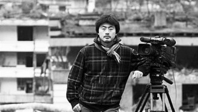
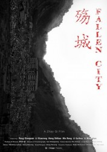

# 赵琦谈《殇城》：一个与地震无关的震后故事

**赵琦：******

1996年毕业于武汉大学，同年进入中央电视台工作。

2002年至2003年公派至英国，在伦敦大学学习纪录片导演和国际制片，获硕士学位。

2003年至今在中央电视台英语频道担任纪录片栏目制片人。

2008年在亚洲广播电视联盟电视奖项的工作中担任评委会主席。

赵琦制作了《归途列车》、《千锤百炼》、《殇城》等数部纪录电影，获得了金马奖、金熊猫奖、伊文思奖等近40个国内外主要的纪录片奖项，并在BBC、ZDF、NHK、PBS等国际主流媒体播出。

**《殇城》******

影片梗概： 

2008年5月12日，中国四川省发生了9.0级地震；近7万人遇难，30余万人受伤，数百万人无家可归。北川羌族自治县被毁，需要异地重建。

影片跟随三个遭受地震严重打击的家庭，见证了在三年中，他们如何从零开始，重建生活。一个在地震中失去父亲的少年，不知道如何与改嫁的母亲相处；一对被地震夺走了独生女儿的夫妇，犹豫着要不要再生个孩子；还有一个中年女人，在地震中失去了女儿、孙女和3个姊妹，她本要与母亲相依为命，却在分房子的时候多贪了3套房，被判入狱，判刑那天她才知道，自己被抓以后，母亲去世了。他们代表了千千万万的普通中国人。他们在从传统向现代快速转变的路上，努力寻找自己的位置。

《殇城》采用纪实跟随性拍摄与客观观察的方法相结合，通过三个人和一座城的故事，记录了灾难对生活的刻画和命运的影响，剖析了重建世界的每一个层面，从个人，到家庭，再到社区，以至整个国家，并试图表现其后的社会矛盾及人性的本质。

** 参展纪录：**

入围2012年阿姆斯特丹电影节。

尽管最终未能获奖，但也取得了进入电影节销售榜top10的佳绩。****

** 导演阐述：**

——“地震里面你经历过生生死死，觉得钱有多重要？”

巨大的灾难之后，那些经历了生死的人们，几乎每一个人都说后悔没有珍惜生活中那些唾手可得的东西，决心以后要活得不一样。然而人的天性便是容易忘却。5年过去了，一切又都回到了过去。

“重新选择生活”并非易事。

** **

**Q:****请简单介绍一下这部纪录片的梗概，以及你所希望表达的意义、对观众反馈的预期。**

** **

**A:** 我曾经与一个制片人讨论电影简介，我们会说“这部电影关于的是什么”。但是这个“关于”其实是一个很见鬼的东西。影片的叙述语言只是一个骨架，影片的血肉部分并非“关于”之中能看到的。从“关于”中你看不到场景中的草长得多高，看不到一只螳螂从水里爬出来的时候好像一片树叶；趴在石头上的时候，它的一只翅膀折断了；你也看不到场景中传递出来的脆弱和坚强。这些东西都不是“关于”能够描述的，必须由影像加上声音传递出来。这些信息都是细微的，综合起来形成一个大的环境，刺激你产生一种反应。每一个人的背景和经历都不同，从而接收到的信息点也不同，产生的反应则是混沌的、综合的。这个综合的环境刺激其实是现实生活场里面的一出戏，而我只是将它截取出来了而已。它有什么意义，只能由观众自己来感受，我只负责截取和完整呈现。

** **

**Q****：您在选择拍摄对象时有什么标准，又是如何找到他们的？**

** **

**A: **开始拍摄之前，我们对拍摄对象并没有预设。地震发生后我们第一次进北川时，随机找到了二十多户人家，留下了一些联系方式。但当时通讯大多已经毁掉，所以当我们第二次进北川时，只能联系到其中的十户左右人家了。而09年春假第三次去拍摄，就只剩下六户。拍摄这六户人家，耗去了大约一年的时间。但在拍摄过程中，有一些沟通比较顺畅，比较容易对我们敞开心扉，而有一些则相对封闭。最后我们选定了其中的四家继续拍摄了两年。

影片剪辑完毕之后，有一户人家并未呈现出来。他们也是一对夫妇，在地震中失去了3、4岁的女儿。我们最后的取舍，一来是考虑到影片的长度，纪录片本身没有很强的剧情，考虑到观众的忍耐程度，则不可能持续两个小时。而90分钟的片子呈现三户人家已经是极限，否则关注点过于涣散。二来他们与彭大哥夫妇情况相似，但不一样的是他们迫切希望再有一个孩子，最好还是女儿，这样就好像他们的女儿又回来了一样，加之他们在县城边开了一个店，并对老县城产生了排斥，不愿意再回来。从取景、剧情重复性来说，我们最后选择了彭大哥夫妇。

其它两个主角，一个是失去了父亲的孩子，一个是接近老年的李大姐。影片中有男人，也有女人，有小孩，也有中年人和老年人，年龄上比较有层次，呈现也比较完整。加之他们本身的生活与新老县城都有一些关联，可以将两个城市自然的连接在一起。

**Q: ****人们在面对陌生人时，常常会掩饰自己的负面情绪，另外在镜头前人们很容易将叙述变成一种表演。请问您如何保证您所呈现的就是真实？ **

** **

**A:**在我看来，在镜头前的表演其实是非常自然的一种行为，而这种表演呈现的很可能是另一种真实。每个人都有很多面，同一件事情在家人面前和在公众面前很可能会不一样，但这恰恰说明了他的性格特点。我们首先会与其建立良好的沟通，使之在镜头前能以相对真实的状态呈现，但这并不能完全避免有表演的成分。但是我们记录的是一个状态，在他表演的时候，呈现出来的恰恰是自己的另一面，而这种表演在某时出现也存在它的道理。从这个角度而言，我认为只要他愿意出现在镜头下，所记录的任何细节都是能够看到真实的。

**Q:****影片完成之后，您所拍摄的对象是否有观看过成片？**

** **

**A:**这个片子拍完的时候，李大姐已经被抓起来了，所以她暂时还未能看到。我对彭大哥说过片子的梗概，但是也没有给他们看。原因是他们一直未能再有孩子，况且他们年纪挺大了，很可能这辈子都不可能再有孩子了。而我内心深处总觉得，因为他们没有孩子，这一页便很难翻过去，哪怕这一页已经泛黄，他们依然生活在地震导致的这种创伤中。因为地震，他们永远没有了后代。出于这种想法，我便没有将片子拿给他们看。因为李姐做菜很好，我建议他们一起来北京开餐馆，如果真的能开起来，他们的生活也有了一些改变，那个时候我会将片子给他们看。洪世豪已经看过了，因为我认为年轻人比较容易越过心理障碍。从十三岁到十八岁，我们记录了他的成长过程，他感到很感激。作为一个年轻人，他的未来是向上的，他能摆脱地震的阴影，会更好的成长，他会有家庭，有爱人，有孩子。而李大姐已经60岁了，没有儿女子孙，连需要她照顾的母亲也过世了，她的身体状况也会越来越差。她的未来只能越来越糟糕，所以在她出狱之后，我也要考虑是否将片子拿给她看。

** **

**Q:****《殇城》如果要在大陆上映，需要做多少妥协？**

** **

**A:** 我私底下把片子拿给电影局的人看过，他们都觉得不错。所以如果选择影院上映，其实没有太大的问题。我没有做这样的选择主要出于经济上的考虑。我作为制片人精打细算，整部片子的制作费依旧耗费了几百万。贾樟柯拍的《24城记》上映，当时我在电影院里看，影厅一共只有三个人。一个人20块钱，那么那一场就是60块钱。电影院分到30%，院线分到30%，制片方拿30%，也就是只拿20块钱。到贾樟柯自己的手上，可能就只有10块钱，甚至5块钱。如果放映100场，也就拿500块钱，而且实际上，并没有放到100场。在中国，宣发是一件很耗钱的事情。我作为制片人的一个片子——《归途列车》，在猛犸放映了半年左右，在全国很多地方做了“一城一映”，是类似于今天这样的放映活动，但最后其实一分钱都没有赚到。这更是一件耗时间耗精力的事情，而我现在没有足够的时间精力去做。而在电视台方面，就题材内容而言也未必是一个大问题。但因电视本身受制于栏目，而栏目一般只有30分钟至45分钟左右，很难开辟一个90分钟的时段，我也没办法将其剪为上下集来分部放映。****

**Q:****您在做电影的经历中，有哪些人对您产生了较大的影响？**

** **

**A:**就纪录片而言，央视《东方时空》的陈虻（现已过世）对我曾有较大的影响。当时我刚从国外学习纪录片导演回来，拿着毕业作品给他看，作为一位声誉很高的体制内名人，当时与我深入交谈，并给了我极大的鼓励。从电影角度来说，我比较喜欢塔可夫斯基的影片类型，这与我自身比较喜欢哲学命题有关。我这个片子故事较为松散，衔接上藕断丝连，因为我在片段之间加入了一些空镜，来展现空间关系以及气氛。如果故事是肉的话，那么空镜就是汤。这些汤汤水水能让观众去体会当事人的真实感受。我喜欢萨特，对他的写作方式很着迷。他能将一瞬间的心理变化写成八页文字，他懂得如何放大这种心理感悟，然后用很具象的语言描述出来。我希望自己有一天也能达到这样的境界，能用具体的影像去表述一种感受。同时这种感觉又能与故事相关联，不至于显得过于虚幻，不能落到实处。****

**Q:****纪录片相对于电影有什么无可替代的独特之处？**

** **

**A:**纪录片从艺术角度而言，不如电影情节连贯生动，故事叙述集中，但是它的特点是真实，而真实本身是很有力量的。中国在这三十年里发生了巨大的变化。经济飞跃，但与此同时，理想和信仰也在不可避免地渐趋脆弱，以致消亡。人们在其中产生的心态变化，整体社会环境的走向，都是值得被记录下来的。从这个角度而言，我认为做纪录片是一种很好的自我学习成长的过程。它令你在衣食住行之外，去独立思考，并发现一些更高的精神追求。

记者：[瓢虫映像](/archives/tag/%e7%93%a2%e8%99%ab%e6%98%a0%e5%83%8f)（北京站）编辑：金晶
