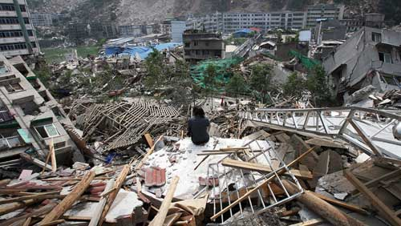
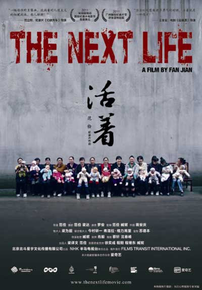

# 震后五年

这里没有不得不说的新闻。如果非说有，那就是，看看生命如何在寻常处找到出路，看看一场巨大的灾难，刻骨的创伤，最终如何消化在日常的细节里。

对于灾区之外的许多人来说，曾经发生的那场灾难就像一个遥远的背景，它就在那里，不曾被忘记，但也并不真切。人们散乱地传递着那里的许多消息，一些英雄被树立起来，又被推倒在地，一些悲伤的高潮被反复掀起，然后又迅速归于忘却。荣耀一个又一个上台，争议一个又一个扑来，在眼花缭乱的变幻中，那些最寻常的人的形象，却始终模糊。他们不会说很漂亮的话，也没有太离奇的经历，然而在这场灾难的背后，他们承受了最大的生离和死别。

这里没有不得不说的新闻。如果非说有，那就是，看看生命如何在寻常处找到出路，看看一场巨大的灾难，刻骨的创伤，最终如何消化在日常的细节里。

震后五年，每个细节都让我们牵肠挂肚。

**【展映时间】**2013年5月 **【参映城市】**北京、上海、广州、成都、南京、武汉、重庆、厦门、杭州、西安 **【观影报名】**[请点击这里](http://site.douban.com/177837/room/2069620/) （PS：部分站点放映时间暂未确定，请关注瓢虫映像豆瓣小站、微信公众平台，或新浪微博@瓢虫映像，掌握一手活动信息。） **【展映影片】**

**1428** _2009/__中国/纪录片/116分钟/高清/彩色/立体声/16:9/四川方言/中英文字幕_ _预告片：请[点击这里](http://video.sina.com.cn/v/b/98521137-1290055681.html)_

2008年5月12日发生在中国四川的8.0级特大地震，让接近十万个鲜活的生命突然中断了与这个世界的联系，不计其数的建筑、桥梁、公路瞬间化为了废墟。全中国及世界各地的人们都带着悲悯和善良的爱心，为这些无辜的生命感到惋惜，并纷纷伸出援助帮助那些还处在灾难中的人们。毕竟，帮助遭遇灾难的人是我们人类的本能，是出于良知和人道主义精神。

同时，灾难也成为了一个契机，它试探出深处其中和与之发生关联的每一个人面对灾难时所表现出的行为背后的动机。这些行为和动机是我们在日常的状态下，在平凡普通的日子里，熟视无睹的，在特殊的事件中它被无形的放大在我们的面前。灾难是一个特殊的背景，在这个不同寻常的背景下，人性的光明和阴暗被凸显的一览无遗。

在余震不断摇摇欲坠的废墟上，由各种原因导致随时上演的荒诞景象，也愈发让人深省。这些是我不愿看到的现实，但我无法回避，纪录是唯一的方法。

毁坏的土地上终究会有种子发出新芽，倒塌的家园可以重新修建，故去的人们也会有新的生命来替代，但如果我们没有勇气直面我们的内心，反思我们的过去，约束既有的行为，我们的局限还将导致新的灾难。

拍下此片，祭奠遇难的人。

**参展、获奖情况** 第66届威尼斯电影节地平线单元“最佳纪录片” 第28届法国环境影展国际竞赛单元“特别关注奖”，2010 第9届维也纳国际电影节 第二十八届温哥华电影节 第六届香港亚洲电影节 第一届香港亚洲独立电影节 第四十六届台北金马影展 第六届迪拜国际电影节 第12届瑞士黑电影节展映 第32届法国真实电影节 竞赛单元 MOMA 纪录片双周展 展映 2010 克罗地亚ZagrebDox 2010 竞赛单元 第十届南方影展「南方奖—华人影片竞赛」 入围第28届法国环境影展 国际竞赛单元 2010/11 法国Shadows film festival 展映 2010/11 第二届中德纪录片电影论坛,展映 ** **

 ****

**活着**

__2011/__中国/纪录片/79分钟/高清/彩色/立体声/16:9/四川方言/中英文字幕__

_预告片：请[点击这里](http://site.douban.com/177837/widget/videos/12005733/video/260752/)_

2010年5月，叶红梅开始了第二次试管生育的过程，她8岁的女儿在汶川地震中遇难。汶川地震中有子女死亡或伤残的家庭有六千多个，其中有五千多 个家庭准备再次生育。40岁的叶红梅希望再生一个女儿，尽管再生育的进程非常艰难，她也不愿收养别人的孩子。叶红梅的丈夫祝俊生在地震中未能救起自己的女儿，一直心怀愧疚 。这次试管生育可能是叶红梅夫妇最后的机会，他们能成功吗？

**参展、获奖情况** 2011年 阿姆斯特丹国际纪录片电影节主竞赛单元 2011年 广州国际纪录片节评审团特别奖 2011年 第六届北京独立电影展 2011年 重庆民间映画交流展 CIFVF 2011 2012年 香港华语纪录片节季军 2012年 韩国DMZ纪录片电影节 2012年 凤凰网纪录片节 人文关怀奖 2012年 加拿大 Picture this film festival \ Honourable Mention Award 2012年 中国纪录片学院奖、第十八届中国纪录片长片十优作品 。 **导演阐述**

《活着》关注的是大灾难背景下的生命故事，在震后共有5000多个家庭有再生育意愿,仅从数量上来说，这场地震后的大规模生育行为就非常不同寻常。而这些家庭为什么选择再生育，为什么不接受收养孩子?为什么面临重重困难用尽各种办法也要再生育？这是我们要探求的。

而我们关注的重点不仅仅是生育本身的进程，更是在生育背后对待生命的态度。死者已矣，生者如何面对死去的生命，如何面对新生的生命，又如何面对自 己未来的生命，都在“生育”这个进程中慢慢展开。透过这部影片，我们感受到生命的无常，生命会在瞬间失去，令人猝不及防。你越是对新生命充满期待，他越是 不会出现，而当你放下时，他却出现了。我们也看到生命的“有常”，生命终究是要向前的，我们无法回到过去的生命状态中，我们无法用惋惜和追忆来阻挡生命的 前行。任何灾难都无法阻挡生命本身的惯性，不管生育会是怎样的结果，不管一个家庭有怎样的喜怒哀乐，这些家庭、这些人仍然要随着生命的惯性向前、向前。

**瓢虫映像(PureMovies)**为一非营利性质的民间组织，由青年人文生活门户北斗网（ibeidou.org）于2012年5月发起并创立。瓢虫映像由来自不同地区的志愿者跨域协作，致力于全球范围内发现和传播反映中国人文生活的纪实影像。

‚**瓢虫映像所放映的一切电影及影像作品，均已获得原版权所有者授权许可。**我们郑重声明不复制、不上传网络、不向他人借阅影像拷贝。

