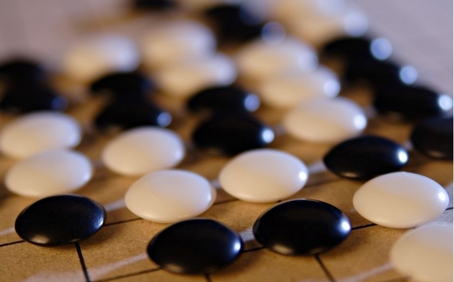

# 包围

1

“世界最好的人类棋手在压力下崩溃了。”

他反复地念叨着这样一句话，一遍又一遍。每一次调试程序的时候，他总是会打开电脑里面那段经典的视频，那是一个国际象棋特级大师，世界冠军卡斯帕罗夫，在1997年输给深蓝之后说出的第一句话。

压力。

他能够从卡斯帕罗夫的脸上读出这样的压力，不只是从脸上。面对深蓝的时候，卡斯帕罗夫有些迷茫，像是一只凶猛的老虎遇上了一辆铁皮包裹的战车一般不知所措。他并不了解对手，也需要顾及到强大的计算机“棋谱库”，这使得以“西西里防御”驰名天下的卡斯帕罗夫，选择了一些更加冷僻的布局，在尝试“脱谱”的同时，也放弃了自己的所擅长的局面，这也算是某种意义上的“兑子”。

每一个面对电脑的棋手都不得不谨小慎微。在和人下棋的时候，就算是处于劣势，人们也会觉得有希望，因为人毕竟是人，总会有漏过一步棋的时候，人们因为这样的一步疏漏而处于劣势，自然也有理由相信，对手也会犯下一样的错误，这样的想法给人带来信念。而在面对一个电子怪物的时候，一旦处于劣势，翻身便难于登天。

“一点一点地磨碎对手，一点又一点。”他想到这里的时候很是开心，他把视线从电脑屏幕上移开，台灯明晃晃的，一只小飞蛾正在一次又一次地撞向灯管。

2

宇宙洪荒。

伏羲氏已经在黄河沿岸行走了整整十年，只不过，他只记得一个又一个的日出与日落，有些时候他想念太阳，有些时候他想念雨水；他看见过一只鹿跃动而过，他看见菖蒲草生长，菖蒲草衰落。

他看了又看。他觉得这一切的事物都在对他说话，用一种细若游丝的语言。他觉得面前的世界正在变得模糊，又变得清晰，在清晰和模糊中不断地变换，就像黄河边上浪潮，升起来又落下去，每一次，想要抓住一个实在的东西的时候，潮水就落了下去。

你这时大概期待着一个高潮，像火山或是像日食，像地震。就像是人们日后书写故事时所用的方式。

而在部落的其他人看来，这时候的伏羲氏如平日一样，把昨天的脚印又踩过一遍，又坐上了那块大河顶上的石头。

只是今天，波涛汹涌，天色昏黄，一片墨色的云正从东方赶来。

伏羲氏缓缓地张开眼，长长地舒了一口气。

一道闪电把暗黑的天色划成两边。

正如仓颉造字时候下的那场雨一样，这场雨如同悲鸣，悲哭来自神鬼。天地露出了深沉的颜色。幽玄的秘密已被洞察，山川的法则正在展开。江水翻滚又翻滚，仿佛跃升了起来。

也许除了伏羲氏，并没有人看见了江水中跃升的龙马。

但所有人都听见了雨里的悲哭。

3

“这一手下得过于平缓了。”沈老师依然和十年前一样，在棋盘上一丝不苟，仔仔细细地给他讲解着这一盘棋的走向，“在中盘的时候你还是想走得厚一些，把战线拉长，拖入官子等待对手的犯错。和小时候很像啊。”

老师又迅速地摆出几个可能的变化，“不过，你看现在的围棋，真是寸土不让。”老师笑着拨乱了棋枰，“就算是上了大学，也并没有扔下围棋啊。”

他推了一下眼镜，露出了一个灿烂的微笑，“只可惜现在都跟不上潮流了，现在的围棋都和小时候下得不一样了。”

“哈，世界潮流嘛！”沈老师说，“现在的围棋节奏太快，强调攻击嗅觉，要得就是一剑封喉，那种棋我是下不来了。我们都不年轻了，你看看你都长这么大了。当年你刚来学棋的时候，还只有这么高呢。”老师的手指着旁边一个正在下棋的孩子，坐不到一分钟就要换一个姿势，仿佛那凳子底下有根蜡烛。他看见那孩子抓起一颗棋子就往棋盘上放，或者更加准确地，往棋盘上砸。

“和我刚来的时候很像呢，也这么蹦跶。”他还是保持着惯有的微笑，很和煦地看着那个孩子。

“你那时候可好多了，刚学了一会儿就能安稳地坐下了，现在的孩子，真是坐不住，家长也宠着，真是越来越难教了。”

每一个孩子都是好动的，但是他在棋盘之前，总是能够安静下来，这一点让他得到了很多老师的表扬——坐如钟，这在那时是一流棋士锤炼自己必修的功课。但是其实坐下的时候，他感觉自己要比平时更加的活跃，只不过旁人看不见那些来自脑海中的风起云涌，只有他自己知道，每到棋盘上大龙纠缠绞杀的时刻，他能够感觉到自己夹着棋子的食指和中指的的颤抖，他每一次都在那样的颤抖中，把棋子送向纵横交错的战场。

那时他依然会推一下自己的眼镜，安静地微笑。

4

这时是深夜，仿佛所有的光亮都被眼前的电脑屏幕吸收了进去，甚至连声音也是，风扇声在屋角不停地转动着。

深夜的电脑屏幕没有抹去的，是他的笑容，只是现在他的笑容充满了秘密。他摘下眼镜，看着自己改动后的程式。

轻轻地一声叹息。

人们总是说，在围棋界，电脑是无法战胜人脑的，围棋的情况太复杂，太精深，充满陷阱，充满不可知的陷阱。19×19的棋盘，三百六十一个位置，有人说这和人身体上奇经八脉的361个穴位一样神奇，但是这只是巧合；真正可怕的，是3的361次方这个数字，每一个位置，都有着黑，白，无这三种可能，你根本就无法利用穷举法，或是通过浩如烟海的棋谱库，找到最好的那一步棋。甚至连最好的棋手们，虽然他们在局部战斗中已经算得上是无懈可击，但是在棋盘上，他们也要依赖着自己积累下来的，深入骨髓的感觉引导自己；在胜负关头，也能感受到自己许久之前放下的一手棋，会对于之后的局面产生怎样可怕的影响。就像是海洋里的群岛，群岛之间只有一座又一座细细，由感觉构筑的桥梁。

这也是为什么在超级电脑已经击败了世界上最好的国际象棋棋士的时候，围棋选手们还能保持着可贵的乐观。他们还处在上升的阶段，正如世界还尚未被一条环球航线打通一般，他们对于海洋充满期待，海洋对于他们依然神秘。这样的神秘，庇护了这一批虔诚信奉着围棋的棋士，有人说这就像是一个神灵，一个留下了秘密的神灵。就像是《棋魂》里所表达的那样，当SAI和塔矢名人在对局中下出了“神之一手”的时候，观战的进藤光却指出在数十步之前那手无关紧要的收束，“大家都觉得那是必然的一手吧。但是，如果补在另一个位置，就能够消除最后那步妙手了。”

如果人类不能够参透围棋最终的秘密，那么在由人类所编写的电脑程序面前，人类便是安全的。即使将来有一天，电脑能够战胜九段棋手，人类也能够继续进步，领悟到更深的境界。在这样的悖论之下，无论怎样，人类都是赢家。可是如果反过来看也一样。

人类处在链条的中间，无论怎样都会是输家。

他熬过了漫长的战斗，却在最后的官子中犯下了一个简单的错误。这是他第一次输给自己的程序。

“Mission Completed”。

电脑屏幕正在一闪一闪。

他抱着头，沉默不语。

5

浪花正在褪去，飞升的水珠留下的一个又一个标记，却久久的停在了半空中。墨色的云彩飘飞得比最健硕的骏马还要快，一朵胜过一朵。天地时而光明一片，时而遁入深黑，而那些停留在空中的标记也随着这一切变换着。

那一场雨之后伏羲氏就一直做着这样的一个梦。

他一直想找到一个机会记下这一切的梦。“就是这样的一天。”他在夏雨里窥视到的秘密，只有等到春天才能写成。在这之间的日子里，他蛰伏在荒野里。

一直到春雪融化的时候，他取下冬季取暖的毛皮，从火堆的余烬中取出一节焦炭的树枝。

一笔，一划。

一六宗北，天一生水，地六成之。冰凌开化，河水流淌。

二七在南，地二生火，天七成之。骄阳出云，大地回暖。

天三生木，地八成之，东边草地，种子冒出新芽；地九生金，天四成之，西方山脉显现毫光。

天五生土，地十成之。伏羲氏勾勒完最后的一笔，便重重地跪在了土地上。

伏羲氏跪了整整九天九夜，仿佛在向神灵赎罪。

河图，就这样传了下来。

6

那么他究竟是为何而沉默呢？

被自己的程序击败让他感到难过，或是因为压抑着自己作为程序设计者的激动之情？

这个在这样的两种身份之中纠缠的年轻人，保持微笑的年轻人，是在以何种身份设计着这一切呢？

“只能到这样了。”他用双手擦了一把脸，这时的他看着电脑，双眸无神。

这确实已经到他的极限了，他一直是一个打磨细节的高手，正如他的官子一样滴水不漏。这一套程式，已经到了收官的阶段。现在的他已经被这样的一个程序抽空了一切，创意，逻辑和精力。他需要休息。

他还记得他小时候的那套《手谈》软件，一位中山大学的老教授设计的这套软件在90年代称霸一时，在布局上虽然只能依赖着原有的棋谱，在局部计算上却显示出良好的能力，可是这套却依然只能达到业余1段的水平，这大概是一个孩子学棋一个学期能够达到的水平，并且还有一个前提条件——对手下的棋必许合乎规则，或说是棋理。他记得老师说过的一个笑话，如果你在二路开始一个一个码棋子，软件便不会下棋了，他记得老师说起这句话时脸上的自豪。“只是那种设计思路早就被放弃了。”他也曾经像老师一样自豪，但是现在想起那时他只是觉得是人们把事情想得太简单了。即便是再天才的设计师，也无法事无巨细的设计出一座城市，细致到每一个建筑，每一个窗格，这样的工作太过冗繁复杂。

“蚁群算法。”这是现在已经面世的围棋软件所采用的思路。设计者们发现，他们不需要每一个“围棋蚂蚁”知道整个棋盘的信息，它只需要知道周边发生了什么，这样所需要的信息量就以几何级数递减。并且，将“围棋蚂蚁”集合在一起，这样事情就简单了很多。就像是你并不需要设计出世界万物应当以何种速度运动，只需要把牛顿三定律扔给这个世界的每一个物体。“围棋蚂蚁”在没头没脑的尝试中进行自组织，又形成“蚁群”，从无序的层面进入有序的层面。在某群体中若存在众多无智能的个体，它们通过相互之间的简单合作所表现出来的智能行为即称为集群智能。

这也是他现在正在实践的道路，“动力系统可自动生成复杂的形式与格局，而且不需要中心组织者的存在。”

但这一切依然充满陷阱，陷阱就在这平坦棋盘的任意一个交叉点上。

在棋盘上有很多的事情是不能两全的，比如厚薄与速度，势力与实利，乘胜追击和坚守战果。他发现“蚁群”遇到的瓶颈，就是在被棋手们称为“感觉”的这些判断上。“蚁群”们有时会在这样的选择面前陷入死循环，或是以一种随机的选择跳出。

“解决不了这样的选择，电脑依然无法和人类抗衡。”他在很早前就清醒地认识到了这一点。这也是为什么。他设计了这样一套精密的评价体系，他把这个体系叫做“围棋的民主”，这一套投票机制，通俗来说，就是在筛选掉初级方案之后，依照着棋子的相对位置衡量了每一个棋子的对于下一手棋的“期望”，“选举”出下一个“围棋蚂蚁”的选点。为了找到一个合适的权重分布，他已经调试了无数盘对局，并且还成功的引入了一个时间函数——“局面进行度”。利用这样一个有着三个台阶的阶跃函数，他想要判断“布局”，“中盘”或是“官子”这样的阶段，他觉得这些由人类总结出来的简洁规律能够使得整个程式的“选举机制”更加合理化。

他不停地打磨着这样一个程式，就像是用砂纸摩挲，使得它更加的粗糙，也更加的具有鲁棒性——粗糙能够帮助这个程序应对更多的环境，就好比把一把M16换成AK47，正如美国大兵们在越南战场上所做出的选择，AK47在关键时刻更加值得信赖。

在回顾这一切的过程里，他已经洗漱完毕躺在了床上，虽然这一切都在是下意识中完成的。

“程序员也得睡觉啊。”他来不及感慨就睡着了。

7

“这是一份能够击败业余5段的软件。”

对于这一年度计算机围棋大赛的冠军，大赛只用了这样短短的一句话介绍，而这短短的一句话也就够了。一个标准的业余5段对于棋手们来说，意味着一切基础都已经成型。如同一个少林弟子顺利地使出伏虎拳，一个武当弟子流畅地耍出太极剑，只有闯得过这道关隘，才能见得到江湖。这也是为什么拿下了这个段位，体育局便会授予一张国家二级运动员的证书。

这样的消息对于那些当年一口咬定计算机围棋不堪一击的人来说，无异于是晴天霹雳；而对于那些正在学习围棋的人们来说，这一点更加残酷。很多人在网上对弈了数千甚至上万盘，熟记着“凡遇要处总决”，把“当湖十局”的棋谱摆了100多遍，都没能达到这个高度。而如今一份电脑程序就能够击败自己，这样的结局让人难以接受。

曾几何时宣扬着“复杂度远远超过国际象棋”和“更加依赖感觉”的围棋，现在也面临着前所未有的危险，曾经看起来犹如天堑的几何级数的复杂度，被电脑以几何级数般的速度超越了。他还记得他最后一次去棋院找沈老师对弈，沈老师面色铁青，在棋盘上下出了那些“他下不来的棋”，步步凶狠，把他的一块棋连根拔起，驱向中腹缠绕相杀，甚至不顾自己那一条大龙也是一样的薄弱。他凝视着这样诡异的局面，足足5分钟之后，轻轻叹了一口气。他并没有选择撕裂对手的棋形，从包围圈突围而出，而是下出几手诡谲的腾挪，整理好形状之后竟稳稳地活在了里面。

于是棋局又进入了细微的平衡，仿佛之前一切燃烧的战火都是错觉。和往常一样，他还是以微弱的劣势输掉了比赛。

终于有人开口，“我知道你一直不愿赢老师，但毕竟还是赢了。”

他收好棋子，站起来，站得笔直，然后深深鞠了一躬。

“我只是想看见最精彩的一局棋。”

这一次的大赛颁奖晚宴汇集了格外多的人。他看见了他学棋时候称霸世界的棋士，也看见了和他年纪相仿的新科世界冠军，想到这位新科世界冠军在围棋道场里还输给过自己，他突然觉得很开心。

“我们看到获奖的这位年轻人笑得很灿烂嘛！确实他也有理由开心，这一次他设计的程序可谓是力压群雄，让我们以最热烈的掌声对他表示祝贺！”

颁奖典礼就这样按部就班的开始了。领导致辞，掌声雷动，颁奖合影，握手微笑。喜庆的音乐响起，主持人正要宣布一个更加灿烂的明天——

“我能说几句话吗？”

“呃…当然可以，现在让我们欢迎冠军来讲几句！”主持人只用了一秒时间尴尬，就迅速地重新掌控了局面，他觉得观众一定会赞赏自己的灵活应变。

“或许大家都以为这个程序只是个开始，好比我现在只有24岁一样，是什么刚出生的孩子，八九点的太阳。其实根本不是这样的，这个程序我打磨了3年，这三年我一直在不停地调试着它，我想说，现在的这套思路，已经达到了它的上限，在这里有一个无法突破的瓶颈，整整困扰了我三年，我无论怎样对它进行修改，它都无法再提升些什么了。我曾经发誓，只有这套程序能够赢下我，我才会让它来这里闯荡江湖，可是最后我放弃了，在它赢下我那盘棋的最后，我选择了一个明显错误的走法，我熬了三年，熬不下去了。”

“我曾经梦想着成为一个顶尖的职业棋手，就像贵宾席上的各位大前辈和昔日冲击职业道路上的战友们一样。我常常在想，站在巅峰的棋手，面对棋盘是什么感觉，不能够站在那样的高度感受围棋，是我一直以来的遗憾。这也是我为什么想要去编写这样的一套程序，我想通过这样的方式，来探索围棋的深奥幽玄。”

“只是依然很遗憾，这一套程序的每一个细节我都努力到调试到最好，其实力却依然无法触及到围棋的奥秘，不说职业的最高峰，就是业余顶尖棋手，也能稳稳地赢下它。这一套算法无论再怎么改进，只要本质不改变的话，最多只能提升一先的水平。”

“棋盘上充满需要判断的东西，比如挑起战斗。战斗是否可行，战斗是否必须，战斗是否能够得利，这一切都需要衡量全局，我努力想要构建起对于单个的棋子的衡量标准，但是每一个棋子所获得的信息都被它自身所局限；我根本没法构建这样的一个衡量标准，这根本不是我能做到的，这需要一个找到‘围棋的本质’的人才能做到，我想要找到‘围棋的本质’，但是我对它一无所知。你们看见了吧，这是一个死循环。我要放弃了，这一次的比赛胜利我很幸运，谢谢大家。”

沉默数秒之后，现场掌声雷动。

编程工程师的掌声在表达对于这份软件的敬意，但是对于这位获胜者的宣言，他们并不以为然。他们相信电脑的力量，其实他们相信的并非电脑的力量，而是自己的智慧，围棋再玄乎，也是人下出来的，只要是人能够想出来的，就理当能够被归纳出来，以最简洁优美的方式从思维之海中提炼出来。

而棋士们并不真正理解这份软件，他们的掌声送给了这位业余棋手对于围棋的敬意，对于围棋本质的探索，和对于自己清醒的认知。同样的，他们相信的也是自己的智慧，这种智慧是人类精神的延续，绵延了无数代的围棋技艺正在他们的手上变得更加炉火纯青。面对着来自二进制世界的一切，他们依然相信，围棋这座复杂的迷宫，想要通过这座迷宫，需要的是“人”的力量。

这其实是人类智慧和人类智慧的较量。而现在，他们在晚宴上举杯相庆，交谈欢愉。

他坚信自己已经对这场较量做出了预言。

他不停地应付着人们的敬酒，赞助的企业家，编程界的前辈，还有各位技艺精湛的棋士，甚至连那位白发苍苍的大前辈都在助手的搀扶下来向他祝贺。他感受得到全场的注目，这个属于放弃的夜晚，也算是他的顶峰。他在杯盏交错间看着这个世界在明媚的灯光下旋转，这世界真好。

晚宴之外的走廊上，点起了一支细长的烟。

8

“日出而作，日入而息，凿井而饮，耕田而食，帝力于我何有哉。”

用脚步丈量自己的天下虽然辛苦，但是尧帝听见老人们这样的回答，他觉得一切的努力都没有白费。那时候尧帝还叫做陶唐氏。

他记得数十年前那场滔天的洪水之前，人们就是这样生活在大地之上。

洪水。

黄河浩浩汤汤，一切都仿佛跌向共工头触不周山的时代，在巨大的自然力面前分崩离析。他还记得鲧，为了解救带来了神圣的息壤，奔劳九年，鸱龟曳衔，却在顺欲成功之时被邪魔击杀于羽山；而鲧的儿子禹，接受了自己的任命，又带领着民众治水十三年，才平息了这样的一场大劫。

他还记得在那之后，他委任羲氏与和氏制定了农耕的历法，看着星辰的走势，日月的变化，学习着与自然万物一同生长。

“其仁如天，其知如神。”

只是他还有一样事情放不下，那就是自己的儿子。

“这张河图，你已经看了三天，可有悟出些道理？”

“父亲，这真的是那张河图吗？我只看到了一个个的黑点和白点，它们似乎是按着数字分开的，可是就凭着这一个个的点，真的能像祖先们一样，窥探到天地的秘密吗？”

尧默默地叹了一口气。

9

这是一只很修长的手，中指和食指夹住了那支燃了一半的烟。

“何洛，你真的决定要放弃吗？”那人的手轻轻地在烟灰缸上一捻一转，熄灭了那支烟，还未燃尽的烟灰轻轻飞起，他看见了那人的脸，很干净，看起来平时有很好的护理；笑容很标准，是那种历经考验的笑容；加上那身标准的黑色西服。像极了电影里面闭着眼睛开枪的特工。

在这里我们需要加入一些狗血的剧情，每一个故事里都会出现的生硬大反派，或是潜藏在暗处的不能见光的势力，他们需要有统一的深色制服，有时候需要一副墨镜。他们总说，有阳光的地方就有黑暗。那么这个无端出现的黑衣男子究竟会是一个怎样的人物呢？让我们来看看他所具有的特征吧，他有着修长的手指和干净的面容，笑容久经考验。

深黑的制服？杀手？但是为什么有人要杀死一个写围棋程序的程序员呢？修长的手指？或许他是一个钢琴家呢？但是一个高贵的钢琴家为什么要来找一个写围棋程序的程序员呢？

或许你要问，为什么需要这些狗血的剧情呢？

并没有别的原因，这一切都是我们的主人公（他现在有了名字，叫做“何洛”），他脑海中所想到的场景。在他还没有来得及抓住它们的时候，这些思绪就已经挥发而去。这在某种程度上，就是人类思考的方式——意识的潜流就在你双眼看不见的地方卷涌而起，托起一个结果浮上冰层。

而现实之中往往并不会有一个生硬的大反派，这就是人生变得复杂的原因。

“如果这里还有一个机会，你会愿意重新开始这项研究吗？”

“我说过这是我的极限了，我对于自己的判断一向很准确。”他觉得有些发晕，大概是残酒未消的缘故，他显得有些摇晃，这让他并不能保持住之前那样的微笑而又冷静的气场。

“我来自G公司，从这次大赛知道了你确实具有出众的才华。想要让你试一试。我们觉得有机会。”

“G公司，那又怎样？你们确实很强，但是博弈软件并非你们的特长领域。”

“说到G公司的时候，虽然只有短短零点几秒，但是你的瞳孔确实放大了，眉毛也不自觉的动弹了一下，让我们直接切入主题吧。”

“你们有什么？”

“深度学习系统。”

一片沉寂。

10

“可…你们自己的程序员都不知道它是如何运作的。”

“曾经，确实是这样。或许，现在也是这样的。但是这并不重要。”

深度学习系统，他还记得G公司的当年的报道：

2012 年 6 月，纽约时报曾报道了G公司如何通过向“DistBelief”提供数百万份 YouTube 视频来让该虚拟神经网络系统学习猫的关键特征。这套系统的创新之处在于，它可以在未事先获取“猫的特征描述”信息的情况下自行总结出猫这个概念的特征。也就是说，DistBelief 具有自学习能力。当然，这套系统的运算能力也非常的庞大，由 1000 台机器组成，共包括 16000 个内核，处理的参数高达 1000000000 个。

这套系统采用分层机制工作，神经网络的最底层可侦测图像颜色变化，再上一层则可识别特定类型的轮廓。在增加若干后续分析层之后，系统不同的分支会为脸部、摇椅、计算机等对象生成检测方法。

能够做到这一点，当然很了不起，据说这套系统让它的技术总监感到震惊的是后来，后来它在视频中识别出了碎纸机，而这一点他思索了很久都不知道如何编写程序做到。而这意味着研究人员已经无法说清楚究竟这套系统是如何识别出特定对象的了，因为程序看起来已经有了独立思考的能力，其复杂的认知过程是不可预测的，虽然这种“思考”能力仍局限在非常狭隘的范畴。

在那之后他并没有再听到关于G公司的深度学习系统的消息。

没有消息就意味着没有进展。现在他恍然大悟，自己实在是太天真了。一个事物的凭空消失必有其隐情。

“它现在有多厉害？”

“我们能和它交流了，非常简单的那种。我们嵌入了一个程序，我们把它叫做‘斯金纳箱’。你应该知道吧，这就和条件反射一样。”

“但是它的奖励是什么？”

“新的数据。”黑衣男子摇了摇头，“我们都叫它‘greedy boy’。对新的数据非常渴望，它仿佛在利用那些数据建立新的‘联结’。你知道的，这就像是它正想要构建一个新世界——在它自己的内部的新世界。”

“它会…像母体一样吗？”他的声音有些惊恐。

“这倒不可能，它是被物理隔离的，数据都是通过一个中介传递的。而且它也没有武器啊。你关注的点真偏，科幻小说看多了吧。让我们来说正事吧，这个深度学习系统，或许能够突破你所说的围棋算法的瓶颈。”

“你是说让它自己归纳出一套算法？就通过分析棋谱吗？这可比懂得如何分辨碎纸机要难很多，很多很多。它通过棋谱，找出的只是棋子存在的法则，简单的吃子手段，最多也只能够找出局部的定型。”

“这就是为什么我们需要你和你程序。我说过，我们要能够和它做交流了。我们需要你的程序，做它的对手。”

11

尧对着那张河图看了整整一天了。

每一次国家遇到危机的时候，他就会看着那张河图，陷入沉思。河图里一定有解决问题的答案。虽然那答案正潜藏于某个未知深渊之中，但是他并不畏惧，他相信河图，更相信万物生灭的规律。他还记得第一次见到河图时的震撼，他的童年就和这张图相关，父亲要教会他从这张河图里，看见日月星辰，看见四时晴雪。当他终于看见了这一切，他才真正成为帝氏的继承者。

现在的他又对着河图，这一次他愁眉不展，愁的不是国家，而是自己的孩子，丹朱。作为帝氏的继承者，他并没有像自己一样，拥有继承这张河图的天赋。这一张河图的智慧，该如何交付给自己的孩子呢？

河图沉默无言，夜空群星闪烁。他望着天空中无数星星交相辉映，天穹缓慢的移动着。

“河图的种种变化，我能看见，别人却看不见。正如这天上的星星，倘若不经过持久的观察，怎能看出这星河的流动呢？如若我能够让丹朱体会到河图中的变化，而非静止，那这一切就迎刃而解了。”

“这一切都要从‘无’开始……”

“尧造围棋，以教子丹朱。”

——张华·《博物志》

12

何洛看见深度学习的时候还是被吓了一跳。

这才是真正的蚁群。

当巨大的计算机组像是古罗马的重型兵团一样展开在自己眼前的时候，没有人不会想去相信人工智能的存在。

何洛整理出的浩如烟海的棋谱库，第一次有了泥牛入海的感觉。

“为什么你们想要挑选围棋作为‘对手’？”

为什么IBM要挑选卡斯帕罗夫呢？你知道的，博弈的游戏，输赢意味着一切，而找到最强的招法，才能够立于不败之地。没有人不想立于不败之地。”

“那我和你们不一样，我说过了，我只是想看到最好的围棋。”他说完转身欲走。

“那，”黑衣男子顿了顿，“又有什么区别呢？”黑衣男子说完便走，他是真的离开了，扔下的那张名片在风中摇摆，在一秒钟后落到了地上。

最终何洛还是来了。

刚才的他已经把自己的程序和“斯金纳箱”连接起来。“‘Greedy Boy’，show me something.”他心里默默念着。

但是真正的“对战”还没能开始，这场对战，需要等知道“围棋”是什么之后，才能够开始。

他现在正一点一点把他所收集到的一切棋谱数据存入这庞然大物之中。

而在属于自己定义的内容里，他一遍遍的输入，一遍遍的删除。到最后，他甚至没有留下关于“生死”的概念，就按下了回车键。

一个月之后，研究人员发现计算机给出了围棋的基本规则。

“比我们想像得要慢很多。”他说起这句话的时候不知是得意还是失落。

终于要到对战的时刻了。

13

电脑给出的程序，和何洛的程序正在内部世界里厮杀着。

但是这时的何洛却并不在G公司。他在半年前，“对战”计划开始的时候就选择了退出，现在的他正在沈老师的棋院里教棋。

“何老师再见！”“何老师再见！”

这天下午他送走了可爱的学生们，坐在教室里沏了一杯茶。他喜欢在这个时候，下午4点钟，打一局秀策的棋谱。在摆完那步“秀策的小尖”之后，他意识到有人已经站在门口好久了。

“你所害怕的事情并没有发生。”

黑衣男子这次依然穿着黑色西服。

在这里打断一下，作者并没有想要借黑色表达什么，他只是觉得如果换成白色或是其他颜色的西服或是背心，会造成指代不明的困扰。

“胜率曲线依然在50%波动，看起来，‘对战’没有赢家。”

这突如其来的结果让他觉得有些荒谬，即便是如此巨大的蚁群也无法创造出一个围棋“上帝”吗？

“带我去看看。”不知为什么，这件事情让他感到更加的害怕。他还记得自己退出的理由——“我无法接受，电脑真的成为围棋‘上帝’的时刻。”不知道为什么，现在的他同样觉得害怕，他害怕这小小19路的棋盘就这样的深不可测，这让他对于了解世界丧失了信心。

而在24小时后，他看到了两个程序对战的棋谱。

他默默地拿来一副围棋，一子一子的摆出了这一局。当他把最后一子摆完，棋局终了的那一刻，他双眉紧锁。

“我最害怕的事情还是发生了。”他的一声叹息轻如羽毛，“从这份棋谱看来，并非是‘深度学习’停在了业余5段，而是‘对战’的双方，都达到了九段的高度。看起来，我那个放在这个‘巨大蚁群’中的程序也被‘深度学习’给改良了。”

他想要站起来时感到一阵晕眩，对着那片计算机组的方向，重重地跪在了地上。

14

宇宙洪荒。

他已经在大河沿岸行走了整整十年，只不过，他只记得一个又一个的日出与日落，有些时候他想念太阳，有些时候他想念雨水；他看见过一只鹿跃动而过，他看见菖蒲草生长，菖蒲草衰落。

这个世界正在慢慢的变得完整，能量从遥远的天边不绝如缕地涌来，把这个世界里面的一切细节填补得干净完整。

这天他吹着河风，感受着天地间生长的一切。

突然间风起云涌，一片墨色的云从东方赶来，一道闪电把天空划为两边。天地露出了幽玄的颜色。

他看见一匹龙马跃升出水面，在那翻滚的波涛里他看见了——

河图。

“何洛，你醒醒。”他醒来时发现黑衣男子扶着自己，“你怎么突然就晕倒了啊，还好只是一两秒。大概是‘对战’计划成功，你太开心了吧。哎呀，我们也没有想到，居然会是这样的结果，居然连你的程序都变得如此强大，我们居然只看到胜率却没有去看棋谱，这真是…”

“你们的‘斯金纳箱’是给了‘深度学习’多少奖励？”他的语气显得很是急促。

“那要看它们对弈的局数了，估计很快就能统计出来，但是所有的数据都是来自G总部的云存储中心，我们为每一局设计了一定的比例，具体的我忘了，怎么了？”

“在那里面，”他又看了一眼那巨大的计算机组，“大概是我想多了。”

不久之后，G公司组织一场旷世的围棋大赛，由“深度学习”对阵围棋的世界冠军。这一场比赛吸引了众多的眼球，所有的人们都期待着这一场“对战”的结果。在上午10点，电脑的操作员在本榧棋墩上落下了“深度学习”的第一手棋——位于棋盘正中的“天元”。

这开局的一手在现场引起一片哗然。而他似乎很平静，他仿佛看见这手棋很早之前就在计算机错综复杂的线路中心落下，就像是一个宇宙大爆炸，一个开始。

他突然想起，他站起身时的那阵晕眩，在那道炫目的光线里，他看见了一只睁开的眼睛。

(采编：薛晨如；责编：刘铮)