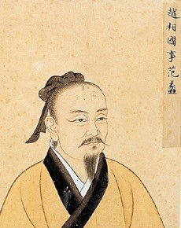
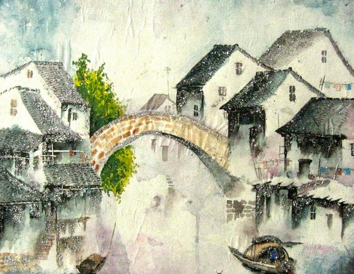

# 吴越

范蠡第一次看见勾践的时候，后者喝得醉醺醺的，和他的永久自行车一起躺在沙县小吃门前的马路牙子上。当时，勾践还处于会第一眼就爱上一位已经订婚的姑娘的年龄，他时常会捧着克鲁泡特金的书爱不释手，甚至还活跃于学校的诗歌社团。日后，范蠡回忆起这些往事时，总是感到十分讶异。正像昆德拉所说的那样，这就是友谊的真正与惟一的意义：为对方提供一面镜子，让他可以看到自己以前的形象。

无论如何，范蠡当初的确是被勾践身上的这种气质所吸引的。当时范蠡没有意识到的是，理想主义者是不可救药的，如果他们被从自己理想的天堂里踢出去，那么他们会另外构造一个完美的地狱。当然，这不是范蠡的错，因为这个道理要到很久以后才会被一名德国籍精神分裂症患者阐明。

于是，在那些梅雨季里，他们骑着自行车徜徉在会稽的街头巷尾，如果下起小雨，他们无视这些雨；雨大起来时，就一边打伞一边骑；下起暴雨后，则将车推到旁边的楼道里，等到雨停，再继续骑。在当时的范蠡心中，雨水和告别是世上唯一两样可以用endless来形容的事物。雨水在他们头顶上的屋檐上流淌，他们在屋檐下的世上流淌，他们和雨水并非特意为对方而来，但至少在这一刻，他们彼此看见了对方。

文种对范蠡的这种诗意化的描述嗤之以鼻，他摆出一副Sheldon那般欠揍的表情，提醒后者道：“那只是东亚大气环流在春夏之交时形成的一种频繁降水的自然现象。”每到这种时候，范蠡都只能哭笑不得地放弃与这个15岁就获得吴越地区计算机竞赛个人第一名的老同学争执——他总能以比果壳编辑还负责的态度说服你。

后来，通过范蠡，文种认识了勾践。三个人的第一次见面也是在那家沙县小吃，当时。。。

这页手稿写到这里，后面的字迹就模糊不清了。我来回翻翻手里的这张纸，懊丧地摘下眼镜，揉揉眼睛。时间已经接近零点了，也是该上床睡觉的时候了。

自从U离开后，睡觉成了一件我非常不情愿去做的事。虽然这件事使我可以独享一张双人床，在上面随意翻滚而不会有所顾虑。事实上，我甚至在考虑把这张床卖掉，去买一张单人床，因为这张床已经占去了这间屋子的太多空间。

我现在住在咸阳的一座破旧的公寓中，公寓离中心城区其实并不算远，但是已很多年没有得到妥当的修缮，一到晚上，安全也很成问题。基本上，这座公寓的住户基本分为两种，一种是脑子有问题，一种是钱包有问题，当然，更多的是兼而有之。住在我隔壁的一位老太太在一周前孤独地死去了，这让我松了一口气，因为她的屋子简直就像垃圾堆一样，不时传来令人皱眉的味道。一个和我年龄相仿的年轻人来整理屋子，我站在门口和他聊了几句，得知老太太是他素未谋面的姑姑，“她被嫌弃了一辈子”，年轻人说道。

我只承认我属于钱包有问题的那一种住户，但在U看来，我是典型的两者兼而有之。其实，公正地说，我们还是很投缘的，我们都偏爱楼下快餐店的肉酱意面，也都认为福克纳对海明威“装样子”的批判大快人心。我们只在一些细微的地方有所分歧，例如价值观啦，人生观啦，这一类细节。但是，U显然不是这么想的。

为了不让自己显得和我一样脑子有问题，她在上个月的一个清晨为我煎了最后一个荷包蛋后，从此像骑在桶上，升入冰山区域一样消失不见，只留下像长谷川泰三一样无所适从的我。按照道理来说，养不活恋人的我应该留下一张“生而为人，对不起”的纸条然后把脖子像长颈鹿一样伸长，套在绳套里，再蹬掉凳子。但是，正如伟大的，永远健康的李斯丞相曾指示过的一样，“人是为活着本身而活着的，而不是为活着以外的任何事物”，我领会了这句教导，于是继续一个人住在公寓里。

我的穷困缘于我从事的事业之冷僻，我认为事业的冷僻程度和事业的高尚程度成正比，U则认为这纯属一派胡言。在大学里，我攻读的专业是列国史，后来选择方向时，我选择了是吴越史。从经济角度上看，这个决定很快就被证明是无比错误的——当初选择大秦史方向的同学很多都去了政府部门，选择三晋史的则不少被关中500强企业招聘走，现在有的已经成为不可或缺的中坚力量，至于选择齐鲁史，荆楚史的同学，也大多有了自己的发展方向，至少留校当个受人尊敬的老师是毫无问题的。

相较而言，吴越史的研究者们面临的命运就很可悲了。当初我们专业一共只有三个同学，这其中，一个人毕业后回到楚地，进了他父亲的公司，还有一个人则成为了诗人，致力于将句子拆开及分行的工作。至于我，虽然热爱着这个专业，但是为了糊口，还是不得已偶尔为《伯牙与子期》这样的通俗杂志写写稿件，或者接下一些编剧的零工。

但是，最近事情起了变化。几天前，丞相府颁布了新的公告，宣布大秦的高等教育体制将在下一个新学期开始时正式取消以下几个学科，这次公告最引人注目的，当然是儒学这个庞大的学科被列入了取消的范围。但是，我个人更关心的是，吴越史也在被取消的学科之列。这会给我带来灾难性的后果。首先，我的咸阳大学吴越史硕士学位证书将成为一张废纸；其次，我无法再名正言顺地研究我喜爱的吴越史，在这个国家，你不能研究不被组织承认的东西，因为组织不承认，就代表这一事物并不存在，而你怎么可能研究一样并不存在的事物呢？

我感到了事情的严重性，于是这几天一直在往丞相府跑。小吏们一开始根本懒得接待我，他们正在为抗议的儒士们焦头烂额，他们已经堵塞了阿房宫附近的公共交通。我第三次去的时候，终于有人接待了我，他的神色比安格尔画中的黑人太监还要慵懒。听了我滔滔不绝的诉苦之后，他告诉我，这门学科研究者过少，目前没有研究所拿它作为课题之一，而它已经三年没有一篇国家级甲级论文了，取消它不是没有理由的。

从这些话中，我看到了一丝希望，于是问他，如果我在新学期开始前拿出足以获得甲级论文的研究成果，那么是不是可以不取消。

接待者用看疯子的眼神看了我一眼，说：“这个还不确定，如果你真的写了，有司会再进行研究的。”

得到这句话，我兴奋地直接跑到了咸阳皇家图书馆的善本室，查到了所有在“吴越史”子目下的原本资料。按照道理说，这些手稿善本是不可能带出图书馆大门的，但是当我小心翼翼地询问时，管理员老头却并不在意。按他的说法，政府准备在某个日子集中焚烧这些所属学科被取消的资料，因此我把它们带出去也是一件功德。

于是，我阴差阳错地开始了对这些手稿的研究，它们是研究吴越史最可靠的文献资料。说实在的，在学生时代，我远远算不上认真学习的学生，因为吴越史的课本来就少，而且老师还经常不来。于是我经常一个人在学校的室内游泳池中默默地，反复地游泳，就像村上春树笔下的青春期男孩一样。有时，我也与U溜出学校去看电影，我们一般看将要下映的电影，这样会省一些钱。看完后，再默默地走回学校。毕业前两个月，我开始匆匆写就毕业论文，最后得了一个良。

我不知道自己是为了完成学生时代未竟的事业，抑或只是为了向U证明某些东西。唯一可以确定的是，这种研究将弥补我精神上的一些缺憾，这使我全力地投入对手稿的阅读中。

据说，当传来文种在勾践逼迫下自杀的消息后，范蠡对身边的人说：“割下这颗脑袋只不过是一瞬间的事，但要再次长出这样的一颗脑袋不知道还要花多久。”这个带着浓郁《世说新语》风格的故事被凌乱地写在手稿上，但我对它的真实性表示怀疑，因为范蠡自己的回忆录里并没有记载这件事。

范蠡的回忆原稿杂乱地夹杂在手稿之中，它们常常前后脱漏，我只能用最大的耐心一一比对。在这件事上，范蠡的说法是，自己一听到这个消息，他就急忙赶到越王宫去见勾践。

“王宫前，那面蓝底白字的‘越’字国旗依然在蓝天中如水波一样静静地飘荡。这是我第无数次凝视这面旗子，但是，这次凝视带有的意味却截然不同了，我开始怀疑，一些东西到底应该是我们的手段，还是过程。”范蠡如此记载他当天在越王宫前的感想，这种文风证明着他的气质在数十年生活的磨砺下，并没有本质的改变。

“你还记得当年我们在你家看《海上钢琴师》的录像么？”面对着范蠡的质询，勾践反问道。

“啊……记得。”范蠡犹豫了一下，说。

“那你也应该记得我们当初的结论。当我们开始坚定地追逐目标的时候，一个人就签下了魔鬼的契约，愿意为这个目标而粉身碎骨。”

“可是这不一样！”范蠡愤怒地喊道。

“哪里不一样呢？”勾践看着范蠡，“我当时真该推荐你多读一点马基雅维利。还有，当你批评别人时最好想到，不是所有人都有你那么优越的条件。”

范蠡痛苦地摇了摇头，换了个话题，“那么，西施呢？”

已经在返航的船上了，几天内就可以到达会稽。”勾践漫不经心地说。

我一度考虑过把勾践作为研究的课题，不过很快作罢，因为要看透这个人实在太不容易，虽然我掌握的他的材料并不算少。甚至，我这里的手稿还记载了一首他创作的现代诗，我们知道，他一直是一位诗人。

“朋友们，我在南方，这里的花开了。

我隐隐感到，一些重要的事，就要发生。

树木愤怒了，他们的手指指向天空。

枯枝败叶接受了自己的命运，跟随着绿色的溪水消失。

风来了！雷响了！整个世界正在醒来。

我看见街道被染色，旗帜在飘扬。

听，那是春雨的声音。

在雨的笼罩下，人们的脑海中波澜交错。”

这首诗的写作年代已经无考，根据我的推测，大约是文种自杀前几个月。说实在的，在这样的年纪还能写诗，这令我对勾践刮目相看，而且，这首诗写得不赖，令我惊讶的是，他仍然没有忘记年轻时的那些春雨。这意味着，他可能不像一般论点认为的一样那么薄情。

在我居住的地方，春雨是一件相当珍贵的东西。我朦胧地记得，在我还小的时候，每当春雨来临，母亲就会显得十分高兴，和因为不能出去玩和懊丧不已的我形成了鲜明的对比。虽然我们家在穆公时代就搬到了咸阳市里，但显然，属于耕作者的记忆已经写进了秦人的基因。

我没有见过我父亲，他战死于魏国的都城，大梁的城墙下，尸骨无存。讽刺的是，那一战我们大获全胜，并最终灭亡了魏国，从而将整个三晋并入我们的版图。我的父亲滑稽地实现了乔治·巴顿将军对于士兵的阐述，这好像是一个对我们全家命运的隐喻，在时代狂飙突进的时候，成为逆流而动的，可耻的失败者，我自然也不可能例外。

U的离去使我最清晰不过地意识到自己的失败，我寄希望于通过对吴越史的研究来遗忘这一点，但令我意想不到的是，它反而加强了这一点。无论什么，都只能是一面镜子，映照出我对U的思念。我给U写短笺，写完之后却尴尬地发现我不知道她的地址，只好把只写着名字的信封投入信箱，就像文静的医生契诃夫笔下的小男孩一样。

“下午好，U。

展信安。

最近，我重新开始了对吴越史的研究。事情的进展并不顺利，材料过于杂乱，整理头绪令我头疼不已。但是，我依然热爱这项工作，因为它令我能真正沉浸自己的身心于自身之外的某个地方，我就像弗吉尼亚·伍尔夫盯着那个斑点一样盯着手稿上的字迹，想像着人们写下这些字时的心情与处境。伍尔夫的日记说，’只有当我注意力不集中，性情多变，又与其他人在一起时，我才喜欢做弗吉尼亚。现在，只有待在这里写作，我就宁愿做个躯壳’。现在，坐在这破旧的公寓里，我也像一个躯壳一样，这使我感到安心。

我省去了非必要的出门，除了偶尔去便利店买点关东煮。最近看材料，发现吴越人在失恋时会吃一种叫’河豚’动物的精子，听说这样就可以不再感伤。我感到很好奇，不知道这辈子还有没有机会吃到？

昨天去便利店时，偶然看见了在咸阳街上游行的儒生们，他们在尽力争取国家不要取消儒学。我感到有些不对劲，又无法用语言传达这种不对劲。我们的国家太大了，也太复杂了，帝国的北端是绵延的长城，据说它们是分段建造的，上面站着忠诚的大秦士兵，他们纹丝不动，目光坚定，头顶是飞翔的鹰与匈奴的U2侦察机；而南端的楚人喜欢无时无刻地跳舞，哪怕是他们的亲人去世了，他们也会跳舞，并且跳得更起劲了。一年末了，他们生起火堆，在旁边跳舞，来庆祝新一年的来临。帝国疆域内的差异是如此之大，更不要说我们至今还看不清楚的吴越了。在这样大的国家里，最经验老到的信使，骑着最优良的马匹，一生也无法穷尽我们的疆域。我们说的话无法准确地被皇帝陛下听到，而皇帝陛下的圣旨传到我们这里时，也早已烟消云散了。我不知道这是不是杞人忧天。

在外面走路时，如果遇上雨，不要把伞丢到一边，尽管我很喜欢这么做，但我发现这样会感冒。

现在我要继续去看范蠡的回忆了，下次我们有时间再聊。再次向你问好。”

“严格来说，我第一次见到西施的时间要早于她见到我的时间。因为当时我看见的仅仅是一幅她的画像。此事发生在某个夏天的傍晚，那段时间里，我迷上了开锁，首先试验的范围是自己家，国家正处于混乱中，成年人们正在和吴国人打仗，没有人管我们。我打开了父亲的抽屉，把里面的避孕套拿出来当气球玩。而那天傍晚，我拿着自己配的万能钥匙，在破旧的居民楼间徘徊，进入了一间陌生的屋子，在那间屋子里，一张照片彻底地吸引了我。

自那以后，我就常常待在这栋居民楼下，期待着与画中人的会面。第一次会面并没有让我等太久，不过，我们开始渐渐熟悉起来，那已经是几个月之后的事了。事实上，她比我想像中的还要更加聪明与美丽，在她身上，我感到像罗切斯特先生一样重新找到了生活的机会。她的那种安之若素的神态令人着迷，我相信，就算把她扔到1968年的巴黎街头，她仍然可以保持这样的神态。

后来我们便常常一起出去玩，让我感到沮丧的是，她对于我和勾践几乎同等热情，甚至有时候对他更加热情，我的不安与日俱增。一方面，我已经意识到我必将和勾践一起去做一些了不起的事业，而另一方面，我又是如此爱西施，这种爱已经浸透了我的灵魂，我爱她连绵不断的絮语，还有她富于诗意的眼泪。我幻想着，以后我接受勾践的命令，去和吴国人英勇作战时，我不能连说出’这一仗打完我就回老家结婚’这句话的资格都没有。

文种常嘲弄我说：’范兄，要不要来注射一管去甲肾上腺素？’现在想来，当时的想法实在引人发笑。不过，我也可以坦然地面对它。”

后面的历史发展是广为人知的，作为吴越史的研究者，我对此非常熟悉。勾践当上了越王，范蠡、文种成为他得力的辅佐，他们的目标是消灭作为世仇的吴国。但是，他们一开始就遭遇了惨痛的失败，精明强干，却连士官学校毕业文凭都没有拿到的夫差在夫椒击败了他们。范蠡在战前曾经劝谏过勾践不要擅自进军，但后者没有听从。

但是，就在勾践几乎失去了所有家底，只带五千人退守会稽时，拥有强大机械化部队的夫差却同意了勾践的求和。于是勾践和范蠡按照和约的要求去吴国服苦役，并在这一过程中坚定了报仇的信心。

夫差为何答应求和，这一直是一个谜。在不同的史书中，对此有不同的记载。比较令人信服的说法是勾践送上了美女名马，使夫差相信勾践不会成为他的威胁。但是，也有其他的说法存在。有一本发行量很少的《吴越七十年》，其中第936页对此事的说明是，在夫差即将一举消灭越国时，一名同情越国的军事将领劫持了夫差，要求他与勾践讲和，共同对付北方强大的齐国。而夫差回国后，这名将领被终身软禁。

这种说法目前为止还是孤证，不过，从事后情况的发展来看，它还是有一定可信度的。与越国讲和后，吴国的确主动北上对齐国发起了进攻。据说在这一时期，越国也派水军进入海道，从侧后方骚扰齐国。这一点可以从我这里的吴越文献中得到旁证。

文献中说，在勾践起程去吴国前，他让文种主持越国的国防政策。后者编写了一个《钢铁雄心》的MOD，在经过反复的模拟后，认为把吴齐之战拖成持久战，是让幼小的越国得以成长的最佳策略，这与越国向北方派遣小规模水军的行动是吻合的。

“已经在返航的船上了，几天内就可以到达会稽。”勾践漫不经心地说。

这些细小的考证从来不会给受过严格学术训练的我造成什么实质性困难，但我在大前提上遇上了可怕的挑战。亦即，随着研究的进行，我越来越怀疑研究本身的意义所在，首先，吴越及其历史是否真实存在？看的手稿越多，我就越加怀疑这一点。到现在为止，我没有见到任何一个这段被描述得绘声绘色的历史的当事人，甚至，我也不认识一个曾亲自踏上过吴越土地的人。我的一位室友毕业旅行曾计划去那里，在出发前夕，御史台的负责人不知通过何种途径了解了他的计划，找到了他，劝阻他不要去，理由是那里最近不太安全。但我室友认为旅行去哪儿应该和二加二等于四一样是他的自由，于是最后还是去了。结果是，他走到楚地南端就被送到收容站，强制遣返。事后，他在咸阳的一家面馆的角落小声告诉我，他亲眼看到一个收容站里的楚地青年因为拿不出名刺而被活活打死。

不论如何，如果没有直接的证明，那么随着我阅读资料的增多，我就会越来越怀疑吴越的真实性。我明白，世界上最讲逻辑的是小说，而生活往往是粗暴无礼的，就像我不知道为何U突然进入我的生活又突然离开，又不知道为什么小时候立志要当一名执剑人的我如今会成为一名历史学家——虽然我不喜欢喝红茶。对吴越的怀疑使我像楚门一样感到恐慌，如果吴越的真实性被取消了，那么我生活的意义也随之被取消了，这是令人难以接受的。我想暂时放下手头的事，去御史台申请一次去吴越的旅游，但是，理智又阻止我去这么做。我依然努力地阅读着材料，只不过，心中似乎已经有一些变化在发生。

对于夫差对齐国的作战计划，伍子胥提出了反对意见。这是一个把“不服从别人是我的看家本领”挂在嘴边的硬汉，他曾在年轻的时候创办过风靡整个楚国的地下搏击俱乐部，因此被全国通缉，他在楚国境内打了一段时间游击，最后才逃到吴国去。后来，他把这段时间里的经历写成《通往蜘蛛巢的小径》这本书，成为该年吴越地区的畅销书第一位。“伍子胥面对楚国大军的姿态让我想起了站在诺坎普中心的迪迪埃·德罗巴。”这是一位著名书评家的评语。

这样一个勇敢的人站出来劝阻夫差的作战计划，可见这个计划是多么愚蠢。但是，此时的夫差已经容纳不下任何的反对意见。最终，预见了吴国悲凉结局的伍子胥决定在这之前死去，他把一支伍奢在他逃出郢都时送给他的，他曾用来把楚平王尸体打的粉碎的勃朗宁手枪伸进自己的嘴巴，整个脑袋顿时被打烂了。

“听到伍子胥自杀的消息后，我向勾践提出，是时候讨伐吴国了。恰好在这一天，齐国和夫差签订了和约，这是夫差一生的高峰，但他马上要迎来急速的坠落了。文种自然还是不悲不喜，只是提出要回去再最后用他的数据库模拟一次。令人有点意外的是，勾践的反应也很平静，他真的和以前不太相同了。不过，我又何尝不是呢？毕竟，我们已经过了可以肆意大呼小叫的年龄了。

我这几天常常回忆起和西施的上一次见面，那也是最后一次见面。仍然是在她家楼下，她拨弄着头发，问我：‘你真的不会忘记为我写小说的事么？’

‘不会的。’我毫不犹豫地答应，‘不过你有什么要求呢？’

‘嗯……你要写得非常污秽凄苦呀。’她说，‘你多少了解这世间的污秽凄苦吧。’

我说以前是根本不了解的，不过这几年多少了解这一点了。

‘那就谢谢你啦。’她露出了美丽的笑容，我们握手，然后告别。我们的旁边，春天的樱花正以0.05m/s的速度匀速下落着（你会如此形容这一场景的吧？我已故的好朋友文种），我想此时，吴国的樱花应该也开了。

樱花上沾满血污，这真是太煞风景了，但是设定这个世界逻辑的毕竟不是岩井俊二。”

暑假开始前，抗议的儒生们终于在大秦的士兵前闭上了嘴巴，其中四百六十名被扔到了咸阳郊外的大坑里。当窗外的世界如火如荼地运行的时候，我仍然在一个人研究着与这个世界不太相关的东西，具体的事情经过还是便利店的收银员女孩告诉我的。

“你是做学问的么？”在为我从柜台里拿来烟之后，她问我。

“啊……算是吧。”

“那你知不知道始皇帝会不会死？”女孩一脸认真地问我。

我没想到她会问这个问题，“呃……一般说来谁都会死掉的吧，不过，始皇帝多活一天，对我们的国家就是一种幸福啊。所以这种问题……还是不要乱问吧。”我心慌地搪塞道。

“我只是好奇而已啦。”女孩平淡地说。

很多年后我才知道，其实在这段对话发生的那天，始皇帝已经死了。作这种回顾常常让我们不寒而栗，我想知道，究竟还有多少我们信誓旦旦的事情其实完全是虚假的？作为一个历史学者，我完全无法回答这个问题，这真的是一种屈辱。因为这个原因，我不再执着于写出甲级论文了，对于一个连存在都值得怀疑的课题，这样做根本没有意义。但是，我依然准备写一篇文章来记叙我这段时间的研究成果，我会誊抄两份，一份送到丞相府那里去存档，另一份则留在这里，等到哪天再次见到U时，作为给她的礼物，虽然她应该不会感兴趣。

一种合理的解释是，整个吴越的历史都是虚构出来的。而这些“历史”，有可能是范蠡一个人独立创作完成的。这一猜想虽然很大胆，但却不是没有根据，一个有力的证据是，按照范蠡的回忆录，在西施去吴国前与他告别时，他曾答应要为西施写一篇小说，而目前看到的却只有范蠡的一篇回忆录与一些第三人称的叙述，而没有这篇承诺中的小说。但是，范蠡不可能不守信用，而且，他最后成了陶朱公，在优越的环境中善终，大多数关于他的材料都得以保存，不可能这么关键的一篇小说却反而失传了。那么，只有一种可能，也就是这些材料其实都是这篇“小说”的组成部分，也就是说，整个“吴越”的历史其实就是范蠡送给西施的那篇小说。而不同的手稿，则是这篇小说采用的不同的叙述角度。那么，范蠡、勾践、文种、西施的真实身份就很可疑了，说不定他们只是楚国某个不起眼学校的普通同学。

我相信我的猜想，但是这个猜想毕竟显得太惊世骇俗，因此我用谨慎的态度将它写入了我的论文，表示它的正误应该由各位尊敬的先生加以评判。事实上，我当然不认为他们有资格对此加以评判。这让我想起著名历史学家黄仁宇在《始皇元年》中写到的一个故事：多年前，李斯向御史台召集的临时议会宣布讨论修建郑国渠的议案，在讨论结束时，他总结道：“有一半尊敬的议员大人们反对修建郑国渠的议案，另外一半都不是婊子养的。”我想了想，还是没敢把这个写进正文。不过，真假本身也没有那么重要。讨论我存在的这个世界和那个范蠡构造的世界哪个是真哪个是假，这个问题就像白夜是被剥夺的夜晚还是被赐予的白昼一样无稽。

目前在我这里的以范蠡为第一人称写成的手稿中，时间最晚的是他写给勾践的一封告别信。我在论文中引用了下面一段：

“今天所有事情都少了些戏剧性, 因为我们更加成熟了，但是这一事件本身在重复发生。我感到我已完成了我对令我魂牵梦绕的在吴越这片土地上的革命的那部分责任，所以我向你、向同志们、向你的人民告别，现在我是属于自己的了。”

勾践对这封信的反应没有记载，在同一阶段，他正忙于为这场旷日持久的战争做收尾的工作。夫差被流放到越国边境的一处地方，并在那里自杀。西施乘坐的船则在离会稽不远时在江中沉没，原因至今不明。

当我将手稿看到这里时，我也开始为自己的论文做收尾的工作了。另外，还有一个现实的考虑，就是我现在住的公寓马上要进行定向爆破了，听说这里要修建新的楼盘。也就是说，我必须要找新的落脚之处，这对于已经在这里待出感情的我来说是件不太容易的事。因为现实的压迫，我感觉要尽快结束论文的事。

在夏天的末尾，我把写好的论文拿到丞相府去。但是，由于始皇东巡时的死讯传到了咸阳，那里现在正处于一片混乱之中，没有负责人出来接收这份论文，我辗转了多个部门，最后终于疲倦地坐在台阶上，感到自己就像法门前的那位农夫一样。我感到闷热与无奈，却又不甘心就此离开，于是只好拿出自己的论文，读着自己写下的结语，汗水不停滴下，把纸上的字迹打的模糊不清。

“各位先生，最令人感到惊讶的是，直到写下这篇文章的最后一个字时，我还不知道吴越是否真实存在。也就是说，我这几个月来研究的一直是一项真假不明的事物，但是，我并不觉得这些努力是在浪费时间。因为，即使吴越是并不存在的一块土地，我们也并不能说，它没有我们脚下秦国的土地来的真实。皇帝陛下的帝国统治万里，无远弗届，但它却无法确认一块土地的存在与否，这让我们看到了某种无尽事物的边界。想想吧，如果皇帝陛下派出的铁骑征服了吴越的每一个角落，在每一个郡县委派最尽职尽责的官员，所有百姓的姓名被严谨地造册，递到皇帝陛下的案头，那么，研究这块土地的这门学问也等于衰亡了。而在这之前，任何对它的研究都只能增加它的未知，这是将永恒存在的矛盾。所以，我现在不准备对这个问题加以进一步的探讨。”

读到这里，我站起身，决定去像马达一样寻找U。

(采编：薛晨如；责编：刘铮；)