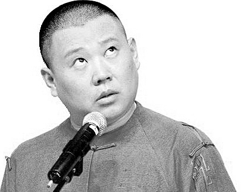
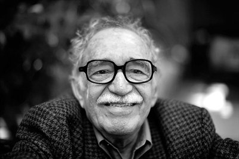

# 现实炸裂

唐朝最高领导人的亲属（御弟）唐三藏，有一天意识到众生需要救赎。于是，他招募了三个具有特殊能力的生物，一路战胜虚伪不义和诱惑，拿到西方如来佛最先进的那一套经文。唐三藏的发愿很伟大：他试图解救所有人，建立起某种人类和真理的桥梁。犹如东方耶稣。

然而真经取得、众生得救后不到三百年，唐朝灭亡。又过了很多年，宋朝前公务员宋江意识到上帝的“道”在这个社会没有被推行，于是他召集到了全国最优秀的108个人才。这108人中包括占卜师、全国武术教练、打死过老虎的警察局长、可以拔起一棵树的佛教徒、全国射箭冠军、一天能跑五百里的长跑奇才、军事家、音乐家、成功的企业家、贵族、富豪和军政界资深人士，造船专家（孟康）、城墙建筑师（陶宗旺）、酿酒专业户（朱富）、武器制造家（汤隆）、宴会筹备（宋清）以及多名酒店管理人才（东西南北山酒店）

甚至还有搞特色面食的黑店老板和老板娘。

这个放在历史任何角落都令人瞠目结舌的团队（也可能是暴力犯罪团伙），团队宗旨为：替上帝行使道义（替天行道）。

可结果呢？替天行道未遂。

108个专业人才，还是受上帝的指示，居然“行道”过程中被一个搞足球出身的官员和一个搞书法出身的官员给消灭了。中国人称这108人为“好汉”，言外之意是梁山起义的正义性。世道不好，好汉被逼上梁山，宣和二年宣布组织成立，但宣和四年就下山接受招安。一个躯体受到感染，108个健康细胞聚到一起，抵御感染，然后又突然回归感染部位，之后躯体灭亡。

唐三藏带领猴子猪河妖，遭受漫长的路途，最后只是为自己成佛？如果《西游记》不是自私的个人成功史，那三藏取到的真经就应该有更高的价值。汉族诞生东方，他们往东走，看到海洋，看到海上日出，于是相信生命起源东方，真理远在日落西方。玉皇大帝在东方掌握“道”和“德”，但西方的如来佛，掌握真经（真理）。

假如108个勇士没有错，宋朝两个奸臣也没有对，究竟是什么错了？是唐三藏被如来佛坑了，拿了个赝品真经？还是真经的保质期只有三百多年（还没孙悟空服刑时间长）？究竟这个真经是干什么用的？替天行道，行的什么“道”？
 
###郭德纲的苦难后遗症###

2010年8月，正厅级的相声表演艺术家姜昆组织了一群相声演员，深入讨论和学习了坚决抵制三俗的讲话，共同起草了一份“坚决抵制庸俗低俗媚俗之风，自觉承担曲艺工作者社会责任”的倡议书。相声名家常宝华发言说：三俗艺人不可取。

这件事不合理之处，不在于抵制三俗本身，而是在于一群艺术家对一个政治理论不必要的响应。受伤的平民草根相声演员郭德纲愤怒了，他接连演出了“我要反三俗”等相声作品，提出了“同行之间是赤裸裸的仇恨”等观点。

郭德纲经历过痛苦和贫穷，他不像姜昆年纪轻轻红遍大江南北，人生某一个时刻，他会想此生不可能出人头地，他为之努力的相声将灰飞烟灭，他的贫穷和苦难，将持续下去。他会在相声中回忆自己的悲惨经历，这些经历是真实的，是他本人的经历，也是相声的经历。

民众一夜间成了相声票友，他们讨厌权威讨厌被统治的情绪，一夜间被激起。姜昆变成了曲艺统治者，他大笔一挥，把好的相声消灭，把郭德纲打垮。人们还有一个认知：姜昆之所以反三俗，反到郭德纲头上，是出于嫉妒。

勤劳勇敢的中国人民一夜间扶正了出自平民阶层的郭德纲（当然这也出于郭德纲自己的相声作品确实优秀），他们把捍卫郭德纲和捍卫自己的权力结合起来，郭德纲就从草根一夜间主流，虽然他自己声称自己是非主流。

早期合作者王玥波退出去说了评书，最有前途的徒弟潘云侠退出，之后是刘文步徐德亮王文林何云伟李菁曹云金。张文顺离世，帐中无将的郭德纲慌乱中扶正了岳云鹏——一个早期没有任何天赋的德云社报幕员。结果岳云鹏逐步发展偏离了相声，走上类似小沈阳二人转（通过卖萌和女性化）的道路。而郭德纲，从小剧场撤离后，开始大量主持巡演拍戏，钱越赚越多。

郭德纲胜利了，正义的反权威艺术家胜利了，相声本身呢？

他说：相声不搞笑就太搞笑了。这话是对的。

但08年以后，郭德纲没有创作出任何可以和《论相声五十年之现状》媲美的作品。

我觉得《论相声五十年之现状》里有一种东西，是从马三立刘宝瑞侯宝林那里继承来的。这个相声能让观众在下面笑，相声演员在后台哭，郭德纲喊着眼泪演，这是相声。

南开大学教授，曲艺理论家薛宝琨说：

【当“喜剧艺术”最终沦落为“搞笑技术”，人们在相声场子除去震荡肚囊宣泄感官之外，还能有艺术反映生活、抒发情感、表现人物的快乐吗？

而艺术带给人们的种种快乐，都缘由并依傍着真实的快乐。既是现实也是历史的，既是存在也是想象的，既是情感也是理性的。是否可以这样认为：悲剧、喜剧、正剧只不过审视生活的方式和角度略有不同，真实同样是它们的生命。悲剧是仰视的、正剧是平视的，而喜剧是俯视的。由于喜剧艺术反映生活和表达情感的特殊方式，受众就更容易误会或挑剔它们的“失真”，因此也就更加强调它艺术真实性的重要。】

相声如果是种艺术，那就必须区别于搞笑。当郭德纲把自己的工作重点放在了于谦如何排泄放屁吃屎嫖娼乱伦妻子当妓女父亲有许多个的时候，民众还是在叫好：这些东西电视上不让播，那么这是反权威的，是好的。于是郭德纲的相声宗教化，你反郭德纲，你就惧怕权威，就是嫉妒，砸烂你丫的狗头。

2014年4月5日，郭德纲接受网易的采访，再次祥林嫂附体，N+1次地提出了自己独创的“同行间是赤裸裸的仇恨”。有趣的是，在一系列采访问题中，有一个问题是：为什么您一直以来都特别喜欢和人辩论？

郭的回答是：我不喜欢和人辩论，我只是小小地解释一下，如果我再不解释的话，那么坏人就太横行了。我是给同行们伸张正义。

为同行伸张正义？

您不是说：同行之间仇恨赤裸裸吗？

谁是你的同行？

谁是你要为其伸张正义的“同行”？
 
这个答案郭德纲从未给出。对他来说，今天的伟大成就来之不易，是孤身一人奋斗得来的。他想到自己的苦难史，就会下意识地捍卫自己的现在：他的周围永远危机四伏，角落里的“同行”，永远在做准备，攻击他，拿走他的一切。

这是一种精神分裂。

杰克伦敦写《热爱生命》，主人公历尽磨难，九死一生，最后被一艘船只救起。他虚弱的身体被船上的食物慢慢恢复，然而他的精神在长期饥饿中受了刺激：

【过几天，他就跟那些科学家和船员坐在一张桌子旁边吃饭了，他馋得不得了地望着面前这么多好吃的东西，焦急地瞧着它溜进别人口里。每逢别人咽下一口的时候，他眼睛里就会流露出一种深深惋惜的表情。他的神志非常清醒，可是，每逢吃饭的时候，他免不了要恨这些人。他给恐惧缠住了，他老怕粮食维持不了多久。他向厨子，船舱里的服务员和船长打听食物的贮藏量。他们对他保证了无数次，但是他仍然不相信，仍然会狡猾地溜到贮藏室附近亲自窥探。  

看起来，这个人正在发胖。他每天都会胖一点。那批研究科学的人都摇着头，提出他们的理论。他们限制了这个人的饭量，可是他的腰围仍然在加大，身体胖得惊人。  

水手们都咧着嘴笑。他们心里有数。等到这批科学家派人来监视他的时候，他们也知道了。他们看到他在早饭以后萎靡不振地走着，而且会象叫化子似地，向一个水手伸出手。那个水手笑了笑，递给他一块硬面包，他贪婪地把它拿住，象守财奴瞅着金子般地瞅着它，然后把它塞到衬衫里面。别的咧着嘴笑的水手也送给他同样的礼品。  

这些研究科学的人很谨慎。他们随他去。但是他们常常暗暗检查他的床铺。那上面摆着一排排的硬面包，褥子也给硬面包塞得满满的；每一个角落里都塞满了硬面包。然而他的神志非常清醒。他是在防备可能发生的另一次饥荒——就是这么回事。研究科学的人说，他会恢复常态的；事实也是如此，“白德福号”的铁锚还没有在旧金山湾里隆隆地抛下去，他就正常了。】

一个人，历尽磨难，九死一生，最后活下来，这是一个好的主题（类似的有《Life of Pi》《Gravity》《Captain Phillips》）。但杰克伦敦是一个旅行家，他经历过磨难，又能反思，所以写出了上面那一段。这一段是让他《热爱生命》这部小说伟大起来的一段，他告诉我们：一个人在磨难的过程中，行成了某种抵御机制，以至于得救之后（或者成功之后）依旧会被“恐惧缠住”。他明明到了一个食物充足的船上，他依旧在“防备一次饥荒”。

这就是一种精神分裂。     

郭德纲站在中国相声的制高点，拥有最有力的发言权，但他如今还是觉得，同行在仇恨他在迫害他，他还在抗争。

那么郭德纲一个人的精神分裂。会不会也是一个民族的精神分裂？
 
###余华的好兵福贵###

余华的《活着》里，莫名经历了一场战争的福贵回到家乡，先看到儿女，后看到妻子家珍：【这时有一个女人向我们这里跑来，哇哇叫着我的名字，我认出来是家珍，家珍跑得跌跌撞撞，跑道跟前喊了一声：“福贵。“就坐在地上大声哭起来，我对家珍说：“哭什么，哭什么。”这么一说，我也呜呜地哭了。我总算回到了家里......】

一个突然消失的丈夫，不知死活，多年后突然回家。妻子看到他，只是喊一句名字，然后“大声哭起来”，就完了？

余华后来写散文谈师承陀思妥耶夫斯基的《罪与罚》和威廉福克纳的《沃许》，说：【这时我读到了师傅的短篇小说《沃许》。他的叙述很简单，就是让人物的心脏停止跳动，让他的眼睛睁开。一系列麻木的视觉描写，将一个杀人者在杀人后的复杂心理烘托得淋漓尽致。此后，我再也不害怕心理描写了，我知道真正的心理描写其实就是没有心理。】

真正的心理描写其实就是没有心理吗？

这话看似高深，事实上不对。陀思妥耶夫斯基让拉斯柯尔尼科夫杀了老太太和福克纳让沃许杀了人后，叙述都未偏离主人公的心理。也就是说，杀人一瞬间叙述简单，但接下来所有的叙述，都在为这一瞬间补充。

而《活着》里，丈夫消失多年，回来见到妻子，呜呜哭两声，就完了。再没有后续心理描写，可以说，这是叙述的败笔。

为什么余华到这儿不知道该怎么写了呢？

回答这个问题，需要先回答另一个问题，给读过《活着》的人：

福贵怎么突然就参军了？他什么时候开始参军的？

余华的叙述是：福贵的母亲生病了，福贵决定去叫郎中，然后他因为一个小孩儿去敲了一个富人家的门，然后和富人的仆人打了一仗。正好国军路过，说：【难看死啦，这两个畜生大家打得难看死啦】【两头蠢驴，打架都不会，给我去拉大炮。】

福贵平时不出门，偏偏出去找趟郎中，就被抓去当壮丁了？

这是不合理的叙述。

为什么余华在这里失控？答案是：

这场战争本来不该福贵去经历。

中国作家有一个通病（当然也是中国读者的通病）：总是试图通过一个人物或者一个家族或者一个事件，展现一个时代的兴衰、变化、规律。我觉得这叫“黄仁宇综合症”。这个想法不错，但技术上完成这样一个事情是十分困难的。

大家会说：马尔克斯的《百年孤独》不就是拉美兴衰史，拉美的圣经吗？

《百年孤独》是表现了拉美历史。但注意，他的初衷不是为了记录历史。

马尔克斯在叙述他听到和感受到的拉美魔幻现实成分时，捎带手，和历史产生了联系。更重要的是，这个历史是合理的。

中国作家看到了马尔克斯的成功，于是试图把历史魔幻现实化，解释某一段时间发生的事。但问题是，他们对历史的看法对吗？他们有合理的历史观吗？

更尖锐的问题：谁又敢说自己理解中国的现实？

对历史的暧昧和现实的不确定，导致了一种分裂：你不说难受，说了又跑偏。试图让福贵来解释中国发展的余华，就硬要福贵去经历一场战争。为的是说明：哎呀，我们的民族遭遇过战争啊苦难啊战争太可怕啦云云。

一个人，莫名其妙，被迫经历一场战争，这是一个堂吉诃德式的伟大主题。捷克作家雅洛斯拉夫·哈谢克做到了这一点，他的著名小说《好兵帅克》就是这个主题。米兰昆德拉说这可能是最后一部伟大的通俗小说，他说这部小说揭示了一个现实：【帅克莫名奇妙地参加一场战争，他与伙伴们向前挺进。却不知道为了什么挺进，而且更不可思议的是，他们对此也不感兴趣。】【没有人相信宣传的胡说八道，甚至发布宣传的人也不相信。】

换句话说这个主题：某个领袖告诉自己的民众，我们的伟大目标，伟大理想是什么什么。民众听了哄堂大笑，说鬼才信！你丫开玩笑呢吧？

领袖哈哈大笑，说是啊，哈哈，其实我也不信，哈哈。

这不是一群疯子吗？    

所以余华没有抓住一个伟大的主题，他只是讲了一个所谓苦难史。福贵的悲剧，无非是家里人都死了，于是大家一把鼻涕一把泪，觉得福贵真惨。

这有什么惨的，只要你活得够久，活到120岁，你肯定会目送身边的妻子儿孙接连离世。但假如你是一个普通人，没有打仗的意愿，然后莫名其妙地参加一次战争，打了好多年你都不感兴趣的仗。这才是真的惨。

可惜余华让这个主题从手边溜走。福贵的参军经历没头没尾，中国读者看看哭哭，也就这样了。
     
###张艺谋的SM美学###

作家张佳玮写电影《金陵十三钗》的影评时，指出电影《活着》的一个问题：

电影比原著多出来了一个皮影戏。

张佳玮的解释是：【张导演，对于封闭感；压抑；色调渲染；对诸如皮影戏、青纱帐、染坊、旧上海歌厅这些色彩感十足的元素，以及所有女性遭受压抑的细节，都很关心。如果要简括张导的大多数电影，那就是：巩俐及其后续的影子，一次又一次，从某种封闭的环境里，举着某种艳丽华丽浓丽的元素，从被压抑被迫害的环境里往外冲。】

我不同意这个说法。

电影《活着》里皮影那段戏，恰好就是福贵被抓去参军的开始。张艺谋大概看出了余华没有在书里叙述好从军的经历，于是电影改为春生摇晃皮影，一把刀从幕布外刺进来，划破幕布。福贵和春生自此，莫名参军。

皮影戏台确实是封闭环境不假，但这不是【从被压抑被迫害的环境里往外冲】，这是被强行被带走，毫无往外冲的意思。

在《金陵十三钗》的影评中，学者刘仲敬有一段总结：【阶级与民族首先体现于阴道，三K党对黑人强奸案和八路军对城市女学生的敏感性远远超过财富。阴道乃权力本体，地位与财富只是外表与装饰。费拉SM学特点在于，继续发挥诡诈弥补无能幻想。娼妓偷换女生，相当于草船借箭----残疾人、女侠、儿童、僧道以武功秘笈战胜官兵。倒错=逆转=革命或反殖。从霍元甲到张艺谋，精髓在于#不用很累很麻烦就能逆转#费拉学本质=M的隐秘逆转=埃及通过被征服而征服罗马。】

对于《金陵十三钗》来说，这是一个精确的影评。娼妓偷换女学生，手里拿着玻璃，终究不是死就是被奸污。但这种结局，让人有种战胜日本兵智商的错觉，达到另一种变态的结局圆满。阿Q被人打了一拳，他这时不会想为什么被打或者被打以后该怎么办，他反而脑补自己是打他的人的父亲，从而说服自己，获得某种愉悦。学者刘仲敬，指出了这个偷换概念的特点：倒错=逆转=革命或反殖。

汉人被蒙古人征服了，被女真人征服了，但你猜怎么着？我们文化牛逼，我们把他们同化，我们把这些野蛮人的变成了中国人。

我们换个角度看，这是一种SM学，心理上叫受虐淫者：一个人强奸了我，但我把他变成了我，他也快乐，我也享受，皆大欢喜。

我爱奸污我的人。

张艺谋可以说，《金陵十三钗》是在娼妓身上找人性光辉，找人道主义。那么这个电影至少讲了两件事：1.娼妓的人性光辉。2.战争的恐怖。

这两点单独讲都没问题，结合到一起，就是问题。举个例子，在东莞扫黄时，跟记者进入洗浴中心，偷拍和小姐的对话，曝光色情服务。事实上，你站在洗浴中心门口，就清楚里面是干什么的。你不必进去，也不必偷拍，全国人民都知道里面是干什么的。问题是你进去了，还偷拍，还虚伪的问小姐问题。妓女有妓女的规矩，嫖客有嫖客的规矩，你不尊重妓女，不把她当正常人看，你就觉得肆意打破这个规矩没关系。

中国人民大学教授潘绥铭，做调查做研究，和妓女生活在一起，不怕被误解，这才是把妓女当人看，给她们尊重。我们看他的报告，觉得很真实，觉得妓女很重情义，我们也意识到：即使在太平盛世，妓女也有人性光辉。

所以，张艺谋没有必要，用战争告诉我们，妓女有人性光辉。这个潜台词不就是说：妓女因为抗日，才有了人性光辉。那么她们不抗日呢？她们假如拒绝替换女学生呢？她们是不是还是婊子？

作家严歌苓在原著中加入了战后国际法庭上，女学生书娟再次遇到幸存的妓女赵玉墨，这应该是书的重点。但张艺谋的电影里没有这个元素，他只是让女学生得救了，然后结尾。那假如从娼妓的人性光辉和战争的恐怖中二选一，张艺谋更想表达哪一个主题？显然是战争的恐怖。也就是说，这是一个打着宣传妓女人性光辉幌子的苦难回忆录。余华让福贵莫名参加战争不过是他被时代带到了沟里，他还有真诚，但张艺谋是充分发挥了诡诈、弥补和无能幻想。可谓集SM学之大成。

最后一个问题：为什么《活着》里多出了一个皮影戏。

听说过一个口号，叫冲击奥斯卡吗？
     
###现实炸裂###

通俗摇滚破音歌手汪峰有一天公布恋情时赶上了另一则更吸引人的新闻，于是众人哗然，争着帮汪峰上头条，乐此不疲，持续数月。

青年演员文章热爱自己的老婆，但不幸出轨，引发大家广泛讨论。什么是爱情？

一起交通摩擦，双方发生争执，一男人发现对方车内有个女婴，于是把婴儿摔死。

一个医生没有治好病人，病人亲属想：进医院，人死了，医生是杀人犯，法律不让医生偿命，我就把医生杀死。

某领导大有前途，儿子很优秀，有一天进了监狱。官方说法是其与多名女性发生了性关系，民众听了哈哈大笑，说这也可以啊，官方说哈哈哈哈，你懂得。哈哈哈哈。

作家阎连科有一天在韩国旅游，发现一堆韩文词语里有两个汉字他认识：炸裂。他敏锐地感觉这两字是形容中国社会最精确的词。他后来写了一本书，叫《炸裂志》。

2013年，阎连科出版《炸裂志》后，到加州伯克利做了一个演讲，他讲了三个他百思不得其解的故事：

一是他看新闻，听说中国某个村子的村民，发现扒路过火车上的货物可以发财，于是全村的就业问题得到了解决，村子发展一片大好。有趣的是，村民拒绝把这种行为叫“偷”，他们的逻辑是：火车经过，货物掉下来，他们捡到了，怎么叫偷？假如货物不掉下来，那么他们帮货物掉下来，这也不叫偷。

第二个故事是某省级干部提着礼物去中央找某部长，没想到被警卫员轰走了。省级干部很伤心，把礼物砸在地上，说：我真没有尊严。

第三个故事是阎连科自己的故事，他河南老家某个市交通局的干部决定修一条高速公路，直通北京。他希望阎连科在北京通融一下，让他修高速公路的事迹出现在某重要报纸上。他接着给阎连科一个惊人的许诺：假如能让他的政绩见报，高速公路可以在阎连科河南老家不到一公里的地方，开一个入口，这样阎连科就以后可以出门就上高速公路，来去北京更加方便。更有趣的是，阎连科拒绝这个要求后，他发现这条高速路最终建的十分奇怪，只在一个荒无人烟的地方开了一个口，离他老家却有几十公里。

这些故事最终经过改装，出现在了《炸裂志》里。这本书出版于2013年10月，紧接着余华的《第七天》的出版。评论家李寅初给这本书做出了精确的评论：认识粗糙，叙述失控，但有一种直面现实的勇气。我看过这本书后，觉得细节方面确实不自然：三十年不散的雾霭，六百年一次的雨，整个城市的钟表全部坏掉等画面，让人觉得还是马尔克斯《百年孤独》的味道。（有时候，我觉得中国作家好像只读《百年孤独》）

但“炸裂”这个词用得好，里面描写的人和社会发展的状态也贴切。炸裂，是一种膨胀，在人群之中，空气最中间，炸开的感觉。这个词存在于中国社会，也存在每个人心，膨胀，爆炸，分裂。提出“神实主义”的阎连科解释为：神话现实主义。我觉得这个解释不对，应该叫“神经病现实主义”。

百年孤独》结尾，马孔多被飓风卷走，在人们记忆中消失。这是魔幻现实主义，也是马尔克斯对于逝去的加勒比沿岸文化的追忆。而中国的“神实主义”没有结束，虽然在历史中它曾经炸裂过，炸过不止一次。梁山好汉在山上发现只能打家劫舍，无法替天行道，他们这时候精神瞬间分裂，忘记了自己当初为什么要上梁山，忘了上帝的“道”究竟是什么。他们决定下山，再试一次，原因是他们觉得社会不公，是那两个足球和书法政治家的错。

他们从山上冲下来，现实炸裂，炸得武松失去一只胳膊，炸得林冲抑郁而死，炸得宋江李逵喝毒酒，炸得花荣吊死坟前，连搞面食的孙二娘也莫名加入一场战争，最后阵亡。她本以为开黑店的犯罪史已得救赎，宋江替天行道大旗，已经恢复了她心中的道义，可她没有想到战争突如其来。她死后会不会突然醒悟，来世终于拒绝正义，回归害人性命的职业。亦或是，她满腔愤怒，把这时已经供在了庙里的唐三藏揪出来，塞给他几个素馅儿的包子，让他再去趟西天，再普度一次众生。              
 
###书写追不到的现实###

阎连科去年出书后做了不少演讲，其中有一段让我印象深刻，他说：【中国现实的复杂、荒诞、丰富和深刻，已经远远把作家的想象甩到了后面。生活中的故事，远比文学中的故事传奇、好看得多，也深刻得多，但作家没有能力把握这些，也没有能力想象和虚构这些。作家的想象力和现实的复杂性进入到同一跑道进行赛跑，跑赢的是中国现实，输掉的是中国作家的想象力。即便作家有天大的想象力，都无法超越现实本身，这是不言而喻的事实。】

这句话是阎连科的真实感受，我相信他在追赶现实的书写时，曾经失望过，曾经痛哭过。现实鱼龙混杂，如同一个人的经历。但阎连科是负责任的作家（余华也是负责的作家），他知道他努力的意义和写作的意义。他的写作是有尊严的。

但假如我们追不上现实的话，书写究竟又有什么意义？小说有什么意义？

博尔赫斯说了一句话：小说家应该像书写者那样写，而不是像时代那样写。台湾散文家唐诺在散文家《尽头》里的理解是：小说要对抗着一个时代写，而不是附庸着时代写。

这话又是什么意思？

米兰昆德拉写过一篇关于卡夫卡的文学评论，他在里面谈到了卡夫卡的小说《城堡》：

【十几年前，一个城堡向村政府提出申请，要雇佣一个土地测量员。村长觉得没有必要去测量什么，就笔头回复了否定，然后百忙的村长把这个回复随手一扔，回复就丢失了。十几年后，在很微妙的情况下，土地测量员K，收到了让他去城堡测量土地的邀请函，于是他就去这个城堡上任。到了城堡后，他自称是被聘请来的土地测量员，但却又拿不出任何证明，于是遭到了严厉的盘查。故事的结局，K用尽心机，东奔西突，但他的一切努力终属徒劳：K至死都没有能够进入城堡。】

米兰昆德拉指出，卡夫卡在《城堡》里没有写任何寓言，也没有任何政治观点，更不是在讲社会学和心理学。在卡夫卡那里：【机构成了一个遵循自身法则的机制，这个法则也不是什么人、什么时候定下的，也跟人的利益没有任何关系，所以根本不可理解。】

也就是说，在《城堡》里，信息一级一级传下来，传到K手上的时候，他试图去找最初发信息的人，但权力一层套着一层，他找不到权力的尽头，于是他被挡在了城堡外面。

我去年看到一则环球时报的新闻（官方信息），说一个被通缉了二十多年的人，想要投案自首，回国坐牢，为了能见自己的家人。他先后自首了四次，却都因“无法提供旅游证件”为由，被拒绝其入境。

这是一个卡夫卡式的故事：这个人犯罪、逃跑了，然后给他定罪的人退休了或者死了，新上任的官员不愿谈这件事，于是所有的官员都不愿谈这件事。那么这个人的罪就没人可以解释，也没人可以让他的罪得到惩罚。下级问上级：这事儿怎么处理？上级想了想，这事儿我还得问问我的上级才行。然后信息一级一级递上去，中间也就传递丢了。自始至终没有一个人站出来，说这个人有罪，或者无罪。他的命运就此被搁置了。

属于中国的现实，竟然被一个早已死去的奥地利作家，很久以前，就书写过了。

散文集《尽头》的前言里，唐诺说：【书写工作，我仍很偶尔会想起年轻，还“无法进入到这个世界”（昆德拉语）的时日，当时，现在想来不知从何而生的空气中仿佛有个神奇的允诺，好像这是个接近无所不能、或至少足够自由轻灵到可以一再穿透各种界线、时间界线、空间界线乃至于人生死界线的太好东西，也许曾经、或本来可以这样没错。多年之后，我渐渐相信并且认定，在原来这也不能那也不能的实然世界之中，书写仍有这样一件事可以做而且得做，接近一种责任，那就是——此时此地，书写者至少得奋力地说出人的当下处境、他自身的处境。世纪交迭，万事发生，惟这一刻我们站在哪里，记得什么，看着什么，知道些什么，意识着什么，犹期盼什么。仔细看，这其实是书写时间长河中一代一代的连续工作，所以说像是个不懈的责任。】

我希望写篇文章向余华阎连科唐诺卡夫卡米兰昆德拉哈谢克博尔赫斯致敬。文学之所以存在，区别于历史学政治学心理学等学科，有它本身的意义。文学没有给现实一个答案，也没有给时代一个答案。文学是走入现实的迷宫，然后书写出来，这个过程痛苦又心酸，但这是文学精神。

中国所有文人的老师孔子生前说了很多话，胡适发现了两条最重要的言论，这其实是孔子的伟大精神，也是追不到中国现实的文学工作者爱好者应该记住的：

一、知其不可而为之。

二、其为人也，发愤忘食，乐以忘忧，不知老之将至云尔。

（采编：薛晨如；责编：刘铮；）