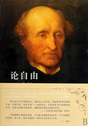
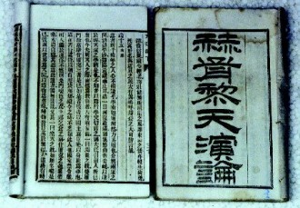

# 再读密尔《论自由·引论》后的三问

**（一）一问：本书之主旨——何谓“社会自由”**

“这篇论文的主题不是所谓意志自由，不是这个与那被误称为哲学必然性的教义不幸相反的东西。这里所要讨论的乃是公民自由或称社会自由，也就是要探讨社会所能合法施用于个人的权力的性质和限度。”2

开篇伊始，密尔便将自由分为“意志上的自由”与“公民或社会的自由”。实际上，这种划分并非密尔首创，早在18世纪，法国思想家孟德斯鸠已然将自由划分为“哲学上的自由”与“政治上的自由”。他说：“哲学上的自由，是要能够行使自己的意志，或者，至少（如果应从所有的体制来说）自己相信是在行使自己的意志。政治的自由是要有安全，或者至少自己相信有安全。”3所以说，将自由依照哲学、政治两个领域分而研究并不是一种密尔所在时代的“突变”，而是有着长期的传统的。

因此，欲理解《论自由》，必先理解“社会自由”；欲理解“社会自由”，必先理解“自由”。

首当明确：自由是一种权利。霍布斯指出，自然权利就是“每一个人按照自己所愿意的方式运用自己的力量保全自己的天性——也就是保全自己的生命——的自由”4。“当我们讲到自由时，不是指作为人的意志的自由，或者说作为终极价值的自由境界，而是指我们拥有的权利”5。1958年，柏林发表了《论自由的两种概念》，把自由划分为“积极自由”与“消极自由”。柏林所谓“消极自由”，是在总结、概括了霍布斯、贡斯当等诸多思想家观点的基础上提出的，即自由是“免于…的自由”；而其所谓“积极自由”，是指“个人希望能够做自己的主人”6，即“成为…的自由”。此后，整个欧洲近代思想史便被视作“消极自由”与“积极自由”的演进史，与此同时，从制度上而言，前者成为了宪政民主的理论基石，而后者则是专政独裁体制的代表。

柏林的观点在当今中国思想界仍然风行，并被视为经典与圭臬。实际上，西方自80年代便已经开始了对这一理论的反思。诚如凯瑞•帕罗内所言，“回想起来，它（指《论自由的两种概念》）更像一篇散文，既不是严格的哲学式著作，也不算历史学的，并且它的风行也很难理解。”7就此，对柏林颇为尊敬的斯金纳教授亦曾指出，“积极自由理论的基础是相信人类自然存在一种本质，如果，仅仅如果当我们成功的实现了我们生命中的本质时，我们才是自由的。”8在批判柏林“积极自由”的同时，斯金纳教授亦更为明确的肯定了“消极自由”的机会特性：“我碰巧同意柏林的观点，即有许多不同的目的，我们可以很好的同时追求。”9

综上所述，柏林的理论最大的问题便在于硬性的划分了自由的种类，“对一个概念史家来说，柏林的论断带有本质主义的强调，‘任何事情就是任何事情，自由就是自由。’因此，柏林的主要兴趣似乎就是一种哲学的澄清。”10我们只有先打破僵化的区分自由为“积极”与“消极”两类的桎梏，才能更加明朗地从整体上认识“自由”这一概念。

密尔即是在“自由”这一整体概念的基础上对自由进行考察，进一步对“社会自由”进行探讨与研究。维新变法时期的大思想家严复在翻译On Liberty时将其定名为《群己权界论》，这一译可谓精彩——它最大程度的反映了密尔一书的精髓——探讨社会与个人的关系，或说双方权利的界限，或说是权力与权利的关系。第二章是论思想自由与讨论自由,第三章是论个性为人类的福祉因素之一,第四章是论社会驾于个人的权威的限度。显而易见,二三两章是讨论个人自由,即思想自由、讨论自由以及个性自由等,第四章社会对个人的合法限制。这种于社会关系之中探讨个体与群体的关系乃是密尔此书之最大贡献，即其社会自由之思想，自由作为一种权利，必当建立于某种具体的、复杂的社会关系之中，不存在完全独立的权利，因而也就不存在完全独立的自由。

强调在社会关系中探讨权利与自由的观念在西方由来已久——而这正是与以霍布斯、洛克为代表的契约论派（权利自由主义）针锋相对的、功利论自由主义的主张。正如休谟指出的那样，所谓的自然状态“既没有刻在树皮上，也没有写在羊皮卷上，它先于人类的一切记录方式与经验认知”11。这鲜明的指出了霍、洛的弊病所在：他们先是在理论上构建出了一个所谓的自然状态——而这是不证自明的，并在其中讨论人的各种权利与一个社会应有的各种规则，随后再将其“平移”到现实之中，使之成为社会应有之义，这种对于权利的讨论一开始便脱离了社会关系。正如密尔所言，“对于洛克而言,即使单独的生存在一个孤岛上的人也对他的劳动具有一种权利,并且可以通过他的劳动获得对物品的所有权。”12因此这种一开始便脱离了社会关系的理论一旦应用到社会之中，必然引起其意料之外的问题。正如贡斯当认为的那样，并不存在的、抽象的人民主权需要转交给一个实际的、普遍的权力，而“实际上，它以人民主权的名义所要求的权力，并不是那种主权的一部分，它不仅是对现有权力的非法置换，更是创造了一种根本就不存在的权力。”13这也正是密尔重申“社会自由”的原因，也是其所欲探讨的“新的问题”的根源所在。

那么，又何谓“新的问题”？

**（二）二问：本书之背景——何谓“新的问题”**

“这个问题，很少有人用一般性的说法予以提出，更从来没有人用一般性的说法加以讨论，但是它却在暗中深刻地影响着当代一些实践方面的争论，并且看来不久就会被公认为将来的重大问题。它远非什么新的问题，从某种意义说，它几乎从最远的年代以来就在划分着人类；不过到了人类中比较文明的一部分现在已经进入的进步阶段，它又在新的情况下呈现出来，要求人们给以一种与前不同而且较为根本的处理。”14

为什么密尔认为这样的问题既不是一个新的问题，又是一个新的问题？这种看似矛盾的说法缘何而起？

我们必须从历史以及密尔所处的时代中去寻找答案。

随着19世纪工业革命的推进与推广，一场世界范围内的政治革命亦走向了历史的潮头，即“民主化”的大潮。随着民主制（尤其是代议制民主）的广泛建立，民主的弊端亦日益凸显，“多数人的暴政”成为当时思想家们研究、考察的焦点，托克维尔将其称之曰“民主专制制度”。民主专制制度的特点在于：以国家代替了国王，以社会代替了家族，它在全体人民的名义下剥夺了人民的权利，侵犯着人民的自由。无论是托克维尔之前的雅各宾专政，还是其所处的法兰西第二帝国，都事实上认证了这一点。而托克维尔对密尔的影响是极为巨大的，正如密尔在其自传中所言那样：“我阅读托克维尔先生的《论美国的民主》的时候（此书刚问世我立即得到一本），在那本享有盛名的著作里，把民主政治的优点说的这样确切这样具体，其程度为我一向所未知，甚至也没有听到最热情的民主主义者说起过；同时书中对多数人统治的民主政治周围的具体危险也同样阐发无遗、分析透彻；作者提出这些危险并非否认民主政治是人类进步中不可避免的后果，而是指出民主政治的弱点，同时指明保卫民主政治的各种方法和必须增添的纠正措施。”15而这也正是《论自由》一书讨论的核心所在：如何防止民主制的弊病，或说，如何保障民主制下个体（尤其是少数人）的权利与自由。

在这样一种纬度之上，“旧的问题”才衍生为一种“新的问题”。正如密尔所言，原本所谓自由即斗争与防御，而“这个斗争乃是臣民或者某些阶级的臣民与政府之间的斗争。那时所谓自由，是指对于政治统治者的暴虐的防御。”16这种斗争存在的前提在于“统治者必然处于与其所统治的人民相敌对的地位，所谓统治者，包括实行管治的“一夫”，或者实行管治的一族或一个世袭阶级”17。因此，“爱国者的目标就在于，对于统治者所施用于群体的权力要划定一些他所应当受到的限制；而这个限制就是他们所谓自由。”18这是密尔提出的第一种自由，即“旧的问题”下的“旧的自由”。显而易见，当民主的时代已经来临，统治政府已由原来的“一夫”变为国家或“全体人民”时，这种“古代人的自由”便已然不合时宜了。

因此，密尔提出了“新的问题”。时代已经改变，“人们对于管治者之成为一种独立的权力而在利害上与他们自己相反对，已不复认为是一种自然的必要。他们看到，国家的各种官府若成为他们的租户或代表，可以随他们的高兴来撤消，那就要好得多。”19这种民选的政府给予民众一个错觉：政府是自己选出的，便也必然代表了自己的利益，因而亦已不可能侵犯到自己的权利与自由。“统治者的利害和意志应当就是国族的利害和意志。国族无须对自己的意志有所防御。不必害怕它会肆虐于其自身。”20但事实并非如此，因为“运用权力的“人民”与权力所加的人民并不永是同一的；而所说的“自治政府”亦非每人管治自己的政府，而是每人都被所有其余的人管治的政府。至于所谓人民意志，实际上只是最多的或者最活跃的一部分人民的意志，亦即多数或者那些能使自己被承认为多数的人们的意志。于是结果是，人民会要压迫其自己数目中的一部分；而此种妄用权力之需加防止正不亚于任何他种。”21这也是为何启蒙思想家们的政治理念可以成为完整的革命爆发的力量源泉而不能成为完整的革命之后的政治框架的理论的原因——他们只是探讨了当政府与人民对立条件下的状况，而未涉及一旦人民与政府合为一体（或说政府名义上已经代表了人民）之时会产生怎样的问题。

当然，密尔对民主的分析并不仅仅只是局限于“多数人暴政”，他亦关注到社会舆论的压制，以及其所带来的社会“习俗的专制”。正如密尔自己所言：“但是迫使一个意见不能发表的特殊罪恶乃在它是对整个人类的掠夺，对后代和对现存的一代都是一样，对不同意于那个意见的人比对抱持那个意见的人甚至更甚。假如那意见是对的，那么他们是被剥夺了以错误换真理的机会；假如那意见是错的，那么他们是失掉了一个差不多同样大的利益，那就是从真理与错误冲突中产生出来的对于真理的更加清楚的认识和更加生动的印象。”22因而，“和他种暴虐一样，这个多数的暴虐之可怕，人们起初只看到，现在一般俗见仍认为，主要在于它会通过公共权威的措施而起作用。但是深思的人们则已看出，当社会本身是暴君时，就是说，当社会作为集体而凌驾于构成它的个别个人时，它的肆虐手段并不限于通过其政治机构而做出的措施。社会能够并且确在执行它自己的诏令。而假如它所颁的诏令是错的而不是对的，或者其内容是它所不应干预的事，那么它就是实行一种社会暴虐；而这种社会暴虐比许多种类的政治压迫还可怕，因为它虽不常以极端性的刑罚为后盾，却使人们有更少的逃避办法，这是由于它透入生活细节更深得多，由于它奴役到灵魂本身。因此，仅只防御官府的暴虐还不够；对于得势舆论和得势感想的暴虐。”23这段话明确的表现出密尔已不仅仅是从政治层面去探索民主的弊端，而是从社会层面上去刨析这一“新的问题”，因而密尔也就达到了托克维尔所谓到达的一个新的高度——密尔实现了自由的“社会性转向”。

提出了“新的问题”，阐明了“社会自由”，密尔面临着下一个问题——“这个边界应当划在哪里”，如何实现其所谓之自由？

**（三）三问：本书之宗旨——何谓“伤害原则”**

“人类之所以有理有权可以个别地或者集体地对其中任何分子的行动自由进行干涉，唯一的目的只是自我防卫。这就是说，对于文明群体中的任一成员，所以能够施用一种权力以反其意志而不失为正当，唯一的目的只是要防止对他人的危害。若说为了那人自己的好处，不论是物质上的或者是精神上的好处，那不成为充足的理由。人们不能强迫一个人去做一件事或者不去做一件事，说因为这对他比较好，因为这会使他比较愉快，因为这在别人的意见认为是聪明的或者甚至是正当的；这样不能算是正当。所有这些理由，若是为了向他规劝，或是为了和他辨理，或是为了对他说服，以至是为了向他恳求，那都是好的；但只是不能借以对他实行强迫，或者说，如果他相反而行的话便要使他遭受什么灾祸。要使强迫成为正当，必须是所要对他加以吓阻的那宗行为将会对他人产生祸害。任何人的行为，只有涉及他人的那部分才须对社会负责。在仅只涉及本人的那部分，他的独立性在权利上则是绝对的。对于本人自己，对于他自己的身和心，个人乃是最高主权者。”24

这就是密尔提出的“伤害原则”，即“不干涉原则”。可以说，密尔狡猾地宣称它是“极其简单的原则”，但却给我们留下了一个值得深思的问题。

实际上，密尔就是从消极自由的维度出发，解决或说试图解决他所提出的界限问题的。密尔貌似首先给出了一个“社会的”人应当享有的“自由”，实际上是指出了社会所不应干涉的、个体的“绝对领域”——“第一，意识的内向境地，要求着最广义的良心的自由；要求着思想和感想的自由；要求着在不论是实践的或思考的、科学的、道德的或神学的等等一切题目上的意见和情操的绝对自由。说到发表和刊发意见的自由，因为它属于个人涉及他人那部分行为，看来像是归在另一原则之下；但是由于它和思想自由本身几乎同样重要，所依据的理由又大部分相同，所以在实践上是和思想自由分不开的。第二，这个原则还要求趣味和志趣的自由；要求有自由订定自己的生活计划以顺应自己的性格；要求有自由照自己所喜欢的去做，当然也不规避会随来的后果。这种自由，只要我们所做所为并无害于我们的同胞，就不应遭到他们的妨碍，即使他们认为我们的行为是愚蠢、背谬、或错误的。第三，随着各个人的这种自由而来的，在同样的限度之内，还有个人之间相互联合的自由；这就是说，人们有自由为着任何无害于他人的目的而彼此联合，只要参加联合的人们是成年，又不是出于被迫或受骗。”25总的来说，“密尔坚持，只要是纯粹涉及行为者本身的事情社会和政府就不应当干涉，这种对个人自由的严格保障自然构成了对民主强有力的限制。”26亦就社会共同体来说，“人的生命，人的自保自然应该是社会状态下每一个人的目的，也自然应该是社会的目的。”27

实际上，启蒙的最后一位大思想家康德曾经提出过与之十分相似的观点：人非工具，人不是手段而是目的，人的一切行为的根源在于为人、为人类谋福祉。在利益的判断上究竟是以集体还是以个人为判断的准则的问题上，密尔果断而又坚决的选择了后者。

这与我们今天中国的实际语境是截然不同的。我们拥有着一个胆敢将自己称作“代表人民”的党、一种不断强调集体主义的价值观念和一个坚决要求集权体制的社会形态。那么，密尔的自由理论在我们究竟有何意义？

其最大作用在于——让我们明确自由，或说是明确地区分民主与自由。

关于民主、自由与平等关系的讨论，自托克维尔开始便已经可以明确了——三者并不是完全统一的，甚至有时会走向对立与冲突。当然，与此同时，三者又是密不可分的一体，它们共同构成了一个健康、向上的社会的基石。

在中国，民主与自由的实现程度姑且不论，但将自由与民主混淆言之的事确实在不断发生，这提醒我们应当明确自由的概念——或说——应当在我们的教育体系中引入相关的政治思想理念，一个健全的公民社会需要一批拥有健全知识体系的公民。

因此，不论密尔的这种“伤害原则”是否得当，但它至少说明了我们今天与未来的需要：界限更加明确的权力，界限更加明确的国家，与界限更加明确的自由。

（采编：马乙洋；责编：彭程）

 注释： 1.作者简介：魏灵学，男，复旦大学历史系历史学2010级学生，研究方向：日本近现代思想史，（Tel）15921231529；（E-mail）10300140009@fudan.edu.cn 2.密尔：《论自由》，许宝骙译，北京：商务印书馆，1982年，第1页 3.孟德斯鸠：《论法的精神（上册）》，张雁深译，北京：商务印书馆，1987年，第188页 4.霍布斯：《利维坦》黎思复等译，北京：商务印书馆，1985年，第92页 5.李宏图：《密尔<论自由>精读》，上海：复旦大学出版社，2008年，第25页 6.转引自李宏图：《密尔<论自由>精读》，上海：复旦大学出版社，2008年，第27页 7.凯瑞•帕罗内：《昆廷•斯金纳思想研究》，李宏图译，上海：华东师范大学出版社，2005年，第121页 8.转引自凯瑞•帕罗内：《昆廷•斯金纳思想研究》，李宏图译，上海：华东师范大学出版社 ，2005年，第122页 9.转引自凯瑞•帕罗内：《昆廷•斯金纳思想研究》，李宏图译，上海：华东师范大学出版社 ，2005年，第122页 10.转引自凯瑞•帕罗内：《昆廷•斯金纳思想研究》，李宏图译，上海：华东师范大学出版社 ，2005年，第120页 11.转引自靳继东：《从经济正义到政治正义》，《石家庄学院报》，2008年7月版 12.转引自靳继东：《从经济正义到政治正义》，《石家庄学院报》，2008年7月版 13.贡斯当：《古代人的自由与现代人的自由——贡斯当政治论文选》，阎克文译，北京：商务印书馆，1999年，第65页 14.密尔：《论自由》，许宝骙译，北京：商务印书馆，1982年，第1页 15.密尔：《约翰•穆勒自传》，郑晓岚、陈宝国，北京：华夏出版社，2007，第115页 16.密尔：《论自由》，许宝骙译，北京：商务印书馆，1982年，第1页 17.密尔：《论自由》，许宝骙译，北京：商务印书馆，1982年，第1页 18.密尔：《论自由》，许宝骙译，北京：商务印书馆，1982年，第2页 19.密尔：《论自由》，许宝骙译，北京：商务印书馆，1982年，第2-3页 20.密尔：《论自由》，许宝骙译，北京：商务印书馆，1982年，第2-3页 21.密尔：《论自由》，许宝骙译，北京：商务印书馆，1982年，第4页 22.密尔：《论自由》，许宝骙译，北京：商务印书馆，1982年，第19页 23.密尔：《论自由》，许宝骙译，北京：商务印书馆，1982年，第5页 24.密尔：《论自由》，许宝骙译，北京：商务印书馆，1982年，第11页 25.密尔：《论自由》，许宝骙译，北京：商务印书馆，1982年，第14页 26.康士其：《西方政治思想史》，北京：北京大学出版社，2002年，第296页 27.李宏图：《密尔<论自由>精读》，上海：复旦大学出版社，2008，第98页 [北斗荐书：阅读私经验（三）·理解战争](/archives/25982) [北斗荐书：阅读私经验（二）·理解时光](/archives/25384) [北斗荐书：阅读私经验（一）·理解艺术](/archives/25173) [【用脊椎骨阅读】阅读私经验（四）·理解教育](/archives/36503)——教育的一个主要目的，正是增进自由。但是每次增进自由的时候，无时无刻的“政治”却阻挠自由的脚步。反自由式的教育最终会蜕化成在“政治”影响下的思想控制。 [【用脊椎骨阅读】工人？工人！（上篇：外国工人）](/archives/36049)——二十世纪最为危险的人类实验暂且渡劫余波，工人的政治性光荣不再。从而，工人理论与工人地位之间的逻辑撕裂已然造成时下代群记忆以及历史叙事的回避之处所在。 [【用脊椎骨阅读】祛魅民国大学——关于民国大学的书籍推荐](/archives/36049)—提及理想大学，很多人第一个想到的就是西南联大，战火纷飞中民国的才子佳人故事更为这所大学增添了一份传奇色彩，为那个时代微缩的历史赋予了庄严的意义。 [【用脊椎骨阅读】阅读私经验（五）·理解快乐](/archives/36677)——耶稣说，“他的喜乐，没有人能夺去。喜乐不是人自己找来的，而是神所赐的。”快乐究竟是天赐，抑或后天习得？激情缺位，快乐缺位，人类心智正在面临无边的拷问。 [【用脊椎骨阅读】曲高而和不寡：当代知识分子的独立与自由——以胡适、陈寅恪与王元化为例](/archives/37032)——为自己思想信仰的结果负责任，不怕“监禁杀头”，只认得真理，乃是中国知识分子最应该坚守的操守。而对权力的俯首帖耳，则会失去最本质的学术，最本质的人格。
