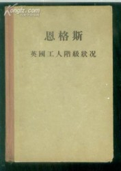
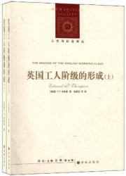
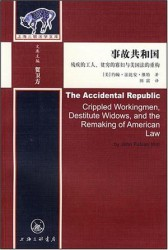
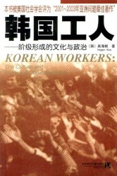

# 工人？工人！

【主持人语】上个世界五六十年代，“工人”在中国的公共话语中无疑具有非常重要的地位。而在今天，工人却成为了当代社会地地道道的“弱势群体”，在中国现代化与城市化的进程当中，这些经济最重要的支撑者却被时代的列车远远地扔下了。

我一直认为，对于我们这一代人，尤其是我们这些大学生而言，“工人”是一个非常疏离的概念。哪怕我们当中，有人的父母在工厂工作，但工厂对我们而言，更多地仍旧只是一种遥远的想象，“工人”到底是什么？我们常常挂在嘴边的“工人阶级”又是什么？都是我们无法回答的问题。

因而，七星荐书会用两篇文章的篇幅来介绍工人问题，为大家推荐一些和工人有关的理论著作和纪实研究，希望能够为大家打开一扇了解工人和工人阶级的大门。

这一期，我们会向大家推荐几本关于国外工人的著作。

### **1、 恩格斯：《英国工人阶级状况》**

说到工人阶级，马克思主义是不得不提及的一个流派。作为最早完成工业化的几个国家之一，英国工人阶级所遇到的问题无疑具有典型性，也为后代的人提供了一个极好的现代化观察样本。正是因为遭遇了这些工人阶级所引发的社会问题，引发了马克思等人的思考，在某种程度上我们甚至可以说，工人问题正是马克思主义的“根”。而这本恩格斯的《英国工人阶级的形成》则可以视作马克思与恩格斯对工人问题看发的入门书，无论是为了了解那个时代英国工人的生存境况，还是了解马克思主义的起源，都有着极其重要的意义。

### **2、 汤普森：《英国工人阶级的形成》**

说起工人研究，绝对绕不开的就是这本英国历史学家汤普森的大作——《英国工人阶级的形成》。汤普森告诉我们，马克思主义所谓的工人阶级其实并不像我们想象的那样是由经济地位决定，自然而然形成的。借助很多对当时工人心理侧面的描写，汤普森以近乎文学家的语言向我们描绘了工人阶级时如何成为一个有着“阶级意识”的群体。值得注意的是，汤普森的这部书几乎牵扯到近代英国最为重要的社会面向，通过阅读这本书，我们同样也能对于近代英国社会有一个大概的把握。

### **3、 约翰•法比安•维特：《事故共和国》**

1935年，时任美国总统的罗斯福说：“我们从来无法保证百分百的人口免受百分百的生活危险与变动，但我们已经试图建构一种法律，它能给普通公民及其家庭在失业与老龄贫困时带来一定的保证。”彼时的美国，因为长达数十年的经济飞速发展，有着“新帝国”光环。但是，国内问题多多，贫富差距巨大，阶级矛盾尖锐，罢工示威风潮此起彼伏。 正是在这样一个激荡的社会环境里，美国渐渐孕育出了一些今天我们赞誉有加的“美国元素”。《事故法》等一系列法律因为这些工人事故而通过，这不仅仅是一些法案，而代表着美国的国家精神发生了变化——国家能力因为工人赔偿制度建立而和民众发生了紧密的联系，想要了解这一变化发生的具体情形，则需要各位感兴趣的同学自己去阅读这部书了。

**4、 具海根：《韩国工人》**

现在，让我们把目光从西方收回亚洲，来看看我们的邻居——韩国。按照一般的说法，亚洲工人一向以“勤劳、守纪和顺从”而闻名，因而亚洲的工人虽然也有生存情况很恶劣的情况，但大致保持了一种“产业和平”的情况。 而在二十世纪的最后二十年，韩国工人的这种情况发生了很重要的变化，因为种种原因，韩国温顺的产业工人变成了社会变革的重要力量。但最值得我们注意的是，韩国工人为什么能够成功影响政治制度改革，传统社会和传统工人观念是如何改变的？相比英国和美国，同为东亚文化圈的韩国，其情况对于我们如何认识中国工人与中国工业有着不同寻常的意义。

（采编：刘星男；责编：彭程）

[【用脊椎骨阅读】祛魅民国大学——关于民国大学的书籍推荐](/archives/36049)—提及理想大学，很多人第一个想到的就是西南联大，战火纷飞中民国的才子佳人故事更为这所大学增添了一份传奇色彩，为那个时代微缩的历史赋予了庄严的意义。

[【用脊椎骨阅读】阅读私经验（四）·理解教育](/archives/36503)——教育的一个主要目的，正是增进自由。但是每次增进自由的时候，无时无刻的“政治”却阻挠自由的脚步。反自由式的教育最终会蜕化成在“政治”影响下的思想控制。

[【用脊椎骨阅读】阅读私经验（五）·理解快乐](/archives/36677)——耶稣说，“他的喜乐，没有人能夺去。喜乐不是人自己找来的，而是神所赐的。”快乐究竟是天赐，抑或后天习得？激情缺位，快乐缺位，人类心智正在面临无边的拷问。

[【用脊椎骨阅读】再读密尔《论自由·引论》后的三问](/archives/36776)——自由，看似简单的字眼，蕴含着最复杂的思考与争论。个人的社会自由与权力、制度等公众事物之间，究竟有怎么样的关系？我们需要的，是界限更加明确的自由。
