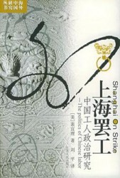
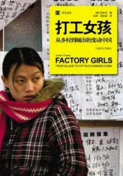
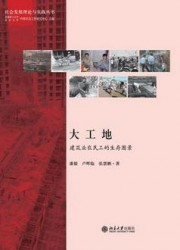

# 工人？工人！（下）

如果说国外工人的生存史对我们而言是一种借鉴的话，那么中国工人的生活现状则是最为真实的生存体验。可能我们当中某个人的父辈，正是来自于这个号称国家统治阶级，事实上却饱经折磨的群体。曾经的工人是光荣的工作，如今，却几乎成为了社会权力结构中被遗忘的存在。虽然媒体不断地给予这个群体曝光，但对于我们这一代大学生来说，工人确确实实地是作为他者而存在的，是我们必须正视但却遥不可及的存在。

这种差异和断裂在年轻一代人身上表现得尤为明显，我们有时候会忘记，我们坐在电脑前看着的那些工人们，可能正是和我们同一代的青年人。我们常常讨论社会断层，只是将眼光放在自己和所谓的“权贵阶层”上，却浑然忘记了，自己在某些同龄人眼中，已经过着他们遥不可及的幸福生活。

**1****、裴宜理：《上海罢工：中国工人政治研究》**

裴宜理对于上个世纪三十年代的上海工人的分析，紧紧围绕着地缘、党派和产业三个方面展开。上海的工人来自周围的几个省份，以“乡谊”为纽带结合在一起，在当时的各政治党派的“运动”下，成为彼时政治舞台的重要力量。裴宜理以这一事实告诉读者，上个世纪上海地区的工人是如何以一个团体的力量影响当时中国政治的。其间很多细节颇堪玩味，尤其是以之和当下工人的政治力量的对比，则不禁会让读者思考：是什么使得那个时代的工人有着如此巨大的力量？

**2****、张彤禾：《打工女孩：从乡村到城市的变动中国》**

如果说上个世纪的工人政治离我们还是很遥远的话，那么“打工”这个词，可以说是和我们当下的生活紧密相关。尤其是近二十年来，市场经济的发展使得无数农民背井离乡，来到城市去寻找工作的机会，一个新的社会群体——“农民工”就这样产生了。在这样的人口迁徙当中，有的欢笑，有的人流泪，成功者走出了打工者的群体，成为新一代的城市人，而失败者，可能就沦为富士康事件中的几个数字。张彤禾是西方记者，她笔下的“从乡村到城市的变动中国”，更多地希望向读者展示中国现代化当中的积极因素。这也是这本书中的受访者多选择打工人士的成功者的原因，其中优劣，却需要读者自己感受了。

**3****、潘毅：《大工地：建筑业农民工的生存图景》**

作者潘毅博士，有一大堆对中国工人的调查研究作品，类似都可以读读，我这里特别举出《大工地》一书作为代表。中国的城市化进程如火如荼地展开，这其中城市建筑工人发挥了莫大的作用，正是在他们的努力之下，无数高楼才能拔地而起，成为中国现代化的重要标志。但是，这批建筑工人在工地上却遭受了许多不公众的待遇。毫无疑问，房地长是中国国经济增长的龙头，而建筑工人也是中国产业工人中最为重要的一支，他们的生存状态，值得我们加以更多的关注。

（采编：彭程；责编：彭程）

[【用脊椎骨阅读】曲高而和不寡：当代知识分子的独立与自由——以胡适、陈寅恪与王元化为例](/archives/37032)——为自己思想信仰的结果负责任，不怕“监禁杀头”，只认得真理，乃是中国知识分子最应该坚守的操守。而对权力的俯首帖耳，则会失去最本质的学术，最本质的人格。

[【用脊椎骨阅读】再读密尔《论自由·引论》后的三问](/archives/36776)——个人的社会自由与权力、制度等公众事物之间，究竟有怎么样的关系？我们需要的，是界限更加明确的自由。

[【用脊椎骨阅读】阅读私经验（五）·理解快乐](/archives/36677)——耶稣说，“他的喜乐，没有人能夺去。喜乐不是人自己找来的，而是神所赐的。”

[【用脊椎骨阅读】阅读私经验（四）·理解教育](/archives/36503)——教育的一个主要目的，正是增进自由。但是每次增进自由的时候，无时无刻的“政治”却阻挠自由的脚步。

[【用脊椎骨阅读】祛魅民国大学——关于民国大学的书籍推荐](<a href=)——战火纷飞中民国的才子佳人故事更为这所大学增添了一份传奇色彩。

[【用脊椎骨阅读】工人？工人！](<a href=)——二十世纪最为危险的人类实验暂且渡劫余波，工人的政治性光荣不再。
