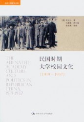
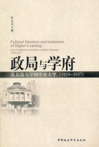
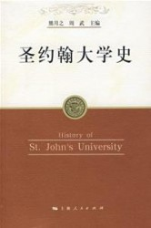
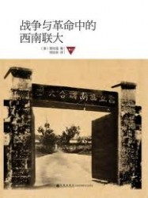
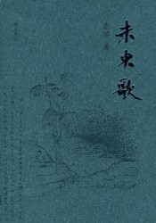

# 祛魅民国大学——关于民国大学的书籍推荐

【主持人语】提及理想大学，很多人第一个想到的就是西南联大，战火纷飞中民国的才子佳人故事更为这所大学增添了一份传奇色彩。了解历史，提倡用多种角度去看待历史事件发生的前因后果。本次荐书正是为在一个更有趣的视角看待民国大学提供了可能。并且，研究一个大学的发展历程，可以从中折射出那个时代微缩的历史，这对我们来说无非是有着非比寻常的意义。

假如我们听过那个刘文典因拒绝党化教育怒斥蒋介石的故事。那我们可能会很傻很天真地认为，原来民国的学者都是有着如此的风骨，相比之下今天的学者真是图样图森破，不但智商拙计，做不出什么学术成果，连学术尊严和对抗当局的胆气都没有，紧接着就是无尽的吐槽。 如果提到理想的大学，你会想到什么？想必西南联大会是一个常常被人提起的理想型：“在那个战火纷飞的年代，在中国大地的西南角，汇聚了这个民族最伟大的心灵，他们‘颠沛必于是，造次必于是’，接续着中华文化的星火，也延续着中西方文华碰撞后的火种。”这恐怕就是我们听到的最多的关于民国大学的神话。

但是，民国的大学果真如此么？恐怕我们很难下这样一个结论。因为今日高等教育不尽如人意，所以人们往往将自己对于高等教育的一些憧憬加之于民国的大学，一些民国士人的传奇经历更是给这层神话又涂上了一层厚厚的油彩。如果对这段历史有一个严肃的了解，那我们无疑会发现，历史的真相并非如此简单。

梅贻琦曾说，“所谓大学者，非谓有大楼之谓也，有大师之谓也”。此语常为今人所引用，这当然不失为一种对于大学精神的理解，但如果我们果真将这个当做民国大学的真实写照，则可能失之片面。无论什么时代，能有大师级人物执教的高等学府毕竟只能是凤毛麟角，因而我们不妨从其他的角度来审视所谓的“民国大学”，无论是学生丰富多彩的校园生活还是高等教育中折射出的国家教育体制变迁，都可以视为全面认识民国大学的一个有趣的角度。

被“民国大学”这个标签遮蔽掉的，是民国时期大学令人难以想象的多样性与其生存环境的复杂性。西南联大这样的巨无霸自然不能代表民国大学的一般性特征，所谓的学术独立在今人的研究中也表现出更为复杂的面向。“国立化”和“党化”成为一些民国大学发展过程中所不能避免的关键词，这也无疑说明了，大学并非一座能够与社会相隔绝的象牙塔，尤其是中国近代复杂的历史环境当中。举例而言，彼时活跃在中国政治舞台上的各个党派，也争相把大学生作为自己“运动”的对象，党派政治成为民国大学校园中一种不能忽视的历史现象，而当时的大学生对这种情况可能也已经司空见惯（抑或是可以理解为深陷其中而无法自拔）。又如，王东杰对于四川大学国立化过程的研究指出，民国大学国立化的进程与地方意识、国家建构还有中央与地方的政治关系之间有着深刻的联系。

在这样一个复杂历史进程中，国立大学、地方大学、教会大学、私立大学因其生存环境的差异性又表现出不同的校园文化形态。甚至，大学所在地对于大学文化生态的塑造也有着极强的相关性，坐落在上海的大学和位于政治文化中心北京的大学，从教师构成到校园生活都表现出相当大的差异。在我们今天熟悉的历史叙事中，大师名家一向最能汇集人们视线，这也直接导致了北京的大学因其大师云集而被更多地注意着，进而会给一些人造成民国北京高等教育远超上海的假象。但事实并非如此简单，民国时期的上海有着比北京更多的高校，但因为沪上高校是以理工、商科、民办和教会大学为主，因而不能像北京高校那样吸引人们的眼球，所以往往给人一种沪上大学规模远不如的北京的错觉，这一点尤其值得我们注意。

如果我们希望还原一个真实的民国高等教育图景，则必须注意到民国大学多元化的情况，民国大学毕竟是个大学，而不是神话传说。将民国大学现实从众说纷纭的传说中唤醒，可能会给我们今天的高等教育以更多更现实的启示。

**1、 叶文心：《民国时期大学校园文化》**

叶文心此书书名为“民国时期大学校园”，但其分析的对象则主要是上海的几所高校。作者重点分析了圣约翰大学、交通大学、复旦大学等学校的校园文化，事实上描绘出民国中产阶级是如何接受高等教育熏陶的过程。叶文心笔下的民国大学校园，学术味道淡了许多，大学是学生们生活的地方，是一个高等教育机关，而非学术研究所，这正向我们展示了民国高等教育学术研究以外的另一个面向，即学生培养在民国大学的运行情况。民国大学的多样性在叶文心这里得到了极好的呈现，

**2、 许小青：《政局与学府：从东南大学到中央大学（1919-1937）》**

常常听人提及那个著名的“国立中央大学”，但恐怕很少有人知道，这一所著名的国立大学是由一所地方大学改组而来。本书就是在描述这所学校从地方性东南大学到国立大学，再到国立中央大学的发展历程。国立中央大学的发展历程，就是许多民国大学发展的缩影，这一过程中出现的很多问题都值得我们重视：地方与中央的冲突、教育制度改革对大学冲击、党化教育与大学校园人事冲突……甚至很多问题在今天的大学都依旧存在，所以，去了解这样一所大学的发展历程，的确对我们有着非比寻常的意义。

**3、 熊月之、周武：《圣约翰大学史》**

教会大学作为民国大学的重要组成部分，值得被特别提出来。作为民国时期最富盛名的教会大学，圣约翰大学是我们观察民国教会大学的重要窗口。西学东渐与东西文化交流是中国近代思想文化上最为重要的关键词，而这一冲突在被目为西方文化传播先锋的教会大学中表现得尤为明显。本书的最后一章涉及到圣约翰大学建国后遭遇，这似乎可以视作对于民国大学传统消亡的一曲挽歌。

**4、 易社强：《战争与革命中的西南联大》**

如果记得没错，这是我本月第二次推荐这本书了，既然“有些常识值得一再强调”，那么有些好书值得一再推荐恐怕也没有错误吧。西南联大是近代史上被讨论得最多的大学，阅读这本书自然值得被一再阅读。西南联大的时间节点正好是前两本书所谓未能讨论到的抗日战争时期，在战火中大学自然不能像战前那样安做象牙塔，这特殊环境下，大学校园文化又会表现出怎样的特点？

**5、 鹿桥：《未央歌》**

了解这个时代的大学生活，文学作品与回忆录也是一个非常好的渠道。讲民国大学的小说自然以钱锺书先生的《围城》为经典之作，不过鹿桥的这本《未央歌》也能算做同类作品中的翘楚。无论是鸿渐还是钱锺书，都是作为大学老师观察校园的，而鹿桥则是西南联大的学生，他笔下的西南联大自然有一种与钱锺书不同的趣味。当然，本书文艺腔过浓实在是让我有一种被“呛到了”的感觉，各位讨厌文艺腔调的朋友慎入。

（采编：刘星男；责编：彭程）

[【用脊椎骨阅读】工人？工人！（上篇：外国工人）](/archives/36049)——二十世纪最为危险的人类实验暂且渡劫余波，工人的政治性光荣不再。从而，工人理论与工人地位之间的逻辑撕裂已然造成时下代群记忆以及历史叙事的回避之处所在。

[【用脊椎骨阅读】阅读私经验（四）·理解教育](/archives/36503)——教育的一个主要目的，正是增进自由。但是每次增进自由的时候，无时无刻的“政治”却阻挠自由的脚步。反自由式的教育最终会蜕化成在“政治”影响下的思想控制。

[【用脊椎骨阅读】阅读私经验（五）·理解快乐](/archives/36677)——耶稣说，“他的喜乐，没有人能夺去。喜乐不是人自己找来的，而是神所赐的。”快乐究竟是天赐，抑或后天习得？激情缺位，快乐缺位，人类心智正在面临无边的拷问。

[【用脊椎骨阅读】再读密尔《论自由·引论》后的三问](/archives/36776?preview=true&preview_id=36776&preview_nonce=6ca1f1730a)——民主、自由与平等三者并不是完全统一的，甚至有时会走向对立与冲突。当然，与此同时，三者又是密不可分的一体，它们共同构成了一个健康、向上的社会的基石。在这个坚决强调集体主义观念和集体体制的社会形态下，我们所需要的，是界限更加明确的权力，界限更加明确的国家，与界限更加明确的自由。
