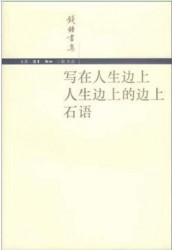
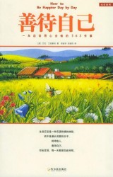

# 阅读私经验（五）·理解快乐

# **本期主题：阅读私经验（五）·理解快乐**

主持人/谷卿（暨南大学） 荐书人/蒋颖（The University of Adelaide）

【主持人语】快乐有没有定义？虽然每个人对此感受或许不同，但几乎无人从未体会到快乐。人们趋乐避苦，这是天性使然，但千万年来，技术的进步、文明的演进、社会的发展，是否让我们离快乐这一终极目标越来越近了呢？

先秦的儒家特别珍视快乐，《论语》的开篇就是“学而时习之，不亦说乎？有朋自远方来，不亦乐乎？人不知而不愠，不亦君子乎？”当年过花甲的孔子，带领门人周游列国九年，不仅没能得到诸侯的任用，还历尽艰辛、险些丧命之际，他却是如此自道：“发愤忘食，乐以忘忧，不知老之将至。”而孔子最欣赏的弟子颜回则是“一箪食，一瓢饮，在陋巷，人不堪其忧，回也不改其乐。”是什么样的一种精神，让先哲以快乐为生活、以快乐为追求、以快乐为人生？

快乐不是一两声傻乎乎的“呵呵”，也不是事后让人怅然有失的纵欲，更不是不计后果的撒疯。快乐有自己的内涵，快乐也有自己的标准，快乐更有难得的坚守。因而，在听完小子述志的描述后，孔子陷入了对“浴乎沂，风乎舞雩，咏而归”的美好想象中，深深地为这种高级快乐而折服。

自离开联合国青年组织后，蒋颖老师一直在澳洲高校的传媒系任教，我本想邀请她就媒介或跨文化交流为专题推荐一些读物，孰知她却提供给我“理解快乐”的主题。快乐没有代际，也没有国界，料想蒋老师作为一名快乐的理解者和收集者，还在快乐地介绍快乐、传播快乐。

 

### **《写在人生边上》**

“幻想有一台时间倒走的机器：人一出生便是老年，然后才是中年，青年，少年，婴儿期，这样至少在人生的尽头，还能享受上一回放肆的快乐。人总是太晚明白，明白后就没有时间后悔，只剩下遗憾和痛惜。人生，本就是属于自己的旅程，只能靠自己开拓，也只能由自己评论，酸甜苦辣，荣辱成败，只有自己的心知道答案，外人是无法插上一句的。”《写在人生边上》与其称其为书，不如视它为钱锺书先生一生的感悟。这本书，蕴含了钱先生自己独特的观点，尤其在《论快乐》这篇里，字字珠玑，大放智彩。钱先生认为快乐是相对而短暂的，而那些失望苦闷虚伪才是贯穿人生的真正主题。也许你会认为“人生注定是不快乐的”这样的观点与“理解快乐”矛盾，然而正因为懂得之于所有人“人生是不快乐的”，才要“乐观的看待人生”，因为二者辩证统一。钱先生在书中更告诉世人，快乐由心生，“快乐是由精神决定的”，乐观的过一生，人便会变得豁达，眼中心中多喜悦，而悲观看世界，则满满的都是冗长的痛苦。“洗一个澡，看一朵花，吃一顿饭，假设你觉得快活，并非全因为澡洗得干净，花开得好，或者菜合你口味，主要因为你心上没有挂碍，轻松的灵魂可以专注肉体的感觉，来欣赏，来审定”。钱锺书先生的字里行间是富有哲理的，懂得了“快乐与不快乐的辩证统一”，懂得了“快乐由精神决定”，便能明白让人快乐的是一个轻松的灵魂。

 

### **《善待自己》**

在明白快乐的人生决定于是否乐观的自己后，这本《善待自己》更能发挥让人快乐的作用。该书一度居于全美畅销新书排行榜年度榜首，作者通过乐观的话语，让人找到快乐的源泉——善待自己。除了告诉人们乐观心态的重要之外，艾伯斯坦还指出了一个造成很多人不快乐和抱怨的原因，即不重视与别人相处的时刻。人人皆知时间宝贵，因而分外珍惜自己的时光，但不快乐者大都是很少与他人分享时光或与人相处时只重视自己的人。英国首相丘吉尔曾说：人们因所得到的得以存活于世，却因所付出的让生命有了价值。所以，如果你正处于不快乐的时光里，问问自己，最近你赞美过别人吗？以笑容待别人了吗？与他人拥抱过吗？表达过你对珍惜的人的情感吗？用自己宝贵的时间聆听过他人的心声吗？人们从出生到生命的尽头，都一直在接受亲人爱人友人的施予和帮助。真情相待，不吝啬自己的真心和时间，不计回报地施予别人，是重视和珍惜他人最好的表现方式。因为真心的投注，是世上最好的礼物。因而，明白了“人生是不快乐的”，便能够活得透彻，再带着乐观感恩的心态，不吝啬自己的真心，便是善待自己。祝愿读者拥有无挂碍的灵魂，找到快乐的源泉。

（荐稿：徐驭尧；采编：李以诺；责编：彭程）

[北斗荐书：阅读私经验（三）·理解战争](/archives/25982)

[北斗荐书：阅读私经验（二）·理解时光](/archives/25384)

[北斗荐书：阅读私经验（一）·理解艺术](/archives/25173)

[【用脊椎骨阅读】阅读私经验（四）·理解教育](/archives/36503)——教育的一个主要目的，正是增进自由。但是每次增进自由的时候，无时无刻的“政治”却阻挠自由的脚步。反自由式的教育最终会蜕化成在“政治”影响下的思想控制。

[【用脊椎骨阅读】工人？工人！（上篇：外国工人）](/archives/36049)——二十世纪最为危险的人类实验暂且渡劫余波，工人的政治性光荣不再。从而，工人理论与工人地位之间的逻辑撕裂已然造成时下代群记忆以及历史叙事的回避之处所在。

[【用脊椎骨阅读】祛魅民国大学——关于民国大学的书籍推荐](/archives/36049)—提及理想大学，很多人第一个想到的就是西南联大，战火纷飞中民国的才子佳人故事更为这所大学增添了一份传奇色彩，为那个时代微缩的历史赋予了庄严的意义。

[【用脊椎骨阅读】再读密尔《论自由·引论》后的三问](/archives/36776)——自由，看似简单的字眼，蕴含着最复杂的思考与争论。个人的社会自由与权力、制度等公众事物之间，究竟有怎么样的关系？我们需要的，是界限更加明确的自由。

[【用脊椎骨阅读】曲高而和不寡：当代知识分子的独立与自由——以胡适、陈寅恪与王元化为例](/archives/37032)——为自己思想信仰的结果负责任，不怕“监禁杀头”，只认得真理，乃是中国知识分子最应该坚守的操守。而对权力的俯首帖耳，则会失去最本质的学术，最本质的人格。
