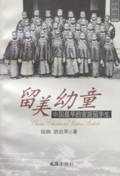
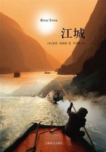
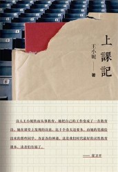
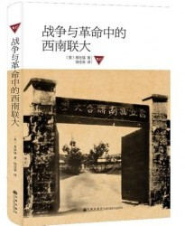

# 阅读私经验（四）·理解教育

# 本期主题：阅读私经验（四）·理解教育

主持人/谷卿（暨南大学） 荐书人/夏著维（池州学院）

【主持人语】作为教育体系的一部分，学校特别是高等院校承担着传授文化知识、激发技能、交流信息及为学生提供一系列生活上辅助服务的功能，它们当然地具有文化适应或者超越文化适应的作用，并作为一个较为庞大的系统进入更大范围的社会、进行着升级层次的运转。不管怎么说，将学校的任务定位在诱导和激发学生的思想理念和潜在技能是没有问题的——这就涉及到了自由意志——学校特别是高校应该在致力于调动学生模仿技能的基础上，对他们的自由意志进行科学的诱发。从文化的角度来说，文明的成长有赖于创造力的领导，有意识的努力和有目的的奋斗总是推进历史的重要动力。

当代教育的目标，正是要回归到对于精神本质的循诱，而不是仍然停留在培养技能甚至流于传授知识的低层面。小约翰•B•科布教授在《后现代主义与公共政策》中说：“教育的一个主要目的，正是增进自由。”就是如此，如果教育系统真的能把对自由意志的引导认知为一项重大课题，社会文化力的发展速度无疑会大大提升。

 【荐书人语】 

### 《留美幼童：中国最早的官派留学生》

1872年8月11日，38个稚气未脱的中国孩子，拖着脑后长长的辫子，登上由上海驶往旧金山的轮船。这拨隶属于先后四批，共120人的 “留美幼童”，浑然不觉自己肩负求索外邦的使命——启程前几日的《申报》用“幼学壮行”一词，形容这一经曾国藩、李鸿章力促，由中国留美第一人容闳发起的行动。这批孩子背井离乡，又是首度乘船，“晕浪者呕吐大作，饮薄粥而已；颠簸又甚，诸生多啼哭声，不得安睡。”而负笈海外的大门，便是在这啼哭声中轰然开启。直至抗战中的西南联大， 179位教师中受过外国教育（绝大部分是受英美教育，以美国为甚）者，高达156位。时为联大学生的何兆武，已然读过二十来本英文原版小说，且时常进出学校附近的英国领事馆，翻看《伦敦画报》，关注欧洲战事。而此时他的校友，外文系投笔从戎的查良铮，正忍受着发作的疟疾，拖着肿胀的双腿，随远征军翻越野人山。尔后，以穆旦为名，写下《森林之魅——祭胡康河上的白骨》一诗。一九四九，天地玄黄，中美两方的蜜月期戛然而止，教育领域的交流就此冻结。 

### 《江城》《上课记》

1996年八月的尾声，27岁的和平队志愿者，彼得·海斯勒，中文名何伟，由重庆慢船沿江而下，抵达涪陵，一座更多以榨菜而为人所知的江边小城。他与同行的亚当·梅勒一起，成为了半个世纪以来第一次来此的美国人。何伟选择到涪陵师专教书，他将要教授的学生，大多是这个西南省份的农家子弟，没有一人跨出过国门，不久之后，却能在英美文学课上，用英语吟诵莎翁的《我可否将你比作夏日》。浩荡的江水似乎已越过历史的三峡，直抵应许之地，不再回头。

而事情总不似表面这般单纯。十馀年后，在诗人兼大学教师王小妮的笔下，经历了盲目扩招后的中国大学，一茬茬的学生“正学习着工于心计，左右逢源，讨好奉承，把握机遇“，“任何一代人都没这么快地出现苍老感“。而曾经激励詹天佑、何兆武的爱国热情，蜕变成了“一个稳妥正面的词汇，他们游移藏身在这个弹性无限的空隙里，从而获得安全感”。而身处涪陵的何伟，无论如何也不会想到，一次长跑比赛的冠军，会“成功地树立起了运动中的爱国主义精神“，而代表外语系打一场篮球赛，也会让比赛变成爱国行为，连裁判也开始吹偏哨力求为祖国保住面子。名字用四川话发音是”霍伟“的彼得·海斯勒感叹：”在这里，历史从未远离，而政治举目可见“。

可从头梳理，细究下来，又有哪代中国人，尤其是学生，能从“政治”的裹挟中全身而退呢？1881年，脱下长袍马褂，打棒球，划赛艇的留美幼童，开始融入美国当地社会，却被驻在当地的留学事务局官员视为不成体统。而剪辫，入教堂，和当地女孩子约会，在清政府保守官僚们的眼中，更是大逆不道。于是，原定十五年的幼童留美计划中途夭折，全部学生被召回国。当时，耶鲁大学的22位留学幼童中只有詹天佑和欧阳赓二人顺利完成学业。容揆和谭耀勋抗拒召回，他俩是从哈特福德前往波士顿这条被遣返中国的火车路线上脱逃的，最后留在了美国，后者更是迎娶了一位小自己六岁的当地姑娘，而谭耀勋罹患肺病，两年后客死他乡。绝大多数幼童像薛有福一样，服从朝廷命令归国，只是在他写给美国女友凯蒂的信里，透出一阵排遣不掉的忧伤——“晚上夜黑似漆，船身摇动，使游子倍感惆怅。我走上船舷，观赏浪中的磷光大小如棒球，闪亮无比。我真愿有你同在，不知你可喜欢？”

### 《战争与革命中的西南联大》《上学记》

半个多世纪后的昆明，之于被誉为“民主堡垒”的西南联大的师生，借用《战争与革命中的西南联大》一书作者易社强先生的话说，“不得不在左翼或右翼的独裁中做出抉择”，由梅贻琦、蒋梦麟、张伯苓牵头，艰难维系的联合共识，正被活生生的现实所撕裂。闻一多的被刺，“象征着这所学校英雄史诗的悲惨结局——不受战争和革命摧残的自由大学之梦——已成明日黄花。”而《江城》和《上课记》笔下的涪陵师专和海南大学，正是闻一多彼时批评国民党“借党化之名，行奴化之实“的实质体现：统一课程，统一考试，教授定级，“党化”教育，以党管校……当年国民政府软磨硬泡孜孜以求而不得的一切，现在所有的内地大学概莫能外。何伟洞悉了这一“中国特色”，“涪陵师范学院有着双重的目的。它培训教师，但和中国任何学校一样，它也是中国共产党教育系统的延伸。”其结果是如工厂流水线般生产出了一批接一批的“按键人”，“思想高度统一，可以预测。你只要按下这几个按钮——希特勒、犹太人、日本人、鸦片战争、西藏、台湾，十有八九都可以精准地预测会有怎样的反应，甚至可以精准地预测人们会使用哪些具体的词汇。目前的教育制度高度单一化和政治化，这是自然而然的事情。”王小妮则困惑于学生对于“鼓掌”的热情，“凡是我的提议，他们的即兴发言，从宣布上课到宣布下课，他们随时都准备鼓掌，好像很盼望被哄堂而起的响声鼓舞一下。有点莫名其妙。”而她给出的看法是“鼓掌，就是学生们除了发言以外，能主动做出的最快活的事情。鼓掌，能带来整齐划一的效果。也许，他们经过十二年的教育格外爱自己的民族，或者他们只是需要借一个集体仪式自我振奋，可能他们在这种集体动作中能得到荣誉感和安全感。还有相当多的时候，鼓掌是机械的，无意识的拍打，仅仅表达对周围气氛的呼应，为了自己和别人一样，而不用经过大脑就顺便拍拍手。“以今视昔，不啻为一个巨大的讽刺。

我们已经很难去设身处地去理解何兆武先生的幸福观——“我想，幸福的条件有两个，一个你觉得整个社会、整个世界会越来越美好，一是你觉得自己的未来会越来越美好，这两个条件在我上学的时候恰好同时都有，当时只是战争年代，但正因为打仗，所以好像直觉地、模糊地，可是又非常肯定地认为，战争一定会胜利，胜利以后一定会是一个非常美好的世界，一定能过上非常美好的生活。“西南联大也化作一阕消散在风中的未央歌。往者不可谏，来者犹可追。何伟在结束自己两年支教生涯后，谈及这段经历，”我对我的和平队中国‘服务’从来没有理想化的幻想；我不是来这里拯救谁，或是给这城市留下无法磨灭的印记。但现在，我发觉自己在想着，从那些天的讲课中，是否有什么东西留下来了。但我希望总有些东西被记住。我希望他们能够在意识的某个角落里保留一些东西，而在其单纯之美中，他们会发现一些稳定而真实的东西。那是我对文学所抱有的信仰：它的真是持久的，不受日常生活的挣扎所困扰。“而身为诗人的王小妮，留下了这样一句诗意满盈的话——”如果它完全是徒劳，也要让这徒劳发生“。

（荐稿：徐驭尧；采编：李以诺；责编：彭程）

[北斗荐书：阅读私经验（三）·理解战争](/archives/25982)

[北斗荐书：阅读私经验（二）·理解时光](/archives/25384)

[北斗荐书：阅读私经验（一）·理解艺术](/archives/25173)

[【用脊椎骨阅读】阅读私经验（五）·理解快乐](/archives/36677)——耶稣说，“他的喜乐，没有人能夺去。喜乐不是人自己找来的，而是神所赐的。”快乐究竟是天赐，抑或后天习得？激情缺位，快乐缺位，人类心智正在面临无边的拷问。

[【用脊椎骨阅读】工人？工人！（上篇：外国工人）](/archives/36049)——二十世纪最为危险的人类实验暂且渡劫余波，工人的政治性光荣不再。从而，工人理论与工人地位之间

[【用脊椎骨阅读】曲高而和不寡：当代知识分子的独立与自由——以胡适、陈寅恪与王元化为例](/archives/37032)——为自己思想信仰的结果负责任，不怕“监禁杀头”，只认得真理，乃是中国知识分子最应该坚守的操守。而对权力的俯首帖耳，则会失去最本质的学术，最本质的人格。
