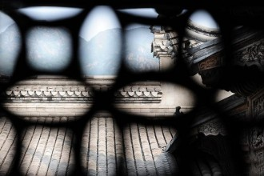
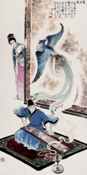

# 凤凰

（一）

卓家的阔绰，在临邛境内是无人能比的。城里稍微有钱的人家，用烧过的方砖、漆过的木头盖房子，用瓦片做顶，养一些猫狗。穷的人家，用石头打成的砖、刨过的木头盖房子，用茅草做顶，养一些鸡和猪。卓家的房子，外墙用烧过的红砖，里墙用雕了花的石头，两层墙中间夹着一道缝隙，缝隙里斜插进了烧黑的竹子，隔出了一道道极细的槽。夏天的时候，叫仆人打上冰凉的井水，从房顶上的孔灌下去，水在墙槽里流动，屋内就能像秋天一样凉快。最后水从墙脚下的孔里流出去，灌进院子里的人工小河，推动河里的小水车。冬天的时候，堵上墙脚的孔，把烧红的煤块从房顶填进墙里，屋内就能像春天一样温暖，最后打开下边的孔，烧完了的炭灰和碎煤就扑落落的滚出来，可以用来融化院子里的积雪。

卓家除了有猫狗，院子里还分别用篱笆圈养了一些孔雀和老虎。要说孔雀和老虎为什么从来不曾走出篱笆，可能是因为它们每天都能吃到切好的水果或是鸡杂碎，已经十分心满意足了。

有人说，卓家的墙可能是最早的中央空调系统。

 

（二）

卓文君的美貌，据说在临邛也是无人能比的。然而文君对自己的美与丑并没有许多概念，作为千金，她自小就没有踏出过卓家的门。虽然有先生教会了她琴棋书画等等名门小姐需要的美妙的艺术修养，有西域的舞姬和南海的柔术艺人在父亲的宴会上表演，但其中没有一样是她喜爱的。她觉得自己的生活无聊透了，缺少了一个难以名状，又最需要的东西。

卓文君羡慕四处云游的诗人和歌手，喜欢读名人的游记，听丫鬟们谈论受欢迎的歌手。她也不喜欢猫狗孔雀和老虎，唯独迷恋凤凰，绣满了被褥和床帘。

凤凰可以飞，可以死，还可以重生。卓文君觉得如果能拥有其中一样，就可以找到自己一直想要的那个东西。

 

（三）

后来卓文君从《玉台新咏》里读到那么一句：吾意久怀忿，汝岂得自由。

汝岂得自由！啊，对！自由！自由！十八岁的卓文君简直恨的牙痒痒，那好像是注定就是她的东西，只是不知被谁夺走了，一夺就是一辈子。

但她不能逃走，除了名声会大臭以外，她还不确定是不是逃出家门就是自由，也许门外是一个更大的卓家院子？

 

（四）

提亲的人越来越多了。

每当攒满三十个提亲的，卓文君就让这些各行各家最优秀的小伙子聚集在大院里，然后像科举一样出一个题给所有人作文。

作文的题目叫做：你能给我什么？

有的人说，我能给你用不完的金银。卓文君打了一个大叉，这我已经有了，滚吧。

聪明一些的说，我能给你才华横溢的诗歌和美丽书画。卓文君又打了一个大叉，我自己写的诗也不赖，淘汰。

有一个人说，我能给你火热的爱情和无微不至的呵护。卓文君想了想，还是打了大叉，爱情听起来不错，但是无微不至的呵护我真是受够了，送客。

其他人就只好说，我家是养猪的，能让你天天吃里脊。我家是酿酒的，能让你天天喝上国宴酒。我家是药铺，能……能……让你天天拿灵芝敷脸？卓文君就冷笑一声，把房门摔上。

提亲的人就越来越少了。

 

（五）

然后我们就不得不又提一个民谣歌手，司马相如。司马相如诗写的不错，但是非常穷，并且仰慕春秋战国时另一个非常穷的乐手俞伯牙，于是也成为了一个背着琴流浪的民谣歌手。

相如不仅仰慕俞伯牙的技艺，更喜爱他和身边那些女子的美丽感情故事。他觉得自己生来也要为真正的爱情浪迹天涯，上下求索。可惜一路上睡了一些单纯的姑娘，却没有一个愿意跟他穷游的。

当然也就没有他苦苦追寻的刻骨之爱啦。

 

（六）

司马相如的穷是有原因的，并不是说做了诗人就一定非常穷。早些时候，当朝的皇帝很喜欢诗赋歌曲，所以他就在成都的乐府上班，也算是个编制内的小公务员。虽然有钱又清闲，但是每天写的都是主旋律诗歌或者花草树木，百姓并不喜爱，也出不了名。可见主旋律作品不受欢迎，是恒古不变的。

后来这个短命的皇帝死了，换了一个新皇帝。新皇帝喜欢骑马射箭打猎娶妃子，不爱听歌，各地的乐府就都关了门，司马相如就下了岗。

他在家里把积蓄吃完喝完典当完以后，就背上琴出门了。

相如一路流浪到临邛的时候，已经身无分文。他在一个小茶馆对面的街沿上坐下来，打算将琴取出来卖唱。

附近一个巡街的市吏三两步跑了过来，朝他摇摇手中的铁鞭，凶声说，喂喂喂，车马道上不许无证卖艺。

相如用手抱着头说，官爷，给条活路吧，实在是没别的营生了。

市吏收起鞭子，不轻不重的踢了他一脚，说，新来的吧？有手艺去卓家的大宴上去演啊，卓老爷要是收你做门客，那挣得比我多啊。

于是相如问茶店主人借了一瓢水洗了个脸，问了卓家怎么走便上路了。来到卓家大门前的时候，刚刚好天黑，饭菜的香味和乐曲声人声一起飘出来，有节奏地扑打在他的脸上。就这样，他迷迷糊糊的在门口登记了名字，迷迷糊糊的被人带进了后台，迷迷糊糊的就坐在了所有酒席的正中，面前是一把琴。

 

（七）

卓文君盯着这个一脸沧桑叫司马相如的乐手，心中充满莫名的期待。只见他愣愣的看着自己，直到周围人都开始疑心他是个来骗吃喝的混球，他才如梦初醒一样开始演奏。

司马相如一看到卓文君的脸，脑袋里轰一下就炸开了，音乐艺术理想人生爱情青春价值天空月亮等等词汇都被炸成了碎片散落一地，变成一万匹脱缰的马，然后又慢慢汇成了一首歌，一首不能更合适的歌，像是他这辈子就只记得这首歌一样。

有一美人兮，见之不忘。

一日不见兮，思之如狂。

凤飞翱翔兮，四海求凰。

无奈佳人兮，不在东墙。

将琴代语兮，聊写衷肠。

何日见许兮，慰我彷徨。

愿言配德兮，携手相将。

不得於飞兮，使我沦亡。

相如越弹越快，快的像走火入魔一样，直到最后直起了整个身子，仰头嘶吼：使我沦亡！！！使我沦亡！！！沦亡！！！！！

在场的宾客没有听过这么前卫的艺术，面面相觑不知道是不是应该鼓掌，唯独卓文君通红了脸颊，觉得气血都在翻腾。相如看了看她，把头上的发髻取下往后一扔，披头散发的开始弹下一段。

凤兮凤兮归故乡，遨游四海求其凰。

时未遇兮无所将，何悟今兮升斯堂！

有艳淑女在闺房，室迩人遐毒我肠。

何缘交颈为鸳鸯，胡颉颃兮共翱翔！

凰兮凰兮从我栖，得托孳尾永为妃。

交情通意心和谐，中夜相从知者谁？

双翼俱起翻高飞，无感我思使余悲。

文君听到这里却觉得害怕了，我的妈，这是在约我私奔啊。她不知道怎么样才算爱上一个人，但是这个男人带在身上的那些流浪和自由，许下的那些飞行，死亡和逃跑的诺言，实在是令自己神迷心窍。

嗨，你们一定倒背如流大话西游里那段感人肺腑的“如果上天给我再来一次的机会”吧。不过你们记得吗，它的前一句是，“我决定说一个谎话，虽然本人生平说了无数的谎话，但是这一个，我觉得是最经典的。”

卓文君决定说一个箭在弦上不得不发的谎话。她用口型对司马相如说：我也爱你，我跟你走。

 

（八）

是夜，卓文君坐在可能是偷来的马背上，抱着司马相如的腰。她想，原来自由就是冰凉的空气，就是一望无际的黑暗里点着零星的灯光，就是马粪味儿和男人的汗味儿。简直太美好了。

直到在客栈里和司马相如躺在一起，她都觉得这一切太不真实了，被抱起来很不真实，被吻也很不真实。

但是疼痛非常的真实，凤凰涅槃的时候也会这样疼吗，她想，是不是这样就可以重生了？

希望可以重生，她一边小声说一边抓紧了男人的手臂。

司马相如以为她爽了，于是更加卖力。

 

（九）

卓文君典当了所有带出来的首饰，在成都开了一家酒肆。司马相如也打算把他的宝琴“绿绮”当了，但是文君不同意。（绿绮是相如流浪途中曾经爱过的一个姑娘的名字，当时还不是很流行把字刻在身上，就只好刻在琴上了。）

每天天微微亮的时候，卓文君就起床，用香味非常浓烈的廉价胭脂擦一擦脸，开始把桌椅杯碗摆到街上，把“凤凰酒肆”的酒旗挂起来。叫醒伙计，招呼客人。

快中午的时候，人渐渐的多起来，司马相如也起床了，两人便鼓琴合唱一曲《凤求凰》。然后看客们心满意足的离去或是留下喝酒。文君回去洗碗筷，相如回去创作歌曲。

男人们喜欢交头接耳的说，这就是那个和唱歌的连夜淫奔的大小姐啊，长的还真是不错，就是手糙了点，啧啧啧，女人思春拦不住啊。

女人们则要说，司马夫人，我可真是羡慕你啊，我也总想着离家出走，可是我爹会打断我的腿的，嘻嘻嘻。

卓文君从没在意这些话，她觉得没有时间停下去想任何事情。

司马相如却想了非常多的事情，比如卓文君为什么对性生活很冷淡，为什么要在一间酒肆里共度余生，好像真正的爱情不是这样的。

一年后的一天，他留下了一封信，和绿绮一起消失不见了。卓文君对此并不非常伤心，甚至觉得有一些轻松，像是一个谎言被一笔勾销。

  （后记） 

四十岁多的某一天夜里，司马相如发现自己已经操不动姑娘了。他也突然想不起来自己身在何方，想不起来自己从哪儿来要到哪儿去。也罢也罢，他安慰自己，反正这些都是终极的哲学问题。

过了一会儿，他回想了自己人生中睡过的每一个姑娘，逛的每一个青楼，以及拐走文君的那一晚。发现自己穷尽了一生去流浪去爱，最后还是没有见到轰轰烈烈的爱情，就拔剑自杀了。

  （后记二） 

许多许多年后，卓老爷在自己快死之前终于原谅了女儿，给卓文君送去了整整十二车的金银绸缎。

卓文君终于关了独自经营十多年的酒肆，她坐在金山银山前，映出了自己的容颜和双手。她突然觉得，生活让她上了一个很大的当。卓家园子的外面，果然是个更大的园子。

原来人是不能重生的啊，她掩面痛哭起来。

采编：王卜玄；责编：王卜玄

[【白日呓】永生之河](/archives/39482)——这姑娘就孤身一人荡在永生与朝生暮死间不得上岸，每70年得以瞥见两岸光怪陆离的容颜。有时她会以为自己已经死了，可却还怀着一丝渺小的希冀。

[【白日呓】影青](/archives/39487)——“影青釉玉壶春瓶。”内务府高公公抖开了怀里紧抱着的绸布，一点亮色借着忽明忽暗的烛火，在墙上跳动。

[【白日呓】四故事](/archives/39526)——玛利亚大喜过望，正欲开口叫基督，身边的老者转过身来，沟壑纵横的脸上皮笑肉不笑的挤出点涟漪，阴阳怪气的对玛利亚说：“夫人，这就是鲁国的夫子。

[【白日呓】睡美人](/archives/39594)——我把她抱到床上，蜷着身子的她一接触到床立刻舒展开来，像水母吞吐着器官占据了床的大部分空间，我只好在边上欠着身子坐下，静静的看她。
