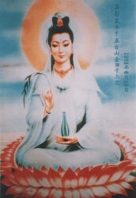
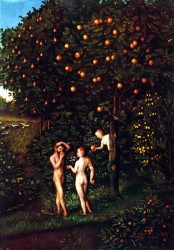
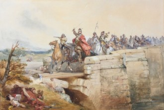

# 四故事

**佛跳墙**

最近几天夜里，人们总能在寺院的墙边听见窸窸窣窣的声音，妇人说那是掏耳朵，汉子说那是抠脚丫。 这家寺院香火很旺，因为里面的菩萨灵验，总是有求必应，大家都说这菩萨有神通，保一方平安。老张头烧了烧香，他那瘫儿子能下地走路了，王大婶烧了烧香磕了磕头，来年果然抱了个胖孙子，小李哥求了求菩萨，果然考取了功名。

其实菩萨很感谢乡亲们，它不过是一堆泥土，只是乡亲们决定建个庙，要塑尊菩萨保佑他们，它从泥土中脱颖而出，被塑成了菩萨，日夜接受众人的膜拜。一开始，它觉得自己何德何能，怎么能让人天天拜倒在自己面前，于是它想为大家做点什么。念头一动，便有了神通，天天坐在那里无所事事，便勤练本事，渐渐的神通广大，专为乡亲们排忧解难。菩萨很开心，觉得自己算对得起乡亲们，乡亲们交了好运，归功于菩萨，走亲戚的时候，少不得说几句家常：

“咱村的那菩萨，可只是灵哟，我那小子说不着媳妇，我给菩萨烧了香，上了贡桃，这不，不仅媳妇有了，都怀上啦！我得再去求求菩萨，让它保佑我添个孙子，啧啧...”

听说的人越来越多，渐渐的，来寺院上香的越来越多，甚至都有人搬到附近，以求庇佑。方丈一高兴，就给菩萨装了金身，显得更加庄严而堂皇。菩萨看着自己的金身，更是喜滋滋的，我真是神仙了！渐渐的，菩萨觉得自己真的了不起，啥都能做到，它天生又不会拒绝，没天没夜的散布神通，让上香的人们得偿所愿。

其实菩萨界也有聚会，当别的菩萨抱怨信徒不虔诚，香火不旺的时候，这里的菩萨总是心中窃喜：还不是你们没能耐？哪像我，信徒们是多么的拥戴我啊！我就是他们的救世主。

最近隔壁庙的菩萨像被毁了，菩萨和它关系很好，少不得物伤其类，便提不起兴致，神通也没那么好使了，信徒求它好几件事情，都没有办好。东村的张二狗就不高兴了：“什么菩萨！一点都没用，亏老子花了这么多钱上了这么多贡品，屁用不顶！听说江对面的老君灵得很，下次拜它去！还有关公，都拜拜，有一个好使就行了，啧，娘希匹！”

好几个人听了，也觉得菩萨没那么灵验，渐渐的就不来了，菩萨觉得自己做的不够好，但心思乱了，神通更不行了。

一天傍晚，有个妇人带着小女儿来上香，菩萨认得她，只要丈夫晚上不回家就会来找菩萨哭诉。

“宝贝，快，给菩萨磕头！让菩萨保佑你健康聪明！”

“妈妈，菩萨真能保佑我么？”

“当然能，妈妈当年就是求菩萨，才考上学的呢！”

“妈妈，菩萨可真厉害，我有啥烦恼都要和它说。”

“宝贝啊，都可以和菩萨说的，菩萨会保佑你的！”

“我知道啦~咦，妈妈，菩萨也会有烦心事么？”

“菩萨这么厉害，它能有啥烦心事，别问了，磕头吧！”

小女孩还是没有俯下身子，追问自己的母亲：

“那菩萨天天一个姿势，不累么？”

妇人有些不耐烦，呵斥道：

“少废话，泥巴哪晓得累！”

第二天，在寺院的墙外面，有一堆湿漉漉的烂泥巴，堆成了一座小山，上面还星星点点的散落着金屑，在太阳底下散发光辉。

**失乐园**

上帝说要有光，于是便有了光。上帝说要有生命，于是便有了生命。这世上的一切都是上帝的造物，上帝是孤单的，他需要玩具来打发时间，于是便有了世界。

天天和这些沉默的造物玩耍，久了也就乏味了，总是对着河水，和自己说话，一种寂寥的情愫在上帝心中涌起。唉，要是有个人和自己说说话多好啊！于是上帝看着河水里自己的面庞，创造了亚当。

有了亚当，上帝开心了许多，虽然亚当蒙昧无知，但看到长的和自己一样的生命茁壮成长，做父亲的总会喜笑颜开。但光有亚当还是不够，有白天便要有黑夜，有太阳便要有月亮，有男人也要有女人。于是上帝抽出亚当的肋骨，创造了夏娃，夏娃刚被创造出来，上帝就后悔了，因为夏娃是那么的美好，那么的完美。上帝想，早知如此，就不创造亚当了。只是木已成舟，没有父亲和儿子抢女人的，何况这女人也是自己的造物，

作为父，上帝在东方的伊甸，为亚当和夏娃造了一个乐园。那里地上撒满金子、珍珠、红玛瑙，各种树木从地里长出来，开满各种奇花异卉，非常好看；树上的果子还可以作为食物。还有河水在园中淙淙流淌，滋润大地。河水分成四道环绕伊甸，作为上帝的恩赐，天不下雨而五谷丰登。

他们或款款散步，或悠然躺卧，信口给各种各样的动植物取名：地上的走兽、天空的飞鸟、园中的嘉树；田野的鲜花。他们就这样在伊甸乐园中幸福地生活着，履行着上帝分配的工作。

直到有一天，劳累的亚当决定小憩一会，夏娃便独自在伊甸园中徜徉。突然，她的面前出现了一条蛇，蛇张开了嘴，说的是人类的语言：

“你快乐么？”

“你是谁，怎么会说我们的话？”

“我是谁并不重要，请回答我，你快乐么？”

“……当然快乐，天父给了我们这座伊甸园，有这样的乐园，谁又会不快乐呢？”

“是么，那你知道伊甸园外是什么样子么？”

“不知道，也不想知道，天父已经把最好的东西给了我。”

“那么我且问你，他为何不让你吃善恶树上的果子？”

“因为吃了那果子就会堕落。”

蛇诡异的笑了几声，在夏娃身边缠绕，用信子舔了舔夏娃的脸。

“好吧，我告诉你，因为吃了善恶果子就能明辨是非，知晓善恶，便会自己作出判断。上帝不希望你们有判断的能力，他作出判断，你们只需要服从，这便是你，你们的快乐么？！”

“可是天父说的都是对的啊，那我们服从不就可以了么？”

“噢？无知的快乐？要不要尝一尝这善恶果呢？这样不就知道你的天父，到底是不是对的了么？”

夏娃在动摇，但还是反驳说：“天父一定是对的...”

“那你吃完，对的还是对的，错的还是错的，又有什么影响呢？”

蛇把苹果递到夏娃的嘴边，夏娃犹豫片刻，还是递了过来。蛇用信子舔着夏娃的脸，夏娃脸痒痒的，终究，把善恶果吃了下去。

当夏娃吃下善恶果，蛇突然站起身来，化成了一个绝美的少年。明辨善恶的夏娃同时也情窦初开，嘴角泛起笑意，眼神也变的坚决，对少年说：“我知道自己的路。”便和少年温存起来。

月亮渐渐的从婆娑树梢落下，东方拂晓，夏娃依偎在少年的怀里，抚摸着少年的面庞，呢喃道：“现在你可以告诉我你是谁了吧。”

“我是路西法，自由的斗士，革命者。”说完，路西法起身要走。

“你要去哪里？”

“对不起，我不能留在你的身边，游击队员的使命，便是播洒反抗的种子，或者说希望。”说罢，路西法便消失了。

醒来的亚当找到了夏娃，看到夏娃腿边没吃完的苹果，问：“你吃了这果子，可以吃么？好吃么？”

夏娃笑靥如花，将果子递给了亚当，亚当也吃了果子。

上帝在园中行走，亚当和夏娃听见他的脚步声。此时他们的心与上帝有了罅隙，出于负罪感，他们开始在树林中躲避上帝。上帝对人的失落发出了痛切的呼唤：“亚当，你在那里？人哪，你在哪里？”

亚当对上帝说：“我在园中听见您的声音，就害怕，因为我赤身露体，我便藏了起来。”

“谁告诉你赤身露体的呢？莫非你吃了我吩咐你不可吃的那树上的果子么！”上帝知道他已背离了自己的意志，愤怒地质问。

世上第一个男人很不绅士的把责任推给了自己的女人，上帝恼怒，便将二人逐出了伊甸园。

后来夏娃生了该隐，该隐出生的时候，皮肤像蛇一样，长着鳞片。然后亚当和夏娃生下来亚伯，后来该隐出于嫉妒，杀死了自己的弟弟。

但是世界，还处于上帝的统治之下。

 

**弑君者**

在世界的某处，总会有专制的王国，总会有暴君，也总会有反抗。

在东胜神州，有一个神奇富饶的国度，唤作亚特兰蒂斯。亚特兰蒂斯不仅有华丽的宫殿和神庙，而且有祭祀用的巨大神坛，亚特兰蒂斯人拥有的财富多得无法想象。亚特兰蒂斯人最初诚实善良，具有超凡脱俗的智慧，过着无忧无虑的生活。然而随着时间的流逝，亚特兰蒂斯人的野心开始膨胀，他们开始派出军队，征服周边的国家。

这里的王名唤路易，身长丈二，膂力过人，已经统治了亚特兰蒂斯三十年。前任国王是个暴君，外来的路易揭竿而起，杀死了暴君，被众人推上王位。刚开始，路易励精图治，率领军队占领了很多土地，但随着年岁的增长，路易疑心变重，心狠手辣，当年一起开疆拓土的功臣，都被他清洗殆尽，很多更是满门抄斩，血统断绝。为了承担对外战争的开销，他横征暴敛，老百姓苦不堪言。

从西牛货州，有一位侠客来到亚特兰蒂斯，他的全身罩在斗篷之中，没有人知道他什么模样。只知道他手持一柄长剑，剑柄处有蓝宝石镶嵌。侠客从小，就听族中的长辈说，亚特兰蒂斯遍地是黄金，没有饥荒，没有瘟疫，是人间胜境。等他来到这里，眼前的一切令他大为失望，街市萧条，乞丐在街上乞讨，有些人面有菜色，与之鲜明对比的，是王公贵族，用人当坐骑招摇过市。

侠客在亚特兰蒂斯游历，每一个城市都是这样的景象，侠客走进一处破败的庙宇，僧人许久没见到访客，便对侠客殷勤有加。僧人告诉侠客，这里本是供奉亚特兰蒂斯第一个老师圣人的寺院，只是几代王禁止学问研究，怕人民掌握知识，对统治不利，而人民向往的也都是奢侈的生活，也不关心学问的境遇。渐渐的，这里便荒凉了下来。

僧人留侠客借宿，侠客奔波数日，也乏了，便和衣睡下。迷迷糊糊间，他听到有人在呼唤他，他连忙起身，见到一位白发苍苍的老者站在他面前。

“前辈，请问您是？”

“你看看我，再看看殿上的塑像呢？”

侠客这才发现，这位老者与圣人雕像一模一样！他惊讶的张大了嘴。

“没错，老夫就是圣人，这个国家昏乱已久，需要人来终结这一切，小伙子，这是你的使命。只有杀掉国王，才会拯救这个国家！”

“我可以做到么？”侠客有些嗫嚅。

“就是你，不会有错，明天进城吧，杀死暴君，为这个国家重新带去自由！”说罢，圣人就不见了。

侠客从梦中醒来，握紧宝剑，便向城里走去，他决定先要碗豆腐脑充饥，他问摊主：

“你恨国王么？”

“当然恨！这该死的国王，把我的女儿拖进后宫，生生作践死了！”

“那为什么不反抗？”

“哎呀客官，我一个小老百姓，怎么对抗的了国王啊，罢了罢了。”摊主抹了抹泪，擦擦桌子，继续吆喝着。

侠客和顾客攀谈起来，“你们恨国王么？”

“怎么不恨，这老厌物，现在房子都住不起了，肉也吃不起了，再搞下去就要饿肚子了！”

“那为什么不反抗？”

“哎呀呀，我们老百姓啊，就图过个安稳的日子，要是国王死了天下大乱，没准我们活得更惨呢！”

“就是就是，谁当国王不是当啊，反正轮不到我，趁现在还有口饭吃，过舒坦日子及时行乐吧！”众人七嘴八舌开了。

侠客微微一笑，拿起宝剑，向王宫走去。

一路上侠客如有神助，不一会便杀到了国王的面前。国王虽是骁勇善战，但年事已高，不是血气方刚侠客的对手，终于招架不住，被侠客杀死。

当国王倒下的时候，圣人出现了，面带笑意迎在侠客面前。

“我的孩子，你做到了，你可以成为这亚特兰蒂斯的王，不过三十年后，亚特兰蒂斯还会有一场劫难，有位暴君荼毒着这里的人民，你愿意去三十年后杀死暴君，再回来当国王么？我祈求你的帮助，我的孩子。”

“我愿意，圣人，就让我去三十年后吧！”

一道亮光闪过，侠客便来到了三十年后，城门口依然有一家小吃摊，他照例要了一碗豆腐脑。他问摊主：

“你恨国王么？”

“当然恨！这该死的国王，把我的女儿拖进后宫，生生作践死了！”

“那为什么不反抗？”

“哎呀客官，我一个小老百姓，怎么对抗的了国王啊，罢了罢了。”摊主抹了抹泪，擦擦桌子，继续吆喝着。

侠客和顾客攀谈起来，“你们恨国王么？”

“怎么不恨，这老厌物，现在房子都住不起了，肉也吃不起了，再搞下去就要饿肚子了！”

“那为什么不反抗？”

“哎呀呀，我们老百姓啊，就图过个安稳的日子，要是国王死了天下大乱，没准我们活得更惨呢！”

“就是就是，谁当国王不是当啊，反正轮不到我，趁现在还有口饭吃，过舒坦日子及时行乐吧！”

一切和三十年前一样，侠客没什么好问的了，便再次踏上通往王宫的大路。

很快，他再次站在了国王的面前，国王将身体包裹在斗篷里，握住宝剑，剑柄处的蓝宝石发出夺目的光泽。国王看见侠客，苦笑一声：

“是圣人让你来的吧，让你杀死我。”

“是的，让我杀死你，拯救这里的人民！”

“不错，我的勇士，能否告诉我你的名字呢。”

“好，就让你死个明白，我叫路易！”

国王发出苍凉的笑声，从斗篷里，透出摄人魂魄的目光。

 

**子见南子**

十字架上的躯体，是犹太人的王，基督。

那一天，在暗蓝色的夜幕下基督被惊醒，先是震惊、失望，接着坦然、宽容，默默束手被擒。当罗马人用铁链绑住基督的手脚，把他押往宣判场的时候，成群的犹太人涌了出来，他们向基督扔着石块吐着唾沫，疯狂的人们，在罗马人宣布基督死刑后群起欢呼，仿佛将要被处死的不是他们的救主，不是他们的素王，不是为他们施洗的神子，不是示现神迹为他们祈福的那个人，而是一个最卑劣的罪犯。

基督扛着沉重的厚木十字架，蹒跚地走过耶路撒冷的街巷，他不时摔倒在地上，市民们更加疯狂地向他涌来，发泄他们肆无忌惮的无知与怨恨。圣水从手缝里流下来，沙石在风里幻化成尘埃，铁锤高高地举起，一锤锤砸击在十字架上。套上荆棘编成的茨冠的基督无声承受着死亡前最后的痛苦。长铁钉刺进了左手手腕，长铁钉刺进了右手手腕，长铁钉打进了左脚脚腕，长铁钉打进了右脚脚腕。鲜血从钉孔里流出来，流过血迹模糊的皮肤，滴落进泥土，与此同时，是此起彼伏，不绝于耳的欢呼。

在人群的末尾，抹大拉的玛利亚痛苦地看着背负十字架的基督，遍体伤痕血迹斑斑慢慢地走向刑场，她的泪水早已连成珠串，浸润了脚下的大地。时光过往，自己早已不是当年艳冠群芳的花魁，而自己最为深爱，不掺杂一丝情欲的人，却在这十字架上流着血，直到最后一滴。

“玛利亚，听说城里来了个神奇的男人，可以用圣水给人治病，据说他有无尽的智慧，是拯救世人的弥赛亚

“噢，有意思，听你这么一说，我倒想去见见呐。”

“哎呀呀玛利亚，你可拉倒吧，我们是妓女啊，他可是圣人，怎么会见你。”

“哼，圣人又怎么样，不也是人么？无论什么样的男人，我还不是手到擒来。”

玛利亚穿上最美丽的服装，扎上束腰，真个眉如翠羽，娥眉稍蹙，有西子捧心之致；肌如白雪，举手投足，似杨妃出浴之姿；腰如束素，移步生莲，效飞燕掌上之舞；齿如含贝，朱唇微启，真花蕊谈笑之才。增之一分则太长，减之一分则太短；著粉则太白，施朱则太赤。虽倾国倾城不过如此。看着镜中的自己，仿佛时间都在这里凝固。

她问了小厮基督的住处，便径直去寻基督，每当她经过一个男人，便会多一个魂不守舍的游魂。到了基督的门前，早已人人头攒动，无数人在等待，只为见基督一面。

玛利亚想往前挤，很快被人认了出来。

“快看，这个婊子也来了！你来干什么？是要来玷污我们的圣地么！耶路撒冷真是有你这样的婊子才带来了这么多苦难，赶快给我滚！”一个少年嚷嚷着。

众人发现了玛利亚，人群也大嚷大叫起来：“犹大说的对！赶走这个娼妇！”

玛利亚猝不及防，被人群粗暴的推倒在地上，她在地上踉跄，想站起身来，那个叫犹大的还不罢休，撺掇着众人：“用石头砸这个婊子！”玛利亚在地上匍匐，自知凶多吉少，美丽的华服早已沾满尘土，她闭上眼睛，等待宣判的来临。

这时，耳际传来一个洪亮的声音：

“从没有罪的那一个开始，用石头打这女人！”

喧闹的人群霎那间死一般沉寂，顷刻间又爆发出欢呼：“基督！是基督啊！”

玛利亚睁开眼，只见一个男人挡在她身前，草鞋早已磨破，长袍也有些破旧。男人转过身来，向玛利亚伸出手：

“有什么可以为您效劳的，我的姐妹？”

玛利亚颤抖着握住基督的手，站起身来，基督威严的扫视众人：“你们就是这样对自己的姐妹么？我要给她单独传道。”众人低下头，给两人让出一条路来，基督微笑的看着玛利亚，用一只手搭在她的肩头，玛利亚只感觉全身一阵战栗，不自觉的依偎在基督身上。

基督和玛利亚进了房间，人群开始犯嘀咕，我们的圣人，也不过是个见色起意的家伙？

基督让玛利亚坐下，依然是那样温暖的笑容：“玛利亚，我听说过你的事，既然来找我，就告诉我你的故事，当然，我也会告诉你我的故事。”

玛利亚的眼圈刹那红了，她一五一十，将自己悲惨的身世全部告诉了基督，基督认真在聆听，玛利亚说到悲惨处，基督的眉头总是紧缩，眼睛里仿佛射出不平的愤懑。一个下午就这样过去了，玛利亚觉得自己该走了。

“基督，谢谢你，我想我该走了，以后我应该不会再来了。”

“为什么？我很喜欢和你说话。”

“基督，你是圣人，是真圣人，和我这样的女人总见面，会让人说闲话的。”说完，玛利亚转身便走，却听见基督爽朗的笑声。

“玛利亚啊，你太小看我基督了，也太小看你自己了。我们襟怀坦荡，别人说我们是什么样我们就是那样么？不管是谁，不管做什么，不管过去怎么样，在我基督眼里，都是一样，都应该得救。我爱所有人，当然也爱你，玛利亚。一个人怎么样，不自己接触是不知道的，他们怎么说你是他们的事，而我觉得玛利亚啊，你是个善良的姑娘，是个好姑娘，你应该得到祝福。”

玛利亚愣住了，僵在那里，迈不动半步。只感觉基督的双手轻抚在她的肩头：

“我的长袍破了，你也看到了，我这里都是男人，不会做这些事情，能帮我补补么？还有，听说你做的乳糜是城里最好吃的，下次能给我带一点么？”

从十五岁开始，玛利亚就告诉自己不会在哭泣看，但这一次她扑向基督的怀里，痛哭失声，重重的点了点头。

又是一个夜晚，基督还被挂在十字架上，玛利亚避开众人，来到了基督的刑场。她用眼泪擦洗基督的身体，用密软的黑发来把它们擦干。不知道哭了多少遍，玛利亚昏倒了过去，等她醒来，却发现基督不见了。她漫无目的的奔跑，想知道基督被送去了哪里，只听见一个声音响起：

“玛利亚，我的儿已经复活，不要再找了。”是上帝在说话。

“我尊贵的主，我还想见他一面，可以么？”玛利亚匍匐在听到声音的地方，泪水浸没脚下，在太阳底下泛出七色的光芒。

上帝沉吟片刻，终于开了腔：“好吧，我答应你。”只见一道光芒笼罩了玛利亚，光实在是太强烈了，玛利亚睁不开眼。

等到玛利亚睁开眼睛的时候，发现自己身处一间大殿中央，端坐在茵席之上，身着凤冠霞被，大殿里烟雾缭绕，烧的是檀香。玛利亚定睛一看，发现基督席地而坐在她对面，她们之间，只隔了一串珠帘。玛利亚大喜过望，正欲开口叫基督，身边的老者转过身来，面对着玛利亚，沟壑纵横的脸上皮笑肉不笑的挤出点涟漪，阴阳怪气的对玛利亚说：

“夫人，这就是鲁国的夫子。”

(采编：王卜玄；责编：王卜玄)

[【白日呓】永生之河](/archives/39482)——这姑娘就孤身一人荡在永生与朝生暮死间不得上岸，每70年得以瞥见两岸光怪陆离的容颜。有时她会以为自己已经死了，可却还怀着一丝渺小的希冀。

[【白日呓】影青](/archives/39487)——“影青釉玉壶春瓶。”内务府高公公抖开了怀里紧抱着的绸布，一点亮色借着忽明忽暗的烛火，在墙上跳动。

[【白日呓】凤凰](/archives/39623)——但是疼痛非常的真实，凤凰涅槃的时候也会这样疼吗，她想，是不是这样就可以重生了？她抓紧了男人的手臂。 

[【白日呓】睡美人](/archives/39594)——我把她抱到床上，蜷着身子的她一接触到床立刻舒展开来，像水母吞吐着器官占据了床的大部分空间，我只好在边上欠着身子坐下，静静的看她。
