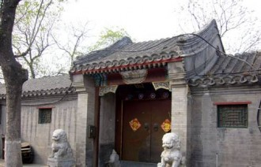
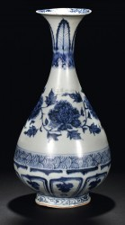

# 影青

庚子年九月初八，城东曹家大宅门前，晨熹的静谧被一阵急促的脚步打破了。几盏灯笼在昏暗中摸索，成了一条短短的红线，隐隐映出些四处弥漫的烟。

“影青釉玉壶春瓶。”内务府高公公抖开了怀里紧抱着的绸布，一点亮色借着忽明忽暗的烛火，在墙上跳动。

“这是元青花，公公您这是……”“唉，甭提了，老佛爷前脚一走，小犊子们就吵吵着分家伙。”高公公把衣襟裹紧了些，虽只是深秋，风还是像刀子一样。“这也算多亏了那帮洋鬼子，眼拙，多少殿门闯遍了，也不识咱这宝贝。”管家沏好了茶，高公公呷了一口，接着说：“圆明园的物件，当年咸丰爷喜欢，带到了承德才避一劫，如今这兵荒马乱，眼见这东西又要遭一难，连我这个老奴也心不甘啊。”高公公咳嗽了一下：“都说你们曹家钱号虽大却公道仗义，不如，这宝贝权当相赠，随便拿几钱银子便罢……”

多事之秋，人人自危。曹掌柜听出了高公公语中窘迫，不错，这一城店铺，遭贼的遭贼，奔命的奔命，惟自己的宅门依然干净。心说自己平日也得宫中不少照顾，便吩咐帐房支了足够银两，送别高公公后，封紧了大门。

两个黑胡子俄国兵拖着个义和团民的无首尸身，拴在巷口的石狮子颈上，醉醺醺地砸了一会儿宅门，不久，踉踉跄跄走了。霜洒了一地，梆子声已不会响了。

“爹！”儿子翻着几口大箱子，把散碎物件向里填。“眼见傅将军也不打算保这地方，咱干嘛还挨这儿干耗下去？”

曹掌柜撑着椅子勉强立起来，窗外乱成一团：卡车轮子辗起的尘，轿车喇叭一路尖声的嚎，脚夫们黄包车咿咿呀呀的响，一股脑冲向南边的机场。是呀，匪患正凶，自保是再合理不过的事。

“爹，瓶子呢？”儿子灰头土脸，显然，他把地窖也摸了个底朝天。

“什……什么瓶子？”“唉呀，您老这当口还装什么糊涂呀。”儿子喘着粗气，他搬了太多的东西。“那个宫里物件，这可是救命用的，那群孙子只认金条！”

曹掌柜明知拗不过儿子，这些年来，他一人扛了全部生意，想想也不容易。只是那瓶子......曹掌柜额上的沟壑拧在一起。忽地，他想到些什么。

“你等等。”

儿子把一个绸布包从父亲手中接过，揪开一角，青花的玲珑釉色从指间缓缓滑过。他小心翼翼拎着这包伏，快步走出门去，可只一会儿工夫就又回到家里，气急败坏的瘫在椅子上。

“土财主！眼拙！不识货，竟说这是赝品！”儿子捂着脸，大声叫骂着。几十年家业被战乱散尽，能指望的瓷瓶仍旧静静摆在一旁。最后一架飞机引擎的轰鸣，划破了几千米的高空，绕着西边巍峨的群山盘旋一周后，毅然朝向了遥远的南方。

 

儿子挣扎着，想沿着墙角直起身子。无奈，手被反绑在雪地里，动弹不得。他四下瞅瞅，隐约还能瞧见身边石狮子下巴上渗进铜环的血痕。老人们都听过当年的情景，一个说书匠蹲在巷口，只要两个铜板，就能听上一段。

“那叫一个快，义和团的傻小子刚掏出刀，嗬！这可不得了，那鬼子兵有他两个那么高，一双眼车铃大小……”

“嘭！”儿子的脸上多了一块乌青。一队人马手持棍棒，临走不忘再砸上一下。他捧起一把雪，擦了擦火烧一样嘴角，朝地上吐了口污血。

“哈，小兔崽子们，你们还差得远呢！”儿子把一根凿落了大半墙皮的柱子敲了敲，找到了那个小暗阁，一个绸布包伏赫然出现在眼前。他一把将头上尖尖的纸帽子捋下，揉成一团，丢个老远。

“爹，这宝贝怎么办？”

曹老掌柜无力的指了指不远的柱子，干枯的眼睛却盯着儿子。

那好似是笑，可怎么也笑不动了……

 

每每回忆起这些往事，儿子仍旧记忆犹新。他把几块砖聚在一起，用绳子扎紧，挽起袖子，挖土机马上又要来了！

“鬼子兵抽出了弯刀，傻小子吓了一跳，那刀比鬼头刀细，又比环首刀翘......鬼子兵扑了过来，丈八的身子山一样，咔嚓……”

脚下的土屑打着滚，天花板上的陈灰溅进了身后的水缸。玻璃像儿时冬天见过的冰棱，曹老爷子抱着儿子，他俩一起，把冻在一起的碴子用竹竿打个粉碎。

院口的宅门多少年前就成了灰烬，可这大堂的门槛还立在那里，上面的木门被铁棍顶紧了，这会儿，门外蠕动的十来顶钢盔也撞不开它。

儿子打开后窗，锈迹斑斑的铲子高高举起，在日光下倒也绯红好看。手里这摞砖还真重啊，儿子揉了揉被尘土迷住的眼，那根柱子承载着垮塌了一半的横梁，死死钉在屋子中央，上面的油漆印依稀可见：红色钻进木阁的断口，“万岁”两字像被刀劈斧砍。

“老伙计，再争口气吧！”

儿子手中的砖在空中划出一道弧线，被履带压成了一捧烟。古旧的三角形房顶完全栽进一地断垣里，雕花瓦当徐徐滚了一圈。

“哎呀，出人命了，出人命了！”

“看什么看？起开！”

 

“曹掌柜，您这是什么意思？”一个军队文员看着对方硬塞给自己的几块大洋，还有一个粗布包的瓶子，不解地询问着。

“嘘……”曹老爷子把嘴凑到文员耳旁。

 

“至正八年款，影青釉玉壶春瓶，通体牡丹纹，细颈垂腹，端庄秀美，承袭宋代制形，又因宋人诗句------玉壶先春而得名，喻示高洁淡雅，不流于俗。民国三十八年，历经漫漫南迁路，这一珍贵文物得以在今日呈现于各位游客面前……”

导游的喇叭声每天绕过展馆，隔着厚厚的防弹玻璃，百年前的釉色从不知疲倦。

（采编：王卜玄；责编：王卜玄）

[【白日呓】永生之河](/archives/39482)——这姑娘就孤身一人荡在永生与朝生暮死间不得上岸，每70年得以瞥见两岸光怪陆离的容颜。有时她会以为自己已经死了，可却还怀着一丝渺小的希冀。

[【白日呓】永生之河](/archives/39482)——这姑娘就孤身一人荡在永生与朝生暮死间不得上岸，每70年得以瞥见两岸光怪陆离的容颜。有时她会以为自己已经死了，可却还怀着一丝渺小的希冀。

[【白日呓】四故事](/archives/39526)——玛利亚大喜过望，正欲开口叫基督，身边的老者转过身来，沟壑纵横的脸上皮笑肉不笑的挤出点涟漪，阴阳怪气的对玛利亚说：“夫人，这就是鲁国的夫子。

[【白日呓】睡美人](/archives/39594)——我把她抱到床上，蜷着身子的她一接触到床立刻舒展开来，像水母吞吐着器官占据了床的大部分空间，我只好在边上欠着身子坐下，静静的看她。

[【白日呓】凤凰](/archives/39623)——但是疼痛非常的真实，凤凰涅槃的时候也会这样疼吗，她想，是不是这样就可以重生了？她抓紧了男人的手臂。
