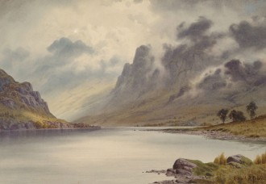
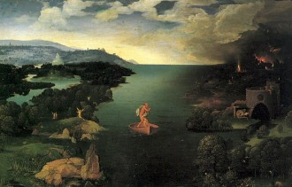

# 永生之河

在人类的黄金时代，通往神秘的道路是丰富多样的。风、梦、破碎的瓦墙，甚至音乐停顿的间隙都可能不经意间打通一条去往奥兹国桃花源或是中土的道路。然而通往异世界的大门一直在陨落，它们从来都是寻而不得的，只会在不经意间向芸芸众生间的某个路人敞开，我要讲的是一件发生在黄铜时代的小事。

那时还是有伊甸园的，然而它的四面环河，河水每70年漫上人类所能见到的土地一次。此时平日所能见之景便被白雾遮蔽，雾中景色则渐渐清晰明朗，隐约可见对岸各种奇花异草（红色的大喇叭树、松鼠尾巴花、两米多高的蒲公英等），然而这只会持续几分钟，河与对岸便隐退了，只留下眼前平凡的草木。

一次很偶然的机会，一位传教士来到了这片蛮荒之地，建起了一座小教堂。过了大约两百年，教堂周围聚集了一些住户，后来渐渐形成了村庄。一对青梅竹马的小情侣那年19岁，偶尔在外玩闹，糊里糊涂穿过一座林子便遇上了这70年一泛滥的河流，河流中间坐着一个戴帽的船夫，看不到表情，在雾中低低地问他们：“要渡河吗。”看他们错愕，接着说：“这船一次只能渡一人，河对岸就是永生，你看那葱绿的一切，永远都维持着它们最健康年轻的模样。”待问清楚了状况，这对情侣纠结了半天，直到船夫催促，男的才推了一把女的让她过去，并约定好七十年后再过来，若是姑娘没有变心，就站在河对岸迎接他。

这小伙儿后来回到村里，被村里人怀疑谋害了姑娘。他百口难辨，怕姑娘家里人报仇就躲到教堂里避难，被一名好心的神父收留，从此成了一名修士，不问世事度过了漫漫岁月。

70年过去了，同龄人基本都已逝世，89岁的男人拄着拐杖走出教堂，划着十字来到曾经的河边。河里的船夫低低地问他：“要渡河吗。”他却没有看他，错愕地愣在那里，看着白雾消散未见对岸的来人，他好像崩溃了，眼前耳边只有一片白，拐杖也颤颤巍巍起来，可他老了，哭也哭不出来，于是只得转过身又回到了教堂，村里的后辈们再也没有见他出现过。

若是故事讲到这里就结束了，那位姑娘必会成为众矢之的，而男人则会得到最大的同情。然而让我们再倒退回70年前。姑娘上了船，回头与小伙子对视，直到对方的身影都消失在一片白雾之中，姑娘默默无语地坐在船上，忽然就有了一个想法，她对船夫说：“你上岸去吧，这70年我来代替你，70年后你再回来。”船夫一愣，闷声不响地答应了，留下姑娘一个人坐在船上漂荡。

那时的姑娘自然不知道那船夫是另一位被惩罚的西西弗斯，被囚禁在尘世与仙界的缝隙，只能助人渡河，自己却不得上岸。这里没有星星，没有白昼与黑夜的交替，只有大雾和永恒的孤独。她也不知道那位船夫是不会回来了，就在一无所知的情况下接替了他，等了70年，等到的却是男人转身离去的背影。白雾渐浓，她呆呆地扔掉了桨，不料这桨认得这船又飘了回来。她仰面躺倒在船上哭不出一滴眼泪，也许她也老了，尽管还有着19岁的容颜。

有一种鸟名为红河翁，可以往返于两界，前几百年常常停在她的船头，毛茸茸地缩在她怀里撒娇，那是她相对幸福的时光，但红河翁这种鸟喜欢白天赖在云朵上睡觉，蜷成一团发着红光。这世上本有9只红河翁，掌管九个地界。但后来出现了一个名叫后羿的人，把所有的红河翁都射死了。姑娘与世隔绝不知此事，还傻傻地等着红河翁回来，就像一开始等待那个男人，等了几百年才明白它们是永远也不会回来了。

这姑娘就孤身一人荡在永生与朝生暮死间不得上岸，每70年得以瞥见两岸光怪陆离的容颜。有时她会以为自己已经死了，可却还怀着一丝渺小的希冀，她不知道那希冀是什么，也许是另一个渡船的人，或是那位船夫悔了心意。你愿意救她吗，如果你愿意，我可以告诉你如何找到永生之河。毕竟，通往奇迹的道路数万年来一直在陨落，若是这个姑娘投了河，人类与神秘世界的最后一条通道也将被隔离。

(采编：王卜玄；责编：王卜玄)

[【白日呓】影青](/archives/39487)——“影青釉玉壶春瓶。”内务府高公公抖开了怀里紧抱着的绸布，一点亮色借着忽明忽暗的烛火，在墙上跳动。

[【白日呓】四故事](/archives/39526)——玛利亚大喜过望，正欲开口叫基督，身边的老者转过身来，沟壑纵横的脸上皮笑肉不笑的挤出点涟漪，阴阳怪气的对玛利亚说：“夫人，这就是鲁国的夫子。

[【白日呓】睡美人](/archives/39594)——我把她抱到床上，蜷着身子的她一接触到床立刻舒展开来，像水母吞吐着器官占据了床的大部分空间，我只好在边上欠着身子坐下，静静的看她。

[【白日呓】凤凰](/archives/39623)——但是疼痛非常的真实，凤凰涅槃的时候也会这样疼吗，她想，是不是这样就可以重生了？她抓紧了男人的手臂。
