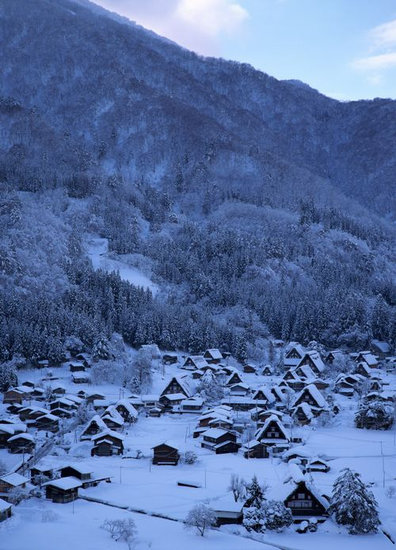
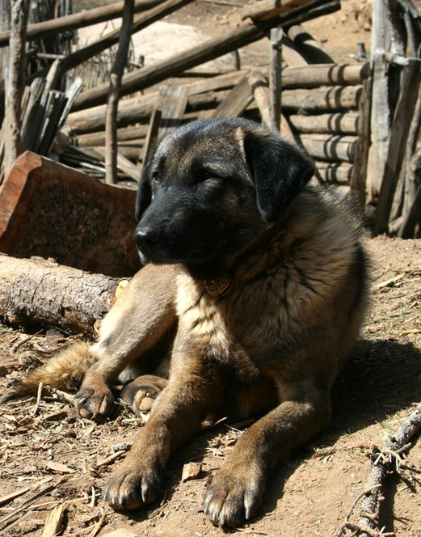

# 土地之下

** **

一连三天的大雪让每一条河都生了根。

我是在新春的前一个月被市局派到这个村庄的。在地图上发觉一个小小的黑点着实不易。翻山路上鲜有行人，到了村口，寒冬的夜已然微微有了颜色。

村支书是个佝偻的小老头，约摸六十多岁，死灰的脸上淌出两道鼻涕，直垂到上唇，看上一眼便让人没有了交谈下去的兴趣。显然，他也无意多说什么，颤颤巍巍地摇一下手示意我向前，就像一条垂死的老狗。

老狗捂着他的鼻子，使劲擤了两下，我沿着他挪动的方向瞅瞅，前一天大火的灰烬半插在雪堆里，焦黑的木门框倚着同样焦黑的半棵树，北风里嚎得像个寡妇。

烧到这个程度，人的尸骸多半也融化了吧。我撇开那老头，独自踩进这大摊的黑里，一个趔趄，是一截干枯的手臂，再向前，一排惨白的牙齿死死钉在熔化的塑料书包上，渺小而空洞，臭气透过冷风直灌进鼻孔，一如我曾见过的许多现场的样子，一如我曾见过的许多现场般令人作呕。

＂死了几个？＂我干咳一阵，掏出根烟。支书瞥瞥我，退了两步，险些摔倒。＂二十三个。＂我把烟又塞了回去。＂多少？＂＂二十三个，一个老师，二十二个娃。＂支书慢慢爬上一个雪丘，踢了踢一块烂木板。＂老师，娃儿们。＂他又踹了一脚。＂都在这下面了。＂

＂你们有谁知道这是怎么弄的吗？＂我想了想，又把烟点上，取出一个小本，好记下些什么。不过，一切都是徒劳，老支书戳在原地，耷拉着脑袋，一点一点把木板拽进雪里。

＂听我儿子说......＂他终于仰了仰脖子。＂是一根电线把胶皮烧穿了，烫了房上的茅草。＂我简单记了几笔，又揉掉了。＂电线？＂他又蹒跚晃悠到我身旁，在一地狼籍中扯出一条金属线。金属线把他的拇指划出一道长长的口子，他拾起一把炭灰裹在鲜血淋漓的指尖，又若无其事地擤擤鼻子。

＂老师是谁？孩子们的家长呢？＂

＂你们的家长呢？＂他板起脸，盯着立在墙角的五个孩子。＂你们的父母没教过吗？上课不能迟到。＂他挽起袖子，瞄了一眼手表。＂整整一上午，你们几个，哪去了！＂他猛地停顿了一下，止住了就要遛到嘴角的笑。也难怪，在这荒山野岭间，消息闭塞的村寨深处，哪有什么奢侈的时间观念？再说......

＂俺爹...俺爹他...＂一个孩子小声嘟囔着。＂他拾牛粪...脚崴了，我帮他...＂

＂俺爹也是。＂另一个孩子低头搓着衣角。

他终于忍不住笑了出来，孩子们无邪的谎言是他从未遇到过的。至少在这样的山村里，朴实、简单变成了令人发指的资本，哪怕他们其中一人偷了邻家的一捆草，另一个在别村晾好的苞谷上小便，只要抬起脸，微微笑一笑，凝聚起的阴翳也就随之烟消云散了。哪怕日后他们依然如此，若无其事地偷草，小便，然后笑一笑，拔腿就跑。

他温柔地拍了拍几个孩子的头，示意他们回到座位上。两年来他成了只没了刺的刺猬，只剩下柔软，还有一丝难以名状的归属感。尽管作为一名乡村教师，他大谈欧洲哲学、历史与音乐，孩子们的眼神逐渐由空洞变得迷茫，最后又回归了空洞；尽管多数村民在两年里还记不住他复杂的名字，但他们仍把孩子交给他，从朝日初升直到西方的霞红也散尽了，一个个从田中回来，扛着锄头与大筐，匆匆领回这些孩子。

不过，逢年过节，酒肉还是有的。从除夕到十五，村人在一如继往的平淡与匮乏中省下了他们视为珍馐的食物，端端正正摆在他掉了漆的桌上。村人视教师为神明，纵使他尚年轻，即便孩子们也不怕他，但在村众眼中，这位套着洗得发黄的衬衫，削瘦的手腕上摇晃着手表的教师总是充斥着威严与神秘，那个薄薄的旧本子里有太多另一个世界的东西，捉摸不透，透了，也不知有什么用。他们希望自己的子子孙孙有朝一日走出这深山，同时，又拼命攒下了给儿孙买牛的钱。

＂当日不落帝国的风帆飘扬在大西洋上时，长琦的孩子们升起一面鲤鱼旗......＂＂老师，山外泄洪了，冲来很多大鱼。＂＂对啊对啊，上午玉儿的二叔就在河里捞，差点压翻了船。＂＂好，好，等下了课，老师和你们一起去看看，可以吗？＂

村中多河，河水时而湍急，时而潺潺。众多河道在村口交汇，像一棵巨大榕树横在原野之间，推搡着三面环绕的高高山岗。大雾起时，河道隐进那苍茫一片，迷蒙中乱石高耸在半空，巍巍如幽冥。孩子们趿拉着塑料凉鞋踏开水面的声音不久就回荡在山谷深处，除了笑声，再无一声鸟鸣。

他站在河边，回忆起夏末的情景，又被脑中突如其来的安静吵醒，恍然间已是初冬。

初冬的城巿是枯燥的。他不知如何处理与父亲的关系，有时会爱，也许是恨，但翻来覆去想来只有挥之不去的矛盾感。儿时父母便分道扬镳，在父亲严格的教育下，他体面地长大，升学。他厌恶父亲总是沉重的面孔，厌恶每一番指手划脚的勒令与自负，尽管如此，他至少令人羡慕地活着，体面地，骄傲地成为他人眼中的标杆与酒桌间吹嘘时一个不轻不重的筹码。地面积了薄薄一层雪时，父亲的汽车稳稳停在楼下，若是他上台阶的步子沉稳，便又享一夜安宁，反之，便是酒气中的风雨，夹杂长篇大论的所谓道理、数落与胡搅蛮缠。

他摇了摇脑袋，连日的失眠令他眼皮跳个不停，可在寒风中还是可以有足够的时间来清醒的。他记起离开家的那天只穿了睡衣和拖鞋，清明的前夕路人便已开始把大把阴纸摊开，焚烧。打着旋儿的枯黄纸圈滚落到脚边，他想了想，又悄悄遛了回去，拿起母亲送的手表与一套衣裤，再狠狠往怀里塞上一把钱。

现在，他庆幸自己的选择。他的选择完全超出自己儿时最疯狂的理想。他希望成为一个战士，守卫仅仅属于自己的边疆，现在，他拥有了属于自己的村庄。他熟悉这里的每一棵树，每一条河。他可以与学生们谈起自己的兴趣：那凌驾在世界之上的创意、艺术，学生们告诉他哪里的果树最矮易于攀爬，哪条河最浅，可以一起涉水捕捉河蚌，哪里的丛草最高，可以抓住许多蚂蚱，又该如何用草尖穿过它们的头，用火一烤，油香四溢，酥脆焦黄。是的，这是他的村庄，谁也抢不走，谁也不会来抢。

警笛声是在不久前的午后闯进来的。父亲终于追到了这千里之外的地方。大雪封山，他远远望见一个高大身影出现在远方崖壁的公路上，几个黑影簇拥在周围，不久，高音喇叭刺耳的杂音笼罩了整个村子。

＂混帐东西！＂这久违的叫骂几欲刺穿耳膜。

＂这就是你希望的？＂屋檐上的积雪籁籁下落。

＂躲进穷山沟里？你他妈好大的出息啊！＂父亲第一次如此嚷嚷，他听得出那嗓音在第一声喊话后就已经嘶哑了，后半声是完全的歇斯底里，颤抖的气声。

远山与周遭在飞快旋转，他跌跌撞撞走进屋子，眼前又是当年离家的情景：午夜的街口，人们在路边画上一个又一个白圈，沉默与啜泣之后，大把大把的纸钱带着未燃尽的火花消失在茫茫黑暗中，顷刻又是一捧，火光摇曳在苍白的灯光中，是回阳的鬼，失魂的人。

＂同学们，今天是老师在这里的最后一课，我就要回家了。＂他知道不久后父亲的车会径直驶进村里，带他回到现实的世界，去那个遥远的家。

＂怎么，为什么不说话？你们希望老师走吗？＂血丝爬满了他的眼白，像两粒四分五裂的弹珠。

＂唰......＂前排孩子踢倒了书包，一把弹珠滚个满地。

＂不希望！＂

＂那好吧，老师不走了！＂他的声音激动但温柔，顷刻又归于平静。

＂下面，老师要教给你们一首诗，这也是老师最喜欢的诗。南宋著名爱国诗人岳飞所写的《池州翠微亭》。至于岳飞......＂他顿了顿，转过身，用力握紧一根粉笔。＂我们曾经讲过的，有谁能回忆起来？＂

＂老师，我忘了...＂

＂无所谓了，我在黑板上把这首诗写下来，我写一句，你们就大声朗读一句。＂他使劲咳嗽了几声，又捏紧了笔。＂记住！一定要大声！大声读！好听！＂

经年尘土满征衣。

＂经年尘土满征衣！＂

特特寻芳上翠微。

＂特特寻芳上翠微！＂

一缕黑烟顺着讲台爬上了天花板，那是两大桶隐藏在台下的煤油。火苗沿一根旧电线胶皮迅速腾起，很快引燃了黑板下的木板。

＂老师，冒烟了！冒烟了！＂

＂没关系，电线短路而已，读完这诗，老师会处理。＂

好水好山看不足。

＂好水好山看不足！＂

马蹄催趁月明归。

＂马蹄催趁月明归！＂

这是腊月一个普通的清晨，村众在支书的带领下到村口迎接一位远道而来的大人物。二十多年来，这几近与世隔绝的村子鲜有外人问津，就算拿着放大镜在地图上寻找，发觉这个小小的黑点也实在不易。

大风呼啸，灌进教室锁得死死的门窗。除此之外，远村又有两柱黑烟升起，那是村民焚烧囤积的败草枯叶，以便播撒在土地里，渴望来年的五谷丰登。

的确，他庆幸自己的选择。他的选择完全超出自己儿时最疯狂的理想。他成为了一个战士，守卫着仅仅属于自己的边疆，现在，他拥有了属于自己的一切。他熟悉这里的每一棵树，每一条河。他可以与学生们谈起自己的兴趣：那凌驾在世界之上的创意、艺术，学生们告诉他哪里的果树最矮易于攀爬，哪条河最浅，可以一起涉水捕捉河蚌，哪里的丛草最高，可以抓住许多蚂蚱，又该如何用草尖穿过它们的头，用火一烤，油香四溢，酥脆焦黄。

是的，这就是他的一切，谁也抢不走，谁也不会来抢。

我是在新春的前一个月被市局派到这个村庄的。我本想在这片穷困隔绝的废墟上查到些什么，不过很遗憾，除了七零八落的遗体与两根电线，一无所获。

最后，我还是见到了孩子们的家长，他们整整齐齐排列在村口，像等候检阅的士兵。老支书又撸撸鼻涕，一抬手，村民的掌声如雨点般砸来，掩埋了一张张固定在脸上的白，也掩埋了我继续停留下去的勇气。

回程的车上，窗外还是那茫茫一片白。山巅乱石高耸在惨白深处，巍巍如幽冥。四周除了让人心烦的寂静，再无一声鸟鸣。

＂听说......＂同事拍了拍我的肩。＂局长刚来电话，要求我们终止调查。那个烧死的老师，好像是北方某个巿长的儿子......＂

一阵尖厉的锣声响起，不知是哪家出殡的队伍，冥钱洒了一地；不远几声劈劈啪啪，又不知是哪村的孩子，提前燃放了迎接新春的爆竹。

不曾停歇大雪让每一条河都生了根。

 

（采编：何凌昊；责编：何凌昊）

[【老师专题】老师](/archives/33005)——“小时候目睹老师游行讨薪，心想以后决不当老师；中学时视老师如监狱长，从未想过自己会做一个老师；大学时遇到了在轮椅上答疑的教授，“老人家你何苦如此拼命啊”；如今在高中教历史，我做不到多么伟大无私，但现在的职业让我很开心。”

[【老师专题】语文老师](/archives/29100)——“语文老师，教会学生如何“揣着明白装糊涂”，什么灵魂也不能塑造，什么罪恶也不能救赎，如同体制内的特雷莎修女。”

[【老师专题】镇上的男老师](/archives/33144)——“到中学后女老师越发少了，在基本都是留守学生的乡镇中学，男老师，是与青春期的我们接触最密切的男人。那时他们的艰难与扭曲，很容易被朝夕相处的孩子习以为常。如今长大成人的学生回头看去，那眼光里有冷笑也有理解。” [【老师专题】性格养成期里的二三事（独立影像47期）](/archives/33356)——“本期介绍的四部与老师相关的电影，有不同的政治环境，相同的是，他们在经受内心与外界的双重的淬炼中展现了自身高尚的师道，向他们致敬。”
