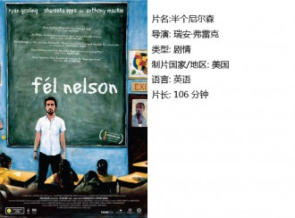
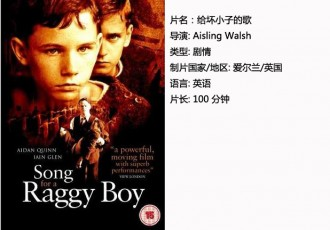
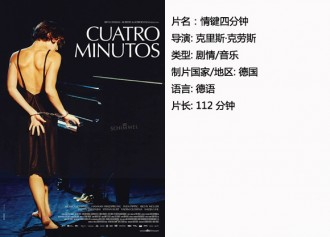
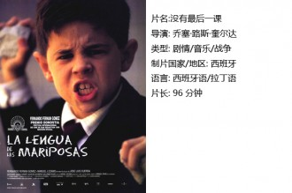

# 性格养成期里的二三事（独立影像四十八期）

乔治·奥威尔曾经在《缅甸岁月》里提到，人的生命中有两次性格养成期，一次是八到十四岁的年纪，一次是二十左右的年纪，这两段时间的经历直接影响到个人在后来岁月的是非选择和价值判断。你以后会成为一个什么样的人，取决于你曾经遇到过什么人，这个命题对于很多人都是成立的。老师的地位崇高，如果在你年少不谙世事的年纪里，可以遇到一个好老师，那该是多幸运的一件事.

不仅在中国，很多国家都有教师节。小时候把老师作为职业选择也是很普遍的事。如果你选择成为一个老师，即意味着你选择了安贫乐道，孤独以及改变一个人的力量。老师是孤独的，年复一年站在讲台重复着说了几十次几百次的教学内容，送走一批又一批的学生，学生还不见得理解和感恩；老师又是幸运的，他在一个孩子几近白纸的的年纪里，好像画家白描一样，对他们教授知识并且潜移默化的改变他们的性格和人生。他们也许会被学生记恨（这种情况并不少见），也许被学生敬仰怀念，无论如何，任何人在他的性格养成期里都会遇到这么一个人。

**一、半个尼尔森******

电影《半个尼尔森》是2006年上映的美国剧情片，由著名导演瑞安·弗雷克执导。讲述了一个白人老师和黑人女孩产生友情的故事，饰演男主人公的瑞恩·高斯林凭借本片获得79届奥斯卡最佳男主角提名。正如我们后来都知道的，他最后并没有得到奥斯卡最佳男主角，获此殊荣的是弗雷斯特·惠特克（《末代独裁》）。但这并不影响他在电影中的魅力。

老师是一个孤独的职业，他既有较高的文化水平——这促使他追寻更好的精神境界，另外一方面却没有相应的社会地位和物质条件与之匹配。也有一种说法，认为老师是平庸的人才会选择的职业。尽管作为老师可以从改变一个人来获得成就感，会很容易得到学生的友情和倾慕，但是这的确不是一条光明万丈的道路。每个人都有对立面，面对理想和现实的无限差距，不免会扯下面具用另外一种样子生活。所以当老师丹在厕所里吸食毒品的时候，我丝毫不感到惊讶，这难道不是一个30岁的单身男子会出现的生活状态吗？他的女朋友要嫁人了，他不被家人理解，他把一切奉献给学生，生活却没有给他丝毫馈赠。我以为在这部电影里可以部分了解到老师的生存状态，这和国籍没有关系。

**二、给坏小子的歌******

《给坏小子的歌》是导演 Aisling Walsh在2003年的作品，曾经获得过2004年爱尔兰电视电影奖。讲述了在爱尔兰一家寂静沉闷的教会所里，一群孩子被一个老师改变的故事。

电影初看有些似曾相识，有人形象得称其为阴暗版的《放牛班的春天》，残酷版的《死亡诗社》。一群保受宗教压迫的孩子，他们不识字，不会读写和背诵，他们知晓的只有教律和皮鞭，有时候还有神父的性侵。生活似乎对他们关上了大门。电影一开始便透出它的悲剧色彩。还好，充满热情和正义的老师威廉来到了这里。也许所有改变都要付出代价，也许所有抗争都会伴随死亡。老师在这里充当了拯救者的身份，他给他们带来了诗意和勇气，给饱受折磨和压抑的孩子们打开了一扇窗。

“宁静夜色绕着我流动/穿透你的牢房铁窗/带动你灵魂往世界自由奔走/你紧握着被囚的手/风是我们的朋友/夜色半开她的门/在俗世牢笼外我们相遇/那里是反叛的归宿。”

永远不要放弃一个孩子，即使他现在呆在教化所里。

**三、情键四分钟**

《情键四分钟》是一部德国电影，一部很地道的德国文艺电影，德国人的严谨克制以及天生的疯狂在这部片子里展现的淋漓尽致。导演和编剧是里斯·克劳斯，也是一个道地的德国人。

刻板古怪的老太太遇到了放纵不羁的天才女孩，她还不满21岁却替男友顶罪锒铛入狱，她们本来各自有不同的路要走，却因为老师对女孩天才的怜惜越走越近。在无数回忆的倒带中，她们渐渐相爱。作为老师，必须要有的技能便是，坦然的面对学生的天才。在这个世界上天才是稀缺动物，他们惊才绝艳不同一般，是上帝馈赠的礼物。在欣赏他们天才的同时，也要忍受他们歇斯底里的热情和满脑子的怪主意。天才本身就是一种负担，他们似乎更容易感知痛苦。所谓破茧成蝶浴火重生，凡是美必将经历磨难。而能感知美的人也一定是理解或者经历过苦痛的人，天才的老师似乎更可敬些。

结局华丽的钢琴谢幕，她以一个屈膝礼表示了对老师最高的敬礼。她们得到了救赎。

**四、没有最后一课**

《Butterfly's Tongue》的翻译名很怪，国内的翻译是《没有最后一课》，初看还以为和都德的《最后一课》有关。本片的导演是José Luis Cuerda，西班牙导演。

老师的能力究竟有多大，一次言语上的解围便可轻易走入一个孩子的内心，大自然的亲密接触便可教授给他们什么是爱和美。但是一个可爱可亲的人可能会在一瞬间背离你，仅仅是因为旁人的闲言碎语和恶意诽谤。对于小孩子而言，仅仅是教给他们爱与美是不够的，他们没有足够的判断力去鉴别好坏。即使是成年人，在政治环境中依然显得软弱摇摆不定。何况一个小孩子。他们需要的不仅仅是一个好老师，而是一个宽松的充满友好包容的社会环境，让爱和温暖的种子真正在心中萌芽，生长繁盛。

蝴蝶的舌头不应该只是一个美好寄喻。

【如何观看】

请关注【瓢虫映像】在全国各大城市（目前已有西安、上海、武汉、成都、厦门、杭州、重庆、北京等城市）的线下放映活动~

豆瓣：[请点击这里](http://site.douban.com/177837/room/2069615/)

请加入独立电影交流群，一同探讨你的观影感受！~

请加群187213480，验证身份时请注明“北斗读者”。

（采编：卢静；配图：卢静；责编：黄楚涵）

 [【老师专题】老师](/archives/33005)——“小时候目睹老师游行讨薪，中学时视老师如监狱长，大学时遇到了在轮椅上答疑的教授，看到他们，我心想以后决不当老师；现如今我在高中教历史，我做不到多么伟大无私，但现在的职业让我很开心。” [【老师专题】语文老师](/archives/29100)——“语文老师，教会学生如何“揣着明白装糊涂”，什么灵魂也不能塑造，什么罪恶也不能救赎，如同体制内的特雷莎修女。” [【老师专题】土地之下](/archives/22393)——“现在，他庆幸自己的选择。他的选择完全超出自己儿时最疯狂的理想。他希望成为一个战士，守卫仅仅属于自己的边疆，现在，他拥有了属于自己的村庄。” [【老师专题】镇上的男老师](/archives/33144)——“到中学后女老师越发少了，在基本都是留守学生的乡镇中学，男老师，是与青春期的我们接触最密切的男人。那时他们的艰难与扭曲，很容易被朝夕相处的孩子习以为常。如今长大成人的学生回头看去，那眼光里有冷笑也有理解。”
