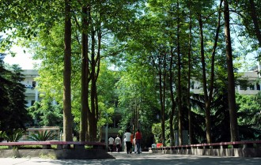
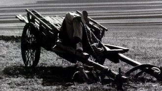
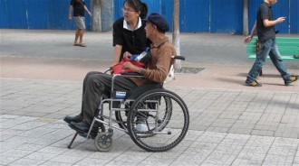

# 老师

20岁以前，从来没想过我会做一个老师。

我现在的学生对学校、对老师，大多有一种深深的怀恋，我就没有这种美好的情感体验。没福气上这样好的中学，我自己也不是好学生。我们读书的时候，比的是哪个学校更能混。记得某中学学生和我们吹牛，说我们学校，牛气冲天呀，满城的黑社会大哥都是从我们学校出去的。我的狗友陈君马上就回了一句，我们学校不牛逼，就是黑社会的大哥们都不敢进去。

这种氛围下，我们的老师对我们这群学生，大概就类似监狱长对犯人，管住我们，不去危害社会，不犯罪，就是他们的职责。而我们对老师，也就是犯人对狱卒的态度。日后回忆起中学时光，有时也觉得老师们对我们很不错，很有耐心的——能教我们这群烂仔这样多年，还真不容易。但和他们斗智斗勇的经历太深刻，以至于老师们的性格、才学，都变得模糊了。

约摸还记得语文老师姓陈，嘴巴子很厉害，呸人功夫一流。陈老师人很胖，天天穿一件西装，从来不换，我私底下给他起了个外号叫猪头怪，这个外号被一代一代的学生传下去，陪伴了他终生。很多年后，等我也成了一个死胖子，就感到天道昭昭、因果报应，正义的审判虽然有时会迟到，但它终究会来。一次夜间独坐无聊，想起了这件往事，感到内疚，就给陈老师打了个电话，深深地忏悔。他在那边打了个呵欠，没精打采地说，“好多年前的事了，我都忘记了。”是好多年前的事了，原本他那极富卡通色彩的经典造型，在我心中已被岁月的狰狞蚀得斑斑驳驳，再也看不清楚。

班主任姓潘，刚从大学毕业的小伙儿，挺帅的。个子不高，喜欢穿运动衫，混在学生里认不出来。有次他给班上的女神讲题，我从后边看到一混混在和女神讲话，从背后给他一脚，“你妈妈的，哪个班的二痞子又来调戏本班美女？”他回过头，瞪大眼睛看着我，不知道该说什么。

很多人说我当教师，太和学生打成一团了，其实老潘比我还亲民。有年暑假，他带着我们去果园偷摘枣子，被农民发现了，大家一哄而散，只有他被抓住了。农民很愤怒，给他一耳光，“妈妈的，居然来偷果子，你们班主任呢？叫他来领人”。他很无辜地看着农民，“老子就是班主任。”后来我把这个故事栽赃给陈君，说是他在中学教数学时的往事，讲给他女朋友听，陈君为这事儿被埋汰了好几年。

关于中学的老师，就只能想起这么多。好像一路走来，人生不断腾挪跳跃，越走越远，那些过往的人和事，就隐身在岁月的喧嚣之后了。

如果硬要想起点什么，就还记得老师们的清贫。我母亲给一个未婚女青年介绍对象，是我们学校的老师。那个阿姨高中毕业待业在家，准备嫁人，听了我母亲的介绍后，很愤怒地说，我宁可找个没工作的混混，也不找老师。听来真是心酸。我们那种小地方，在那个年代，大学生极少，政府的领导多数都是军人转业或者中专毕业，只有中学里的老师是一水的大学毕业生，但他们仕进无门，赚钱无路，是地方上最苦逼的人群。有一次，老师们闹起上街游行，据说是好久没发工资了，快活不下去了。我还记得当时我父亲跑去大骂了管教育的领导，说，你这个畜生，你怎能这样对他们，他们都是大学生，都是知识分子。一辈子从没看老人家发这样大脾气，我当时就在想，男怕入错行，我以后决不当老师。

我还想，学生对老师的服从，要比员工对老板的服从度高多了。学生对老师的理论，要比公众对学者的认同度高多了。老师是不是就会因此自我膨胀，陶醉其中，变得飘飘然，全然忘记自己苦逼的处境了。所以，我想，无论如何，不当老师。

进了大学后，对老师的看法有了很大的改变。深深地让我感受到老师的伟大的，是一个从来没教过我的教授，刘老师。我去大学报道的时候，是和我的母亲一起。当时我在路上看到刘老师经过，就找他问路，问宿舍在哪里。已经是二十世纪末，刘老师还穿着青色的中山装，骑一辆加重的永久自行车，也就是工地上民工的标配。他停下车，看了我的通知书，说自己是学校的教授，可以带我去宿舍。而我的母亲实在是一个多疑的人，我们母子出远门，时刻都在提防遇到骗子。刘老师那身打扮着实不像是教授，我们怀疑这是个骗子，就像躲贼一样，加快脚步甩下他走了。等走了一里多路，找到宿舍停下来，看到这位先生推着单车，气喘吁吁地跟上来了。他居然真的一路送我们到宿舍了。我们当时就想，这骗子，还真不死心嘞。

开学后，上第一节数学课。开课前，数学老师说，每年开学，一位退休的老教授总要来看看大家，和大家说说话，讲讲本校的历史和传统。我惊人地发现，这个来和大家说说话的退休教授，就是我们昨天遇到的“骗子”。

慢慢才知道，这位刘教授可是学校的一道风景线，他每天清早就坐在红楼外面，为学生答疑，从早上六点到晚上八点。一是解答数学题，二是提供各个专业考研的咨询。日复一日，年复一年，学校也觉得他坐在大楼外面的树下面太冷了，这儿的冬天有零下二三十度，打算给他提供一个办公室，被拒绝了。他说坐在办公室太正式，同学们就不方便问问题了，于是零下二十度的冬天里，他依然坐在红楼的门口，每天不断。有一次摔伤了腿，第三天就坐着轮椅出来了。

不过，我读书不认真，从来没去问过他问题。直到大四某一天，在学校门口无所事事的瞎逛，再一次遇到了刘老师。他对我说：“学生啊，我想买最新的机械系研究生入学考试考纲，可是我今天身体很不舒服，那楼梯我是爬不动了，你去帮我买来好不好，我要赶紧看完，有学生要咨询我。”说完颤颤巍巍地把钱递给我。接过钱的那瞬间，觉得自己真的快要哭出来。老人家你何苦如此拼命啊！

离开大学后，我经常都会想起这样一位老师，他从来没教过我，他在学术史上籍籍无名，也没有什么独立精神、自由思想，但他真正的为这个学校奉献了全部生命。他还改变了很多堕落的混球，即使堕落如我，总也有那么一个时刻想起自己的这位老师，然后收束心思，努力前行。

十年后，我自己的学生都考上了我的母校，我问他们，那位刘老师还在给学生答疑没有。他们说，刘老师已经瘫痪了，但现在每天还是坐轮椅出来，二十年不变。

和刘老师分别后，我在外边瞎混了许多年，也尝试过许多职业，都没有成就，最后当了老师，这是当年无论如何也想不到的。在现在这个学校，我看到了许多和刘教授一样搏命的老师，看到了许多为学生辛勤付出的同仁，我也努力收拾起惫懒的性格，去做一个称职的老师——如刘先生那样伟大的人格，我是做不到了，但我每天都在努力地让自己不成为一个差劲的、丢脸的老师。

我以前的朋友，比如狗贼王小石，就经常讥讽我，你这样的烂仔，也能做老师呀，不怕教坏学生。有时候又问我，你以前说过不肯做老师，现在却在当老师，那你说说看，你工作的意义在哪里？你教的可是最没技术含量的历史。

我工作的意义在哪里？我告诉他，考我们这个高中很难，我的学生，要么是特聪明的天才宝贝，要么有较好的社会资源，总之，他们将来都是有大能耐的人。这样的人，将来一旦去做恶，对社会的破坏比我和你这样低端烂仔大多了。我现在努力地教导他们热爱生命，独立思考，他们将来不做恶人，而是坚强有力地去爱人，这就是我工作的意义。

其实这样的说法，挺虚伪的，我觉得。我当老师的意义在哪儿呢？每当我追寻意义的时候，就觉得挺迷乱，我挺迷乱的时候，就会想想刘老师，一个人怎么能这样纯粹？这样纯粹的人，他的人生意义在哪里？

我教书的意义是什么？我想，我这人很聪明，可惜从来没用在正途上，我这一辈错过了多少啊？我当老师，可以看着这帮聪明的孩子，不走我走过的错误的路，看着他们慢慢成熟，成长为我当年曾经有机会成为，却最终没能成为的那种高尚的人，我就非常地开心。我做不到多么伟大无私，但现在的职业让我很开心。

只不过，学生三年一换，永远十六岁。学生不老，学校不老，澄池不老，我却渐渐地老了，这真可怕。

（采编：刘铮；编辑：季节扬；配图：季节扬；责编：刘铮）

[【老师专题】语文老师](/archives/29100)——“语文老师，教会学生如何“揣着明白装糊涂”，什么灵魂也不能塑造，什么罪恶也不能救赎，如同体制内的特雷莎修女。” [【老师专题】土地之下](/archives/22393)——“现在，他庆幸自己的选择。他的选择完全超出自己儿时最疯狂的理想。他希望成为一个战士，守卫仅仅属于自己的边疆，现在，他拥有了属于自己的村庄。” [【老师专题】镇上的男老师](/archives/33144)——“到中学后女老师越发少了，在基本都是留守学生的乡镇中学，男老师，是与青春期的我们接触最密切的男人。那时他们的艰难与扭曲，很容易被朝夕相处的孩子习以为常。如今长大成人的学生回头看去，那眼光里有冷笑也有理解。” [【老师专题】性格养成期里的二三事（独立影像47期）](/archives/33356)——“本期介绍的四部与老师相关的电影，有不同的政治环境，相同的是，他们在经受内心与外界的双重的淬炼中展现了自身高尚的师道，向他们致敬。”
