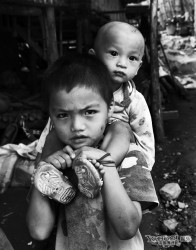
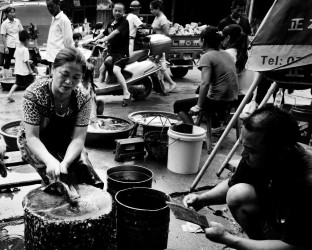
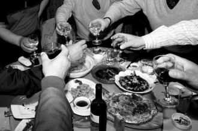
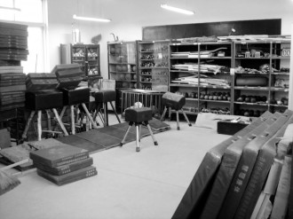

# 镇上的男老师

到中学后女老师越发少了，在基本都是留守学生的乡镇中学，男老师，是与青春期的我们接触最密切的男人。

**张火柴**

张火柴老师，瘦高，教语文，学校主任，略有文人气质。

一个冬日早晨，他和他妻子做爱。情到深处忘记拉上窗帘，而他家在一楼，卧室窗口正对着操场。学生们都在做早操，于是他无意中给我们上了堂稀缺的性教育课。

那时我们年级上，有女生初潮，跟爷爷奶奶长大的她以为自己患了绝症，把自己反锁在房间内近一周，想饿死不拖累老人。直到班主任去家访。班主任是男老师，默默地去村口给她买卫生巾。回校后啼笑皆非地告诉同事，“快给自己班女生讲讲，流那个血是不会死人的。”

初一课本上有一章讲生理知识，我第一次看到“手淫”俩字，惊得满脸通红。同学都偷偷摸摸地在反复翻看那章，生怕被人发现。

有女生被强暴后怀孕，不堪其辱去跳河。被同班男生救起，送到三轮车上陪着回学校。一身水草垃圾，衣服在挣扎中被撕破，目光呆滞地在大家的观望中走回寝室。我现在才知道那些观望的残忍，并庆幸我不在其中。她父母知道后，让施暴者给了一万彩礼，把那个女生嫁到了他家。

就是在这样懵懂压抑又不时有惊爆消息的环境里，张火柴老师，在上百位学生的注视里，与妻子做爱。

他终于发现，暴怒异常。跳出被窝，一把拉上窗帘，拖着两只不一样的拖鞋就跑到操场，把离窗口最近的男生一脚踢翻，再扯起头发给了男生两巴掌。那只亮色的女士拖鞋，像是骤然加速又失去燃料的火箭，飞出很远，倏尔坠落。

火柴老师的妻子是他的表妹，或是因为近亲的缘故，儿子有先天重疾，医生说活不过二十岁。因为小孩不能走路，他的家都在一楼，他孩子所在的教室也在一楼。我看过他送小孩上学，先从家里背出来放到摩托车上，再开车到教学楼下，然后背着孩子去一楼的教室。他常常在学校陪儿子玩溜溜球。儿子玩，他在一旁看得呆呆的。儿子一手扶着他，一手飞快地转动。不一会又因为莫名的原因——可能只是觉得有人在看他，就赌气不玩了。个性里有残疾孩子特有的敏感和暴烈。

听说火柴老师什么事都很迁就他的儿子，觉得要在他活着的时候给他最好的。

那个小孩，如今已经有十八岁了吧。

 **李大手**

李大手老师，教历史。小眼高鼻，有费翔似的大背头。颇有才华，书法极佳，写得一手漂亮的板书。上课时声如洪钟，总是笑嘻嘻的，讲到激情处，头向上一昂，再猛地拍下桌子。学生们在下面开小差，互不相扰。把他惹急了，他就把铁质的保温杯用力砸到墙上，水花四溅，“不听课就给老子滚出去！”下节课还是笑嘻嘻地走进教室。我曾请他帮广播站写材料，他很爽快答应了。次日就来教室给我，字体苍劲飘逸。没有多的话，交给我就走。

歌咏比赛时（就是那种全班一起穿校服唱红歌，每个学校都有办过的歌咏比赛）我才知道他居然弹得一手好琴。学校没有像样的电子设备，伴奏都很难准备。他摆半张桌子在副台，琴边放话筒，给我们伴奏。

我记得那个春天，油菜花与粪水的味道一阵阵地光顾学校上空。他在春风里微闭着眼，学生在台下嗑瓜子，领导打着呵欠张开了大嘴，旁边的同学声嘶力竭地吼“红星闪闪放光彩……”，空气中看不到的花粉和粪水，和春风一起附着在他油腻板结的头发上。我知道他通宵打牌，妻子常年在外面打工，家境艰难，他嫖娼，患性病，他花了很多钱也没有治好……这有什么关系呢？他在春风里微闭着眼，舞台风大，没有人在意他的琴声，流水行云动人心魄。

这有什么关系呢？

再后来，他妻子回老家，过年的时候他们经营鱼摊，我去买鱼。他殷勤招呼我，我只觉得心酸——真的不用这样的，我是你的学生呀。

我也不用忘记他为我杀鱼时手上划出的大口子，粘稠的鲜血流到鱼肉上，他的疼痛和尴尬。

我也不用只记得他那个春风沉醉的下午，粪水的味道和琴声。

这些都只是他的人生。

 **周西服**

周西服老师从来不和除李大手外的老师深交。周西服，教历史，瘦高，眼镜，初三时，学校第一次发奖学金，年级第一50块，依次递减，第四的我20，后面的一人5块。而他在我们初一时，就自费上千块，给学生买学习机，班会给学生买烟，他带的班历史平均９０＋，而其他班班平不及格，学校第一名到不考试的混混都喜欢听他的话。

西服老师才情与大手老师比肩，但较大手老师努力。用高三实验班的要求我们乡镇学校初三的学生。我们没考上九十分的同学，自己走到讲台摔手——就是把手狠狠地摔到桌上，而且大家都心服口服，觉得对不起老师。

我们自习他在教室晃悠，西服背面全是干硬的米粒和油污。妻子是介绍的，没文化，不爱他，据说只是看上了他的教师身份。他讲一战拿学生会举例子，说学生会是学校的走狗。我当时是学生会主席，同学们转头看我的反应。晚上放学回家，路上已经没有人，他停下摩托车载我，告诫我一定要考名牌大学挣大钱出人头地……这些话由他讲出来，居然听着不刺耳。绝口不提学生会走狗的事情。

西服与大手老师一样，时运不济。

这里不得不提一位女老师袁气球，气球老师梦想让儿子出国。她名义上的爷爷与她母亲生的她。名义上的父亲，事实上的哥哥是个弱智。不知道是否是这样的出身给了她屈辱感，她一直以异常亢奋激进的方式赚钱，希望能送儿子出国留学。初三她请假去看她生病的爷爷，同学都惊讶她年近四十爷爷居然还在——我心里冷笑，公爸爸。不觉得自己刻薄。卖教辅、刻光碟、办英语辅导班，学校赚钱的生意他们夫妻都在做，做到让人厌恶的地步。

因为西服老师办的班比她人气高，她于是举报，教辅班这种事情本来就说不清楚，可大可小。

但西服老师被罚了巨款。妻子照样天天打牌，索性饭都不做了。生日给他短信，“女子啊，老师在河边钓鱼……”他总是称呼我们为“女子”，用方言喊出来亲切得有宠溺的味道。

我当时在想，何必为气球女保密。天真地想以这样的方式帮西服老师出口气，最后还是不屑于揭人短。而今我才觉得，西服和气球是同一类人，心比天高，一心想摆脱小镇的荒芜给人的绝望。只是西服通过与学生真切交流，给自己建造世外桃源；而气球的目标只有一个，逃离，彻底摆脱这个地方。

再后来，西服辞职考公务员，县城里的小公职，任务主要是陪人喝酒，我们高考填志愿，他给同学发短信“老师对不起你们啊，现在不能帮到你，但再等两年，我立稳了脚，一定会尽力帮你们的……”这些话，如果不是他讲的，我们都会觉得虚伪。那时我们已经很久没有与他联系，更未指望他帮忙。

最后一次见他，是在县里等车，他已不太记得我。他对我这个曾经被他称作“走狗”又叮嘱要出人头地的学生，微微寒暄然后转身离开。

我看见他的西服，背面还是皱巴巴的，大腿的位置有米粒。

 **钱大眼**

我真正接受老师嫖娼，是在知道钱大眼老师的秘密之后。

钱大眼，具体教什么不记得了。矮胖，头大，笑起来肥肉颤颤，憨憨的。和学校谁的关系都处得好，教书很烂，赚钱能力一流，负责给学校大小活动拍照，垄断了学校的证件照毕业照的生意。

当时我在学生会，负责帮他发放照片，顺便收钱。他因此不收我的钱。活动照上有我的就送给我。毕业时对我各种叮嘱。

我觉得跟这老师关系不错。

后来我就毕业了。

再后来，我陪一个社会女青年去他那儿拍照。好久不见，我以为他会与我寒暄，他却只与那位女青年朋友聊天。他矮，我朋友更矮，他的目光很低，我顺着他的目光看去，发现他在把目光分成了三份：一份是跳动的，用来诠释“眉飞色舞”，好像在心无城府地聊天；一份是涣散的，假装漫不经心地扫视身边的人；最后一份固定而真诚的，用来看她的乳沟。掩饰得很好，把其他俩份疲惫不堪的目光都逗开心了。

她浑然不觉。我让她换了个姿势站。

再然后，我就知道了他年轻时候当团委老师，在放鼓号队器材和褪色纸花的活动室强奸了很多漂亮女生的事情，都是那种能歌善舞的水灵女孩。

没有受到任何惩罚。

他那颗油亮的大头，还是在学校的文艺晚会上扭动着，选位置，拍照。

不出意外，我们都还有几十年的路，我会比他们活得长。我可以看着他们，衰老，枯朽，死亡。

我们都安守各自的命运吧，看上苍在死亡之外，还会赠与这样的他们，怎样的结局。

（采编：刘铮；编辑：季节扬；配图：季节扬；责编：刘铮）

[【老师专题】语文老师](/archives/29100)——“语文老师，教会学生如何“揣着明白装糊涂”，什么灵魂也不能塑造，什么罪恶也不能救赎，如同体制内的特雷莎修女。” [【老师专题】土地之下](/archives/22393)——“现在，他庆幸自己的选择。他的选择完全超出自己儿时最疯狂的理想。他希望成为一个战士，守卫仅仅属于自己的边疆，现在，他拥有了属于自己的村庄。” [【老师专题】老师](/archives/33005)——“小时候目睹老师游行讨薪，心想以后决不当老师；中学时视老师如监狱长，从未想过自己会做一个老师；大学时遇到了在轮椅上答疑的教授，“老人家你何苦如此拼命啊”；如今在高中教历史，我做不到多么伟大无私，但现在的职业让我很开心。” [【老师专题】性格养成期里的二三事（独立影像47期）](/archives/33356)——“本期介绍的四部与老师相关的电影，有不同的政治环境，相同的是，他们在经受内心与外界的双重的淬炼中展现了自身高尚的师道，向他们致敬。”
