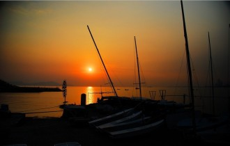

# 亲爱的米兰达

我时常努力把记忆的碎片粘合起来，拼凑成一个完整的故事。这样读者不会看到一些不知所云的蒙太奇，可是思绪再怎么延展，也不可能抵达完全不可知的领域。我需要线索，也许取材于个我的经历，也许取材于他人口中的故事。可是我听完过后，发现每个人都是如此；莎士比亚过后，我觉得人间的小说都已经写完了。

我总是希望你毫无保留地对我坦白内心，就像对一个放心的友人倾诉衷肠。但是你守口如瓶，只会微笑着面对我，以一道轻描淡写的笑容来敷衍我的饥渴。也许是历经长久的讲述，早就没有开口表达的欲望，也许是伤疤搁在心里见光就会吧嗒吧嗒地流泪。所以我一直尊重你的缄默，无论面对自己或他人，沉默永远是人最后的权力。

那次在高铁上，你和我去买了好多罐百威，你开始在我耳边轻轻地吹气，看我痒得扭动身体于是你笑了起来。你还是拥有那些调皮的。我无法断定这种调皮是一种习惯或是一种调剂，毕竟我总是看不懂你。

河床干涸的地方，纵横着泥土堆砌的脉络。野外的风里有动物粪便的气息，闻起来自然舒服。风拂过你我头顶，像是一排刀子列成的阵，开垦我们的头顶。在黑暗往事的那段时间里，我总是感到凄惶。没有朋友没有众人，走在哪一条路上都像赴死。那种孤独我无法准确地描述妥当，只能交由你去感受。后来我明白，不需要感受，因为你也是如此的人。

相生相死，是个轻松愉悦的话题。携手在都市里寻觅海鲜小食，主要是沿着右手边的海岸线由西至东。嘴唇每一次离合你吐出简单的音节，像是鼓点一般明亮地有节奏感。雾灯从你的身体里得到表达或是回应，总是打在你的身上。或者这是一种错觉，可能那个夜晚过于安静，我以为一座城里只有两个人。麦岛停泊着破旧的渔船，还漆着年代久远的编号。

像是一种安静的叙述，我们都不属于那个年代，看不到恢宏的海浪吞噬海岸的树木。防汛堤老得讲不出任何故事，目睹的每一对路过青葱的情人，灰白的照片是他年轻的见证，荒唐却真实地作为布景的装饰，衬托出那个风和日丽却锈迹斑斑的年代。遥想那时节，爱情还是生命里重要的事。渔船长出白花花的胡子，皱纹爬上他们的脸。皲裂的皮肤诉说着时间的苍老，躺在冬风里望向南方，抚摸过他身体的姑娘也成为一个平凡的妇人。世间永恒不变的只有变化，这是一个奇妙的二律悖反的荒诞笑话，当然，你大可让她从你耳边溜走。退役的武士再也不能漂荡在近海，桅杆倒下像是一茬茬匍匐的麦。我们终将如同他们，在漫长的光阴里拉近与他们的距离，直至无穷接近于相等。飓风中斩浪的故事被人遗忘，光荣剥落在泥泞的地上，被海浪卷走，归到风暴的中心与闪电相晤，被撕裂成泡沫与水汽，蒸腾上升进云层，落成雨点在不谙世事的少年肩头。这像是一场轮回，我们都是凡人，亦皆当甘愿如此。

表述美丽的作用，将延展成一个无休止的争论。短暂的一生从开头走起来，总觉得漫长。可是行至终点，却发觉未曾认识到世界，也从未安静地与自我相处。那层现实与个我的紧张关系，薄薄地在指尖前端，谁也难以戳破开悟。得道的后果都是羽化或涅槃，谁知道这些老东西去了哪儿。但是人这一生该怎么诠释美，这在你矜持的举止中得以完满地表达。我在重新考量矜持的作用，或者这是对自我的一种控制与挑战。明明可以放浪形骸地像一个可笑的行为艺术家，但却甘愿在俗世里恪守自我的规则。如果你袒胸露乳地卖弄身体并将其冠以艺术的名义，大概我不会多看你一眼。所以说，你活得漂亮、甚至美丽是有原因的，并且你从未对我坦白。你很明了，在一段感情的对手戏里，谁更能控制自己，谁就是坐在王座上的贵族。

我愿秉烛夜游，与你携手把这腌臜的人间走成一道亮丽的路径，风景盛开给我们看，到哪儿都有蝴蝶蹁跹。可是我们都不是生来便自带背景的男人和女人，这一切只能靠荷尔蒙的反应和虚妄的想象。你是一个有教养的女孩儿，当然优越感我也能清楚体会。可惜我长得不像金城武，你眼里的夜色海岸可能不会成为回忆里的珍藏。

但那是我的珍藏，这就够了。

可是我不认识你，这让我感到悲伤。

我也不是处女了。再见。

（采编：有奖信息；责编：王卜玄）

[【致卿卿】来自树精的情信](/?p=41125)——我看到你眼里的光，就忽视了黑夜。我乘着草叶颠簸到了灯塔。在灯塔上不分昼夜地编织故事，试图再一次把身体与情感分离。可是我将故事缝到了自己衣服上，扯也扯不断。

[【致卿卿】情诗](/?p=41050)——诗人的性欲是爱情。诗人的餐桌是爱情。诗人是鱼爱情是水。[情诗](/archives/tag/%e6%83%85%e8%af%97)，就是一场鱼水之欢。
