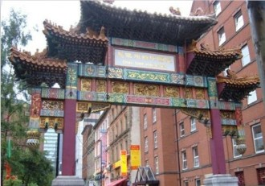
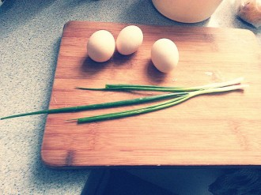

# 屌风的汉子——“冚家铲”大叔的故事

不是我选择了拳击，而是拳击选择了我。

——奥斯卡·德拉霍亚

“拳坛金童”德拉霍亚是我最喜欢的一位拳击手，他的拳击风格浪漫而忧伤，进攻时像一只翩飞的燕尾蝶，防守时像一只无辜的梅花鹿，直看得人如痴如醉，如梦如幻。在其传奇般的职业生涯中，他获得了数不尽的冠军头衔，被全世界的拳击爱好者顶礼膜拜。德拉霍亚有着英俊的面庞和丰富的情怀，他能文能武，又红又专，甚至凭借一张西班牙语专辑进军了格莱美。他真是人生的赢家，造物的恩宠。

所以他才有如此的自信，说出题记里的那句话。正如其父亲给他起名“奥斯卡”的理由一样，他人如其名，拥有了一段比好莱坞电影更美丽的人生。

并不是每个拳手都是上天的宠儿，今天我要讲的是另外一个拳手。如果说德拉霍亚的人生舞台是那个6米见方的擂台，那么他的舞台就是这个醉生梦死、尔虞我诈的沧桑人间。

### （一）

王宾是我在利物浦时的好友，他来自水泊梁山所在地山东，为人慷慨，急公好义。朋友托他办事或找他借钱，从来都是无所不应。后来有人看准了他的软肋乘虚而入，找他借了3000多英镑，一拖再拖就是赖着不还，王宾这才着急得四处找朋友商量对策。他其中一个朋友是广东人，参加了利物浦的一个老乡会，说会里有几个都是混当地广东帮的，要不要找他们来帮忙讨债。

王宾开始还觉得不太好，毕竟朋友一场，不想撕破脸皮。那广东人虎着脸说道：“我老豆死得早，死之前嘱咐我，破财消灾、挨打站定、欠债还钱、杀人偿命，这是中华民族的四大传统美德。”

于是王宾只好出此下策。他在打电话约到了欠钱不还的朋友去某酒楼见面，俩人刚上楼，那哥们就被满桌杀气腾腾的江湖人士吓尿了裤子，当场就乖乖掏出手机从电话银行转账。完事后广东帮的弟兄拍了拍王宾的肩表示要借护照一用。王宾知道他们是要用他的护照给蛇头帮人偷渡，有些犹豫，不过他想起了中华民族四大传统美德的第一条就是“破财消灾”，现在灾消了，都没让他破财呢，借护照就借吧。

他垂头丧气地回到自己租住的房子里，闷闷不乐。房东提着一瓶伏特加，摇摇晃晃地走过来，问他有什么心事，王宾和盘托出。房东说这事我替你搞掂，你放心吧，来饮杯啦。然后王宾就借酒浇愁，喝得不省人事。

第二天他醒来时，发现护照放在自己床头。他这才明白他的房东不是普通群众。

他的房东姓龙，我们叫他阿龙。我那时经常去他家找王宾喝酒，阿龙是个酒鬼，总是不请自来，提着酒瓶就加入战团，每喝必多，一喝多就给我们讲述自己的革命家史。

阿龙英文名叫Dick, 中等身材，四十岁左右的年纪，广东人氏。其父亲曾是某权力部门高官，阿龙年轻时依托其资源快意人生、吃香喝辣，自己在广州有一化工厂，正事不做，衣食无忧。后来因其父东窗事发，阿龙不得不舍弃大好温柔乡，拿着一纸学生护照去了英国。

在英国他也无心读书，可又不能回国，于是就四海为家，最后去了曼彻斯特一家中餐馆当厨师。该餐馆的老板据说是心软收留了他，这一软不打紧，软没了一个纨绔子弟，软出了一个黑道大哥。

在英国的华人都知道，中国城里的酒楼等产业不涉黑是不可能的。要想不受欺负，惟有拉帮结伙或者甘居人下。阿龙跟着老板阿伟在曼城打拼了几年，逐渐显露出英雄本色。他在出租屋顶种大麻，和其他帮派抢地盘打架、帮人收账赚外快，可以说是坏事做尽，当年老板阿伟真是没有白软。多年以后阿龙酒后跟人吹牛逼，说自己除了没去警察局门口上过吊，啥事都干过。对方当场就拍出200英镑，说你牛逼就去警察局吊一个。

阿龙当时酒壮怂人胆，拿起200镑就真去了警局。他去厨房找了根捆龙虾的麻绳，虎虎生风地走在街上，把上衣脱得精光，光着膀子露出自己的玉麒麟纹身，有一种翻身做主的感觉。他说自己当时觉得中华民族5000年的苦难都被自己的虎虎生风刮到了太平洋里，当时要是英国首相来了，他也敢把他捆成一条龙虾。 后来他在街上被巡夜的警察看见了，大概觉得他衣冠不整，就上前询问他的身份。阿龙说他当时酒还没醒，还以为警察设下了天罗地网，要将他捉拿归案，所以他撒腿就跑，等被警察香汗淋漓地按在地上时，他已经把麻绳从皮带扣里穿进去，系在裤子上了。

“It’s my belt.” 他耐心地跟警察解释，“I’m a poor man.” 警察问他的名字，他告诉警察: “My name is Dick Long.”刚讲完警察就把他铐了起来，抓进警局关了24小时。后来因为证据不足，根据政策只有把他释放。

阿龙给我讲述这个故事时，我震惊于他如何能够边逃命边把麻绳系成裤带。阿龙反问我：“你有没有去过深圳啦？几唔几道深圳发展那么快，全因为那条标语‘时间就是金钱’啦。时间很宝贵的，我在厨房屌阿细的时候，穿脱裤几都只得一秒钟啦。”

这话题峰回路转，我一时没反应过来，过了好一会儿才明白二者的联系。我问阿龙：“你就这样练就了你系裤带的手法？”他点燃一根事后烟，陶醉地点了点头。

不过他说他始终想不明白为啥警察听见他名字后就把他抓进去了，我想告诉他你的英文名起得有点不合理，但又不敢说出口，只有安慰他：“你看过西游记吗？里面孙悟空也是回答了自己的名字，就被妖怪收进瓶子里去了。”

阿龙大笑了起来，差点把事后烟吞了下去。他笑起来还是很可爱的，让人甚至忽略掉他脸上的刀疤。

不过他喝醉了就不怎么可爱了，总是大喜大悲，长歌当哭。他每次喝醉了必做两件事，一是用粤语朗诵一首七言绝句:“冚家铲泥齐种树，汝家池塘多鲛鱼。树长鱼肥嬷撚饭，邀你老母共进餐。”

我不知道是什么意思，王宾给我当起了翻译：“全家一起铲泥种树，你家池塘有很多鱼，树长大了鱼肥了奶奶就去做饭，邀请你的母亲一起来进餐。”我听完后只觉得莫名其妙，不知有何内涵可言。

第二件事就是唱歌。他每次都如泣如诉地吟唱同一首歌——《捕风的汉子》，以至于我从来没听过谭咏麟的原唱都能一字不漏地唱出来。“昨天有位仿似是，关心我的女子。昨天我于她眼内，找到千篇爱诗，但是像阵风的她飘到后，转眼又要飘走像片风疾驰。谁人长夜里苦追忆往事，现她不想要知。”

王宾在一旁偷偷告诉我，那个风一般疾驰的女子就是被阿龙在曼城餐馆厨房里屌来屌去的那个阿细。

“果然风一般，每次都只屌一首诗的时间。”我幸灾乐祸地讽刺道。

没成想阿龙听觉极其灵敏，虽然已经喝醉，但我和王宾的对话仍被他一字不漏听入耳中。

“乜诗啊？乜诗啊？”他哭着怒吼道。

王宾被吓得瞠目结舌。我临危不惧，急中生智地背出刚才学到的七言绝句：“冚家铲泥齐种树，汝家池塘多鲛鱼。树长鱼肥嬷撚饭，邀你老母共进餐。”

阿龙愣了一下，突然又破涕为笑，乐得人仰马翻。然后脑袋一歪，倒在沙发上呼呼睡去。我和王宾面面相觑，实在是不知道他的歌声、诗句、眼泪和狂笑里，隐藏着一段怎样的故事。

### （二）

阿龙就是这样一个有故事的男人，他的故事和传说在利物浦和曼彻斯特的中国城里，被人们口耳相传。

王宾给我讲，阿龙在曼城的时候，胆大心细、身手过人。他的老板阿伟赌品不佳，在赌场里赌输了钱经常掀桌子，后来赌场干脆把阿伟列入了黑名单，不让他入内。阿伟束手无策，又不能硬闯怕赌场报警，就找来了阿龙，让他搞掂此事。

阿龙果然有两把刷子，他成天站在赌场外面，告诉每一个打算进入赌场的华人：“你可以进去，但是出来后能不能回家就不一定了。我在这等着你。”

有钱人可不会跟阿龙这种烂仔玩命，知道他啥事都干得出来。于是华人们纷纷退避三舍，更换赌场。赌场没了中国人，生意就没了一大半，最后都快倒闭了。几个经理不得不连着请阿伟吃了好几顿饭，求爷爷告奶奶地把他请了回去。

“都说请神容易送神难，我还第一次听说有人哭着喊着把瘟神请回去。阿龙真是太牛逼了。”王宾击节赞叹。

阿龙一战成名，从此深得阿伟器重，决定让他负责种植大麻这一高危行业。阿龙调研了一番本地帮会的大麻史，做了优劣势分析，然后大手一挥，独辟蹊径地决定把大麻的种植地点从后院换到房顶。他跟老板解释，这样做就不用怕后院里的大麻被毒瘾难耐的老黑和阿三们翻墙而入，顺手牵羊。每层楼都有人把守，重重关隘，想抢大麻难于上青天。

帮会群众纷纷伸出大拇指夸他不愧是文化人。阿龙得意地掏出护照说，谁让我拿的是学生签证呢，你们这些难民！

后来几次去阿龙家，他给我们讲了更多的江湖故事，他说大麻的发育周期通常在100天以上，在其间他需要科学规划，合理统筹，安排人手负责种植、灌溉和收成等流程。大麻的迅速生长需要高温和强光，所以阿龙在房顶建造了一间温室，不同之处在于温室罩不是玻璃或者透明的塑料膜，而需在内表面贴上厚厚一层反光锡纸。这样一来能够反射灯光，二来从外部就无法一窥内里。温室里用大功率的灯泡24小时强光照射，以保证光线和热量供应，这能够使大麻的成熟周期缩短至三个月。

阿龙耐心细致地给我们做着科普，那神态像极了央视农业频道《致富经》栏目的主持人。讲到动情处，他从沙发上站起身，神情肃穆地面朝东方（曼彻斯特方向），我还以为他要跳一段忠字舞，结果他摇摇头说：“我只是想她了。”

阿龙说有段时间风声比较紧，销售渠道出了内鬼，他确定不了是谁，好几周不敢出货，愁得拉屎都不臭，吃饭都不香。这时候阿细挺身而出，扮作餐馆的外卖人员亲自帮他们送货。 阿龙一开始不同意，担心阿细因为没有江湖经验而吃大亏。

我问阿龙：“那后来呢？”

“她精明过人，一般的烂仔哪是她的对手。”阿龙的笑容落寞又骄傲。“她的确是一个风一般的女子。”

具体的细节我不得而知，不过“阿细”这个称呼却很是熟悉，让我想起了《古惑仔》电影里的黎姿，滚滚红尘，绝代风华。难怪阿龙对她如此难以忘怀。

我问阿龙，能不能再给我讲讲你和阿细的故事。

阿龙点燃一根烟，感伤地告诉我：“我那时候每天都屌她好几次。”

原来江湖儿女就是过的这样的生活，我和王宾不禁悠然神往。

“但是阿细现在在哪里？为何从我搬进来的第一天起，你就一直独居？以至于我一开始还以为你是……”王宾的问句到最后欲言又止。

“你以为我是咩啊？”阿龙打了个酒嗝。

“基。”王宾平静地回答，只是面部肌肉有点发抖。

阿龙哈哈大笑，然后终于在那么多次喝酒后，第一次给我们讲述了他和阿细的故事。

### （三）

阿细是以前同一家中餐馆的服务员，广东顺德人，偷渡来的英国，长得好看又肯吃苦，深得餐馆同仁喜爱。但阿细却惟独钟情从不主动亲近她的阿龙。

“这叫欲擒故纵。”阿龙补充说明，王宾当即就把这一条记在了手机记事本里。

他俩的第一次肌肤之亲，发生在厨房操作间旁边的小仓库里。当时是晚班时间，但是还是有人不时进出厨房，那仓库又只有门栓没有门闩，锁不上。

“那怎么办的？不锁门吗？”

“我随手抓了一只龙虾当作门闩。”阿龙淡定地答道。

“龙哥真系随机应变。”我和王宾被他的机智所折服，大拇指久久不愿放下。

“那当完门闩的龙虾怎么处理？”王宾打开手机记事本继续好学不倦。

“清蒸红烧都得啦。”阿龙不耐烦地摆摆手。

我暗自心想我以后去餐馆吃饭绝对不点龙虾了，搞不好吃的就是厨师们用过的插销……

阿龙继续给我们讲述他和阿细的燃情岁月。他说他在国内的时候虽然屌过很多女人一次，但却从来没有像这样，屌同一个女人多次，他说这算是他的初恋。他说他之所以后来从餐馆出来自立门户，一是因为人脉和资金已经足够，二是他的老板阿伟也看上了阿细。

“那你当时没有去砍他？”我问道。

“没有，我当他是我的恩人，没有他收留我，我早就被遣送回国了。”阿龙的眼神里有一丝黯然。

所以他带着阿细搬出了曼城中国城，在外面开了中餐馆，后来又扩大经营，无所不包。到了2005年左右，他的势力终于能够和阿伟分庭抗礼了。

那段意气风发，双宿双栖的生活一定很精彩，我想。阿细当上了老板娘，再也不用和阿龙躲在厨房仓库里偷情了，整个餐厅都是他俩的产业，他俩想上哪偷情就上哪偷情，哪怕在房顶。

“房顶不行，种着大麻呢。”阿龙摇摇手。

“后来有一次我和阿伟做大麻生意。他要货要得急，我这边人都在外面跑，没人给他送货。我又要守着大麻种植基地，走不开。然后阿细就自告奋勇，说她去帮我送货。”

“我怎么可能放心，我知道阿伟对她一直有意思。阿细说你俩是兄弟，勾引二嫂可是江湖大忌，他不敢的，你就放一百个心吧！于是我就信以为真了，我竟然信以为真了！我顶你个肺！我顶你个肺！”阿龙国语白话自由切换，愤怒地用手指着我骂道，吓得我差点从椅子上跌下去。

“当晚阿细就回来了，看起来一切顺利。我没有察觉出她的神情有什么异样，我真是麻木不仁，我屌你老母。”阿龙继续骂着我。王宾在一旁轻抚我的大腿，示意他不是在骂我，谁叫我坐在了曼彻斯特方向。

“过了半年，我有一次约一帮以前的兄弟出来饮功夫茶，其中一个人现在还在阿伟手下做事。他跟我感情一直很好，他告诉我说阿伟可能和阿细有搞嘢。呢个死扑街！”

幸亏我预感到阿龙又要指着曼彻斯特方向骂娘，提前把椅子往伦敦挪了挪。

“我问他你怎么知道的？他说阿伟有次喝多了跟大家吹水，说阿细的后腰有一块纹身，纹的是一对天使，我操他妈逼，那纹身全世界只有我才看得到！只有在背入她的时候才看得到！”

王宾领会到了龙哥的发言精神，又掏出手机写下了“后腰有纹身的女人喜欢被背入”。

“我赶紧回家问阿细，她哭着我跟说她那天送货去的时候被阿伟逼奸了，回来怕我把事闹大，一直不敢跟我说。当时我觉得是可忍孰不可忍，一阵血往上涌，也不顾家里缺人手，连夜带着两个弟兄就去找阿伟，想跟他算账。”

“你带枪了吗？”我忍不住插嘴道。

“枪？我连刀都不带，你没听过‘曼城阿龙境界高，行侠济世不用刀’？”

“那你难道用拳头？”

“我在广州的时候可是拿过业余拳赛冠军的，我打架一拳一甩棍足矣。”阿龙从柜子里拿出他多年来傍身的ASP甩棍，充满感情地摩挲着，就像在抚摸阿细的大腿。

“我们当时在车上装上汽油瓶（当炸弹使），就往中国城走。我们以前有一次半夜出去和黑人打群架，开了两辆车，其中一车上面有枪，另一辆车装着汽油瓶。结果在路上和其他车辆连环撞车，两辆车都毁了，人也受伤了走不了，条子和救护车都来了，没办法只有去医院。出院后持枪的人全被抓了，但是带汽油瓶的那几个哥们却被放了出来，你猜他们怎么跟条子解释的？说是用来照明的。英国的条子也真是白痴，居然相信了。”

“所以后来我们出去打架就只带汽油瓶和甩棍了，被条子查到了也没有证据关我们。”阿龙再次把学生签证赋予自己的大智慧运用到了帮派生涯中。

“以及我的拳头。”他摇了摇右拳，那轻佻而不羁的神情让我想起了德拉霍亚。

战无不胜的阿龙这次要面对旧主了，听到这里，我和王宾都紧张得腿毛倒竖。

“我们到了中国城，进了阿伟的酒店才发现中了埋伏。他找来了香格里拉酒店的老板，一个越南人，那家伙当时算是曼彻斯特和利物浦老大级别的人物，黑白通吃的。我们几个兄弟怎么是越南帮的对手，被打成了猪头皮。我虽然放倒了几个，但是敌不过人家人多又有枪。最后被按在桌上，要废了我。”

“怎么废？”我毛骨悚然地问道。

“就是挑了我手筋脚筋。”阿龙的语气平静得就像电台主播。“我一直以为自己不怕死，但是生平第一次遇到这种事，还是惊得不行。我不想下半辈子成废人啊。于是我就和他们谈条件，答应把我的酒店、桑拿、KTV全部转让给阿伟，还有我的大麻。”

“然后他们就放你回来了？”

阿龙干笑一声，就像是在咳嗽。他从衣兜里伸出左手，示意我们凑近了仔细看。

我们发现他的左手小指和无名指无法弯曲和动弹，那是假的手指！虽然已经几可以假乱真、混淆视听。所以我们跟他相识这么久，从来没有注意到异样。

“他们要废了我带去的俩兄弟，我不干，就说替他们受过，一人抵一根手指，然后就这样了。他们没把手指还给我，当着我的面就拿去喂狗了。多谢女王，英国全民医保，看病治伤都不要钱，我就选了最贵的义指。”他似乎很满意地把左手翻来覆去地欣赏，仿佛那伤口已经痊愈，新指得以重生。

“资本主义就是好！”王宾感动地记在了记事本里。

我理解阿龙刚才的举动。如果我能用两根手指救回兄弟的命，那么我也一定会对这个伤痕满意一辈子的，那是男人的勋章。

“我灰溜溜地回到家，发现阿细已经不在了。我不知她去了哪，我唯一知道的是，我这下什么都没了，包括我的这个‘家’，我马上就得搬出去。”

“后来我就来了利物浦，这里有我几个老友。他们给我在餐馆里找了一份厨师的工作，让我重操旧业。我虽然只有八根手指，但是切菜炒菜比他们都利落，他们都叫我八指叔。”说到这里，阿龙的眼里充满自负，似是又燃起了火焰。我知道，无论他在哪里，无论他在干什么，豪情胜慨永远都在。

英雄总会老去，但英雄永远是英雄。

“那后来你知道阿细到底去哪了吗？”王宾实在按捺不住，终于冒着被阿龙用甩棍打脸的危险问了出来。

“她在我被砍的那天晚上就回阿伟那里去了。我后来才知道，阿细本来就是阿伟的情人，只是大家都不知道。后来她在餐馆和我偷情，被阿伟发现，阿伟要收拾她，她求饶说愿意戴罪立功，跟着我就当是个卧底。后来我果然做大了，在曼城阿伟已经压不住我，还处处被我抢生意。于是他们就来了这么一出戏，骗我上钩。阿伟当时肯定知道我人手不够，而且也知道，只有为了阿细，我才会失去理智、不顾一切地去找他拼命。”

“那现在呢？他俩还在一起？你不想去找他们报仇吗？”我被那对狗男女气得七窍生烟，恨不得率领我们利大计算机系的学生去曼城和阿伟拼命，要知道我们班有个黑人身高2米1，还有一个黑人长得和麦迪一模一样。

“呵呵，阿伟后来贩毒案发了，结果成功落跑，带着英镑回大陆花天酒地去了。”

“阿细也回去了？”

“阿细被抓了，判刑了，现在在号子里呢。”

“活逼该！”我和王宾掌声经久不息。 “

我还去看过她，我真是没出息。”阿龙讪讪地笑道，“我不去的话真没人管她了，我给看守塞了钱，不然她一个华人在监狱里会被欺负死的。”

“她还有3年就出来了。”阿龙又望着曼城方向，这次他终于没有骂我。

我看到阿龙深邃而浑浊的眼里突然有一种晶莹剔透，不知是泪水还是流转的眼波。

我终于明白他为什么到现在都孑然一身了，他一定是在等待着什么。

我和王宾默然无语。

阿龙站起了身，打破了尴尬的沉寂，他说你们就快回国了，也没请你们去酒店吃大餐，我今天就亲自下厨给你们炒一盘黄金炒饭吧。

### （四）

“我在利物浦的餐馆里当厨师，最受欢迎的就是这道黄金炒饭。因为我每次在切菜和翻炒的时候都喜欢骂骂咧咧，尤其喜欢念那首“冚家铲泥齐种树”，所以餐厅的兄弟都把这道炒饭叫做‘冚家铲黄金炒饭’。”

说完他就开始切葱，果然“冚家铲”、“丢你妹”地骂个不停，咬牙切齿，目呲欲裂。

我忍不住问他冚家铲到底是什么意思？他对着我暴喝：“全家都死晒啊！”吓得我久久不能言语。 我知道他又想起了那些屈辱的往事，我更知道，这道黄金炒饭一定是他的老板和恩师阿伟教给他的。

阿龙打了三个鸡蛋、然后分离蛋清蛋黄，把蛋黄打进米饭里。这全套动作都只用左手三根手指完成，那两根义指上滴水不沾，干净利落。他的右手始终闲庭信步地放在衣兜里，他甚至告诉我们他完全可以在做饭的时候同时手淫。

我问他如何做到这样的神乎其技，阿龙文绉绉地答复我：“无他，唯手熟尔。”

然后他从冰箱里掏出一瓶Gordon金酒，我以为他做饭时睹饭思人，触蛋生情，又要借酒浇愁。结果只见他倒了一点酒在碗里，把左手三根手指伸了进去。

“我这是在清洗手指，一会儿还能顺便清除蛋黄的腥味。”阿伟解释道。

我还没反应过来他清洗手指干嘛，就看见他闪电般地把手指插入了带着蛋黄的米饭中，开始搅拌。

我们不解地问他为什么不戴上厨用手套？他反问我：“你屌你条女的时候，她喜不喜欢你戴套？” 我支支吾吾还来不及作答，他自问自答：“肯定不喜欢！所以你屌饭的时候，饭也不喜欢你戴套。”

原来阿龙不是在拌饭，他是在屌饭。

我仿佛看见那小小的一碗米饭背上了阿龙半生的爱恨情仇。他父亲的落难，身世的飘零，江湖的血雨腥风，情人的始乱终弃，这一切连同阿伟他妈逼一起，全部融入在这金黄色的米饭里，被阿龙屌到天荒地老。

但我逐渐发现这手法有点不对，那不像是对仇敌的决绝和对命运的不忿，更像是在招呼情人的身体，柔到极处，宛若无骨。

原来这米饭不是阿伟他妈，是阿细！

阿伟慢慢地搅着，拌着，揉着，屌着，仿佛用掉了一首诗的时间。

那如果真是一首诗，那一定是荷马史诗。

阿龙说他年轻时以为世间万物唯快不破，现在才知道错了。他要把在厨房里、仓库中、江湖上，那些仓促对待、匆匆逝去的时间全部屌回来。

他屌得我和王宾昏昏欲睡，突然闻到了一阵蛋香味。只见阿龙嘴里叼着一根事后烟，疯狂地挥动着锅铲，翻炒着屌好的米饭。

好一招冚家铲！从那上下翻飞的铲影里，我已经看不清阿龙的身形，他就像一只翩飞的燕尾蝶，他仿佛不是置身于乌烟瘴气的厨房里，而是站在拳台上，那个真正属于他的舞台。

“刀光剑影变成了锅光铲影，阿龙你真的能够坦然接受吗？”我问他。

“现在华人帮派都不种大麻了，警察知道了我们的伎俩，就派出直升机昼夜巡航，用红外线探测器查找房顶的热源，温室里一旦开灯，必暴露无疑。所以毒品少了，治安也好了很多。 一切都会变的不是吗？我原本就是个厨师，现在只是变回去了而已。”阿龙专心致志地铲着饭，头也不回地告诉我。

是的，你变回了厨师，但爱和情怀还变得回去吗？你等的那个人，她还变得回去吗？我在心里默默地想。

阿龙把炒好的冚家铲黄金炒饭分成两份，递给了我俩。只见那泰国米被炒得妻离子散，颗粒分明，每一粒米都被鸡蛋黄染成了金色，就像利物浦海边的阳光。

我和王宾狼吞虎咽地吃完，根本找不到任何辞句来形容其绝味。这是我这辈子吃过最好吃的炒饭，或者说，最好吃的东西。

阿龙看见我们把盘子都舔了个底朝天，甚是满意地躺在了沙发上，端过刚才那瓶Gordon金酒，倒在杯里徐徐咽下。 “你们看见没有，这是金酒，金盆洗手的金。”阿龙冲我俩晃了晃瓶子。

我恍然大悟，原来他炒饭的每一个细节都是大有深意。这真是用故事和情怀炒出来的炒饭，这样极品的食物，怎么能叫“死全家”这么粗鄙的名字？

我当即就请阿龙给这炒饭起个新名字，我说我要带回祖国大陆去发扬光大，让社会主义的春风把它吹绿！

阿龙喝下一口金酒，缓缓地说道：“我经常想着我和阿伟的恩怨情仇，不由得想起了小时候看过的武侠小说《天龙八部》，里面乔峰苦苦追查的害得他身败名裂家破人亡的“大恶人”，竟然是他的父亲。而我的仇人是我的师傅，我的恩人。这就是命运，我的命运还真有些像乔峰。

“这炒饭就叫做虽万千人吾往矣吧。”阿龙指着空盘子说道。

虽万千人吾往矣，多么豪气干云的名字。你和乔峰都历经了劫难，勘透了生死，但你和他的不同之处在于，你的阿朱还会回来的。

一周后我和王宾就踏上了回国的旅程。我们再也没有见过阿龙，这一别也许就是参商永隔。

那位曾经帮王宾出头找人讨债的广东同学去车站送我们，临别的时候我问了他一个问题，那是我这一年多来最大的心结。

“冚家铲泥齐种树，汝家池塘多鲛鱼。树长鱼肥嬷撚饭，邀你老母共进餐.”这首诗到底是什么意思？

“你丫种树死全家，你家池塘真多余。树长鱼肥麻烦死，邀你妈逼共吃鱼。”广东同学淫笑着翻译成了普通话，朗读给我们听。

“信达雅。”王宾竖起了大拇指。“粤语真是博大精深。”我对他交口称赞。

广东仔真是一群有故事的人，不是你们选择了江湖，而是江湖选择了你们。我坐在车上看着他的背影，啧啧称奇。

### （五）

列车开动了，开往伦敦，我终于告别了利物浦，我的第二故乡，启程回国。我有点伤感，耳机里却应景地传来了那首《捕风的汉子》，我是听熟了阿龙的演绎后特意去下载的：

路中有位不说话、心伤透的汉子目光带点哀与倦，天天穿黑布衣，像是立了心一生追悼某个已于风中逝去的梦儿茫然流浪去他将此数字画于街中废纸Marianne, Marianne, Marianne.Won't You Stay For Me?Marianne , Marianne, Marianne.Won't You Stay For Me?

(采编：有奖；责编：王卜玄；)

[【致卿卿】亲爱的米兰达](/archives/41159)——米兰达到底是谁？是否你我的心中，也有个米兰达在望着我们，看我们挣扎、自问？

[【致卿卿】来自树精的情信](/?p=41125)——我看到你眼里的光，就忽视了黑夜。我乘着草叶颠簸到了灯塔。在灯塔上不分昼夜地编织故事，试图再一次把身体与情感分离。可是我将故事缝到了自己衣服上，扯也扯不断。

[【致卿卿】情诗](/?p=41050)——诗人的性欲是爱情。诗人的餐桌是爱情。诗人是鱼爱情是水。[情诗](/archives/tag/%e6%83%85%e8%af%97)，就是一场鱼水之欢。
