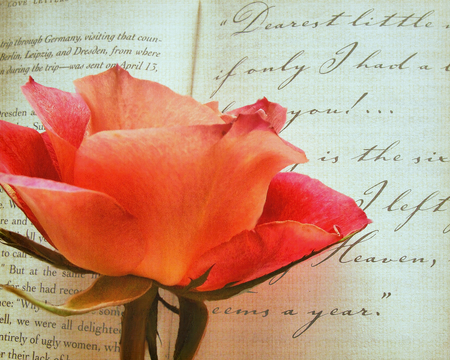

# 情书

我一直知道自己不善写诗，所以要为爱人写一首诗这件事也迟迟未成。至于情书这件事，我没有那些诗一样优美狂乱的句子，所以怯怯地，始终不敢写下。我写了一页，又一页，最终揉到抽屉里。

有个小说结尾，是卡夫卡的，“我的船没有舵，它是由风驱使的，而那风是由冷冻地区吹来的”，你就是驱使我的风，吹动我的灵魂的风，涟漪优美，风势迅疾。是冷冻地区吹来的吗，你是那样的让我温暖，我却常常想象你从暴风雪中走来，风尘仆仆，满身雪花，白得仿佛世界在你之前从未有过任何颜色。而你重新定义了这个世界，给每一种颜色冠以名字，天空的风暴是紫罗兰色，你的瞳孔深处是鸽子灰色，还有，还有赤焰色的岩浆，在我的心脏里流淌。

至于遇见你以后，我的全部感受，我的言语拙劣，无法与我对你的精美的爱，仿佛从天空一直吊落的蛛丝一样精细、透明、细碎闪着明亮光泽的爱相比，我只好用纽卡斯尔公爵夫人的诗来概述，“她的床用樱桃核制成，到处雕刻着蝴蝶之翼/她的床单用鸽子眼皮做成，紫罗兰花蕾就放在枕上”，就是这样的心情，你明白吗。其实我还是更喜欢她的另外两句，“给我自由和高贵的方式，尽管狂野，却不受约束”。我对你的感情是狂野而不受约束的，但我想因为你而安定下来，囿于厨房、昼夜和爱，都是无所谓的， “the heart of a woman falls back with the night/and enters some alien cage in its plight,/ and tries to forget it has dreamed of the stars/while it breaks, breaks,breaks on the sheltering bars”，也都是无所谓的。

这些年我乱七八糟读了不少书，可是我呢，只想从这里头摘出有限的几句话，可以逗你笑，可以让你思考，可以让我喃喃在你耳边低诉。我只想取悦你，“我不知道如何爱你，我看着你/我前后左右都跟着你/以自己的才华和智慧我投身于你/不够，就以信念，再不够/就以身以命一生相许”。是啊，竟如此不易，你和我，彼此在不如意的生活中，遇上一个如意的人。

到底需要多少的运气，在一生当中能够遇上一个像你这样的人。我觉得我幸运透了，幸运得简直想叫嚣让世界马上把我拉去枪毙吧。可是子弹不要击中我的心脏，我的心里装着爱人的画像，如果有来世，我还要装着他的样子去找他，如果没有下一世，我就带着对他的全部记忆全部感情，让这些在冰冷的泥土里一直温暖我，直到我的肉身腐朽，直到所有人都不再记得我，但我知道我是存在过的，因为我爱你。

我把写给你的诗，改了又改，删去一切不必要的词，因为我仅仅清楚一点，你是我的必需品。如同氧气，水，连绵雨季之后的阳光，那些穿透我的、浸透我的日辰。没有你我当然不会死，但是也许不再感觉自己活着。

   To XXX :  你用目光将我织入罗网 我忘了本来要骑上鲸鱼出海流浪 所以你要给我盖一座石头小房 让我在此世不再游荡  我的嘴唇，朱红色翅膀的小鸟 它把情话都驱赶到你的耳畔 用一千个吻将你全身捆绑 除了你，它不再飞往别的方向  上元节了，在天空点上一盏月亮 我们坐在它的两端 一伸手就能碰到彼此的心脏 跳动的是无尽的海洋与渴望  绝望在你的凝视中纷纷折断 涌出浓稠如蜜的松脂 锁住我的声带，哑口无言 分分秒秒犹如琥珀在凝固  在此缄默之中我爱你 用我这颗无用的心和有限的时间 犹如爱我的孤独 星辰，大地，无穷之物，和你 

(**采编**：王卜玄，**责编**：王卜玄)

[【致卿卿】要有光](/archives/41235)

[【致卿卿】屌风的汉子——“冚家铲”大叔的故事](/archives/41211)

[【致卿卿】亲爱的米兰达](/archives/41159)

[【致卿卿】来自树精的情信](/archives/41125)

[【致卿卿】情诗](/archives/41050)
