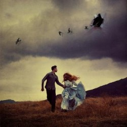
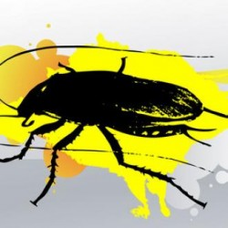

# 要有光

自我有意识起，就不曾离开过这里。光秃秃的四壁，冰冷得没有半分生命的气息；偶尔动了念头想要爬上去看看，奈何上面也是同样的死寂，混沌天地，皆日夜笼罩在固若金汤的黑暗里。黑暗模糊了时间、消弭了欲望，生命于我无外乎是进食与睡眠，求生的执着占据了心灵的全部空间，再无冗余可供滋生杂念。在很长一段时间内，我从未想象过世上还有黑暗以外的风景，然而光明却在最为绝望之时照亮了我的生命——那日我已饿得奄奄一息，就在我即将向死神投降的刹那，双眼忽感一阵刺痛。随后自那明光中浮现出了一个人影，望着他那开朗的笑容，我恍然明白自己是有心跳的。

他为我送来了很多口味清凉的食物，切成黄绿相间的圆片；量很大，比我的身体还要庞大，足够我再吃上好一阵子。尽管光芒很快黯淡下去，尽管我并不觉得他送来的食物符合我的胃口，但我也不再是从前的我了，爱情的喜悦将我攫获，冰冷的虚无也被对他的思念温热。我开始翘首盼望每一次光明的降临，只为捕捉他模糊的侧影。正是再次与他相见的欲望，支撑着我坚强地活下去。

他又为我送来了食物之外的别致礼品：一个晶莹透亮的圆球，氤氲着沁人心脾的香气。我开始拖着它走，抱着它睡，将它们视作他的分身、我的灵魂、我们爱情的结晶，哪怕片刻都未曾与之分离。沉重的爱情渐渐将我压垮，在深重的思念中我开始产生幻觉，时不时会头晕目眩；偶尔我会莫名害怕，甚至会觉得我在害怕他赠与我的信物。但纵使如此，我还是加倍抱紧了它。难道是恶魔在考验我的忠贞吗？

不久后他再度归来了，这次他为我更换了许久不流通的空气。他赐予的气体是那般芬芳、鲜亮，照得黑暗也趋于透明。我贪婪地吸吮着，幻想着自己正与他无比靠近，近到可以依靠他的呼吸声呼吸。然而再深厚的爱情也无法抵抗自然规律，我日渐虚弱，自知命数将尽。我仍然依靠着他送来的食物充饥，紧紧抱着他赠与我的圆球，回味着他的呼吸，视线完全被他的影子模糊，抛却了与他无关的一切记忆。你从未爱过我，甚至没有看到过我；但世上没有谁会比我更爱你。所以我愿用生命来感激，感激你让我知道了黑暗之外并非是更黑暗的境地，而是痛得甜蜜的光明。

死神终于来到我身旁徘徊了；我曾以为死亡是黑暗的，万万没有想到它是那般光芒万丈。我感到灵魂正飞速脱离躯壳，迎着前所未有的辉煌光明飞奔而去——竟然是他！他的指尖触碰到了我的触须，幸福自点滴向全身蔓延而去，我就这样融入了我所期待的光明，在光明的包裹下，我拥着那个圆球自由落体。我隐约听到他在说：“这只蟑螂好强，黄瓜、樟脑丸、杀虫剂都干不掉啊……”然后我落进了一团软绵绵的东西，闭上了眼睛。

（采编：王卜玄，责编：王卜玄）

[【致卿卿】亲爱的米兰达](/archives/41159)——米兰达到底是谁？是否你我的心中，也有个米兰达在望着我们，看我们挣扎、自问？

[【致卿卿】屌风的汉子——“冚家铲”大叔的故事](/archives/41159)——并不是每个拳手都是上天的宠儿，今天我要讲的是另外一个拳手。他的舞台就是这个醉生梦死、尔虞我诈的沧桑人间。

[【致卿卿】来自树精的情信](/archives/41159)——胆小鬼连幸福都会害怕。卑微到尘埃里，再悄无声息地开出花来。

[【致卿卿】情诗](/archives/41050)——诗人的性欲是爱情。诗人的餐桌是爱情。诗人是鱼爱情是水。情诗，就是一场鱼水之欢。
