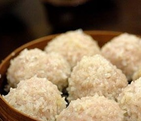

# 江湖厨房

我曾有个同桌，上课的时候我经常以戳他肚子的形式练习一指禅，他则以猛击我天灵盖的形式回报以降龙十八掌，日久天长，我们都欣欣然自己武功大进。小时候人傻气，看了两本金庸就被迅速洗脑，义结金兰两肋插刀学得比唐诗三百首快，动不动就义薄云天地拍胸脯说兄弟我罩着你。此君始终唤我“小兄弟”，并且常常替我可惜没生成男儿身。如此场景在各路武侠小说中倒是常见的，只是小屁孩只对称兄道弟感兴趣（对英雄美人的代入感要到高中之后才开始滋长），所以后来李文秀在江南玩得怡然自得忘了苏普，郭靖也摆摆手作别黄兄弟不见踪影。

这几日在纽约又相见，我们俩都一阵唏嘘：十年一别，张无忌风流倜傥，周芷若明艳动人，而我们俩小时候白白做了那么多大侠梦，十年过后竟然都出落得一副獐头鼠目的模样，果然是没这个命也没这个相。

正好有个传说中的餐厅我们都向往已久，中国人的老套路，什么旧都是餐桌上叙。此兄一个月前订了位，不幸被放了只胖鸽子，我就果断顶上，同学一场，同吃同喝在所不辞。

席间这位仁兄说起北京有一家武侠餐厅，里面的菜肴都用武功招数命名。我说我和朋友去吃过一次，没觉得多好吃，因为徒有花名，没有侠气，但是想法倒是有点意思：马克思韦伯曰“除魅”，意即现代社会中理智化增进，消除了神秘感与神圣感，老祖宗留下来的东西被西方科技破除得差不多了，留下来的不少是有奸尸嫌疑的装神弄鬼，生活中能真正聚集原汁原味侠气的唯有厨房了。

现如今公共知识分子横行，我可不敢用烹小鲜来比喻治大国，惹不起一群民意顾问代表了全中国人民来教训我。我喜欢美食喜欢读不找边际的闲书，所以只能夸口说一句烹小鲜如习精武。

小伙子小姑娘为了在另一半面前表现一番，做的大多是简单花俏的甜点和小菜——品相容易做得好看，对烹饪技巧要求不高，提升空间多在材料和创意上。比如日本女孩子做爱心便当，萝卜做成蘑菇状蘑菇做成水果状水果做成花朵状，非常有迷惑性地摆出一大盒；比如我闺密N小姐做cupcake的主要任务是把糖霜捏出各种造型；再比如我男朋友做爱心三明治，所有有可能的变化都在于他夹了什么诡异的蔬菜上……这就有些像武侠小说头几章出现的龙套们，乍一看武功卓群，往往有着拉风的江湖花名还伴随着奇奇怪怪的把式，没几个章回就被开了外挂的大boss一眼看穿了罩门打得满地找牙（典型案例就是完颜府上宴请的那几位怪杰，又是侍女撒花，又是掷筷成梅，又是玩毒蛇，又是采阴补阳，不知情的还以为是马戏团，完颜先生果然是外族，不通我国情，轻易地就被阿猫阿狗糊弄过去了，得见真英雄黄药师之时反而有眼无珠）。料理入门者不管有没有诚意，基本火候口味很难到家，雕个萝卜花来遮羞还算可爱，但是有几次我竟在酒席上看到盘子上堆了一只硕大无朋的胡萝卜老虎，而那菜的味道果然令人发指，难吃得简直都对不住那一脸傻气的老虎……

绝顶高手则常常深藏不露，如扫地神僧，一直默默当npc直到剧合章尽之时才低调显真身。我馋字牵着鼻子走，从食堂小炒到路边小摊，从神州八大菜系到西域米其林三星黑暗料理，也勉强算是个入门级食客，前几天读一饕姐美食心得，末尾有言：别问我饺子炸酱面哪儿好吃，家常菜永远是家里老娘做的最好吃。只此一句，我就信服她懂行。习武之人年少闯江湖，内修一口气，外练筋骨皮，打遍天南海北，扛得过蒙古摔跤术江南越女剑滇南五毒盎西域蛤蟆功，最后蓦然回首原来终极大神一直在自己家里后院扫地。

我家二高手一个是我奶奶，深居闽地；一个是我外婆，坐镇帝都。可惜从来没见过俩人一起置办一桌菜，只能从记忆里比较，不能当场判高下。就像小说里一样，绝顶高手极少直接过招，相反，他们更喜欢用给小辈传招或过继功力的手段来一决高下。每个孙儿辈的味蕾或许都在两位功力深厚的料理精英手下经受过如下考验：做奶奶的飞沙走石，端出一盘骨酥皮嫩入口即化的红烧猪蹄；做外婆的见招拆招，拍出一道香鲜弹牙的莴苣虾仁。历练了几十年的武林高手切磋，往往不玩花样，折根树枝把入门级的两仪剑法施展得风生水起。老人们招待孙儿们的也往往都是地道的家常菜，然而内力深厚，一是因为经验老道，烹过小味鲜，炒过大锅饭；二是因为他们实在有的是时间，于是汤浓味醇，皮骨酥烂。当妈妈们下了班焦头烂额地赶去家乐福抓两把蔫菜时，外婆奶奶们早就在家把奶汤汁都小火熬上一盅了，水槽里是早市里农贸市场里挑得的上海青，清鲜水灵，老人家戴着老花镜择得认真。背了人了，几家奶奶们还不免含蓄地夸耀孙儿生得壮实饭量大，颇有洪七公与欧阳锋结怨多年按下不言，佯装和睦笑嘻嘻地郭靖与欧阳克比试，其实憋着一口气：小辈赢了自然是师傅教得好。

我小时候在南方和奶奶长大，福建省坐山拥海，有山珍更有海味，我奶奶下厨也如同天地会众杰一般剑走偏锋，各路食料用来得心应手。县城一个好处就是农民常带了自家养的活物来卖，那滋味和北京超市里卖的冰冻死尸绝不一样。每天早上六七点钟，一众老太早早到了农贸市场，以动物学家的认真钻研每一只小野物的活力，而后以经济学家的不烂之舌砍去每一分多余的价钱，最后才是以料理之神的面目下厨开锅。

小时候常常肚子饿，夜里总有碗鸡汤扁肉。山里人放养的小土鸡，老人家到集市上拎回来，放血剖净，小砂锅里慢慢地炖，然后一勺一勺撇掉鸡脂碎肉，直到一小锅汤金亮澄黄，方才下了扁肉嫩冬笋，再加两张薄薄燕皮提味，皆是闽地山珍。倒是让我自小一直误以为扁肉和馄饨是一家，到北方第一次吃菜肉馄饨吓得魂飞魄散，大呼上当受骗。后来和人去了几次著名的馄饨侯，还是难免和奶奶做的扁肉作比：肉不筋道，面皮太厚，汤水寡味，切～。

鸡汤的另一种吃法是下线面。我每每跟人说起的时候都要被笑话：不就是龙须面么，超市里都有啊。在福建吃的面线，比那超市里成包的龙须面细了数倍，面里自咸，于是不可放盐。在沸水里快抄一下便捞起，多一顷就要糊成一团。而后再入汤，面线吸饱了汤汁，绵软柔韧，两三口就吃光。这应该是我奶奶众多拿手菜之中最亲民的，因为只要有鸡汤，开水过面即可。奇怪的是我家在北京做这面能得了味的只有我爸，别人不是糊了就是咸了。

再有就是各路奇货。我小时候是抓黄鳝的一把好手，奶奶放在面盆里的黄鳝，我就徒手把它们一只只捉住放到另一只盆里去，所以鳝鱼们在变成清炒鳝丝之前大多被我玩得筋疲力竭，下锅时一个个连挣扎也无。现在看见黄鳝黏滑可怕，真不知道当时是怎么下手的。

逢夏天，还能借着怕长痱子的理由喝蛇汤。那时候路边还有剥活蛇的人，拎着尾巴一甩，整条蛇就脊椎脱散。旧时说烹蛇要在院里，不得入室，因为走蛇至鲜，宰杀时会把别的五毒爬虫都吸引过来。一想到蛤蟆蝎子统统爬进房间我就觉得好玩得不得了，可惜奶奶坚守老规矩，从来都是让剥蛇人弄好了才血肉模糊地拿回家。剖蛇之后，往往剔出蛇胆给小孩子，就烈酒生吞之谓为明目。我小时候在亲戚的瞩目中不知道豪饮了多少加了血淋淋生蛇胆的白酒，虽然我妈知道后坚决制止我参与如此酒席，但这经历让我在墨西哥出尽风头：他们企图以吃蛇来吓我，我说我老家不光吃蛇肉还吃蛇内脏呢；他们炫耀墨西哥人从小以龙舌兰酒配卷饼，我说姐五六岁就干52度的shot了，我们天朝别的不提，吃食方面还是秒杀天下的——光一个皮蛋就吓疯了多少美国人。

看《天龙八部》的时候我别的没记住，倒是对开篇钟灵坐在房梁上看人打架还一晃一晃脚地磕瓜子印象犹深：娇俏少女吃得好生开心，手里是甘宝宝夫人亲手用蛇胆炒的瓜子……虽然钟灵和段誉没了结局，但我爸妈倒确实是因为与蛇有关的事结识的。我爸妈初见时两人都在贵州支教，我妈的宿舍跑进了条大花蛇，女孩子们都吓得花容失色，有一天回来说是没事了，我妈追问一句，同屋说：那蛇被一个福建男生抓走吃了。当即北方姑娘我妈对传说中的除蛇英雄产生了无限崇敬，一如江南女子阿朱恋慕上北乔峰。

我跟约翰桑说，你来福建，我也给你做蛇吃嘛。这一问就好像是蓝凤凰抛绣球砸中了岳不群，他一脸浩然正气地说我不要。

我刚从南方来北京的时候，外婆不咸不淡地一句“你奶奶平时给你做什么好吃的啊”，巅峰对决就此开始。

我外婆小时候是大宅门里的闺秀，喝得豆汁吃得爆肚，老北京人在待人接物上很像京味菜，厚重温和，君无意我亦不迎合，但若上了桌那就是酱满料足的一大碗。

外婆做的菜品相都不亮丽，甚至有的时候是稀里糊涂的一大碗，但是入口是惊人的好吃，这份好吃是只能留给家里人的，给外人卖不出好品相。洪七公传郭靖降龙十八掌都可大大方方当着人家面，虽然招式简单，但其中精妙万千。就像洪老七说的，那轻飘飘多诡变幻的逍遥游和漫天花雨掷金针都是他早年玩的（于是我总会猜想料理之神尚是萝莉的时候是不是也刻过萝卜花……）。

如果说福建奶奶做饭如南族奇门所修武功一样刁钻泼辣的话，我外婆做饭则遵循了中原武林对于大巧不工的原则，一招一式都是老实，最高境界是无招胜有招，讲的是精纯真气，拼的是至刚无敌。

祖母辈人传厨艺往往不如父母辈教来得实在——爸妈教孩子做菜基本秉承了他们平时下班做饭的标准：快，准，狠。短短时间里用最简单的食材炝爆收汁，半个小时就泼辣地摆上一桌，所教授菜式也大多为青椒炒肉丝，炝白莲，红烧排骨，容易照猫画虎。

祖母辈人的厨艺则以慢制快，以柔克刚，她们的拿手菜看上去简单，没个二十年功力基本上是做不出来的。厨艺如此，模仿的难度系数也随之陡增，老人家教你的是拈花指，你打出来的那个叫广播体操。外婆做的红烧鱼外焦里嫩，鱼皮沁透了酱汁香酥薄脆，内里鱼肉丝丝雪白柔韧，最神奇的是不带丝毫河鱼的土腥气。如果剩下了，放在冰箱里做成鱼冻也很是美味，只可惜我每次都贪嘴，根本留不下来剩余。有一次强行省下了半碗鱼汤和鱼尾巴，恋恋不舍放进冰箱等着它明天成冻，结果被不知情的老爸倒掉了，弄得我很是郁闷。我觊觎偷师这道红烧鱼很久，缠着外婆教我做，每每失败——就算是测准了酱油醋的用量，打表记好了火候和时间，做出来的味道还是相去甚远。问外婆有何未传的秘诀，外婆摇头，笑而不语。

约翰桑第一次来我外婆家是意外，得知他饿了一天之后，我外婆就下厨烹鱼了。红烧黄花鱼，佐以一碗皮薄多汁的大水饺，水饺是前一天亲手包好的，北方饺子四捏成褶，每一只都敦实端庄（总有人赞我外婆饺子好吃，可以开餐馆了，我妈说要是照这样开馆子早就赔死了。老人们平日过得节俭，锱铢必较，但是给孙子辈做饭总是几近奢侈）。老人家喜静，不爱跟人套东套西，见了生人总也没话。约翰桑大赞鱼好吃，旋即求做法，外婆笑而不语，约翰桑说我学会了在美国给吴昕悦做着吃。我外婆听了这话龙心大悦，隔天就买了两条鱼，冻冰箱里等着教他做菜，可惜约翰桑机票不能改，先回了美国。一个月后外婆生病住了院，还是心心念念说没来得及教他做鱼。

隔壁邻居以前是全聚德的大厨，退休以后闲不住，在小区边开了个小小的烤鸭店，老头儿总是夸口自己用的果木比全聚德的好，但也经常叹气怀念全聚德的旺火老灶。外婆极喜欢他家烤鸭，我总是嫌烤鸭油腻，要吃隔夜的。外婆说我不识货，第二天喝粥，碗底卧了两片鸭胁肉，三分瘦七分肥，饭上还要压上一粒青津梅，镇住烤鸭油的肥腻。一碗薄粥，上自清甘下自鲜，倒有几分诗意了。

高手终寂寞。我奶奶和外婆虽然经常电话交流厨艺，倒未曾像欧阳锋和洪七公那样决斗一次，而是从黄药师无崖子——年岁益高，各隐一处。

去年回福建看老人，老爸打电话叮嘱：你奶奶一直唠叨着想你，等你真去了她肯定是一头扎进厨房里拼命做菜，最后也没来得及跟你说上几句话。待我到了老家，戴着老花镜的奶奶果然在厨房里尽出十八般武艺，我要她休息一会一起说说话，被她毫不留情地轰了出来。吃完一席，我喝了三瓶水，跟爸爸说奶奶做菜好像口味变了。爸爸半天没出声，说不许告诉奶奶。

奶奶已经不太尝得出咸味了。

而我外婆则每每做饭之前都满怀担忧：禽流感鸡肉不能吃，六必居也出了事，芹菜农药不干净……因为食材不放心，诸如美人肝之类的很多菜都极少再做了。以前是吃着美味，现在但求不被吃死。这倒让我想起小说里面，绝对高手很多时候都是被宵小用毒逼死的。

于是白吃了一顿米其林三星法餐，结账的时候光小费就签得心肝乱颤。与老友作别，满怀感慨：身在曹营心在汉，在法国厨子的地界，怎么想的都是家乡菜，品食不专心是食客大忌，各自惭愧之。

次日我揣着满肚子昂贵蛋白质飞往盐湖城陪约翰桑搬家，忙碌了几个小时安顿下来，自己敲打出了一桌一柜一床，已是深夜。下小菜，煮稀粥，想起在转机时馋嘴买了话梅，偷偷在碗底卧了几颗，静待清甘之味上浮。梅子的气味蒸腾在米香里，竟也有了些家的味道。

约翰桑说家里什么都没有，刚从纽约吃完大餐就来喝稀饭是不是落差大了点。

耳边谓夫君：鹅肝与鱼子酱混咬，有火腿味。

（采编：孙晓天，责编：佛冉）

[【舌尖上的记忆】白斩鸡 ](/archives/39175)——走过万水千山，玉盘珍馐吃遍，都比不过幼时过年在外婆家吃到的，她“监制”的家乡味道。

[【舌尖上的记忆】说年糕](/archives/39240)——在家乡宁波，年糕实在是一种寻常食物，并不金贵。然而，思乡的情绪最早体现在味蕾上，即使是当时觉得不那么好吃的年糕。有些食物，有了距离感，就变得好吃起来。

[【舌尖上的记忆】说粽子](/archives/39371)——粽子有甜咸之争，有圆头方头之区别，可这些对于一个吃货来说，这些自然是无暇顾及的。
