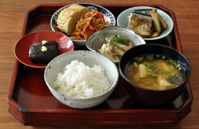
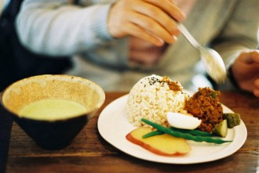

# 白斩鸡

世博会的时候，去了一趟上海，本来说要去世博园转转，却实在是苦于在30度的高温天气挤进50万摩肩接踵的人流，只好说不上忍痛的直接放弃了这个行程，改去寻觅上海大街小巷里的小吃。 很早就听土生土长的上海人说过，有一家在黄河路上有家名为“小绍兴”的白斩鸡店十分出名，既然已经听说了，像我这样耽于美味之人于情于理都不能错过，就兴冲冲的一个人摸了过去，到了店门口一看还真是吓了一跳，人气很旺，远没到饭点却还是十分火爆，很大的厅用8人坐的黄色板材桌椅，挤得满满堂堂的，全部坐满了相互拼桌的饕客。寻么了半个小时，饥肠咕噜的我才勉强找到个位子，买了半份白斩鸡，一碗滑鸡粥和一杯店内自磨的豆浆。半分钟不到，东西就跟着一小碟姜丝米醋一起端了上来。 鸡的味道不错，也很嫩，陪着老醋和姜丝吃，颇有几分生鲜的味道。但，明显是大锅炮制的，应该也是做好了等着客人点了好端出来，所以料酒的味道浸在鸡肉里，盖过了鸡肉本身的香味，不沾着调料吃就有些逊色，酒味儿甚至有点熏鼻子。至于粥的味道，除了烫，米的口感因为熬的时间太长大打折扣，其他的，就记不得了。

之后也就是相隔半年的时间，又得机会在北京一家名流云集的饭店里吃到了传说中的三皇走地鸡，陪着八小碟八大碟酸甜咸辣海鲜沙茶林林总总的调味料，切得一样大小配着装饰用的兰花装在镶了金边的盘子里，这么一弄，白斩鸡就不像是白斩鸡了，努力佯装成了什么更高贵的物什。像是农民穿上龙袍，倒不如简简单单的棉布衣裳舒服耐看。不过，刨去这些做作的部分不提，鸡的味道却也还是不错的，五谷杂粮喂出来的，和饲料喂出来的鸡到底是有些不同，肉嫩有嚼劲，没有普通肉的腥气，还是应该为此浮一大白。

不过，如此这般这般如此，都比不过幼时过年在外婆家吃到的，她“监制”的家乡味道。

外婆家在江南一个小城市，离以火腿出名的铁路城市相距不远，一座古城，中部正好被一条几百米的所谓兰江贯穿而过，兰江水并不湍急，很干净，缓缓地，一点也不像是松花江的支流，不紧不慢，就像这座城市一样，慵懒却绝不性感，温和淡定，有点竹林人家，袅袅烟火的味道。 那时，兰江水位比现在高出不少，而足可以载入史册的防洪工程亦还未在全国如火如荼的开展，所以每每一到梅雨时节，城里少不了的就是会发个一两次大水。每次快到这样的时候，外婆就赶紧把要紧的东西搬到几乎顶着屋顶的楠木大柜子上，以防那些个怕水的贵重家伙什被水淹着。果真到大水来了，外婆就汲着拖鞋噼噼啪啪赶快跑进小院，抱起院子里水池下面那个自制“鸡圈”里面的两只公鸡，跑到二楼的人家去“避难”。

二楼住的是一对夫妇，四十岁不到，没有孩子，人都善良而普通。 也许也是有点寂寞吧，夫妇两人每次看见外婆去了，总是端茶倒水拿出干果，招呼外婆坐下，然后三个人就边喝茶边吃零食，一起聊天能一直聊到大水退下去。

每次的对话都是这样：

“阿婆啊，侬的鸡怎么还没吃呢？好大了哦，开始浪费粮食了。”

“我外孙囡囡没回来呢。”

“回来去买外面的哦。这个吃了伐。小米又贵了几毛钱了喂。”

“外面的哪有我的公鸡好哦。”

外婆的屋子都是有点潮湿的。有的角落里长着青霉，颇有几分野草的气质，就是清理的，也总能春风吹又生。不过，养在院子里的鸡却总是被细心照料的，干燥，清洁，食物充沛的长大，等到过年，让宿命的宰鸡刀霍霍而来。

儿时，父母亲都在外谋生，只有过年过节才能抽出那么几天忙里偷闲，带着我回趟老家。去看看外婆，过个团圆年。

南方的冬天的冷比起北方也是不逊色的，甚至更胜一筹。那种属于沿江小城的氤氲总是潮湿而让人无法遁形。那时，家里没有空调，电暖气也不是寻常物件，所以，屋里屋外温度永远都是一样的，冻进人的骨头里。儿时过年在老家，母亲总会为我套上厚厚的棉衣，裹得像个粽子，每天几乎都被白天晒了很久带着阳光味道的厚实缎面儿棉被裹成蚕蛹状方能入睡。

冷归冷，老家的乐趣却也是不乏的。小城市里的空气清新，外婆家的小院子里还烧着做水用的小煤炉子，一直放着蜂窝煤，不时蹦出噼里啪啦的火星子。外婆很疼我，总会带着我四处兜兜转转，连买菜都带着我去，看见街坊四邻了就会眯缝着眼睛笑着介绍，这是顶顶有出息的外孙囡囡回来了。不用我开口，外婆也总会给我买些好吃的，街边用白糖和糯米蒸的白花花甜丝丝的糖糕，黏黏的有点粘牙，还很有嚼头；一层一层酥脆的油酥饼，里面放了梅干菜和肥肉，又脆又香；还有浅底敞口的瓷碗装的水晶粉，像凉粉一样却更透明晶莹，放了绵白糖和醋用勺子挖着吃。路边有些竹竿撑起来的棚子，用大块大块的石砖砌起纯天然的炉灶来，好一点的通了天然气，没那么发达的，便直接烧柴火，咕嘟咕嘟的煮着糯米和紫米混合的甜粥，从很远的地方，就能闻见锅里飘出来扑鼻的只属于米面的清香。

不过，这些虽然都是让儿时的我开心不已，但最期待难忘的，还是大年三十儿那个晚上的年夜饭。一个旧时时兴的圆形折叠桌，放在中厅里，满满当当的，坐不下许多人，却神奇的可以摆那样多的菜，多到让人眼花缭乱，翠绿的青椒，暗绿的雪里红，白色的年糕，泛着点油光红彤彤的红烧肉……每一样，我都爱吃，但也都是浅尝辄止，因为一般这个时候，外婆的白斩鸡，还没上桌呢。

每年，只要我们一回外婆家，约莫就是二十九、三十的时候，外婆就会开始嚷嚷着让舅舅把她养了一年的公鸡杀了，过水，剃毛，然后也不知道经过什么我这个黄口小儿不知道的奇妙步骤，就变成了一碟子带着骨头切好了的鸡肉。粉嫩粉嫩的，像刚落还没沾到泥的桃花瓣的颜色。 然后用厨房里那口手柄已经抹掉了全部油漆颜色锅底怎么刷都泛着铁锈的大铁锅在明火上烧热了，倒上水，盖上半人高的大盖子，咕嘟咕嘟烧。一会，从锅盖延就开始往外冒白气了，这时候，就是水烧开了。接着，外婆就一股脑把所有的鸡肉倒进锅里去，这时，她也不能放松，因为时不时的，她都要开盖子瞅两眼，捞一捞血沫子，监视一下，鸡的状况。 

小时候不懂事，自然觉得这过程没什么奇怪，直到大了才知道，就这个煮白斩鸡，学问可大了去了。火候小了，肉还没熟，一口咬下去肉里还往外飙血，自然不能吃；煮过了头，肉又老了，咬不动还塞牙，更不好吃。所以，要煮的刚刚好，骨头里还有些微红，肉嫩却不生，鸡皮带着嚼劲却没有肉腥味，才是真功夫。 每年这过程总是外婆亲自操刀，哪怕到了现在，外婆已经是耄耋之年，别的煎炒烹炸的事情都交给了几个舅舅舅妈和母亲，但这煮白斩鸡的活，却还是外婆在做。

所谓：冰肌自是生来瘦，那更分飞后。对苏轼，是说虞美人，对我却是恰好描述白斩鸡的句子。那煮好的鸡肉，嫩白，白玉比之差了一分白，面粉比了又没那么又生气。反正就是恰到好处。刚煮好的鸡，外婆总是盛在家里搪得很薄的瓷碟子里放在窗户底下晾凉，门外是经年绿色的松树，一点点白衬着成片的绿，是我儿时记忆里美妙的画面。

再后来，就是给放凉了煮好的鸡块调调味道。没有什么特别，无非是简单的淋上酱油和醋搅匀的汁点上麻油而已。 但，肉不老不生，酱汁因为加了老醋并不算很咸，却带着南方酱油的鲜味，没有味精，盐巴一类颗粒状的调味品，所以，口感从始至终都是鸡肉丝=一条一条的这一种。就着半盘外婆的白斩鸡，那时候身量还够不到桌子的我，可以消耗两碗白米饭。

每年过年，就那么两天，那么两只花毛红冠子大公鸡，总让我吃得满嘴满手都是酱汁，像上战场一样，和几个哥哥们乱抢一气，甚至不惜用假哭威胁，竹筷子就是武器，上下纷飞，飞刀，剑法不一而全，也就是为了那么一两块鸡肉而已。

那日和朋友聊天，说起，她们家乡那边白斩鸡的做法，却是典型的重庆口味，精致香辣，调料繁多，听着就有种大汗漓淋的快感：

先是用料酒把鸡烧过，有点焦味，肉却绝对没糊没硬，伴着葱姜蒜煮熟了，再淋上酱油，醋，白糖，用干辣椒炸出极香的辣椒油和绍兴酒，加上点切碎的葱姜蒜一起放进盘子里。香辣，清爽，浓厚味醇。

听着很过瘾，却总觉得比之外婆的白斩鸡，还是少了几分清香，干净的真味。就所谓白斩鸡，就是肉白而滑嫩，趁着酱油依附于表面，还没渗进内里，用竹筷子夹了囫囵吃进去。干净的味道，却回味无穷。

不过，后来，因为搬了楼房，外婆也没法再自己养鸡，外面的鸡总是肥厚油多，而买回来酱油也多了几份化学添加剂的味道，虽然还是好吃的。但总是笑眯眯的外婆也时常没办法的尝尝自己煮出的白斩鸡，咂咂嘴，唠叨两句：“可惜了了，可惜了了。”

之后也就很少做了。

（采编：佛冉，责编：佛冉 ）

[【舌尖上的记忆】江湖厨房](/archives/39213)——食物和武功总是能让人热血沸腾，刀光剑影里的美食美酒实在让人神往不已，作者笔法风流，讲故事娓娓道来，案板之上，功夫不到家，可如何是好。

[【舌尖上的记忆】说年糕](/archives/39240)——在家乡宁波，年糕实在是一种寻常食物，并不金贵。然而，思乡的情绪最早体现在味蕾上，即使是当时觉得不那么好吃的年糕。有些食物，有了距离感，就变得好吃起来。

[【舌尖上的记忆】说粽子](/archives/39371)——粽子有甜咸之争，有圆头方头之区别，可这些对于一个吃货来说，这些自然是无暇顾及的。
