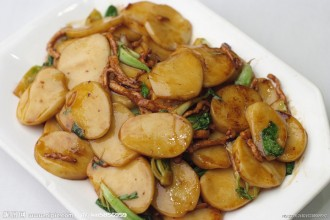

# 说年糕

《三联生活周刊》赶在过年前出过一期年货特刊，我是很早就看到的，不过因为在家过年的缘故，买本杂志反而没有在学校里方便。前几天到美术馆看完画，顺道到旁边的三联总店找到了过刊，不打折，但是还是买下了。

吸引我的是里面一篇写慈城年糕的文章，说慈城水磨年糕，就是说宁波年糕，慈城年糕是宁波年糕的代表。慈城，顾名思义，原本是慈溪县的县城，如今早划归了江北区。好多年前，慈城刚刚经历过一轮旅游开发后，我还去过这个古镇。说它古，并不见得想象中的古色古香，不过有别于其他更为出名的古镇，几年前的慈城还是一个有寻常人住的地方，并非彻底被改造成一个围起来买门票的旅游区。

年糕是宁波人的寻常食品，不夸张地说，吃年糕像是北方人吃饺子，也是每年入冬时候的保留项目。不过身处鱼米之乡的人们，对食物没有那种特别执着的虔诚。每年春晚主持人说到一家人围在一起吃饺子的时候，江南人多半呵呵一笑，一是因为国家电视台的地域偏见，二是因为，“吃饺子”也不过是一种吃而已，有必要如此仪式感么？

其实年糕本来不是我特别喜欢的食物，因为它并不金贵，实在是一种寻常特产。每年入冬，家人买来的年糕，一条条交叉堆垒起来，变成一个小方块，有时还放在水缸里，为的是避免干裂。我家吃年糕，图的也是省事，从地里割几片菜叶，煮一锅年糕汤就成了当天的中饭。这样吃的年糕，白白净净，不过没有多少油水，远远不如各色海味好吃。

思乡的情绪最早体现在味蕾上，即使是当时我觉得并不那么好吃的年糕。到了北京，年糕就成为了一件稀罕物事，偶尔能够见到打着年糕名字的菜色，却经常冠以“韩式”字样。我不知道朝鲜人的日常生活中年糕是什么地位，不过至少从形状来看，他们卷成圆柱形状的年糕和宁波人一条一条并切片食用的年糕很不一样。何况，外面的年糕都用糯米做，只有宁波年糕，其实是用大米做。

偶尔找到卖售年糕的店家，我常常就毫不犹豫地变成回头客。有段时间在对外经贸大学对面一条巷子里的一家杂志社帮忙做事，做了没多久，一个重大发现是相邻巷子的小吃街有一家卖肉丝炒年糕的杭州小笼包店。店很小，四五张折叠桌，不过炒出来的年糕确是地道的家乡味道，有肉丝和鸡蛋，也一扫我对年糕汤清淡的不良印象。

后来我曾经推荐过北大西门畅春园食街的没名儿生煎，说那边的生煎和小笼包好吃。不过，我现在越来越多吃他家的肉丝炒年糕。这学期在清华有一堂课要上，骑车回学校，路过颐和园路，晚饭常常是一碗肉丝炒年糕。没名儿生煎的肉丝炒年糕舍得放肉，常常是年糕吃完了，肉还有小半盘。年糕是素净之物，有点油腥，未尝不是坏事。

其实年糕有好多吃法，较为奢侈的是跟螃蟹一起炒。不过私下认为，跟螃蟹一起炒的年糕，年糕反而显得变成了一种铺垫，类似于水煮鱼里面的辣椒了。而螃蟹呢，新鲜的毛蟹拿来炒，终究不是上道的吃法。吃螃蟹以清爽利落为上，而炒出来的螃蟹，手又不好抓，筷子也全然排不上用场，最有只能匆匆嚼烂突出带着蟹肉和蟹壳的残渣了事。

肉丝炒年糕是一道主食，冬笋炒年糕就全然是一道菜了。这就是年糕的百搭功能，介于小吃与主食之间的地位，决定其能屈能伸。冬笋在笋类中算得上列入上流社会，和年糕炒在一起，酱汁入味，是很有江南风的菜。这里顺便说说，有人觉得江浙菜一律偏甜，这是一个莫大的误解。传统上苏州一带，做菜爱放糖，尔后苏州人多有迁徙到上海，以至于将甜的饮食哲学辐射到整个江南。不过宁波菜历来是咸鲜为主，谁有可能在海鱼上放糖呢？据说上海人由苏州、宁波两支迁移人群构成，上海菜理应也有宁波人的饮食哲学吧。

没名儿生煎还有拿年糕油炸，我觉得难以下咽。无论是炒，煮，都还是要恪守一点年糕清爽的底线，一拿来油炸，就是一种很粗鲁的吃法了。

有些食物，有了距离感，就变得好吃起来。

2013/6/3

（采编：佛冉，责编：佛冉）

[【舌尖上的记忆】白斩鸡 ——走过万水千山，玉盘珍馐吃遍，都比不过幼时过年在外婆家吃到的，她“监制”的家乡味道。](/archives/39175)

[【舌尖上的记忆】江湖厨房 ——食物和武功总是能让人热血沸腾，刀光剑影里的美食美酒实在让人神往不已，作者笔法风流，讲故事娓娓道来，案板之上，功夫不到家，可如何是好。](/archives/39213)

[【舌尖上的记忆】说粽子——粽子有甜咸之争，有圆头方头之区别，可这些对于一个吃货来说，这些自然是无暇顾及的。](/archives/39371)
