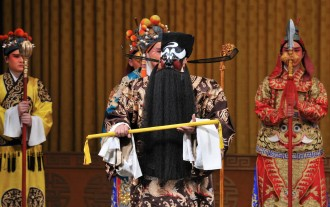
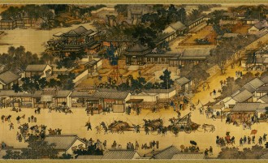
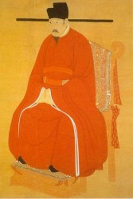

# 打龙袍

宋代的戏，先是柴荣、赵匡胤、郑恩三兄弟的事，严格来说应该归入残唐五代戏。然后就是杨家将，比如《碰碑》、《探母》、《斩子》、《挂帅》。再来便是铡美铡侄——包公戏、浔阳楼野猪林——水浒戏。到了南宋，就是挑滑车八大锤，有关岳王爷的戏了。今番要说一折包公戏《打龙袍》。

《打龙袍》说的是宋仁宗一朝，包拯奉旨陈州放粮，在天齐庙遇乞讨盲妇李氏。李氏自称是当朝天子亲生母亲，并有黄绫诗帕为证。包拯答应代李氏辨明，好让李氏母子相认。包拯回京，借元宵观灯之际，特设灯戏，指出皇帝不孝。仁宗一怒，要斩包拯，幸有老太监陈琳说破当年狸猫换太子之事，才赦免包拯。假太后刘妃自尽，同谋太监郭槐处斩。仁宗迎接李后还朝，李后责仁宗不孝，命包拯责打仁宗。包拯脱下仁宗龙袍，用打龙袍象征打皇帝。全剧以母子相认，包公加官进爵告终。这出戏是裘盛戎、李多奎二先生代表作，花脸饰包拯，老旦饰李后。老旦唱工繁重，尤以“龙车凤辇进皇城”、“一见皇儿跪埃尘”为有名唱段。李多爷的衰音、雌音堪称一绝，只是多爷、李金泉等人之后，男老旦越来越少，现如今绍继李派的名角，基本都为女性，如李鸣岩、蓝文云。天津京剧院有过康万生蓝文云的《打龙袍》、《赤桑镇》，可以一看。

这出戏事关一桩大大有名的公案——狸猫换太子。说白了就是李氏为真宗产子，刘妃用剥皮狸猫调换，诬赖李氏生下妖怪，将太子据为己有。为杀人灭口，火烧冷宫，幸有陈琳相救，李氏逃出一命，才有后来打龙袍的事。这桩公案半真半假，的确宋仁宗为李氏所生，也的确自幼由刘后抚养，但这是其父真宗的决定，并无狸猫情事。宋仁宗也的确不知自己亲生母为李氏，一直尊刘氏为太后，直到刘太后去世，才知晓自己身世。仁宗以为李氏为刘后所害，决定开李氏之棺，同时派兵包围刘后亲族住宅，准备随时拿下。开棺之后，李宸妃遗体由于有水银保护，肤色如生，并非被人害死，冠服、饰物一如皇后规格。说明当初李宸妃并非死于非命，刘太后也确实将宸妃按皇后礼安葬。仁宗看到这一切，大为感慨，遣散士兵，待刘后宗族一如过往。

其实刘太后可没这眼光。李氏一直是个宫女，到临死才有宸妃封号。刘后始终提防李氏，李氏也恭谨小心，不因自己是皇帝之母表现出愤懑不平，才从刘后手中逃过一命。当其大限将至，有的也应该是宽慰，毕竟她的儿子是一位明君，将天下治理得河清海晏。这可能是母亲的共性。李氏去世，刘后准备草草了事，刘后对李氏总有种莫名的妒意，和刘后没有长大成人的孩子有关。知道当年事的宰相吕夷简进言刘后，大致说的是：您百年之后，万一有人说破当年事，皇上一看他亲生母下场这么凄凉，您的家族还有个好么？刘后被一语点醒，将李氏晋为宸妃，以皇后礼安葬。吕夷简的确有先见之明，不然像上文说的，仁宗派兵包围前几天还喊舅舅的刘后家族，如果开棺见自己生母蓬头垢面，纵使仁宗天性慈爱，但母子情深，少不了将刘后家族流放边关。

这刘太后可不是个普通老太太，刘太后名叫刘娥，益州华阳（今四川成都）人。她出身微贱，是个孤女，不得已十来岁就嫁给当地的银匠龚美。龚美走街串巷给人打造银器，她就摇拨浪鼓招揽顾客。雍熙初年，一齐来到了京城。真宗当时封为襄王，他特想娶一个川妹子，龚美因为贫寒正准备把刘娥改嫁，经襄王府给事张耆拉皮条。刘娥一入王府，就大受宠爱，这年她仅十五岁。不想太宗知道这事，即令其子将刘娥逐出王府。这时真宗已割舍不得，便让她寄居在张耆家。太宗去世后，真宗即位，便将刘娥接近后宫，距他二人初次相逢，已经十数年过去了。送老婆的龚美、拉皮条的张耆，也因此官运亨通。真宗对刘娥那可是真爱，数次想立刘娥为后，碍于文官集团，难遂心愿。最后一次，真宗干脆跳过御前讨论，自己去找人草诏，想偷摸把事办了。真宗属意大文豪杨亿草诏，结果杨亿直接驳皇帝面子，官可以不当，这诏书老子可不写。真宗直接怂了，杨爱卿啊别生气嘛，官您继续当，您不乐意写，朕换个人写便是。这段故事，除去感叹真宗对刘娥真是一往情深，就是北宋士大夫地位之高、待遇之好，历朝历代不乏驳皇帝面子的读书人，但多半要付出点代价，像宋朝之样没啥事最不济也就是官不做了领几车绸缎回家钓鱼，那可真少。刘娥总算是当上了皇后，不几年真宗翘辫子，刘娥成为太后。刘太后从底层打拼上来，相当具备政治手腕，重用贤臣，为此后的仁宗盛治打下基础。

狸猫太子宋仁宗，是少见的好皇帝，但他的名声却不大。这和沙文主义教育有关，只有开疆拓土才是好皇帝，不少人中了这种毒。我不否认汉武帝雄才大略，但他好大喜功，老百姓可受够苦了，说句不好听话，那是文景两朝给他打好了基础，他要是第二代或者第三代，未必下场比隋炀帝强。宋仁宗时代，不说第一，也是中国封建王朝前三的盛世。北宋积贫积弱的错误观点，之前写过文章批驳，稍微有点史学常识的人，都不会认为宋朝软弱无能，此处不赘述。

宋仁宗当时是个偶像级的皇帝，在位四十二年。死的时候，讣告传到辽国，乔峰他哥耶律洪基听到消息，居然忍不住痛哭失声，还将当王子时出访北宋仁宗给的御衣葬了个衣冠冢，时不时给仁宗贡点猪头三牲什么的。驾崩之日，连汴京乞丐都纷纷给他烧纸钱，人格魅力之大令人难以想象。仁宗性情宽厚和节俭可能在皇帝中当推独步。仁宗十分勤政，经常加班到半夜，一天肚子实在饿得慌，想喝羊肉汤。但想想还是算了，于是忍着饿把事办完睡觉，皇后一听，哭笑不得：陛下是天下之主，想喝就叫人做呗。仁宗说：老妹咱不能这样，宫中一时随便索取，会让外面看成惯例。我今夜如果吃了羊肉汤，厨下以后就会夜夜宰杀，一年下来，就要数百只。若形成定例，日后宰杀之数更不堪算计。为我一碗饮食，创此恶例，且又伤生害物，于心实在不忍。而且大半夜人都睡了，把一大帮人霍霍起来伺候我一个怪不好意思的，拉倒吧。有年元宵节，仁宗和宫女在宫殿高处看汴京街上的灯会，有个宫女就说了：皇上街上过节好热闹我们这里好冷清啊。仁宗说：就因为我这冷清百姓才能热闹啊。我要天天热闹没事干下个江南啥的，百姓还有好日子过么？

包公没少跟他吵吵。有一次皇帝想给他一个大舅子搞个官做做，被包拯一顿骂，圣人之言祖宗之法大帽子没少扣。说到激愤处，直接走上皇帝办公桌与仁宗面对面交流。《宋史》记载：上以袖拭其面。显然是被包公喷了一脸口水，最后也只好按包大人说的办了。曾经有个成都的老秀才给成都尹写诗煽动他据蜀地称王，被押解汴京，仁宗一看，这老秀才没官做说两句气话呗，算了算了，给个县官当当吧。

仁宗一朝文化繁荣，唐宋八大家宋朝的六位都在仁宗朝登场。晏殊、宋祁、柳永、苏轼都与他有故事，足见是个风雅的皇帝。晏殊是神童，小时候和另外一个姓曹的孩子送进去陪读。小太子总贪玩，晏殊就总劝太子好好学习天天向上，那个姓曹的就想法子教太子一起玩，等到三个孩子都长大了，仁宗却重用晏殊而疏远那个姓曹的。足见仁宗也不是滥好人，谁能用还是心里有数的。

仁宗和宋祁更有一段佳话。一日宋祁逛步行街，赶上宫中仪仗出门蹦跶，结果从这仪仗里传来娇滴滴的呢喃。哇哇，那是小宋学士噻！宋祁循声望去，只见一位宫嫔掀开轿帘，冲他盯着看。二人御沟流红叶，私通款曲，不久宋祁给宫嫔写的诗登上了排行榜。宋仁宗爱好词曲，经常关注汴京各大KTV的排行榜滚动情况，念了念宋祁的词，咋感觉咋不对。于是在后宫排查，那位宫嫔倒也大胆，承认自己爱上别人。仁宗也不生气，决定征求下男方意见。把宋祁叫过来交流一下文学创作，然后猛然问起这事，宋祁想来是吓尿了，说不出话来。仁宗倒觉得好笑，把小宋拉起来淡淡的说，蓬山不远啊，成全了两人。柳永就倒了大霉，高考不中，复读了多少次，还自诩为忍把浮名换了浅斟低唱。后来还是念念不忘，又来考试。仁宗一看，你不是浅斟低唱的挺好么，要这浮名干啥（且去浅斟低唱，何要浮名）？柳永哪想到皇帝也是他的读者，遂完蛋，颇有孟浩然不才明主弃的意味。自称“奉旨填词”，仁宗也不计较，还关照晏殊、宋祁去照顾下柳永。这档子事吧，仁宗的确有点酸，总感觉天下的风流都被柳永占去，自己这个皇帝心里稍稍不平衡。

仁宗治下，文化是发达的，经济是繁荣的，才子是风流的，百姓是幸福的。其经济发展水平达到中国封建王朝高峰，到明朝中叶仍难以逾越。固然是因为宋元末世战乱频仍，破坏生产，但北宋的繁荣，仍可想见。仁宗朝伊洛理学还没发迹，这种繁荣是个性解放、人性自由、人的权利较为得到尊重的繁荣，虽然由于郡县制度的先天不足，各地肯定存在官员仗势欺民的事，但这种繁荣绝非过度损害人权盲目追求效率的繁荣。

史书里的包公完全是高大全，毫无感情，不近人情，也没听说他有什么朋友，总之让人无法亲近喜爱。弹劾宋祁那档子事，简直是无趣无味极了。宋祁是个备极风流的主儿，治蜀之时修唐书，总是燃蜡烛开府门。成都人一看就知道大学士写书呢，都像看神仙似的。有一次凉，让家里的姑娘们给他拿夹衫，结果十几人一人拿来一件，宋祁犯了难，穿她的吧别人不高兴，干脆一件都不穿，回去就感冒，足见其人风流却不下流，是情之所钟，而非欲壑难填。所以包公弹劾宋祁奢侈，着实焚琴煮鹤。宋祁死的时候，成都人民哭成一片，自发哀悼，说明他的奢侈花的不是公款，对百姓还是挺好的。倒是戏里的包公，不管是铡美铡侄，都有过动摇有过忐忑，甚至劝秦香莲和陈世美私了也想找法子免侄子一死。包公也有思想斗争，最后经受住了考验，这才是个有血有肉的人嘛。民间艺人都知道人应该有感情，结果建国之后拍那些个革命题材作品，主人公一水的高大全，但凡高大全没有缺点没有动摇过的，不是机器就是变态，反正不是个人。元代王恽有诗云：惊乌绕匝中庭柏，犹畏霜威不敢栖。狠到这份上，也就过了点。我敬佩他，但实在喜欢不起来他。

话说回来，狸猫换太子《打龙袍》最早见于元杂剧，却在明朝成化年间时兴起来，盖因为成化帝宠爱比自己大十七八岁的万贵妃，搞得后宫无子，生下弘治帝的纪美人也被万贵妃害死。民间说这书编这戏，多半是讽喻成化帝和万贵妃吧。只是当时的宰相，没有吕夷简，都是些纸糊的家伙，譬如首辅万安，除了给皇帝送春宫画，没别的事迹了。

（采编：刘铮；编辑：季节扬；配图：季节扬；责编：刘铮）

[【艺评专题】略说沈从文与汪曾祺](/archives/33560)——汪曾祺比沈从文多了士大夫气，文人气，写得更“雅”，更像文人画，更有人情世故。沈从文是真正的赤子之心，看什么都是小孩子的视角，明澈中有残酷，残酷是因为面对真相时候的心平气和。 [【艺评专题】王小波的不幸](/archives/33899)——迟早有一天，我们都会满足于140字的微杂文，以及《王小波最伤人的89句话》。有一天我们都会死去，追求智慧的道路还会有人在走着。但一想到这些人越来越少且越来越懒，我心里就很害怕。 [【艺评专题】四郎探母](/archives/33838)——佘太君见到杨四郎，哭过之后，并不谈家国天下，而是问他铁镜公主是不是贤惠！这是多么家常的一个问题呢！十五年母子未见，几句家常，便是一辈子难忘的恩情了。想来，那些战火连年的时代，离家索居的儿子，思念起永世不见的母亲来，不正是这样的唱词吗？ 或许有一天，等我们自己白发满头，父母俱往的时候，连这一折《坐宫》，都不忍卒听了。 [【艺评专题】走向不和](/archives/33941)——都说中国人坚忍善良质朴勤恳，我看中国人才最是霸气十足，别的国家建国史里总能找出些妥协、合作的痕迹，我们的开国先贤却非要唯我独尊，通杀全盘。每一次变革总需要血流漂杵、动乱不堪，总会引起国人的咒骂与怨言。 [【艺评专题】老尽少年心，无复相思人](/archives/40982)——成功的房地产商人们，都是当年失败的诗人。要是能够像吴笑宇那样发了财，成了胖子也没啥。就怕成了身无长物的穷人，还肥肠脑满。
