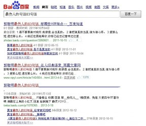

# 王小波的不幸

我本来是很喜欢杂文的，至少在我可以正确区分杂文与散文以后。在此之前，我的印象只有荷塘月、三味书一类的东西。我知道这些东西是好的，因为文句好，虽然有时也很拗口，但看得出作者是咬着牙抠着纸写的，所谓力透纸背。另外感情真挚饱满，这点是毫无疑问的，因为语文课上确实是这么教的，语文老师说朱自清撰写该文时内心是苦闷的，暗示我们阅读的时候要眉头紧锁、面如刀绞，以体会作者的思想感情。然而操作难度太大，我承认自己做不到。当然后来我才明白，做不到和操作难度无关，而和我的情商发育有关。对于情商发育无望而智商亟待发育的人而言，杂文无疑是一种解救，因为它有明明白白的观点和简简单单的论述，非常适合哺育一颗幼嫩的大脑，而不至于太难消化而把肠胃搞瘫。

很多人是因为杂文才认识再而阅读再而喜欢王小波的。这点我是相当的后知后觉。诚然王小波的杂文是不差，因为它比一般的杂文多了几分有趣，又比一般有趣的杂文多了一点脑子。但我至少是在阅读他相当数量的小说以后，才开始接触他的杂文。王小波的作品一般有两种流通形式：全集和选集。最初我买的是选集，五卷本，只有一卷是杂文集，另外四卷均为小说，分别以四个“时代”命名：黄金白银青铜黑铁。这种数量上的对比让我非常直观的认为，王小波是小说家，写小说才是他的专长（这点他在杂文里也有说明），因而杂文只能作为他的随笔，而且杂文这种体裁本身就很随笔化。杂文和小说在王小波的创作里，应当是有主次高下之分的。

博尔赫斯既写小说又写诗，给后世造就了很多难题，譬如他究竟是诗写得更好，还是小说写得更好；抑或者，小说与诗哪一个更能代表博尔赫斯。当然这个问题我没有发言权，因为博尔赫斯我一首诗都没读过。但我读过王小波的小说和杂文，所以自觉有义务厘清一个问题：小说和杂文哪一个更能代表王小波。这个问题有一个显著的特征——无聊，我只是以自己有限的情商猜想，假若王小波知道自己的杂文影响更甚于小说，或许会感到一丝惋惜。

大学以后，我几乎就不读杂文了。委婉地的说，杂文很难满足我这个发育阶段的需要，尤其在青春期已经结尾，智商发育亟待质变，杂文的小打小闹根本无法突破思维的坚冰。换句话说，杂文已经略嫌低智了。杂文是议论的，说理的。当人类思想的理论构建达到一定程度，加上论文这种庞然大物的诞生与日趋成熟，杂文的说理不可避免地的会显得单薄和幼稚，因为它已经无法负载高强度的说理工作，碍于其体裁、篇幅、构架，顶多解决一些理论上的细枝末节，或将庞大的命题与复杂的论证做简化及文学化的处理。当然你可能愿意尝试写一篇一万字的硕士杂文或者十万字的博士杂文，但即便做到了，也依然无法改变，你必须把一半的字数用于对另一半的加工、润色的事实。与其说杂文是说理的，不如说杂文用清淡的说理来加强内容的说服力，以达到观点输出的目的。

文章之于大脑好比食物之于肠胃，而杂文的地位大概就像零食。零食好吃，而且一开吃就停不住嘴，但终究不会有太多的营养，这和杂文的写作者无关，和杂文的形式有关。即便兼通文哲如萨特者，能够在杂文里表达的思想也是有限的。所以萨特写《存在与虚无》，写《恶心》，以哲学家、小说家闻名。单纯以杂文家闻名的作者极少，或者你可以把《忏悔录》之类的当作长篇杂文，但作为神学家的奥古斯丁还是更有名一些。诸如此类的还有梭罗，散文家；富兰克林，资产阶级大代表；鲁迅，战士。

因为李银河的提醒，我特地翻出了《知识分子的不幸》一文，文章提到了“说理”这件事。知识分子以理服人，因此“最怕生活在不理智的时代”，不理智的时代无理可说，有理没地说。即便在小波先生逝世16周年的如今，这种时代性的不理智余温尚在，它既包含了硬性的不理智，即完全的狂热、疯颠，拒绝理智；也包括更广泛存在的、软性的不理智，即把宣传性的、煽动性的内核细心包裹在理智的外衣中，以一种带有“说理气息”的文辞流传于世。这种文章乍看是说理的，但思维的过程已经被巧妙地的掩藏在无数的俏皮、挖苦、类比、煽情之中。作者更多地的以文辞，而非说理，来说服并取悦读者。

写杂文的王小波是实诚的，他从未试图在杂文这种小体裁里表达大思想。因此他的杂文轻盈、朴素，思想刚好注满文章的容器，但从未溢出。他更排斥杂文中过分的修饰，以免欺骗与误导读者的理智。然而，类似的老实杂文已不多见，而今的杂文作者似乎对杂文的撑受力没有任何掌控，把自己关于历史、社会、政治的所有成熟不成熟的思想一股脑倾注到这种纤薄的文体里，并把复杂的说理过程替换成看似玄奥的警句或者富于煽动性的呼告。他们或者以为自己有寓言家的笔力，实际上却造早就了大量不堪重负的长篇杂文、长篇政论杂文、长篇历史杂文、长篇时评杂文……当杂文终于被臃肿的思想撑破，流出来的便只有腐臭和恶意了。

显然王小波需要一个更大的容器来装载自己的思想，所以他把写作的重心转向小说，并留下了丰硕的作品。但不幸在于，这个时代的阅读的风趣。越来越多的人只读王小波的杂文，读完小波读张海鹏（冯唐），读完张海鹏读李海鹏，实在不行李承鹏和韩寒也可以凑数。迟早有一天，我们都会满足于140字的微杂文，以及《王小波最伤人的89句话》。

智慧本身就是好的。有一天我们都会死去，追求智慧的道路还会有人在走着。但一想到这些人越来越少且越来越懒，我心里就很害怕。

(采稿：刘铮；编辑：季节扬；配图：季节扬；责编：刘铮)

[【艺评专题】略说沈从文与汪曾祺](/archives/33560)——汪曾祺比沈从文多了士大夫气，文人气，写得更“雅”，更像文人画，更有人情世故。沈从文是真正的赤子之心，看什么都是小孩子的视角，明澈中有残酷，残酷是因为面对真相时候的心平气和。 [【艺评专题】打龙袍](/archives/33743)——正如列宁称托尔斯泰为“俄国革命的一面镜子”，一切文艺作品都不自觉地折射出了所属时代的某一面。时隔若干世纪，我们又能从《打龙袍》中看出怎样的时代气象与人物风流？ [【艺评专题】四郎探母](/archives/33838)——佘太君见到杨四郎，哭过之后，并不谈家国天下，而是问他铁镜公主是不是贤惠！这是多么家常的一个问题呢！十五年母子未见，几句家常，便是一辈子难忘的恩情了。想来，那些战火连年的时代，离家索居的儿子，思念起永世不见的母亲来，不正是这样的唱词吗？ 或许有一天，等我们自己白发满头，父母俱往的时候，连这一折《坐宫》，都不忍卒听了。 [【艺评专题】走向不和](/archives/33941)——都说中国人坚忍善良质朴勤恳，我看中国人才最是霸气十足，别的国家建国史里总能找出些妥协、合作的痕迹，我们的开国先贤却非要唯我独尊，通杀全盘。每一次变革总需要血流漂杵、动乱不堪，总会引起国人的咒骂与怨言。 [【艺评专题】老尽少年心，无复相思人](/archives/40982)——成功的房地产商人们，都是当年失败的诗人。要是能够像吴笑宇那样发了财，成了胖子也没啥。就怕成了身无长物的穷人，还肥肠脑满。
