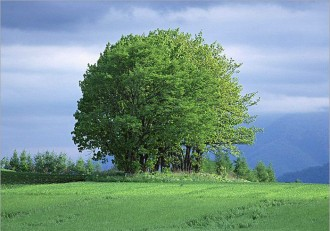

# 略说沈从文与汪曾祺

今天在读黄永玉写的，《比我老的老头儿》，很好看。想想，还看过类似的掌故，是谁写的呢？有章诒和写的，有汪曾祺写的。黄永玉比章诒和写的好，悲伤藏得深，不那么着痕迹，且他写一个人的速写的时候，这篇文章和这个人的风格便很合。写张乐平的时候幽默，写沈从文的时候素朴，写钱钟书的时候富雅趣，真是难得。他的文笔颇不错，取舍去留都有道。

黄永玉是沈从文的表侄，他的父亲是沈从文的表兄，和沈老关系很好，因此看他写沈从文，比很多只能从故纸堆里勾勒沈从文形象的人要生动很多。读着沈从文，便想起他的学生汪曾祺，一时兴起，便想写写两人的风格比较。

虽然我读沈从文读的很少，仅限于一些散文《边城》愣是没读下去，但是我也觉出了汪曾祺和沈从文之间的异同。

汪曾祺是沈从文的学生，大约有的人乍一开始看俩人的文章，会觉得是同脉，就好像我曾经觉得汪曾祺和孙犁也没有什么不同一样。但是那也有情可原，当时我一个中学生，了不起了算是比同龄人读书略多的中学生，怎么看得懂字里行间的人情世故，人情美乡情美背后没有言说出来的心酸和态度。但是现在却是不同了。

说回汪与沈。汪曾祺比沈从文多了士大夫气，文人气，写得更“雅”，更像文人画，更有人情世故。沈从文是真正的赤子之心，看什么都是小孩子的视角，明澈中有残酷，残酷是因为面对真相时候的心平气和。而汪曾祺不一样，汪曾祺不是小孩子的平视视角，他是俯视的，尽管他俯视得很温柔，他依然是从上往下看人世的。对于他笔下形形色色的人，天真的，善良的，虚伪的，不幸的人，他下笔柔慈，但是有态度，这个态度是与他文人的气质和身份相联系的。

但是又不是说沈从文天真不通世故。的确，在日常生活中的做人上，沈从文就是一个天真的，不通世事的会写文章的人，而汪曾祺的人情世故要炼达得多，更懂得保护自己。这个自保不是很庸俗地保护自己不受到身体或者外部的伤害，更包括保护自己的心灵、精神、才华。在动荡黑暗的年代里，怎么能够保住自己的道德底线，怎么能够保护自己的人格健全，怎么能够爱惜羽毛、珍视才华，都是学问。汪曾祺做的很好，所以才能在十年动乱后枇杷晚翠，大器晚成，以一手温雅清新的短篇小说惊艳文坛。

可是我觉得每个好作家，都是懂人情世故的。他们能写出那样的好作品，就说明他们有过人的敏感和观察力，至于现实生活中愿不愿意做又是另一回事了。像林黛玉那样是爱惜羽毛，珍视格调，懂世故不愿弄世故，认为那样降低了自己做人的境界。而像钱钟书伍尔夫这样的，是爱惜精力，他们真的是以有限的精力投入到无限的文艺创作中去。而像沈从文先生，他是真正的心知肚明而温柔敦厚。记得看黄永玉的书里有这样一个片段，黄永玉是沈从文的表侄，有天去沈从文家看他，正好有一个青年也在看沈从文，这青年行为举止大喇喇的，很粗鲁，说话的口气还居高临下的，走之前连道别都不会说就扬长而去。黄永玉说自己从没见过这样的人，当时心里很气，觉得应该给这样的人一点批评教训。而沈从文说的是，“他是来看我的，是真心来的。家教不好，心好！莫怪莫怪！”当时看到这里，真的感慨这就是人格修养。

********

我觉得沈从文和汪曾祺的差距（此处差距非指水平高低，仅指风格相异），与其说是性格不同，倒毋宁说是出身不同带来的影响更大一点。说到性格，俩人都是敦厚里有倔强的个性，只是汪曾祺的性格似乎更柔慈一些，这也影响到了他写小说注定不能写出通透的黑暗与淋漓的恶，他只能写参差的美丑，用讽刺而温和的口味暗点出人性的恶。这两种风格也无谓优劣，只是说性格的确影响创作风格。

虽然俩人都是小城长大，但是高邮和凤凰，江苏和湘西，成长环境可实在是太不同了。高邮算是江南小城，自古便是经济文化都繁荣的地域。汪曾祺是什么生长环境？从小就是家庭宽裕，精神生活也宽裕。练字练的都是桐城派的文章，上初一就咿咿呀呀地跟着父亲熏陶着学昆曲。后来上西南联大，中外文学都读，二十出头便尝试用意识流等外国新小说方式搞文学创作。这样的环境下成长出来的汪曾祺，文字之外，好花鸟，好书画，爱金石，爱曲艺，爱民俗，写俗也是用雅洗练过一遍。他的爱好，全是旧时散淡文人会用以遣兴的东西。

再观沈从文，虽然沈从文是汪曾祺的大学老师，汪曾祺的小说启蒙还是打他这儿来的，但是论到小时候的精神文化环境，那可是大不一样。湘西也是南方，但是南方与南方不一样。湘西出土匪，骨子里有汉文化主流之外的野性与匪气，而江南，则是汉文化的精华所在，骨子里是俊逸风流，温柔敦厚，文明化程度已经非常成熟。沈从文家人不是文化之家，他小时候也不爱读书，更喜欢与大自然打交道，也喜欢上街。汪曾祺也爱上街。汪曾祺上街，看的是市井繁华，看的是手艺人如何做活，这些细致的观察，都化为了《鸡鸭名家》、《侯银匠》等篇目中细腻的描写。而沈从文上街，看的是大家聚众打架，聚众砍头。我至今记得我当时第一次读到沈从文写他看人被砍头时候的感受，非常平静，非常客观，就写，一个头掉下来，又一个头掉下来，倒是让没有亲眼目睹砍头的我，被他的描述看得全身一寒。

汪曾祺的求学之路很正统，上完私塾上中学，上完中学上西南联大念中文，他受到的文化教育很完整。因此虽然他也爱俗文学，爱风土民俗，他这个教育背景就决定了他的视角，和初中没毕业就出来闯生活的沈从文，非常不一样。

我是更偏爱汪曾祺的风格的，因为和我自己的性格爱好更相近。对沈从文，包括对很多类似的，有生命原初张力和野性的艺术家，我会被他们惊艳，但是心里终归是暗暗畏惧。我不大喜欢失控的力量，倒是喜欢牵制的平衡；我不大欣赏大悲大喜的古典哀歌，倒是中意成熟的人情社会中的世故与牵缠；大红大绿让我心中一颤，但是桃红葱绿的参差照应倒是与我的个性更为相得。

但是对于天真的人，我始终心存敬意。敬他们在主流的文化之外，开辟出新的天地，种出新的奇花异树，开拓了新的可能性。

****

（采稿：刘铮；编辑：季节扬；配图：季节扬；责编：刘铮）

[【艺评专题】打龙袍](/archives/33743)——正如列宁称托尔斯泰为“俄国革命的一面镜子”，一切文艺作品都不自觉地折射出了所属时代的某一面。时隔若干世纪，我们又能从《打龙袍》中看出怎样的时代气象与人物风流？

[【艺评专题】王小波的不幸](/archives/33899)——迟早有一天，我们都会满足于140字的微杂文，以及《王小波最伤人的89句话》。有一天我们都会死去，追求智慧的道路还会有人在走着。但一想到这些人越来越少且越来越懒，我心里就很害怕。

[【艺评专题】四郎探母](/archives/33838)——佘太君见到杨四郎，哭过之后，并不谈家国天下，而是问他铁镜公主是不是贤惠！这是多么家常的一个问题呢！十五年母子未见，几句家常，便是一辈子难忘的恩情了。想来，那些战火连年的时代，离家索居的儿子，思念起永世不见的母亲来，不正是这样的唱词吗？ 或许有一天，等我们自己白发满头，父母俱往的时候，连这一折《坐宫》，都不忍卒听了。

[【艺评专题】走向不和](/archives/33941)——都说中国人坚忍善良质朴勤恳，我看中国人才最是霸气十足，别的国家建国史里总能找出些妥协、合作的痕迹，我们的开国先贤却非要唯我独尊，通杀全盘。每一次变革总需要血流漂杵、动乱不堪，总会引起国人的咒骂与怨言。

[【艺评专题】老尽少年心，无复相思人](/archives/40982)——成功的房地产商人们，都是当年失败的诗人。要是能够像吴笑宇那样发了财，成了胖子也没啥。就怕成了身无长物的穷人，还肥肠脑满。
