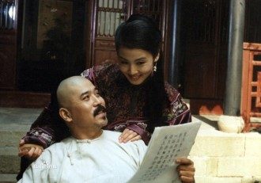
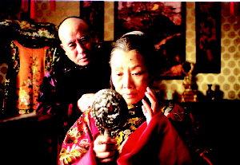
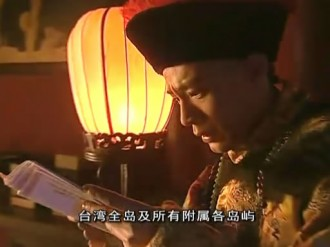
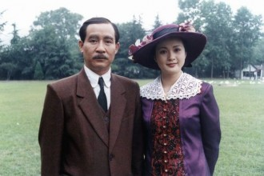

# 走向不和

断续将《走向共和》海外版重温了一遍，依然震撼于此作的精致与磅礴。推轩而望，夜色下是灯红酒绿五彩斑斓，联想起百年前这片土地上的寥落浮沉、离合悲欢，不禁狐疑两者是否同属于一个民族的故事。

煌煌大剧，慨当以慷如黄钟大吕，矫夭飘然若天外游龙。这样一部剧作，原本任何绮丽或古奥的文字都不足以贴切形容之。但翻来覆去把这六十八集剧作观赏了两遍，又挑拣着读了些相关史作，清末民初的帝王将相们，开始在眼前走马灯似的轮转，其貌其状，其行其言，总像是复现于身边般挥之不去。胸中既有块垒万千，似是应当留下一些文字，也算是给自己交的一份作业了。

若要谈议《走向共和》，很容易便会延伸到政治、社会中去，这无疑不是一件知趣的事情。更何况，现实总要比文艺作品更来得波谲云诡。因此，此文只谈影剧，兼论历史，至于政治，似乎怎么谈都还是扯淡扯谈。

【李鸿章】

李鸿章，一个用生命卖国的男人。

百十年来，李鸿章死死地与“卖国贼”这个标签黏在一起，黏得血肉模糊，撕也撕不开。《走向共和》索性把水搅浑，在“卖国”标签下新添了一笔“爱国”，揉搓出一个爱国的卖国者形象，可谓古今无双。儒家士大夫终身奉行者不过四字：修、齐、治、平。由于体制的偏狭，“修齐”与“治平”之间产生了断裂的鸿沟——修自身易，修官身难。李鸿章纵使拥有至高的智慧和理想，却只能拱手将两者双双敬奉在清廷的祭坛上，然后，孤身行往名为“卖国”的天堑，以身殉道。

与这样一位颇具理想主义气息的悲剧英雄相比，翁同龢、徐桐等一干老朽更显得颟顸可鄙。他们在剧中所起到的功能，仅仅是身体力行地警示着我们：一个老成谋国、忍辱负重的卖国者，要远远胜过一群摇唇鼓舌、乌烟瘴气的爱国者。

显而易见，编剧与导演在李鸿章身上投射了十足的感情，将其塑造成政治与人格的完人。本片的许多理念与精神，均借由这位年逾古稀的老叟之口，铿锵有力地吐了出来。朝野指责他培植私人势力、揽权自重，他坦然陈述着自己用人唯亲的理由，陈述得正气凛然；梁启超劝他起兵革命、再造乾坤，他率然回复“一代人只能做一代人的事”，把大才子噎得无话可说；盛宣怀拍他马屁，赞他雷霆雨露、恩威并加，他竟又心血来潮论起自我节制权力欲的重要性。这样一位神奇雄豪的政治家，书中少有，人间绝无。

当然，最出彩的无疑是谈判桌上的李鸿章。即便大清国的国际形象已经臭翻了天，每次都要砸锅卖铁“结与国之欢心”；即便满堂豺虎嚣张嘶吼，对着丰饶富丽的中国垂涎三尺，李鸿章却总能保持着东方古国独有的淡然气度，娓娓推谈，在张与弛之间游刃有余。群兽翻腾，座首老者却仿佛云中仙鹤，矫然不群。委实不可思议，一场屈辱求和的城下之盟，居然也能演绎得如此荡气回肠。

这不是中国人关起门来在自己的文艺作品中大加意淫，而是史有其事。近代史学泰斗唐德刚曾有评述：中国自有外交以来，出现过两个半外交家，一个是李鸿章，一个是周恩来，半个是顾维钧。李中堂纵横捭阖之术，可见一斑。

李鸿章同洋人的最后一战，是与八国联军签署《辛丑条约》。偌大的北京城已被八国军队占据，李鸿章奉旨求和，有单刀赴会之危情，却无单刀赴会之豪迈。更何况，此时的他早已风烛残年。衰老在体能上意味着气力的竭尽，在精神上却意味着勘堪透世相的深沉。李鸿章艰难争得生命的最后一刻隙罅，在杀气腾腾的外夷、养尊处优的权贵面前，激昂而语：“我大清国民，连活着都不怕，还怕死吗？！”——语含悲烈，掷地有声，声可绕梁，声可裂帛。 

总之，这样的李鸿章俨然已成为诸葛亮式的神人，剧中也时常拿他与孔明相提并论。然而他并没有诸葛亮那样呼风唤雨的通天本领，他拥有的，只有他的老师曾国藩遗留给他的“忍经”——人生不如意事十有八九，千难万难，只有付之一忍。李鸿章能征善战，熟稔洋务，有识人之明，有识势之能，然其平生所做最多之事，只有无可奈何地叹息，叹息自己的无可奈何。就像宵小如李莲英倾轧于他，小人如袁世凯背叛于他，他，一个饱经世事消磨的老人，唯有隐忍不语。

正因为这一份艰难，才将李鸿章的荧幕形象烘托得的更为悲情。同为智者，李鸿章反倒比诸葛亮更易赢取观者的好感。左有贵胄掣肘，右有清流物议，上有朝廷猜防，下有士子鼓噪。饶是李中堂长袖善舞，也难免左支右绌。李鸿章的为难，完全体现了一个体制内开明派官员的困境。这多少有一些影射的意味——但在更大程度上还是寄托了中国人所幻想的父母官形象：威严可畏，和善可亲，上思国恩、下忧黎庶。即便是小节有亏，只要于国家于黎民有大功德，那也足以被供奉到祠堂里，去受万世香火了。

身居庙堂，危乎高哉。李鸿章在剧中第一次入宫奏对时，恰逢阎敬铭凄惨离职，他神情凛然地扶了一下自己的冠冕。画面在这一刻定格了，一切悲剧仿佛在预先便已设定好，只等着李鸿章扣动其中的枢纽，然后如履薄冰地赴死。悠悠苍天，曷其有极？即便魂归天外，也干系着百年大计和千载骂名。这一份承受，对于李鸿章来说未免太沉重了。

伏念臣受知最早，荣恩最深，每念时局艰危，不敢自称衰痛。如今銮驾未归，根本之计，处处可虞。窃念多难兴邦，殷忧启圣。臣敢请太后皇上举行新政，再图自强。直隶乃诸疆之本，北洋乃臣所手创，臣荐袁世凯正式接任臣职，臣在九泉，庶无遗憾。”

面对这道寓意复杂的遗疏，慈禧顿足大恸。后之览者，亦不禁悲从中来。凄凉的旋律奏响，世间再无李鸿章。

《走向共和》难说没有矫枉过正之嫌，却多少让我们窥探到一代“汉奸”五味杂陈的心情。历史上的李鸿章自然没有这般高风亮节，与俄国的黑历史至今不清不楚，甚至还被考证出有过废清自立的心思，但其劳苦功高却是不言而喻的。马关条约时，李鸿章左颊中枪，性命垂危，却不愿即刻接受手术，反而以命相胁要求日本放低赔偿的标准。比起《走向共和》中哀语恳求的李鸿章，这样的李鸿章无疑更胜一份壮怀激烈。

剧中反复提到过李鸿章少年得志时所作的一首诗：“丈夫只手把吴钩，意气高于百尺楼。一万年来谁著史，八千里外觅封侯。”凌云豪情，溢于言表，甚至让伊藤博文、袁世凯等世之枭雄都心折不已。殊不知李鸿章赴北京与八国联军谈判前，亦留有相似的遗作，这却更像是中堂一生写照：

_劳劳车马未离鞍，临事方知一死难。_

_三百年来伤国步，八千里外吊民残。_

_秋风宝剑孤臣泪，落日旌旗大将坛；_

_海外尘氛犹未息，诸君莫作等闲看。_

一万年来谁著史，八千里外觅封侯。三百年来伤国步，八千里外吊民残。李鸿章的后半生走得诚惶诚恐战战兢兢。他本是纵横疆场的一代儒将，却被当做至死都在卖国的权奸载入史册，遗臭万年。生不得其时，死不得其所，百年之下，骂名犹存。这不禁让人想起辛弃疾那半阙豪烈无双的《贺新郎》，仿佛是送别这位老者的挽歌：

_将军百战身名裂，向河梁，回头万里，故人长绝。_

_易水萧萧西风冷，满座衣冠似雪，正壮士悲歌未彻。_

_啼鸟还知如许恨，料不啼清泪长啼血。谁共我，醉明月？_

嗟乎李鸿章！

【袁世凯】

从李鸿章到荣禄再到袁世凯，三代国相心传，终究变了质。袁氏窃国，袁氏当国，他所开启的三十七年中华民国，誉满天下、谤亦随之。

自古为臣殊不易。李鸿章被清廷当做丢车保帅的弃子，成了个屈辱条约签订专业户；荣禄也被发配到过大西北几十年暗无天日；袁世凯则有五次迭逢大难：朝鲜平乱是第一次，戊戌政变是第二次，厘定新官制第三次，大参案第四次，“足疾未愈”是第五次。每次突如其来的变故，都有点不白之冤的味道，其中一、三次更是朝廷恩将仇报。袁世凯一代枭雄，岂能甘心受此折辱？这几番平白无故的折腾，让他想不谋逆都难。

李鸿章和荣禄恐怕做梦都想不到，那个磕头如捣蒜的袁世凯，会成为袁总理，继而摇身一变成为袁总统，他们本以为自己找的是纸糊匠的接班人，却不料成就了一位封建王朝的掘墓人。同为直隶总督兼北洋大臣，袁世凯比起李鸿章来，少了公忠体国的风骨，多了大开大合的气魄。后者比之前者，在道德人格上或许颇有不如，政治伦理方面却犹有过之。如果曾国藩或李鸿章放胆振臂一呼澄清玉宇，中国近代史必然不会像现在这样写满了血泪和屈辱。

《走向共和》诸人物，编剧无疑是最偏爱袁世凯的。从青楼订情到龙椅泣血，袁世凯这条线的起承转合都相当圆满。而名义上的主角——孙中山，前半段总是出场得莫名其妙，后半段同样时隐时现突兀诡异。从团队阵营来看，袁世凯手下的一干马仔一看就是气度不凡的资深演员，徐世昌、赵秉钧、段祺瑞、杨士琦、张勋就不必说了，连王士珍这样只打了几次酱油的角色，也找了个龙行虎步的壮汉来演。反观孙文身边的黄兴、宋教仁，虽然与历史上真实的形象颇为肖似，但总让人感觉是群众演员，徒具其表，貌合而神离。胡汉民、于右任、居正、章太炎、宋霭龄则直接被删去。至于国母宋庆龄，她还没有那个二逼女记者田沫的戏份多，实在难与袁世凯的红颜知己沈氏分庭抗礼。

尽管在王冰、吕中这些老戏骨面前略嫌单薄，且台词中念得白字太多，孙淳仍是一位不可多得的好演员——前半段唯诺卑贱的样子倒还罢了，有用力太猛之嫌；后半段枭雄末路的悲欢敛尽却着实令人目眩神驰。无论是左右腾挪、毒计百出的奸恶嘴脸，还是为国操劳、呕尽心血的豪杰模样，都是如此的活灵活现，时而令人信以为真。

王冰饰演的李鸿章一死，《走向共和》的戏魂便去了十之五六；吕中饰演的慈禧再死，《走向共和》整体水准已降了一个档次，直到最后几集，袁世凯悍然改立君宪政体时，整个电视剧才回光返照似的再现了点儿昔日余晖，惜乎这时离袁世凯之死已为时无多——终于，孙淳饰演的袁世凯死了，《走向共和》也没有继续看下去的必要了。

袁世凯的很多台词，几乎突破了中国大陆所有电视剧所能达到的最大尺度。比如他对权力不加掩饰的迷恋，对密室政治鞭辟入里的分析，对民主政治的不信任，对孙中山等人革命伟业的非议等等。编剧巧妙地借这个反动角色说出了革命角色不允许说出的话，一语道破官僚政治秘而不宣的运作密码，令人信服地展现了政客应有的豪狠与爽直。

还好袁、孙的政治斗争离我们比较久远，让编剧有了一逞滑头的机会。如果题材放到民国末年，剧本里的蒋介石像袁世凯那样摩挲着自己的光头，大谈我党革命领袖的阴私与狠辣，那么此剧的下场可想而知。

从壮年到晚年，袁世凯在多重磨砺中掌握了举重若轻的诀窍。如果说前半生能保全性命是靠福缘深泽和贵人提携的话，后半生睥睨天下则全然是靠自己挥洒自如的政治手腕。无论是政事还是战事，阴谋还是阳谋，袁总理或袁总统总能用一顿火锅便轻松加以搞定——饭桌上的热气蒸腾氤氲，袁世凯忙不迭地为对方夹着肉菜，嘴里还殷勤地说着体己话。分明是森然叵测的心机，却被火锅蒸气裹上一层豪爽大方。与剧中孙中山装腔作势的洒脱不同，袁世凯的慷慨豪气似乎是浑然天成的，让人想恨也恨不起来。

他是奸贼、是坏人，可他奸得豪迈，坏得英雄，我们就是喜爱他、亲近他，这又有什么办法呢？

袁世凯的爽然快意，至称帝便戛然而止了。之前他也不是没有表现过作为历史巨人的沧桑厚重，比如清帝逊位，他肃容正襟，向溥仪行了最后一次君臣之礼。然而留给观众更多印象的，还是他得意忘形时的翩翩舞步，或是讨好上级时的惺惺作态。袁世凯这个脑满肠肥的胖子，似乎就该是笑容可掬的，油腔滑调的才对。

可自打这个圆滚滚的胖子做了皇帝后，刹那间竟是须鬓染霜，凄惶无限。

从大总统到大皇帝，袁世凯走得荒腔走板，改制称帝更是错着百出。或许是封建官僚出身的他，根本不能理解何谓共和政治。当然，也或许是历经数十年的刀光凛冽，使他对沉疴丛生的中国有了更透彻的看法，而这看法为当时和现世所不容。

在倒数第二集里，袁世凯已成为千夫所指的独夫民贼。他静悄悄坐在龙椅上，关掉了电灯。满室黯淡，四壁寂然，袁世凯抱着自己心爱的女人，孩子般嚎啕大哭。怆然悲凉，无胜于此。第一集袁世凯怀才不遇，只有妓女英子能理解他、支持他；最后的袁世凯英雄末路，竟还是只有妓女英子陪侍在侧。这或许是另一个时代的霸王别姬。

可能是前半生无数次的逢凶化吉，让袁世凯胸臆间鼓荡起了十足的傲气与霸道。也确实如此，李鸿章、慈禧、瞿鸿机这些老狐狸已成过眼云烟，奕劻以及一帮载字辈的纨绔子弟不足一哂，二次革命又把孙文、黄兴驱逐出境，拔剑四顾，天下更无敌手。在收与纵之间权衡了大半生的袁世凯，终于志得意满君临天下。却不料转眼便是众叛亲离，自己当真成了孤家寡人。

不成器的儿子汲汲于太子之位，不惜PS了几张报纸欺父误国；昔日生死与共的旧友徐世昌、唐绍仪则因政见不合，纷纷避而远之；最让人痛心疾首的还是变生肘腋——自己一手调教出来的北洋部将狼心狗肺反咬一口。

编导把所有反水的戏份集中到了段祺瑞一人身上。段原本只是个愣头愣脑的军人，对政事的理解尚不如那个自作聪明的赵秉钧。而到了最后几集里，段祺瑞戾气大作，完全继承了袁世凯阴鸷贪狠的精神遗产，逼宫篡政，“再造共和”。不过在历史上，北洋里率先背叛的倒还不是段祺瑞，而是“北洋狗”冯国璋。“北洋虎”段祺瑞所做的不过是趁人之危、相机要挟而已。更何况还有个叫陈宦的替他们刷新了下限。此君初时涕泗横流跪请袁世凯登基，一看大事不妙就跺脚痛骂袁世凯祸国殃民，翻脸比翻书还快。彼时衰迈卧病的袁世凯，得知此事竟一下子跳下床来，并且气喘如牛、满面通红，悲戚道：“人心大变，乃至是耶！”其愤然欲绝之状，让人思来怃然。

天作孽，犹可为；自作孽，不可活。袁世凯前半生首鼠两端的政治投机，言传身教给了自己的嫡系将领，数十载的反复无常聚积成因果报应反噬一击，令袁公痛穿肺腑。盛气凌人的枭雄，总容易被自己豢养的白眼狼所覆灭。一如曹操培育了司马懿，董卓扶植了吕布，织田信长逼反了明智光秀，丰臣秀吉成就了德川家康。

袁世凯要比王莽更英武，比曹操更成功。可惜锐气太盛，适得其反。千百年来，王莽有人同情，曹操有人翻案，袁世凯获得的却只有鄙夷、奚落与咒骂。他被两党的宣传机器钉在历史的耻辱之柱上，无休无尽地接受着后世意识形态的啄心啮肺、敲骨吸髓。

袁世凯离世之前，却不曾在意过自己的千秋功罪。他念兹在兹的，仍只是身后的天下大事。在最后的时日里，这位病入膏肓的老人，做了许多令人唏嘘的事情。

预感到不久于人世时，他自撰挽联：“为日本去一大敌；看中国再造共和”。袁世凯一死，日本狼子野心再无人可以遏制，中华危矣。

性命垂危时，他召来徐世昌、段祺瑞，交付大总统印，遗嘱传位于黎元洪。从此，中华民国乱象从生，诸镇林立，城头变幻大王旗，民国殆哉。

或许袁世凯早已预见了这一切。史料记载，袁世凯重病卧床时，曾泫然垂泪，仰面长叹：“吾不为帝位惜，吾为天下人心惜耶！”

历经百事，身名俱裂。中国的第一任大总统，中国的最后一任皇帝，身后所余，却只有千载骂名，和百年乱世。

【慈禧】

《走向共和》是一部大老爷们扎堆的戏，男性荷尔蒙磅礴欲出。然而前后勾连、统构全剧的任务，却是由一个异族老太太来担任。这委实是个奇异而又古怪的景象。

揆诸两千五百年的帝王历史，从纵向上比较，叶赫那拉氏也算是一位有为之主了。清王朝传到她手里，早便成了惨不忍睹的烂摊子，内忧外患此起彼伏。在《走向共和》第一集末，第二集初，编剧便迫不及待地表达了自己对这个老人的同情——用凄切的音乐和沉痛的独白，娓娓讲述了治国守业的万钧艰辛。

从辛酉政变算起，慈禧执政有四十八载。四十八年里，大凡是君王能遇到的所有政治困境，慈禧居然一个不落全遇见了。旱灾水灾蝗灾瘟疫就不必提了，单是人祸，就有回变、疆乱、太平军造反、捻子军叛乱、清法战争、清日战争、两次鸦片战争、戊戌政变、庚子拳乱、八国联军侵华，以及革命党十次武装起义等等不一而足。而慈禧竟能神奇地一一化解，还搞出来个浮光掠影的同治中兴，当真是不世出的女中英杰。

无论是历史上的慈禧，还是影剧中的慈禧，都将政治手腕提升到了艺术的境界，也难怪她贪恋权力不肯松手了，这就好比一个天才艺术家难以放弃自己的绝艺一样。擢黜有度，恩威并济，在那个时代，慈禧的帝王之术无人能出其右。尽管她在一定程度上难以摆脱识见浅薄的先天劣势，但她在人事上高度神妙的造诣，足以支撑住老大帝国直至撒手人寰。晚清及至直至民国，称孤称王者多矣，却不见得能有人比得上这个无冕之帝。曾、左、李、张比不得，孙、黄、袁、黎比不得，恭亲王、庆亲王、醇亲王更是比不得。

《走向共和》还阳了慈禧的本来面目——生活中嬉笑随性的老太太，政治上铁腕翻覆的女王。大部分宫廷剧里的慈禧基本上都不成模样，要么仿佛淫乱的母兽一般成日价与面首、宠臣、太监们苟且龌龊，要么仿佛更年期的悍妇一样动不动就要奴才的脑袋。这样的慈禧是明显不能让人信服的，毕竟，即便名声再烂再臭，慈禧总还是个君临天下的女人。

依靠吕中老师出神入化的表演，慈禧变成了一个可爱的人物。她时而肃穆庄重，凛然不可侵；时而撒泼耍赖、诿过他人，让人哭笑不得。其中有一段尤其匪夷所思，就是慈禧仓皇西狩时，和荣禄一边平起平坐吃着饺子，一边大哭大闹暴跳如雷，最后却又破涕为笑娇嗔连连。这一集弥漫着一股诡异的暧昧，后来一查，慈禧和荣禄果然有些街巷传议的桃色绯闻。

除了荣禄，李莲英更与慈禧关系匪浅。这个闻名中外的大太监，深孚慈心，藏身于慈驾之后，一言一行动辄便能左右朝局。剧中的李莲英是一个忠心侍主却不识大体的恶奴，成天只盘算着自己的小九九，无意于国运兴衰。李莲英既做不到魏忠贤那样的大奸大恶，也做不成郑和那样的至功至伟。有慈禧、李鸿章、袁世凯等强人环伺，李莲英只能安心做一个小丑般的配角，待太后老佛爷殡天之后，自己的戏，也当知趣地落幕了。这个被赐予古代俊美男子之名的宦官，便如同观世音身边的童男童女，关公身边的周仓关平一样，生生死死侍奉在垂帘的一侧，陪伴着老太后走入后世形形色色的戏剧、话本之中。这或许亦能从侧面显示慈禧的用人有术了。

当然，慈禧也有她昏聩荒唐的一面，《走向共和》并未隐藏这一面，反而着力突出了它。穷奢极欲、独断专行倒还罢了，慈禧作为庞大帝国的最高元首，却还不知外务，把日本视为蕞尔小邦，把八国列强看成用跳大神的义和团就能轻松扑灭的妖怪，这在日新月异的近代世界是一件要命的事。彼时列强争雄，英、美、德、法、俄、日等国都在励精图治、勇锐革新，唯恐进步稍慢。慈禧——这个受祖宗圣训荼毒太深的皇族老妇，却只求万事稳妥，走一步等两步。稳定压倒一切固然是老成谋国之论，但暮气太重、落后就要挨打更是万世至理。改革太急则乱，改革太缓则亡。

更何况，慈禧还做出了古今中外空前绝后的决策：向全世界宣战。“与其苟且图存、贻羞万古，何若大张挞伐、一决雌雄。”满面惨白的老太婆，一字一顿、凶戾恶毒地宣读出清帝国的最高政策，同时也舒张了胸中积郁已久的忿怨之气。一切显得诡异而又阴沉，这个女人，仿佛已化身为喋喋怪笑的老巫婆，念念有词催动着法力，来迫不及待敲响中国的丧钟。这样丧心病狂的君皇，慈禧之前有很多，慈禧之后仍不少。我很难想象他们大脑的神经构造究竟要怎样迥异于常人，才能做出这种万世惊骇的行为。

辛丑条约之后，慈禧痛定思痛，举行了浩浩荡荡的清季新政。在《走向共和》里，慈禧的幡然醒悟还有两个引子：一是荣禄故意吓唬了她一下，让她以为自己错无可改必死无疑；二是李鸿章死前恳切上奏，劝谏慈禧再举新政以图自强。这一吓一奏，开启了清帝国亡羊补牢的工作。从专制王朝的角度来看，清政府也算走得很远了——各种现代化的工程搞得有模有样，甚至还张罗出了君主立宪。尽管君宪最后被搞成了一出彻头彻尾的闹剧，但那也是慈禧身后之事了。

慈禧的心事，复杂而又深沉。我们难以粗暴地使用“明君”“昏君”二元论来辨别这个女人。比如慈禧在第二集自我辩解的“修园救国论”，我至今都参不透，这一套奇葩却又能自圆其说的理论，究竟是慈禧欲盖弥彰的托辞，还是她真的慈心远虑、时时事事以江山社稷为念？不过从现如今不惜劳民伤财兴办奥运、世博来看，面子工程的道理倒也始终站得住脚。

千秋功罪，任人评说。个人以为，慈禧一生中最失败的决策，是她钦定的接班人政策——国有长君，社稷之福，当时的满清皇室宗亲中也不是没有才具开展的英伟之士。慈禧却为了自己身前事后的利益，指定婴童溥仪继承大统，并让庸庸碌碌的载沣摄政辅国。慈禧是一了百了了，她身后的紫禁城却变得乌烟瘴气——少不更事的小溥仪在金銮殿上大哭大闹， 

隆裕太后和小德张在旁哄着，下面是摄政王顿足捶胸，另外还有一群王公大臣们贪婪地捞着银子。清室的瓤子彻底烂掉了。

再之后，便是武昌一呼，南国百应。两百六十年的大清王朝气数殆尽，意兴阑珊地退出了历史的舞台。而这一切，亦可以说是肇基于慈禧选出溥仪的那一刻。

这是颇值得我们反思的一件事：一个占世界人口四分之一的国家，其兴亡治乱，皆由这个老太婆一念而决，皓发白须、饱读圣贤书的群臣只能毕恭毕敬地遵从着，这实在是极端荒诞的事情。

【光绪】

难以想象，如果戊戌政变成功，光绪从此操持权柄，中国将会变成什么样子。

大概会是如此：康有为如愿以偿成为国师，担任大学士、军机大臣，而且极有可能费尽心机攀到国家首辅。袁世凯政变有功，领直隶总督兼北洋大臣。中央和地方内政尽归康梁一党，军队和疆臣势力则属于北洋六镇。军机四章京晋级成了军机大臣，伊藤博文做了戊戌变法的总顾问。

以康、袁两人的心气品性，断不会和衷共济，反而会围绕权力中枢展开一段殊死搏杀。康胜，则天下事尽归康党，康有为会得意洋洋搬出他那套书生之见，一厢情愿地搞大变、全变、骤变，让本就气息奄奄的中国囫囵着把一剂猛药全吞进去，继而分崩离析、变乱丛生。还有，康有为这个人品低劣之徒会不会效王莽当年故事、僭居帝位，也很不好说。当然，更有可能的是康有为这个政治弱智尚未施展拳脚，便因太过狂妄、眼高手低，被改革的“拦路之虎”一口咬死了。

袁胜，则天下事尽归北洋，这个情况或许还好一些，至少百姓能享几年太平安宁。但光绪必然驾驭不了袁世凯。结局要么是袁世凯挟天子以令诸侯，要么便是袁世凯“迫受”北洋将领兵谏，废帝自立、黄袍加身，洪宪帝制提早数十年。

还有个最糟糕的结局：康、袁相争，日本渔利。老奸巨猾的伊藤博文两相挑拨，促成中国内乱，然后再大举入兵，谋我中华。

幸好戊戌政变流产了，中国不至于步入更坏的境地。而失败者光绪，由于没有机会开展他那愚蠢的宏图，反而在教科书上留下了一个英锐果敢、有志难伸的改革者形象。

光绪是个有为而无道的皇帝，他亲政期间只有过两次重大决策，一是对日战争，二是戊戌变法，两次却皆以惨败告终。不度德，不量力，行事孟浪，行政操切，即便比起慈禧更通外务更懂时事，总的说来还是个沉浸在中二病里不能自拔的衰男罢了。

《走向共和》为光绪掩盖了许多劣迹。比如甲午海战惨败，编剧把矛头更多指向翁同龢这个不顾大局的老匹夫，事实上还是光绪的责任居多；马关条约签订，导演不惜用大篇幅特写表现光绪的沉痛与悲切。然而真实的历史中，彼时的清国原本有实力与日本抗衡到底，朝野也不乏有人主张迁都再战，孱弱怯懦的光绪却一门心思只想停止这场战事（当初也是由他一意孤行启动这场战争），宁肯赔个倾家荡产也要严饬李鸿章尽速签约。

还有那场形同儿戏的戊戌变法，一百多天里，过家家似的颁发二百四十多道改革谕令，要一口气把国家政治体制全部改换门庭——中央的领导班子换了，科举废了，兵制改了。彼时举国上下官员们的反应想必是骇然的。后世史家常常痛心疾首于封建保守势力太强、光绪政令出不了中南海，实际上官员们不是不愿服从皇帝，而是面对这一大堆空中楼阁的国策，根本就无从下手。

所幸慈禧及时踩住了急刹车，软禁住这个不知天高地厚的熊孩子。《走向共和》提出了一个大胆的看法，即戊戌政变始末光绪毫不知情，全是康有为阴谋策划的。我不能认同这一论断。首先，“我自横刀向天笑，去留肝胆两昆仑”已被证实不是伪诗；其次，康有为若无光绪授意，绝不敢胆大妄为向慈禧下手；第三，也是最重要的一点，戊戌政变后，尤其是庚子西狩时，光绪同慈禧有过许多次的接触，前者完全有机会进行自我辩白，而睿智如慈禧也不会查不出事情真相。更何况，倘若不是光绪密令袁世凯兵围颐和园，那袁世凯的告密也谈不上是背叛光绪，至多是背叛谭嗣同、康有为罢了，光绪也不至于至死都对袁世凯恨之入骨。

或许是编导想保留一些人性的温情吧，不愿让我们看到宫廷政治可以让母子之间以命相搏。事实上，不但光绪磨刀霍霍向慈禧，戊戌政变后的慈禧也常常欲置光绪于死地。比如派人送金纽扣暗示光绪吞金自尽，逼光绪猛吞汤圆想将其撑死等等，而光绪之死——已被检测出是砒霜中毒致死——八成也是大限将至的慈禧做的手脚。可到了《走向共和》里，垂死的慈禧还不忘嘱咐隆裕太后保护光绪皇帝，她是真心期冀，自己一手带大的这个养子能够长成为英明神武的帝王。历史与戏剧之间强烈的反差，真相与教科书之间强烈的反差，在这位悲剧帝王身上，投下了深沉的阴影。

_ _

【翁同龢、瞿鸿机】

翁同龢与李鸿章，瞿鸿机与奕劻，甚至是后来的孙中山与袁世凯，仿佛是命运的双生子般，相缠相杀，难以分解。这种戏剧的二元对立结构贯穿始终，通过不同变体展现着同一内核。这是《走向共和》的高明之处，线索明朗，角色清晰。导演张黎后来的《大明王朝》尽管仍保留着《走向共和》的气魄和神韵，惜乎野心太大，线索繁芜、众相杂多，常常一集里乌压压出现一批主角，观众一时之间难以细细品味。

看完《走向共和》前十几集。观众常常会敬慕老成持重的李中堂，憎恶不识大体的翁师傅，这委实是委屈翁师傅了。仅以私德而论，安于清贫的翁同龢要远胜于豪奢享乐的李鸿章。再看公事，翁同龢所长者是教育皇帝（两代帝师）、审理案件（审理杨乃武与小白菜案）、选官用人（举荐张謇、康有为），业务能力并不逊于李鸿章。《走向共和》却只表现翁同龢任户部尚书和总理各国事务衙门大臣时糊涂的一面，使其给人一种泥古不化的腐儒之印象。

尽管编剧一再辩称也展现了翁同龢许多优点，但其一套春秋笔法还是明显有所偏袒。翁师傅清廉、戆直、忠诚，可是他背地里小动作不断，为了扳倒李鸿章不惜动用国本，而且“祜势弄权”、虚伪狭隘、居心叵测。相反，李鸿章尽管贪腐，却是为了使钱打通关节，兴办大事；尽管用人唯亲，却也是为了更方便地开展工作利国利民。编剧每表现翁同龢的优点一次，总会用更大的篇幅展现其斑斑劣迹；每表现李鸿章的缺点一次，也总会不厌其烦地详尽说明中堂是不得已而为之。当然，这么做也无可厚非。一部文艺作品总要有主有次，谁叫翁同龢与李鸿章作对，只能活该倒霉担当反派人物。

比起翁同龢来，我们对瞿鸿机的观感或许会好上很多。这个相貌清癯的老先生，廉洁奉公、朴素低调、严谨缜密，还富有韬略。大参案一击惊天，杀袁倒庆，功败垂成，事了拂衣去，高士之风跃然而出。编剧将其比作黑夜中的一丝烛光，大概是也想为腐败透顶的封建官僚队伍，保留一个道德操守的典范吧。

瞿鸿机当然没有那么完美。他躲在暗处运筹遥控，阻挠袁世凯改制立宪，尽管有防止权奸揽权自肥的用意，但客观上也阻碍了中国前进的步伐，本质属于反动。历史上的瞿鸿机则更平庸一些，不但有吸食鸦片的癖好，嘴上还没个把门的，将大内政闻捅给了报馆（电视剧中则归咎到恽毓鼎身上），最终自取灭亡。

对于角色的塑造，《走向共和》可谓颇费心思，其在历史形象与艺术形象之间精心抉择，呈现出极为微妙的平衡性。除了徐桐、刚毅这些次要角色采取了漫画化的处理方式，其余大多角色都表现出气象万千的立体感。而在立体感之上，又能够清晰地看出编剧对不同人物的感情倾向（孙中山除外，这个角色表现得阴阳怪气扑朔迷离）。比如对李鸿章、慈禧、袁世凯必然是同情的，对康有为、翁同龢、载沣是贬远多于褒。而对于瞿鸿机，则是在含蓄地批评了他的政治理念后，又无以复加地赞颂了他士大夫情怀和个人品德。

【孙中山】

在主流视野的认知里，近现代诸多政治领袖，似乎唯独孙中山尚未走下神坛。

也是，我们需要一位精神领袖，一个能够寄托信仰和宏愿的符号。即便这个领袖也存在一些不清不楚的黑历史。

也许正是这个原因，编导对于孙中山形象的塑造显得含混不清，甚至颇为纠结。整个《走向共和》电视剧里，除了罗文、田沫这一对奇葩外，孙文是最与本剧气质格格不入的角色。初登场与康有为进行政治论辩还好，二杆子似的跑到李鸿章府上吐槽政治制度就显得太过离谱，再后来的壮烈割辫、广州起义、问兄借钱、旧金山募捐，则干脆看不下去了，比革命题材主旋律电视剧还要主旋律。再和清宫戏一加对比，简直就像是两个人拍的。

我弄不清楚编导究竟想把孙中山表现成一个什么样的人物。挥舞手臂模仿旗帜飘扬，摇晃着亲哥哥大喊“快醒醒我的兄弟姐妹们”，是想展现孙文纯真忘我的革命浪漫主义精神吗？但剧中也不乏表现孙中山权谋机算的一面。比如与保皇党论战时期，话剧团表演完革命领袖的伟大事业之后，孙文一脸真诚地倾尽所有财物赠与演员们。我刚在想孙文怎么会如此二逼，孙文接着冲身边马仔说：“把这些人收编到革命队伍里，让他们跟着我干吧。”我了个去，原来是收买人心啊！

饰演孙文的马少骅，据说是全中国容貌最像孙中山的演员。他把青壮时的孙文表演成了一个近乎癫狂的愤青。但这不是演员的问题，是编导对这个人物的定位本身就有很大的偏差。辛亥革命后的孙文则沉稳了许多，不过逢人还总是神经质笑嘻嘻的，且说话时常犯结巴，给人一种虚伪、阴狠的感觉。实际上，历史上的孙文确非良善之辈，革命成功前勾结日本人就不必说了，南北议和后总统之位拱手相让也多半是忌惮北洋六镇的兵锋，待袁氏当了总统后，还总是使出阴损手段给袁世凯使绊子。为达到私人目的，于国民党内部不惜施展独裁铁腕，逼走了黄克强、闹反了陈炯明。还有那位国民党教父宋教仁，究竟惨死于谁人之手，至今无人可解。

本剧隐隐约约暗示了这一点：孙中山最精彩的两次表现，莫过于组建中华革命党时与黄兴的对手戏，这也是剧中孙中山推行集权体制的开始。面对黄兴的义愤填膺，孙中山轻蔑一笑，随即拂袖而去。接下来一集，孙中山要求党员按指印、宣誓效忠，黄兴愤然抗议，孙中山负手踞立，向黄兴厉声咆哮。一身漆黑西装的孙中山，此刻爆发出了领袖群伦的气魄与权威。

孙中山本质上是与袁世凯一样的枭雄，编剧通过后者对前者的评价，旁见侧出式委婉地表达了这一点。其实这也没什么大不了的，在中国能够振臂一呼从者云集的人，多少总会具备些权谋和手腕。倘若孙中山真是一个天真无邪大公无私的理想主义者，那也不可能颠覆清政府、击败袁世凯了。都说中国人坚忍善良质朴勤恳，我看中国人才最是霸气十足，别的国家建国史里总能找出些妥协、合作的痕迹，我们的开国先贤却非要唯我独尊，通杀全盘。

也正因如此，每一次制度的变革总需要血流漂杵、动乱不堪；而每一次变革的成果，又总会引起国人的咒骂与怨言。

有时候我总在琢磨，或许，人们设计出何种制度并非关键，关键的是，设计制度的人，究竟是何等样人。

2013年春分初稿，清明二稿。

（采编：刘铮；配图：季节扬；责编：刘铮）

[【艺评专题】略说沈从文与汪曾祺](/archives/33560)——汪曾祺比沈从文多了士大夫气，文人气，写得更“雅”，更像文人画，更有人情世故。沈从文是真正的赤子之心，看什么都是小孩子的视角，明澈中有残酷，残酷是因为面对真相时候的心平气和。 [【艺评专题】打龙袍](/archives/33743)——正如列宁称托尔斯泰为“俄国革命的一面镜子”，一切文艺作品都不自觉地折射出了所属时代的某一面。时隔若干世纪，我们又能从《打龙袍》中看出怎样的时代气象与人物风流？ [【艺评专题】四郎探母](/archives/33838)——佘太君见到杨四郎，哭过之后，并不谈家国天下，而是问他铁镜公主是不是贤惠！这是多么家常的一个问题呢！十五年母子未见，几句家常，便是一辈子难忘的恩情了。想来，那些战火连年的时代，离家索居的儿子，思念起永世不见的母亲来，不正是这样的唱词吗？ 或许有一天，等我们自己白发满头，父母俱往的时候，连这一折《坐宫》，都不忍卒听了。 [【艺评专题】王小波的不幸](/archives/33899)——迟早有一天，我们都会满足于140字的微杂文，以及《王小波最伤人的89句话》。有一天我们都会死去，追求智慧的道路还会有人在走着。但一想到这些人越来越少且越来越懒，我心里就很害怕。 [【艺评专题】老尽少年心，无复相思人](/archives/40982)——成功的房地产商人们，都是当年失败的诗人。要是能够像吴笑宇那样发了财，成了胖子也没啥。就怕成了身无长物的穷人，还肥肠脑满。
