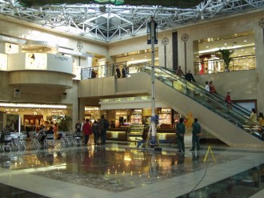
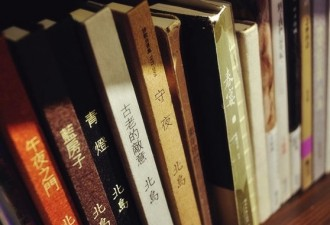

# 商场的地下王国

我曾在一家书店工作了两年。书店在某商城的地下二楼。每天早上钻进去，天黑了才爬出来，一整天都看不到阳光。不过，好在北京也没什么机会看到阳光。

书店对于店员有很多奇怪的规定，比如不准与店员交头接耳，不准与顾客闲聊，不准久坐在咨询台里，不准看书等等，刚开始很不习惯，尤其是最后一条，但后来慢慢也就习惯了，我们对于环境的适应力往往超出最初的想象。

来书店买书的人也是千奇百怪的，最少见的恰恰是那种真正喜欢读书的人。

很多人并不知道自己想要买什么样的书，比如有这么一位顾客，他问我比较经典的书摆在什么地方，我想当然地把他带到了世界名著的架子前面，但是他说他不读小说。我又把他带到了人文社科类图书的架子前，他又说这些书太深了他看不懂。然后我就问他那你喜欢读什么类型的书。他说，我也不太清楚，就那种比较经典的。

有的人只买畅销榜上的图书，即使我们偷偷把一些滞销的书摆到畅销榜的架子上，不出几天也能卖光。有一位顾客在畅销榜上看到了一本名为《百年孤独》的书，她问我这本书是讲什么的。这种问题是很难得，一般除了问有没有某本书之外，顾客们只会问“厕所在哪里？”“可以拍照吗？”“居然没有凳子？”“不卖咖啡吗？”“会员卡怎么办？”……当然，还有一些更奇葩的，有一个人在书店逛了一圈，然后走到前台一脸疑惑地问：“你们这里不卖剃须刀？”因此，当我听到这个顾客的问题后，我立即滔滔不绝地跟她讲了一通魔幻现实主义、长河小说、宏大叙事、历史关怀等我觉得可以简要概括这本书的关键词。结果，听完我的介绍，她默默地把书放回了原位，我感到无地自容。

更多的人买书是为了装饰。这其中有一部分人是为高级宾馆或餐厅采购相关图书和杂志的。还有一部分人纯粹是因为有钱没处花。他们买书有一个共同点，那就是不会过问作者、出版社以及书的内容，他们只在乎书是否是精装，封面好不好看，有没有足够多的插图。一天，一个一身名牌的中年女子幽幽走到前台，嗲声嗲气地说：“我想请你们帮个忙，我最近在海边买了一套别墅，我想用书摆满客厅背海的那面墙，你们帮我挑一下吧？”此言一出，我知道又来了一位贵宾，我立刻用对讲机叫来了几位同事帮她挑书。她一口气买了13万块钱的书。临末，还叫来三辆车帮她把书运了回去。

还有一些人只会跟风买书。我刚去书店的时候，彭浩翔经常来书店逛，有一次他买了一本台版的推理小说后回去发了条微博，说这本书不错，还配了张书店的照片，于是接下来的几天那本书是被问的次数最多的书。不过刚好那本书只进了两本，粉丝们只能失望而归。等这本书补货到了之后，再也没有人要来找那本书了，它在角落里静静躺了两年；我快要离开书店的时候，莫言得了诺贝尔文学奖。于是一大拨人蜂拥而至，几天之内就把莫言的书抢光了。有意思的是有些人并不知道得奖的作家叫什么名字，也不知道他写了什么书。他们会这么问：“最近有一个人得了诺贝尔文学奖，你们有他的书吗？”

有不少明星来过。演员、导演、模特、歌手，大陆的，港台的，欧美的都有。老狼来过几次，有一次我鼓起勇气跟他聊了几句——其实是一句——我问他最近有没有演出，他笑着说没有，然后我就灰溜溜地走了；汤唯来过一次，这是来过的明星里我偷偷在一旁注视的时间最长的一个。我一直在她身边的架子前装作整书，心里盼望着她会问我某本书放在什么地方，但她自始至终也没问，最后她买了一本室内装修的书；基努•里维斯来过一次，不少人跟他合影了，他也没有推辞，很多国内明星被认出来后一般都会拉长脸拒绝粉丝的拍照请求……遗憾的是，绝大多数明星所买的书，除了一些实用类的书外，基本上都是心灵鸡汤（周迅是个例外，她只买世界名著）。一天，一个我还比较有好感的二线女明星让我给她推荐几本好看的外国小说，我给她推荐了卡佛的《当我们谈论爱情的时候，我们在谈论什么》，理查德•耶茨的《十一种孤独》，还有赫拉巴尔的《过于喧嚣的孤独》，她每本书只翻了一分钟，一边翻一边摇头，最后她买了一本治愈拖延症的书。

书店的工作并没有想象中那么轻松闲适。每天都有新书要上，要去地下三层的车库去把新书拉上来，要根据书籍的销售情况不停地调整书的摆放位置；还要处理顾客的各种需求：有的人要找某本书但她不记得作者名只记得大概的书名。有的人要找某本禁书我们告诉他是禁书之后，他会把怒气都撒到我们头上：Bullshit，这种书你们也禁？！还有操着俄式英语、日式英语、印度英语、菲律宾英语的顾客说着我们完全听不懂的英文，我们只能让他们写在纸上，但是他们的笔迹又很潦草；书店不准拍照但是到处都是闪光灯在闪；还要防盗，每天都有好多书被偷，但是我们一个小偷都没有抓到。有一段时间我们还特意安排员工不穿工服伪装成顾客去抓小偷，但是没有用，那些看上去是小偷的最后都被证明不是小偷。

每天下班后都是身心俱疲，而中午只有一个小时的吃饭和休息时间，不能提前，也不能晚回。中午，我们会去员工食堂吃饭。员工食堂在地下三层，位于商场地下王国的最深处，一路上我们会路过几十家奢侈品店（我怎么才能忘掉我曾在一家卖婴幼儿用品的店铺里看到一个手工摇篮卖十二万块钱一个），穿过十几道防火门（商场地下有无数道防火门，那里面极容易迷路，第一次一个人去食堂吃饭的时候，我以为我记得路，结果在地下绕来绕去，绕了半个小时才找到回书店的路）。

去食堂需要走十五分钟，来回就是半个小时，我们通常会用十五分钟的时间吃完，然后剩下的十五分钟，我们会去地下二层的溜冰场看别人溜冰。

也不知道是从什么时候开始我们养成了这样的习惯，也许是那些溜冰的人轻盈的姿态让我们暂时忘掉了生活的沉重。我们就那样静静地坐在溜冰场外围的凳子上，不说一句话，我们看着那些老人、中年人、年轻人在冰面上滑过来滑过去，就好像看着鱼缸里的鱼儿游过来游过去。

有一次很奇怪，整个溜冰场，我们只看到一个穿着白裙子的年轻女子。不一会儿，楼上有一个男人拿着喇叭在唧唧歪歪地说着什么，我们仔细一听，原来他是在求婚，只见男人从楼上抛下来一根线，让女人拿着，女人很听话地捡起了线，然后男人在线的这一端放了一枚戒指，戒指在空中缓缓地滑向女人，女人一手牵着线，另一只手捂着张大的嘴，显得很惊讶。与此同时，溜冰场的喇叭里响起了那首浪漫的歌曲《今天你要嫁给我》。这时候溜冰场栏杆附近围满了人，大家纷纷掏出手机拍照。

我们也为这对新人感到由衷的高兴，我的一个同事，她还感动得哭了起来。

 链接：http://www.douban.com/note/289501225/

（采编：陈静；责编：王卜玄）

[【蝇生】杀人公司](/archives/40630)——“农人”是行业里对收尸人的黑话，到指定的地点收尸叫“收菜”，杀手叫“厨子”。大部分厨子都是女人，因为女人好伪装，不容易被发现。另外，女厨子心思细腻，不爱留马脚。事实上，农人平时也收尸，在火葬场干活，厨子平时可能是任何人。

[【蝇生】火车经过的房间](/archives/40612)——做违法信号接收器的话务员，在夜里总会遇到奇奇怪怪的人。可是，这位悲伤的大叔，周杰伦真是你儿子吗？

[【蝇生】天仙配](/archives/40761)——除了歌颂他们是城市建设者，听闻他们讨不到工资自杀，你了解过农民工另一面吗？他们偷女人内裤，暴打工头到屎尿横流，除了猥琐和暴力，他们的人生，还有另一种可能吗？

[【蝇生】保安](/archives/25973)——我时常需要在这傻逼世界中探出头换换气，却不敢将鳃长久暴露于寒冷稀薄的空气中。这时我总会怀念起那个半睡半醒慢悠悠的人。早忘了自己啥时候开始认定这个世界很傻逼，但好像已经不重要了。
