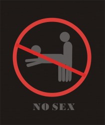
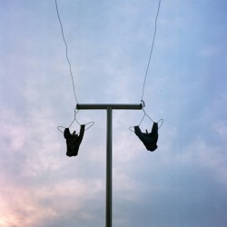

# 天仙配

我问工头，为何工地没看到食堂和宿舍？工头说没有食堂，看到那边那栋高层没？最高的那一栋，宿舍就在那边。我抬头往宿舍方向眺望，没敢想我能住那么高。 

宿舍在坡子街，从工地到宿舍，要横跨这个城市最繁华的地段：五一大道与解放西路，中间要经过太平街或下河街。我拖着行头，跟在识途老乡身后，低头穿过人群拥挤的五一路，过太平街时，老乡吐掉槟榔渣，说以后上下班就走这儿啦！平平安安，不要走下河街。我说我们做室内，不怕失足。我怕在这碰见熟人，网友，前同事，前女友，前前女友以及她们朋友们。我要穿着沾满水泥沙浆的迷彩工作服，每天早中晚在这片多事多非的地方穿行，一旦与拖家带狗的她她狭路相逢，意味着穿帮和尴尬！ 

宿舍在六楼，是一个小隔间，还住着另一个老乡，隔壁的大间则住着几十号人，有邵阳人，湖北人，广东人益阳人和宁乡人。几天后，我惊悚地发现那边还住着个漂亮女人！我立即想要加入他们，遭到拒绝，理由是：我们不是一个班组，住一个宿舍容易搞乱。我对老乡说，人家歧视我们呢！但老乡说不可能，说在工地，不管他是哪里人，都要怕我们新化人，我说那不就是歧视嘛！老乡说我太自卑。你能在长沙任意一个工地上见到新化人，你也能在西站，南站，马王堆高桥撞到混的他们，和睡到站的她们。 

我们随地吐痰随地小便，我们用旧报纸擦屁股，用手掌揩鼻涕，偷看女人洗澡，把钢筋绑腿上带出工地换酒喝。我们的个人卫生让人着急，我们的心理卫生令人生忧，我们用四肢来做事和思考，我们不是二等公民，我们比二还要低几等，我们不仅仅是新化人，我们是攸县人，南县人，张家界人，邵东人，双峰人，安化人，涟源人，冷水江人，我们是农民工。本地人讨厌我们，我们自己则相互讨厌，我们都有着相同且多的弱点和缺陷。但我能说我们的缺陷是社会的缺陷，我们的弱点是人性的弱点么！只是有人在这个点上开花，有人看到有花就把它摘了。 

邻居拒绝我们的加入，我们没有乱来，而他们那边一直不太平静，牌桌上吵，饭桌上吵，床上床下厕所澡堂都可以见到他们的争吵。比较刺激的一次是：某个痴汉半夜在月光下孤独地吃隔壁漂亮女人晾在过道的内裤，我无法代入女人的老公起床夜尿，出门看到如此景观是何心情。痴汉被揍得哭爹喊娘，末了还被逼下跪道歉赔钱，差点引起宿舍两股人火拼。 

这以前，我一直以为，内裤賊是一个高刺激低风险的事业，我发信息给一个之前的工友，劝告那位安化老几以后务必好好做人。 

在前一个工地，我们可以选择睡工棚或工地，我和他在工地的三楼分铺睡一个屋。这个老几定力不行，没一次能坚持看完一个毛片，通常看到一半就开溜，临走时留遗言一句“受不了了，我去楼顶放一枪。”不出意外，第二天必有女人内裤失窃，也偶尔几次听到有男人骂娘，心痛内裤昨夜无风而逝，合算着今天又有几个平方的灰白抹了，多少面积的砖白贴了。 

当时已是零晨三点，工友竟然没睡，回短信问我在哪？我说下河街，他骂我没日过，说那种地方你也去，没意思，没情趣，你从街头走到街尾，所有货色都是一句搞不搞，连句老板都不会叫，上的时候更来气，上死人似的，你让她叫两句，她就哎呦呦哎呦呦呦，活像群娃娃鱼在叫，我说那明明是个叫床版的《忐忑》。工友操了我一句——还他妈左小祖咒版的呢！ 

早上八点，包头电话过来，问我们怎么还没到工地，我说我们今天需要休息，不做事，这个益阳老几冲我吼，说一个月内没给他完工就别想拿钱，我开的外音，我们中间年龄最大的老乡闻声跳起，接过电话开始日他娘，另一老乡也凑过来，说黑工地都没人敢赖他一块钱，说不干了，叫他马上过来给大伙结帐，敢拖欠一毛钱就要揍得他流屎，我见两位老乡都很激动，抢回电话大声补充，告诉他不要以为挨饱了揍就可以赖掉工钱，没这个好事！ 

这个喜欢拿工钱来压人的包工头，最终被一伙涟源人抽得脸蛋肿成馒头，原因无他。在工地，人们对未拿到手的工钱总是透着股危机感，容易躁动。 

当时老乡看不下去，要去劝架，我说还没出屎呢，看戏看戏，你看他那一身肉，好像好好打的样子。 

这个傻瓜，他以为抓住了民工的鼻子，但那也是底线和痛！ 

我曾看到一个女人因为拿不到工钱从五楼跳下当场摔死，她的丈夫当时就在楼下，站在围观的人群中像块烂木头般不声不吭，木然望着楼顶绝望的女人。我也见过一个月上六十四天班的神仙大姐（当时的情况是白天做满十小时为一天工。晚上加班则是，上半夜加班一小时算一点五，下半夜一小时算两分）。 

前年冬天，我们宿舍有一对兄弟，这对兄弟家境不好，在工地做小工，清洗外墙的瓷砖。哥哥小时得过脑膜炎，有点呆傻，弟弟二十好几了听说还没谈过女朋友，他们俩人两天的工钱加一起还没我一天的多。一次烤火夜谈，聊到工地前些天摔死的一个电梯工的赔偿款，有人就说：某傻，你这么活着，总有一天你弟要被你拖死的，你还不如去死了干净。哪天你从脚手架上往下一跳，自己解脱了不说，你弟也能得一笔钱成个家。 

对这种半调侃的诛心玩笑，哥哥呵呵呵呵傻笑，而当时只是沉默的弟弟，在烤完火后回房睡觉，再抱着哥哥的臭脚取暖时，会不会做噩梦呢？ 

工程顺利完工，在等待验收，结帐然后拿钱走人的日子里，再没有什么事情是必须要做的。第一天，我们除了拉撒，吃喝都在床上。 

傍晚醒来，老乡在电话联系下个工地，我短信给一个女人，说我想她，没有回音。去楼下小卖部买包槟榔，问老板有没有我的信，老板说如果收到会通知我。我回宿舍把槟榔丢给老乡，准备喝壶酒继续睡觉。 

夜晚来临，我还没有睡去，老乡们出去吃饭，我决定去走一走下河街。夜幕下，我脚步虚浮，踩着湿漉漉的石板，在下河街走了两个来回，没见到工友所说，两旁数十失足夹道喊“搞”的场景！ 从下河街出来，江风冷烈，橘子洲头的烟火在头顶咆哮，我头痛欲裂，又走了一些时候，酒劲似乎还在往上涌，我有些分不清方向，不过没有关系，我今晚可以去我想去的任何地方，我现在就要找个干净的地方睡一觉。 

那里，厕所的水不会半夜往我床下流，浸湿我的鞋，没人在我酣睡时把电视机摔到地上，没有凌晨三四点钟压抑的啪啪啪，吱吱吱，地上没有浓痰没有剩饭没有老鼠屎，我可以把后背安全地交给墙壁而不用担心被鼻涕粘住！那里没有脚臭，没有鼾声磨牙声梦呓声没有二手烟。但是，一旦没了这一切会怎样呢？有一万种可能。只是对我来说，任何一种都不会比现在更好。 

尽管我憎恶工地的一切，但它如此简单直接，以至于我只需要一双手和一点蛮力就能在这儿生存，它如此适合我。 

只是，今夜我不会回来，酒醒了也不回来，明天我也不一定会回来，等钱花光我就回来。 

（采编：陈静；责编：王卜玄）

[【蝇生】杀人公司](/archives/40630)——“农人”是行业里对收尸人的黑话，到指定的地点收尸叫“收菜”，杀手叫“厨子”。大部分厨子都是女人，因为女人好伪装，不容易被发现。另外，女厨子心思细腻，不爱留马脚。事实上，农人平时也收尸，在火葬场干活，厨子平时可能是任何人。 [【蝇生】火车经过的房间](/archives/40612)——做违法信号接收器的话务员，在夜里总会遇到奇奇怪怪的人。可是，这位悲伤的大叔，周杰伦真是你儿子吗？ [【蝇生】商场的地下王国](/archives/40686)——在位于商城负二楼的书店，只要畅销书的读者来过，一线明星来过，买书装饰海景房的贵妇来过，求婚的人来过，读者来了又去，谁见证了书店的繁盛与落寞呢？ [【蝇生】保安](/archives/25973)——我时常需要在这傻逼世界中探出头换换气，却不敢将鳃长久暴露于寒冷稀薄的空气中。这时我总会怀念起那个半睡半醒慢悠悠的人。早忘了自己啥时候开始认定这个世界很傻逼，但好像已经不重要了。 
