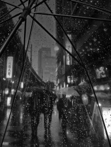
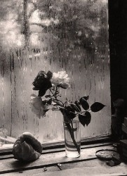

# 一个春天的晚上

王二是出了门才发现下雨的，他没带伞，又懒得上楼拿，于是紧了紧皮衣，缩着脖子走了出去。

这是这个春天的第一场雨，来的不声不响，淅淅沥沥落在身上也不用担心湿透。王二淋着雨转到了三环边，盼着细密的雨点能穿过衣服和皮肤浇一浇自己硬梆梆的心。

他没有夜奔的习惯，这天晚上的举动只不过是因为睡前无可适从附庸风雅的翻了翻郁达夫的散文，正巧看到《春风沉醉的夜晚》那一篇，于是忍不住也出来走走。

王二觉得生活逼得他喘不过气来。他正处于一个别人看来年轻的可以无所不为的年纪，但似乎只有他自己知道身上住着多少无可奈何。父亲死的早，他跟母亲住在一起，母子关系很微妙，但深层次的感情肯定是有的，否则他也不会二十多年离不开这个让他又爱又恨的城市，他不是那种不敢闯不敢拼的人。母亲一天天的衰老让他有了一种不能离开的责任，有时候老小孩不讲理起来让他觉得又可气又好笑，忍无可忍他也去朋友那儿凑合一宿，可吵过闹过之后还是会一脸不放心的推开自家门，一切如故。

王二顺着三环走，路上没什么人。这个城市的灯光永远是暖色调的，但却始终挡不住深夜的寒意，他有些后悔没多穿两件。就好像能暖和起来似的，他点了根儿烟给自己找了点事做。旁边还没关门的苍蝇馆子里出来了三个白领打扮的人，中间那个身子颤颤巍巍的还不忘大声嗷嗷着吹牛逼“我还就告诉你们丫的，这事儿没我就是不成”，旁边两个一脸嫌弃的迁就着他“哎哎，可不是么”，一边把他架的双脚都快离了地。王二放慢了脚步饶有兴趣的打量着他们，无人的街上难得见着活物。三人艰难的挪到路边打算打辆出租车，说时迟那时快，就在王二的注视下，中间那人“哇”的一声干脆利落的把胃里那点山珍海味一股脑倒在了旁边朋友的身上，王二看着那个落了一身雨水和呕吐物的可怜人“噗哧”一下乐了“别说，金针菇还真挺不好消化的”，心想这回是真打不着车了。告别了一脸无辜晃晃悠悠的大哥和他两个不知所措歇斯底里的朋友，王二接着往前走。

雨看着是没有要停的样子，“这么下一宿也好，难得呼吸点儿新鲜空气”。他想起来了两年前凌晨达到一座西陲小城的情景，整个城市依山而建，蛇形的道路两边是鳞次栉比的饭馆和旅店，难得见着一个邮局。来到这里的都是过客，夜里落脚睡一晚，天一亮便匆匆忙忙的去往下一个目的地。王二也只是路过那里，因为那时下着雨，他对这座小城的记忆更加模糊。依稀记得每一家店的老板似乎都是四川人，惹得他还忍不住赞叹过“果然天下都是四川人的”。他很佩服那些四川老板，在每一个人都是异乡人的城市扎根，日复一日的劳作，迎来送往，想想都觉得寂寞。去之前他就听说过那里一天到晚都在下雨，真的住下了，躺在潮乎乎的床上感到湿漉漉的寒意一点一点钻进骨头的时候他才真的意识到这也许就是传说中那“雨水中一座荒凉的城”吧。

今夜的雨让他想起了遥远的那座小城，两年前去过的地方现在已经恍若隔世了。那时候的他刚被一个姑娘伤了心，一声不吭的背包走人，以为出走能解决一切问题给自己一次脱胎换骨的机会。现在想起来愚蠢至极，不过是被当时吹得天花乱坠神乎其神的间隔年文化骗了，将希望寄托于外力，忽视了主观能动性，回来后发现问题比没走时候还棘手，自己整个人都散掉了。王二又点了根儿烟。

他又有些羡慕那时候的自己，能闹能折腾见着漂亮姑娘不搞到手就觉得对不起自己这张英俊的脸，不像现在这样无精打采，对女孩儿都提不起兴致。烟虽然抽的更猛了，但越来越不爱喝酒，尤其讨厌那种要吐不吐晕晕乎乎的状态。其实王二不愿意再喝酒是有原因的，他喝多了话密，还全是真言，没有哪次喝多不是他挨个儿搂着哥们儿姐们儿叨逼叨掏心掏肺到天明的，弄得他睡醒了以后总不好意思见人，他是断了片儿说了什么一概不知，可总有几个还记得的拿着那些酒后真心话揶揄他，一次两次还挺有意思，多了还真挺没脸见人的。

王二在桥上站定，看着一大妈半夜跟河边遛大黑贝，几年前城里刚不让养大型犬的时候，这样趁着夜黑风高出来遛大狗的可比这会儿多多了，弄得还是初中生的王二天一黑就不敢出门，他小时候在同学家被大狼狗扑过，落下一怕狗的毛病。王二把烟屁弹进河里，跺跺脚转身又走了。

王二的那些狐朋狗友现在也都不怎么一块儿出来玩儿了，那时候堪称东城一霸海淀一妈的“局长”“处长”们现在也都焦头烂额的在招聘会的涛头里弄潮，削尖了脑袋在面试官面前装着良民，王二自然不能免俗。他不想再让他妈养着了，第一笔工资怎么花都想好了——给家里换个灶。现在只有一个灶眼能用，吃个晚饭恨不得刷完午饭的碗就开始准备。支撑着心高气傲自命不凡的王二低眉顺眼找工作到现在的就是这眼灶，熄灭他那些歇斯底里甩手掌柜念头的也正是这眼灶。

王二想到这儿有点儿堵得慌，他磕了半天磕出两根烟来挑了一根抽。虽然他大学没怎么好好上，但也绝不算不学无术，要不以前也不会每次才华刚横溢出来一点点就有仰慕的姑娘前赴后继的往身上贴。可惜的就是这些“闪耀的激动人心的时代最强音”都在胡侃时唇齿间灰飞烟灭仅仅铭刻在爱戴他的人民群众心中了，没能留下点儿白纸黑字的证据以示后人。所以现在被拒的多了他丧气的同时不免有些不甘心，总觉得自己是朝着太阳张牙舞爪奔跑的人，却被绑住手脚种在河边得按命令温柔绽放，这种缩成团还被要求缩得再瓷实一点的感觉实在让他难受的无可是从。想到这儿王二松开夹紧的胳膊像舒展的柳条一样伸了个懒腰，雨点趁机扑簌簌的落进他怀里。

王二觉得眼前路朦朦胧胧看不清，怕自己其实好一朵美丽的雄茉莉花又白又香却无人夸，直到他想起丁一，这个萍水相逢交情不深却一眼看进他心里的金子般的姑娘。在他脑门上刻着良民小心翼翼平淡度日的时候，丁一在茫茫人海中小雷达一般探测到了王二这颗心怀鬼胎的大心脏。丁一不算漂亮，但她给了王二极大的安慰，他甚至有点相信看不见摸不着的缘分，甚至第一次扪心自问“何德何能”。王二无疑是有些依赖丁一的，好像她是这陌生世界里的第一根也是最后一根稻草，对她的感情单纯到可远观而不可亵玩的地步。

王二想到这句话时浑身一激灵，被自己恶心得够呛。他磨磨蹭蹭的掏出最后一根烟点上，感到天色微微泛亮，周身稍稍发冷。之前一直低头走路想事，没注意其实已经快绕到家了，雨还在不急不缓的下着，皮衣稀稀拉拉的淌着水。他慢慢的往家走着，想着出门前刚刚读完的那个失意闲居的年轻文人的最后一段话：“所以我这几天来，到了晚上，等马路上人静之后，也常常走出去散步。一个人在马路上从狭隘的深蓝天空里看看星星，慢慢的向前行走，一边做些漫无涯涘的空想，倒是于我的身体很有利益。当这样的无可奈何，春风沉醉的晚上，我每要在各处乱走，走到天将明的时候才回家里”。

天快亮了，雨还没停，王二把烟头扔在水洼里，拍了拍衣服上的水，三步并两步的上了楼梯。他的心情没有更好，他只想睡觉。

(采编：朱燚；责编：王卜玄)

[【行路客】家书·家燕](/archives/39702)——如今每次归乡，桥变成了一只渡船，从南岸到北岸，过了江就是家了，就是没了那眸等待的目光。

[【行路客】人之初](/archives/39741)——我摸摸自己毛茸茸的下巴，看着小周叔把一副整齐的猪肠剁成小块儿，一股脑扔进热气腾腾的大锅里。从那时起，小周叔变成了周师傅。

[【行路客】只进杯酒，不言过往](/archives/39805)——生活亦如疾驰的列车，坐在两辆并行而过的车里的人，无论如何使劲地挥手凝望，列车也不会为你而停留下来。
