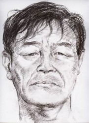
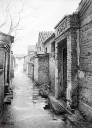

# 人之初

说起这事儿，可真有些年头了，若是从头说起，还要回到周师傅还是小周的时候。

小周是我从前的邻居，长我一辈，我便称他小周叔。小周叔的母亲早逝，父亲去了新疆棉田，他吃百家饭长大，没人教养，性子也直，可奶奶总说小周生得聪明，人也标志，以后定有大出息。我记得奶奶喜欢叫小周叔六六，他生于农历六月初六，六六大顺，是个好日子。

小周叔可没少招姑娘们惦记，高鼻梁，鹅蛋脸，有些像那个年代里画报里的人物，尽管由于出身问题当兵不成，终究没能套上那身带兜和红旗的皮，可戴上大红花去当农民时，也是威风凌凌的。小周叔下乡前教我抽烟，那时几分钱一包的大前门还是奢侈品，他随手给了我，看着我咳嗽不停，揣着笑却端着一脸严肃，我看他嘴唇上已经长出了细密的绒毛，那是他可以教训我的资格，尽管他还是奶奶口中的六六。

“大老爷们儿，这算啥？抽！”

后来的两年里发生了许多事，不过多是些无关紧要的小事，比如，奶奶死了。新年的头几天，奶奶坐在门口，一边和邻居聊天，一边听着破收音机里的广播。总理死了，奶奶听后一愣，竟一口气没上来，堵住了心口。大家说奶奶选了个好日子，只是犹豫究竟该去哭哪一个。总理和奶奶的照片并排摆在客厅里，干瘦的老太婆依偎着总理，活像一对尴尬的夫妻。我偷偷溜到什刹海附近的工地上哭奶奶，我不喜欢让别人看到我这副模样，更不敢告诉他们我的眼泪居然与总理的死毫无关系，只是那年冬天很冷，眼泪被冻进了鼻腔，成了一滩鼻涕。我想起了小周叔，点了根烟，把自己呛乐了。

小周叔回来的时候家里的客厅里摆了四幅照片：主席、总理、朱老总和奶奶。小周叔全然一副农民作派，脸颊尖利不少，肩头一个粗布包袱，站在门口，朝三位领袖磕了几个头，瞟了瞟奶奶，闷头想些什么，又磕了几下。小周叔不似从前那般活跃，他变得沉默而木讷，我知道他在陕西讨了婆娘，他给我看了一张花白的婚照，婆娘像一堵铁塔，小周叔的脸模糊了，而后排正中端坐的支书却面似桃花。后来我知道，小周叔是一路逃回北京的，婆娘怀了他的种，大着肚子躺在炕上，疼起来变了疯狗，好不容易等孩子生下来，又说什么小周叔是倒插门的女婿，这孩子要随母姓。小周叔不依，婆娘抬手就是一个耳光，打掉了他一颗牙。

小周叔问起奶奶，毕竟他们有感情。小周叔只长我七岁，还不到一轮。我想起小时候我们一起去偷生产队的桃子，我爬上树，他就在附近望风，我一不留神摔断了腿，抬回家后父亲先抽了我一个嘴巴，又拿着棍子追小周叔。小周叔哭着躲在奶奶身后，奶奶张开双臂护着他，哪怕自己的孙儿正捂着脸鬼哭狼嚎地让一个蒙古大夫接骨。我看到小周叔对这奶奶的遗像抹了抹眼圈，当然，他没有哭，一如他曾经告诉我的男子汉模样：叼着烟卷，留着半长的胡茬。

我摸摸自己毛茸茸的下巴，看着小周叔把一副整齐的猪肠剁成小块儿，一股脑扔进热气腾腾的大锅里。从那时起，小周叔变成了周师傅。浪荡在城市间几年后，他有了自己的偶像。每每经过周师傅的卤煮摊子，坐下聊天时，他总会提起杜学然，那个九大的中央候补委员。杜老在打回原籍后经营了一间卤肉馆子，生意红火。他卤的肉色正味香，鲜亮软烂，来的都是回头客，而杜老也全然没有中央委员的架子。周师傅咂咂嘴，给我盛了一大碗猪下水。他说这卤肉就像人一样，急功近利总是不成的。我知道卤煮与卤肉乃至人生的差别，而周师傅口中的杜老连同他的吐沫和肉味一起喷个满桌，兴致高时，仿佛自己就是杜老的门徒。

长辈们一个一个慢慢离开的时候，周师傅把自己的摊子改成了一间小门面的馆子。就像由矿工变成中央委员再变成卤肉老板的杜老，周师傅从知青变成农民，再一点点褪掉农民的影子。岁月蹉跎却平静，直到周师傅被带走的那天前都是一个样子。那天下了入夏以来最大的雨，周师傅领回一纸通知，自从他逃回北京的那一刻，他的户口就从下乡知青所在的登记簿上抹去了。没有电文、布告哪怕警察的搜索，周师傅的合法人生止步在了疯狂的年岁里，同一个叫小周的青年一起，消失在漫天黄沙的陕北。这是民政局的判决，卤煮馆子封了，没有户口，也就不存在什么许可证；周师傅也不曾想到，那些递交到村支书手里的几张薄纸，早已经退还给家属——那个铁塔似的婆娘，她破口大骂着周师傅的良心，用它们擦了孩子拉在院子里的屎。

再见到周师傅是在报纸上。我不知道那几年他经历过什么，调往外地许久，只在一次回乡经过他家门时看见里面透出微亮的灯光。我站在窗边唤他开门，他打开窗户，纱帐下只有一个隐约的轮廓。他说他得了感冒，不过很快就好，约我改日叙旧，好好喝上几杯。末了，他爽朗地笑笑，示意自己一切安好，不必挂念。

“大老爷们儿，这算啥？”

周师傅依旧是那个简单的人，他想到了一劳永逸的方法。几年后我们相见时又来到了什刹海，他指指对岸水边的大片水葫芦，告诉我那就是他当初跳下去的地方，然后摇摇头，不再作声。周师傅又挑起了卤煮摊子，这一次总少不了些许唏嘘与白眼。他要养家糊口，尽管“家”已经成了孑然一人的代名词；他要想法子重新上户口，上次在警局终究没说出来，可日后想想却也不再重要了；他还要给那个武警战士守陵，年年戴孝、磕头，尽管他们此前从不相识，而那天他让他变成了英雄，他让他又一次活着。

不过，这都是后话了。

年幼的儿子接过周师傅的红包时郑重地磕了个头，又是一年新春。几个穿着军装的人围在周师傅家门口，还有记者与尚未搬走的街坊。一个军官拉着周师傅的手嘘寒问暖，不时有闪光灯此起彼伏，接踵而至的，是七嘴八舌的提问和劈啪作响的掌声。

“您对生活满意吗？”

“您后悔当初的选择吗？”

“您有什么想对牺牲战士的家属说的？”

“您有什么需要就向当地政府反映，我们一定......”

儿子认生，面对突然闯进来的形形色色的人们显然有些不知所措。我赶忙把他拉到一边，剩下周师傅被攥住的手，被灯光照得惨白的头发，还有墙上那张大幅黑白的年轻的脸。我似乎看到了奶奶，那个总理遗像旁的干瘦老太，而此时的周师傅宛如一位苍老的父亲，镜框里的是他可怜的儿子。这时，周师傅猛地转身，一下子跪在地上，对着年轻的“儿子”咚咚咚几个响头。军官们赶忙去搀扶他起来，随后又是一片枪栓似的拍照声。

儿子上中学时周师傅拿起一瓶二锅头。儿子摆摆手，说自己不会喝酒，周师傅一饮而尽，说你爸小时候都比你强，你这个当儿子的长到十八居然还这么怂。儿子拗不过，看看我，我笑着瞅瞅周师傅，儿子端起瓶子，一饮而尽。周师傅那晚很健谈，就像我们的童年时代。他叫我兄弟，我说这可不敢当，您终究是我叔。周师傅听罢也就不再说话，看着脸颊变成绛色的儿子，嘿嘿笑了出来。

“你们等着，叔去弄碗猪肝粥醒酒。”

周师傅踉踉跄跄推开房门，忽地一头栽了下去。我去扶他，他爬进院子里，指着屋子正中那幅照片破口大骂。

“他妈的，把那个死人从老子这里挪走！”

周师傅骂了一夜，笑了一夜。起初还听得懂，后来，只剩下喃喃的呓语。清晨，他又爬起来，整整衣服，剁他的猪下水和火烧去了。

我的小周叔死在2000年的夏天。那天有人举报棚户区的臭气熏到了附近的商铺，警察以为那是流浪的野狗在阳光下腐烂发胀，不想竟在旁边的破宅子里发现一具男尸。他尸渍横流的面孔早已看不出表情，屋子里的遗像上，那年轻的笑容依旧如阳光般温馨。

巧合的是，那时出差在外的我做了一个梦：气急败坏的父亲举起棍子时，小周叔哭着躲在奶奶身后，奶奶张开双臂护着他，就像呵护着自己的孙子。六六乖，六六不怕。

说起这事儿，可真有些年头了。我依稀记得那天是千禧年的农历六月初六，六六大顺，是个好日子。

(采编：朱燚；责编：王卜玄)

[【行路客】家书·家燕](/archives/39702)——如今每次归乡，桥变成了一只渡船，从南岸到北岸，过了江就是家了，就是没了那眸等待的目光。

[【行路客】一个春天的晚上 ](/zh-cn/archives/39773)——这是这个春天的第一场雨，来的不声不响，淅淅沥沥落在身上也不用担心湿透。王二淋着雨转到了三环边，盼着细密的雨点能穿过衣服和皮肤浇一浇自己硬梆梆的心。

[【行路客】只进杯酒，不言过往](/archives/39805)——生活亦如疾驰的列车，坐在两辆并行而过的车里的人，无论如何使劲地挥手凝望，列车也不会为你而停留下来。
