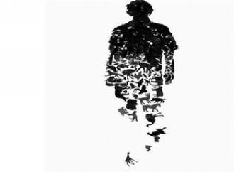

# 只进杯酒，不言过往

突然接到刘纪伟电话，他来北京出差。我问他怎么有我的号码，他说：“阿纯给的。”我说：“你认识吴纯？她可是大美女，我们高中有不少人对她动过心思呢。”刘纪伟说：“噢是么，她现在是我的助理。”我惊讶：“你什么时候开始当老板了？”他淡定：“没有当老板，只是在张延手底下混口饭吃。”

我们在海底捞见面。他递给我一支烟，我摆摆手说我不抽。他问我在北京过得好吗，我说还可以。知道了我的月收入之后，他闷着头喝干了杯子里的酒，对我说：“就凭你刚才不接我递的烟这一点，就能断定你在北京混得不好。”我默然。他又说：“回咱县吧，跟着张延干，一年至少能赚这个数。”然后伸出三个手指。

有意思。在他的词汇里，表示钱的单位已不再是“十百千万亿”，而是手指头加上“这个数”。三万，就伸出三个手指，三百万，也是伸出三个手指。其间的区分要看说话的语速，三万是“这个数”，三百万是“这、个、数”，三亿就是“这，个，数”。三个仄声字吐出来就像刀砍在菜板上，掷地有声。刘纪伟全然没注意我已经走神，仍然自顾自地说：“人生一世图什么，不就是吃吃喝喝自在快活吗！在家要啥有啥，何必在北京受这份儿罪！”我说在北京习惯了，回去不适应。他干笑两声摇摇头说，你跟当年一样，还是太倔。

小学二年级时，电视上播《三国演义》，我和刘纪伟、张延模仿刘关张结义金兰。老师说，刘纪伟为人实在讲义气，但太老实，将来要受人欺负；王路性子太倔，做学术能成气候，混社会不免受阻；张延太聪明，但一肚子歪点子不能用到正道儿上。当时流行“抓小偷”的游戏，一个人当“眼儿”抓其他人，被抓到的人成为新的“眼儿”。张延个子小，又胖，跑不快，但很少被人抓住，因为他有个绝招——每次都往人多的地方跑，快被抓住时，就先抓一个旁边的人，对眼儿说：“我帮你抓住他了，你别抓我。”人家骂他是“汉奸”，他不怒反喜。不过他也有原则，从不抓我和刘纪伟。

一天放学后，我们在班里打牌，教导主任路过，我们忙躲到桌子底下。钻出来时，我不小心把张延的文具盒碰掉地上，摔瘪了。张延让我赔他10块钱，我没零花钱，又不敢向家里要。我说和他换文具盒，他不肯；我说先欠着，等攒够了再给，他还是不肯。我说看在大家是兄弟的份上，我把每天发的蛋糕给你，这学期的都给你，他依然不肯。我大怒，说张延从今以后我不认识你！刘纪伟掏了掏兜，翻出来6块钱，说看在是兄弟的份上，6块钱算了，别伤了和气。后来我攒够钱拿给刘纪伟，他说都啥时候的事儿了，算了。

我初中去了一中，张延和刘纪伟在二中。有天，张延托刘纪伟向我道歉，说挺珍惜我们的友谊，后悔当初不该那样。我很感动，给他写了一封信表示重修旧好，让刘纪伟带给他。不过没有回音，我也没有见到他，读高中后，连刘纪伟都没见过面了。

再见到刘纪伟是2009年春天。我已经大学毕业一年了，刚以无业游民的身份考上研究生。刘纪伟高中复读过一年，当时大四。我打电话问他找到工作没，他说还没，我说要不一起去郑州摆地摊儿吧。我不知他有没有想过我纯粹是玩票，只图刺激，无论能否挣到钱，几个月之后就会拍屁股去读研，拉上他是怕一个人太寂寞，而他绝无退路，毕业了就得卷铺盖走人，还要踌躇以后的工作。他大概没考虑那么多，一口答应了，然后就从西安跑到郑州了。

我们在古玩城倒弄了一批旧杂志，去火车站卖。《特别关注》进一块卖一块五，《读者》、《青年文摘》进六毛卖一块。我之前非常讨厌火车站，那里肮脏、噪杂，时刻充满危险，但当我抱着杂志吆喝“读者一块，读者一块”的时候，那里顿时宁静和谐、井然有序了——绝不会有小偷再打我的主意，卖切糕和石头的小青年也对我视而不见了，连探头探脑打量过往旅客是不是有需要的大妈们也知趣地避开了我。有些买主用奇怪的目光打量我，大概觉得牛仔裤白T恤圆框眼镜的造型和卖二手杂志的身份并不搭，或者以为我是迫不得已流落到此等境地，于是带着同情和疑虑买了一本。尽管如此，一上午也只卖了十几本，赚了不到五块钱。

刘纪伟在火车站旁边进了一批手机挂链，看起来非常漂亮，而且不贵，才两块五。我们兜去城郊的学校卖，被<保安撵了两次后终于找到了一个出摊儿的地方，这时发现旁边的摊上有同样的挂链，只卖两块。一个月后，淋成落汤鸡的我和刘纪伟坐在前往火车站的985路公交上，凄惶地看着郑州城的夜色在雨洗过的车窗上一幕幕流转，像上演着没有开头也不会剧终的电影，而主人公从来不曾出现在屏幕上。在雨窗里映出西大街海底捞的时候，刘纪伟嘀咕了一句：“不知咱啥时候也能搁这儿吃。”我摸摸干瘪的兜，心想如果把两个人的火车票卖了，大概够进去饱餐一顿。

研究生毕业后，我来到北京工作。过年回家，我和我爸下乡走亲戚，路过移动营业厅，我爸进去给手机充话费，车停在路边。我爸刚出来，一个交警走过来要往车上贴条。我爸给他递烟，说就停了两分钟，请他松下眼皮放过，交警不肯。我下车看，发现是刘纪伟。他见是我，忙转头对我爸说：“叔，真是不好意思，自己人自己人！我和王路是小学同学，不知道是俺叔，不好意思。”我爸塞给他一包烟，他硬是不收，只留了一根，我问他要手机号，他说：“先别留了，回头再说，你们快走吧，被别的交警看见不好。”我们就匆忙上车走了。

我爸说：“真没想到你同学混成这样。在咱县当交警，一个月才600块钱，每天在外面风吹日晒。时代真是不一样了，年轻人差距越来越大。我二十几岁时，混得好的去机关，一月五六十块，混得不好的看仓库，一月也有二三十。现在，你看看差距多大，人家老板张三千，不到三十岁，西边新城区的楼盘都是他搞的，不知道有多少家产。”

那个春节，高中同学聚会，我和吴纯聊起过往，聊到我是在五小读的小学时，她就问你们那一届有个张延，你认识吗。我说张延是我同学，你怎么知道他。她说在正阳县，不知道县长是谁的人多，不知道张延是谁的人少。然后掏出手机，给我看她和张延的短信往来，她毫不介意让我看那些嗲言嗲语的信息。我看到短信里，“三千哥哥”长“三千哥哥”短的，就问为何这么称呼。她说张延喜欢别人叫他张三千，“三千”的意思是一顿饭至少是三千的标准。

我突然想到有个表舅人称杨百万，那是二十年前的称呼了。当时杨百万是县里做生意数得着的人。可今天，谁再称呼他杨百万，他会和那人翻脸。他后来经商失败穷困潦倒，再叫他杨百万就不是尊重而是侮辱了。更何况今天在小县城的蜚短流长里，津津乐道的早已从家产多少变成一顿饭的花销多少了。

春节假期过后，离开家回北京时，我对我爸说，如果你在街上再碰见我那个当交警的同学，就把我的手机号告诉他吧。我们县城很小，街上碰见熟人是稀松平常的事情。我想如果刘纪伟今后来北京找工作，我能稍微照应一下。我爸说，难道你没看出来吗，他当时不给你留手机号，是嫌自己混得不好，不好意思跟你来往。

两年来，我一直想，刘纪伟如果什么时候来北京，我要请他吃顿海底捞，算是感谢他当年放弃了找工作陪我在郑州漂泊，虽然这种感谢微不足道。

现在他来了，就坐在我对面。我们面前是热气蒸腾的火锅，隔窗是夜色中熙来攘往的街衢。一辆辆公交缓缓驶过，里面挤着如同当年一样凄惶的我们。我们谁都没有提当年的话头，也不知他是不是早已忘记了。只是在吃饭结束的时候，他问我要不要夜里一起去玩玩，有人负责买单，我没问他去玩玩是什么意思，只说不了，明天还要上班，然后消失在神情木然地涌向地铁的一大波僵尸中。

时过境迁，刘纪伟已不再是刘纪伟，我也不再是我。早年的交情已经散落成尘，了不可得，俨然是另一个世界的事情了。也许从张延的文具盒被我摔瘪时，我们三人就再也没有聚在一起的可能。好在这次见面，刘纪伟和我都没有旧事重提的意思。我们虽然再也找不到共同语言，却至少在这一点达到了默契——只进杯酒，不言过往。吃了这顿海底捞，我就可以把刘纪伟的号码从手机里删掉了。因为过去的已经过去，永远不会再回来。

生活亦如疾驰的列车，坐在两辆并行而过的车里的人，无论如何使劲地挥手凝望，列车也不会为你而停留下来。

（采编：朱燚；责编：王卜玄）

[【行路客】家书·家燕](/archives/39702)——如今每次归乡，桥变成了一只渡船，从南岸到北岸，过了江就是家了，就是没了那眸等待的目光。

[【行路客】人之初](/archives/39741)——我摸摸自己毛茸茸的下巴，看着小周叔把一副整齐的猪肠剁成小块儿，一股脑扔进热气腾腾的大锅里。从那时起，小周叔变成了周师傅。

[【行路客】一个春天的晚上](/archives/39773)——这是这个春天的第一场雨，来的不声不响，淅淅沥沥落在身上也不用担心湿透。王二淋着雨转到了三环边，盼着细密的雨点能穿过衣服和皮肤浇一浇自己硬梆梆的心。
