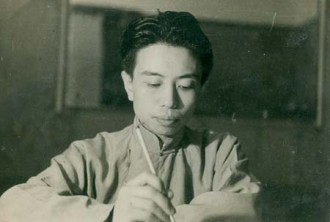
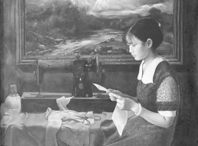
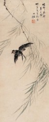
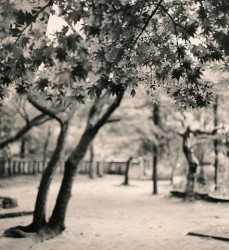

# 家书·家燕

# 家书

一 

我已经有好久没能好好睡一觉，在家是怕，窗帘拉上太黑，怕，窗帘不拉也怕，夜里有风，树影绰绰的被月光一照，总感觉有人站在外面看着。到学校是梦，夜夜不离笑容，场场不少温存，梦里往事千转，结局无一例外，都是醒来时的头疼，疲惫，和深深的失落。

小时候放晚学不敢独自走回家，因为回去的路要穿过一片坟地，即使有夕阳晚照，阵阵野风也让人浮想联翩——是不是背后有东西跟着。有一次妈妈加班不来接我，我一个人在路口惆怅了好久，迟迟不能移步，眼看着太阳一点点沉没，为了不走夜路只好捂住耳朵一下子飞奔到家，扑到你怀里号啕大哭。那时你和我说，乖，别怕，那里有你的太太，她会保佑你的，怕什么呢？

我不会跑了，因为你也躺在了这里。每次骑着摩托经过，总是不由自主地偏过头，看看能不能看到坟。回家或者出门，都来和你说说话。

以前觉得自己只是害怕孤单，天下哪有什么鬼神，当你走了，才知道鬼神之说从不是迷信。先民寄托故情的凭借，即便只是一个借口，那也要给他们一个借口可以吐出心里的思念吧，如果什么都没有，生命逝去就结束所有，就一了百了，那活着的人会绝望的。年纪越增长，越想跟爷爷把敬菩萨祖宗的仪式学会，那时你睡在堂屋里，每上一炷香，我都有一丝彷徨的心安。

坟上没有墓碑，他们怕被发现把你的骨头葬在这里，也没有棺木，只埋下去一个小盒子。我当然记得很早之前我们去参观一位亡人的葬礼，你摸着两头朱色一身漆墨的柳木感叹，好大的棺材啊。想必那时你就已经预料到自己不会有这样的奢侈了，让卑微贯穿的人生，能有栖身之地已是绝大的幸运。

可是我会担心，如此平坦地被周围的高坟掩盖，来年草长，没有任何记号的地方还有谁记得？随他去吧，记不记得又怎么样呢。这世上本来大多数人就善忘，那么多的苦痛都随着一起消失了，至于活着的人的内疚，你不用担心，也担心不上了。这地方是真好啊，北边是太太，南边留给爷爷，爸爸，妈妈，还有我。每年春天的蚕豆花，夏天的油菜，又漂亮又香，秋天的芦花像雪飘，冬天地被整过以后，我们一个一个就冒出头来，还是团聚的一家子。

传承的力量究竟有多大，它意味着不仅仅是你的生，连着死亡都被牵绊，一切早已注定，心甘情愿。这一辈子多少穷困潦倒荣华富贵，临了还是要回到这里，所以你不急，我也不急，什么都是未知，唯有这最后一遭我们都已选好。

六月初九观音会轮到家里，爷爷哭着哀求他们：把这最后一场会做完吧，轮到你们妈妈了。他们不愿意，人都死了，还搞这些虚的干什么。我拉着他的手，心酸无力。但是看到爸爸在饭桌上和着眼泪吞饭，我又原谅他们了，他是吃你的奶长大的。最后一夜我握你的手，他在旁边哀哀呜呜地啼哭，历数记事以来所有母亲的苦难，那场景我永生难忘。那手掌心的温度，冰凉的脚和父亲的啼哭，成了我挥之不去的梦魇。

医生说你听不见，可是为什么父亲喊你的时候你会流泪，我不相信是颅内压太高的缘故，不要和我说这些，我不相信。

我恨所有伤害过你的人，包括父亲母亲，所以我有时也恨他们。每次想起那些让你心痛的场面，我的血都像要燃烧，但是渐渐发现，回忆起这些场景的次数越来越多，越来越清晰，甚至要沉迷其中。因为仇恨也是一种纪念，至少那里面的主角是你，那里面你的样子一点也不模糊。

从你走开始，心跳，快速，血压这些词语都成了我的禁忌，我又开始害怕回家，我的家在哪里呢。我的家，已经没有最让我期待的，在等我的人。

现在，我和你一样孤独。

 二 

立夏了，你在那边还好么？

这是一年最好的时候了，要是天气好的早晨，你穿上蓝印花的布纽扣衫去水桥上槌衣服，我赤膊坐在爬爬凳上看桃花，看禾苗，看河里的胖头鱼，风吹得人骨头酥。可惜布纽扣衫一件也没留下来，都烧掉了，一件不剩。我想，他们烧你的东西，是要让你在那里也有得用，再就是怕留下来给我们看见，又要掉眼泪。可我还是蛮后悔，怎么不留下一件布纽扣衫呢？一件从上到下没有一点搁手，还带着陈纱棉和皂角的淡香，温柔到极致的漂亮衣裳，可以作为最丰厚的遗产了。它比寿衣好看多啦，现在想想，如果都要烧掉，还不如那时候就穿着它走，把发髻匀匀散开，真像是睡着了。

我们的菜园子没有了，姑父拉了两车废砖泥倒在那里，说是要打实地基以后用水泥浇筑平整。没有就没有吧，你不在，这家连个守门人都没有，黄瓜棚子都被人家捣坏了。我只是可怜我们那棵梨树，果子那么大，刚结第三年就要被埋没。浇吧，浇吧，反正也剩不下什么。以前每年从南京回家过年，我总去约大楠姐姐，同走同走啊。她说不了，离开那里太久，什么都变啦，回去反而不知道哪里是故乡。可我还是想回来。什么都变啦，但是河流的模样，桑田的影子还在，就是人家不下河洗澡，田里也不种桑树了。

各个都说此心安处即是吾乡，可我实在不知道，除了家里那块小小地方，还有哪处他乡能让我心安。我是一辈子离不开水三了，就像一辈子脱不开你的怀抱。爸爸问我想去哪里，他给我在那买房子安定下来，我想我哪里都想去，却只想在家里造房子。一层就够，木梁铁梁都行，要有个大天井，把水泥地敲碎，露出泥土的面目，种一株桂花，一棵芭蕉，还可以开出一畦菜地。要有院墙，最好是青砖的，墙上有镂空，这样边角里种的扁豆和丝瓜藤就能墙里墙外穿梭游走了。我要请老师傅来画屋脊上的蓝墨水纹，双龙戏珠还是雪浪红日都好，两边一定要圆圆的翘上去，就像要飞上去。鱼鳞瓦铺的细细的，唯独屋顶中间拿块抽屉大的玻璃贴好，到凉月子好的夜里，把堂屋里照得通透。

屋里的墙上刷白了，还可以上彩画儿。我这几年也认得了两个会画画的好人，他们要是来家里，你该要高兴得眯上眼煮荷叶蛋招待。中堂画个牵鹿的老寿星，厢房里画个观音娘娘，再画出一大片荷花来，满屋子里又亮又香。要是能行，我还想造个小水车，人站在上面踏踏，能把河水引到家里来，浇花洗菜，洒扫清除也便利。

这些也就能想想么。公家早就不准起房子，如今又到哪里去寻青砖细瓦老匠人呢？况且这座你和我同住了二十年的旧屋，哪一个角落没有一点温存呢。

你走没多久，猫儿也跟着不见踪迹。我好多个夜里白天给他祝祷，希望他是去找到好伴当或者走到好人家里去了，千万不能给人家打去吃掉。黑狗儿也不来家里，我想你也确实是个好人，在的时候外面的人啊畜啊的都往家汇集，一朝去了，这些离散的性命更加孤寂，仿佛连相聚的理由都不再有。

可我还有些喜事要告诉你。我们家里添丁啦。前次渡江归去，半夜到家一抬头，屋檐下竟有一双好燕子啄出一只新窝来，真是喜不自胜，喜不自胜，真想请她们下来同饮一杯香米酒，最好再衔两枚肉干去。原本妈妈嫌脏，不准她们做窝，刚做起一点就拿竹竿打掉，后来有几天她外出，等回来一看，居然已经做成了。都是一口一口衔来的泥草筑就，还要提防晚来的同类争巢，妈妈也不愿做那菩萨怪罪的事情，她们在咱们家里安了家。妈妈说现在天天有一只在巢里孵着，估计已经有了宝贝蛋，一到晚上更是两只一起窝着，祥和安宁的令人羡慕。我们一家吃过饭，围在一起看她们一家，都不说话，都好。

三 

在我们能够相见的时间里，我确确实实地知道有十一年整，你都陪在我身边。原谅我已经忘记了最初逢面的场景，我也时常悔恨打能够记事起一直都心不在焉地活着，没有拼命地一点一点地多记住些你的样子。我所能记得关于你区别于别人的时候，是一个夏天的傍晚，家里有什么热闹的事情，我伏在一个人的背上看着你走过来。我特别惊讶为什么不是伏在你的肩背上，开始仔细打量你和身下这个人的模样，最后下定决心，咿咿呀呀地朝你划过去，周围的人充满了欢声笑语。后来她们告诉我，那天你太忙了，把我交给别人带，而我直到你出现才发觉不对是因为身下的人是你的姐姐。你们如此相像，可我还是发现了你。

和你时空难断的缘分指引我降生到这个家庭，成为我们共同的福祉。回想起来，我们的幸运足以令所有幸福的人嫉妒，你伴随我度过的童年像所有童话的结局，只是省略了坎坷和波折，只有幸福快乐的生活在一起。亲爱的人，我从幼年时就以你为荣，直到现在未有一天改变。在一起的每个季节每一天真的让我心悦诚服地觉得这是生命的恩赐与馈赠，这种感恩已成为我现在面对艰难的勇气，曾经体会过那般美妙生活的人，理应要接受这些磨难的吧。

我有许多同年的伙伴，你的孙辈也不止一人，但我只愿意，也只我愿意，牵着你的衣襟，形影不离。大清早我抓着捣衣仗和你去汰衣裳，提着毛竹篮握住你的大手指去割春草，等太阳露出全脸，我们衣服上沾满了露珠的味道，踏着鸟鸣归家去。春天嵌下的番茄秧到三伏天直长到人眉毛高，我坐在藤下面看你带着凉帽薅草，辣太阳透过叶子打下来，我睁不开眼睛，低着头去找蚂蚁，蝉的叫声一浪高过一浪。我们吃下了中饭，蜷缩在八仙桌上睡午觉，前后门都大开，穿堂风吹干你额头上的细汗，也带着吊扇慢慢转。秋收之后田里的野火烧着了沙土上的一切，连着把天上的云朵烧成金色晚霞，我们把番芋和玉米埋进火堆，这样烤出来的吃食有麦香的味道，我们守候着火堆，像守候着雨露朝阳，我看见燃烧的火焰在你脸上印出红光。烧过的田野里打满了水，你深一脚浅一脚的插秧，我两手空空，踏着你的脚印一步一趋，摘掉附在你腿上的蚂蝗。冬天有我的生日，也有过年那好大一场热闹，你没有活计，我们窝在一起看电视里的戏。你顶喜欢一块五一斤的奶油瓜子，给我剥好了放在床梆上，我不舍得都吃完，捉起两颗往你嘴里塞，你有时偏头，有时向后仰着躲开，我不答应，硬要你吃到嘴里，然后一块儿咯咯地笑。生日里吃你包的芝麻圆子，爸爸会到吃食馆烧一锅羊肉，我挑那些半精半肥没有筋的肉，夹一块到你碗里，你说不要吃，我说多着呢。等到三十晚上看你包好了馄饨圆子，一起泡脚，看爷爷敬香，第二天一大早跑到你房里，祝你们福如东海寿比南山！那时候你的笑，把眼角的旧纹挤出一朵盛开的菊花。

我们就这样度过了胜似世界上最亲密的恋人最甜蜜的恋爱期的十一年，当我回忆起往事时，心里充满了温暖，这温暖能在瞬间剥夺我在这十一年间所有对母亲的记忆。恕我不道，倘若没有母亲，我的童年和少年未必感到多少遗憾，但如果没有你，我将绝不会有今天这样浓烈的对生命的爱与希望。是你让我体会到人间的好，教会我热爱生活。

上中学开始，我离开你去县城念书，自此之后又是十一年，我们聚少离多。我每一次的回归，你手里或拿着米箩，或抓一把稻草，眯起眼睛远远望我从东疆岸奔回来，嘴边笑容的弧度随着我的身影越来越近也越来越深，边招呼边感叹的一句“阳阳家来了”，满心欢喜地去做饭。我不知道我不回来的日子里你有过多少回这样的盼望，就站在傍晚落阳的余晖里朝着东面看，那目光里藏了多少呼唤，家来吧，家来吧。

那时候每次回家要过一条长长的河港，时间久了，河上的桥就像你盼我的目光，我日夜想见那座桥，过了桥就是家了。如今每次归乡，桥变成了一只渡船，从南岸到北岸，过了江就是家了，就是没了那眸等待的目光。

# **家燕**

一 

她们大约是三月末来的。应该历经了一番艰苦吧，也不知道从北边哪里的远方，一直朝南飞，一直朝南飞，到了这个小地方落脚，到我们家里来了。这实在是一种特殊的缘分，让我以为是不是母亲和我平时礼佛结来的善缘，或者去岁亡人显化，托她们来家探视。不然，何以到此就不飞了，不过江去草长莺飞的江南呢？要知道如今我们这里的环境，不比过去那样好忙活计了。

总之她们能来，我是很高兴的。母亲却不大乐意，因为她们可算是真正的不拘小节了，全无厕所的概念，但有所感，纵意所如，在地上甩抹出一大块写意的黑白斑点图，似乎不太雅观。最不妙的是行人过时必得留神，否则很有可能中头彩，那更不雅了。母亲未出阁时，娘家年年有燕子来认巢，她深知其妙。自从发现她们有在檐下做窝的苗头，她每晚下班都要拿竹竿把人家一天的成果打掉，还要驱赶一会儿，不许在此立户。

我要是早知道这回事，一定拦着她。远来的客人到家拜访，哪有拒之门外的道理嘛。你这里不好，人家怎会千里迢迢迁居过来？至少说明家里是适宜生灵居住的，这两只精灵才来投奔，况且说不定人家新娘子已经身怀六甲，总不好让她挺着大肚子在外头风餐露宿吧。好在母亲外出两三天，这对新人加紧努力，等女主人回到家时，木已成舟矣。母亲无法，埋怨两句，就由他去了。

四月我回家来，甫一相见即大喜过望，短短几旬，家中竟添数口新丁，岂非喜出望外！这对年轻人在我头顶环绕飞行，奋声唧唧，大概是不曾见过我这生人，存了护家的念头。我很欢喜，都是恋家的生灵。她们今年在这造了窝，以后不出意外年年都要来，而且防护意识特别高，母亲和我说，有过后到的燕子来争巢，被她们赶跑了。她拿了块木板放在巢下面接鸟粪，板上印迹斑斑，倒是没什么味道。小夫妻俩整日在家和田头之间奔忙欢叫，家里比以往热闹多了。

初次见面后，我每周都回家来。

起初还常见到两只双进双出，没多久就有一只始终不离窝，我们猜想，她生下蛋了。在窝里敷坐着的应当是母亲，只露出一段尾巴。羽毛光洁的漂亮爸爸站在巢旁的电话线上，看我们进出大门，不准靠近。要是谁站得靠点前了，他先是大声抗议，然后扑扇翅膀到人身边绕圈子，忽远忽近，搭配嘴里的啾啾声赶你走，你若不走，他便不停，在几米方圆里翩跹摇曳，比蝴蝶轻灵多了，靠近人耳边的时候左一啼右一鸣，既像是敬告，又似在哀求，紧张尽责的不得了。

我们就不敢靠太近。只在每天晚上吃下了饭，下面这一家子分作两边站到屋檐下，悄悄看上面那一家。那窝像是半个贴在檐上的泥碗，两只小家伙头窝在里头，两边各自稍稍露出一截尾巴，一动不动，同我们一样安逸。傍晚看见她们从麦田里回来，在半空里跳出幽雅的华尔兹，连身影划过的弯线都成双成对，充满了浪漫的气息。有时在天上翻飞会露出红色的肚腹和燕尾内侧，那尾巴上的图案像极了深色蝴蝶的翅膀，可更有力量，散发出好一股勃勃生机。

优雅活泼又充满爱意，说她们是鸟类中的绅士是很确当的。

麦子快要黄了，我们看见两位新父母又开始一起觅食而归，似乎那个小巢中的生气越发的浓厚起来。我对妈妈猜测：“是有了小燕子吧！”

二 

我们猜想“小泥碗”里有宝贝蛋之后没多久，妈妈传话过来，小燕子出世了。头里说是三只，后来居然又冒出个小白脑袋，真难为他们母亲了。这样小小的巢穴里能孵化出四个孩子，真是位英雄的母亲。

来不及好好诉诞儿之喜，新燕一下子成了老鸟，生活节奏顿时快了许多。这可比赶在女主人回来之前筑好家、比人们过农忙还要忙碌，任谁想起家里扬着四张嗷嗷待哺的小黄嘴，怕都得心中一紧吧。人类初为人母之后要做月子调养元气，雌燕是一刻也歇不得，立即同丈夫一起出外奔忙。这样看来，母亲实然是更伟大的，除却孕育生命，将生灵带临世上以外，连抚养的义务也尽心尽力，不稍推辞。况且我们更知道，自然界中，许多母亲是要独自把孩子抚养成的。

好在家燕丈夫也是有担当的好男子。即便如此，小夫妻俩也忙得精疲力竭，白天基本全在飞行中度过，连喂食也不肯站住脚，一把虫子放进雏儿嘴里，打一个回旋又往田野里去了。我瞧着四个圆乎乎的脑袋齐刷刷的排列，又是喜人又有些气愤，你们这些讨吃货，可害苦了爹娘啦。他们丝毫不以为意，老燕飞回的时候只顾张大了嘴朝前伸首，恨不得把胃肠都张开，好让虫食不经喉舌脖颈，直接果腹才好。

两个劳力要养活六条性命，我们做楼下邻居的也时时担心。一是怕老燕操劳过度，又要省口粮，伤了身子；二来挂念那个最后露头的小“落巴儿”，它太孱弱，被哥哥们挤着，怕难争到吃食。万幸我们担心的这两样都没有发生。虽不见老燕自己吃东西，羽毛也不比以前光洁了，但在空中回旋的姿态还是婉转飘逸。而那只老幺或许正因年小体弱得了父母的特别照顾，时常开个小灶，长得也不差似兄长们。

 小家伙们几乎是数着时辰长身体，分秒都有变化。父母亲竭尽所能地补充营养换来的就是他们活力无限，时而把头聚在一起磨蹭，像在亲昵互抚着窃窃私语，时而一同转过头去，把细窄的小尾巴露出来——动作那样齐整，几乎是受过训练的舞蹈演员了——连如厕也是要统一行动的，自从小家伙们出世，那块作为厕所的木板上色的频率快赶上梅雨季节下雨的水准了。唯一有些尴尬的是房子不大够了，小的们一天一个样，把小泥碗挤得满满当当，以至于爸妈夜里只能攀着巢沿将就入眠，真够折腾的。 

居住这个问题，看来在哪个物种里都很重要，只是动物们往往懂得节制，用多少取多少，这里头境界很高。

我出差一回，隔了两个礼拜回来。一到家就抬头看这一家子，父母照例不在，小兄弟们齐整整地露个已变得光洁乌黑圆脑袋迎接我这个有些陌生的邻居。母亲对我说，别看它们窝在那，各个都会飞了。我一听好不泄气，出去这几天功夫，错过了多少好生活喲！看它们绕着窝巢扑棱乱撞，又不免感叹生命玄奇，短短时日就从软嫩幼稚的小呆瓜出落成潇洒的小飞侠了。

我想这也是好事，至少再过些日子就能彻底减轻它们爹娘的负担了。可是一旦它们可以自立，不需要老燕子投食了，又到了离开这里独自闯荡的时候了。从初生到长成，还不及好好疼爱就要离开自己，老燕子该要伤心的吧。毕竟，我们与这对夫妻分手了应当还有明年再见的缘分，可它们母子别离后，何时能有重逢的机会呢？

我只祝福你们呀，善良的生灵！

 三 

雏儿们都出飞以后，难得看到他们一起回来了，天要夜的时候看屋檐下，也只有一两只窝在一块憩息。我想今年和这些可爱房客们的缘分，就到此为止了吧。而且似乎连长久的友谊也不能保有了，家里很快就要装修，这屋檐下的小巢穴多数是在劫难逃，等到明年此时，怕是无处可相逢。

也许是客人夫妇也预感到了将来的不测，决心抓紧在这里剩下的一点功夫，留给我们一份大礼。他们竟然又生了一窝宝贝蛋！我以前从不知道燕子会在两三个月里生二胎，简直可以上新闻了。我找来动物图鉴，上面说成鸟确实一年产两次卵，并且要等到所有雏鸟长成之后一同迁徙，那就是说先前那一窝也并没有走，只是等着父母兄弟的召唤，一同做更长的旅行。

大概幸福的族群都是恋家的吧，独行的生灵纵然自在洒脱，却终于逃不脱孤独的侵袭。孤旅的寂寞随着时光流逝而愈发沉重，这是无论怎样坚持忍耐都无法消磨的。如果客人愿意，我多希望同你们一道上路，飞越山川湖海的远行之后，一道归家去。

我同父亲说说，把小泥碗留下吧。

（采编：朱燚；责编：王卜玄）

[【行路客】人之初](/archives/39741)——我摸摸自己毛茸茸的下巴，看着小周叔把一副整齐的猪肠剁成小块儿，一股脑扔进热气腾腾的大锅里。从那时起，小周叔变成了周师傅。

[【行路客】一个春天的晚上 ](/zh-cn/archives/39773)——这是这个春天的第一场雨，来的不声不响，淅淅沥沥落在身上也不用担心湿透。王二淋着雨转到了三环边，盼着细密的雨点能穿过衣服和皮肤浇一浇自己硬梆梆的心。

[【行路客】只进杯酒，不言过往](/archives/39805)——生活亦如疾驰的列车，坐在两辆并行而过的车里的人，无论如何使劲地挥手凝望，列车也不会为你而停留下来。
