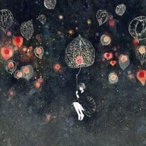

# 世界在你手中

世界在你手里

你拂过的一瞬间 我就老去

有时也会猜想 你凝视的原因

惊异于你的转身 停留 与背影

是否每一个谜都需要谜底

是否有所思 必然有所迷失

他们曾经也有 梳理长发的心情

我们曾经也会 日光下 感到一些新鲜

好像很难去察觉 事物背后藏着的 躲着妖怪的迷宫

很难去理解 任何年轻的哭泣

相信

絮絮叨叨了几千年的 都是

一头不死的大象的画像

我们捡起一些墨水

就把时间涂得漂亮

转几个弯又走回的那种单纯

我们不断体会 重演 赋予新的意义

好像 今天一定是重要的日子

你去听

它就会哼起歌

作者介绍：杨松子，复旦大学学生。

（采编：鲸书；责编：王卜玄）

[ 【诗味薄】渴望](/archives/42455)——爱是闪电般的光，击中和照耀我，月亮是一团美丽的肉体。

[【诗味薄】九月的晴天](/archives/42469)——九月初秋，当光斑飞溅在我脸上，请允许我忘记雾霾。

[【诗味薄】便当](/archives/42512)——七八月的时候，找一张干净的纸，放在床边晒太阳。晒过之后，轻轻抖一抖，就能收集到好多金粉，那是太阳粉。记住，上午八点的太阳粉味道刚好。
