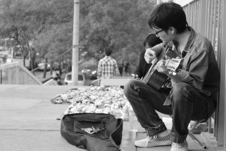

# 九月的晴天

清晨，阳光在雾霾中滑雪

飞溅起来的光斑落在我们脸上

人们站在大街上，举起他们的头

“啊，出太阳了！”

“多美的天空啊！”

他们的目光纯净得就像

从来没有见过雾霾

夜晚很快坠落下来

夜晚是另一种雾霾

紧紧裹住我们

像狗紧紧咬住陌生人的裤管

我们会驯服恶犬

我们会治愈伤口

面对雾霾

我们的回答永远是：

生活下去

作者介绍：远子，男，作家；已出版散文集《眼望着北方》和小说集《十七个远方》，作品风格忧郁苍凉，被读者戏称为“北漂伤痕文学”代表作者。

(采编：鲸书;责编：王卜玄)

[ 【诗味薄】世界在你手中](/archives/42381)——我会在哪个瞬间老去？世界在你手里，你的手拂过我。

[【诗味薄】便当](/archives/42512)——七八月的时候，找一张干净的纸，放在床边晒太阳。晒过之后，轻轻抖一抖，就能收集到好多金粉，那是太阳粉。记住，上午八点的太阳粉味道刚好。

[ 【诗味薄】渴望](/archives/42455)——爱是闪电般的光，击中和照耀我，月亮是一团美丽的肉体。
