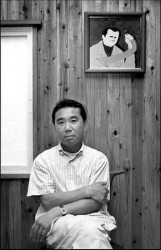

# 村上春树为啥获不了奖

听说春树又没获奖，就来马后炮下。上个世纪60年代，川端康成获得诺奖的当晚，听说三岛由纪夫在东京的黑夜里开了一整夜的车。两年后，三岛以其特有的方式自杀，随后两年，川端自杀。三岛和川端同时作为日本战后时代最富影响力的作家，两人不管是在个人关系还是在文学观念上都是密切的盟友，同是集大成于芥川龙之介、谷崎润一郎、太宰治以来日本物衰美学派的泰山北斗。

其实，三岛比川端更了解川端。不要忘记，虽然川端闻名日本之时，三岛还只是小毛孩，但是上个世纪六十年代三岛无疑是日本最有希望获得诺贝尔文学奖的第一号热门人物，三岛应该是最能代表日本精神世界的作家，他亦比川端在欧美世界更富影响。即使是今天村上春树纵横世界，三岛由纪夫却依旧是日本历史上最重要和在全球最富影响的日本作家，其两次诺贝尔文学奖提名为候选人。

他与普鲁斯特、乔伊斯和托马斯·曼并称为20世纪四大代表作家。三岛由纪夫天才般的复杂、深沉和敏感以及混沌着的黑夜、鲜血和死亡的诗性美学观念，在全球产生着旷日持久的巨大影响，川端康成评价他是世界性的伟大天才。川端的诺贝尔推荐信就是川端几乎是厚着脸皮乞求三岛写的。至今对川端评价最权威的著作就是出自三岛的笔下。

但是最后川端拿了诺奖。没办法，三岛的世界杀伤力太强，他把日本物衰和刚力美学已然发挥极致。而且他对时代来说，已经走的太远，当50年代第一版《假面自白》发表，即刻轰动日本文坛，川端康成评价三岛有着足以让人昏厥的天才，此时的三岛以其极富思辨力的文学笔触第一次向世人展现关于他“悲剧性之物”的猝然疯狂和寂然衰微的深层世界。《假面自白》的三岛已经前瞻性抓住了日后席卷欧美和全球的后现代和解构主义文学思潮的核心。

要知道，同时代的欧洲文学还在萨特的统治之下，距离列维斯特劳斯、巴特、拉康、福柯等结构主义一代大牛们登场的时刻还有10年左右的时间，后现代鼻祖德勒兹还在黑暗中摸索，解构主义之父德里达还在被巴黎高师的入学考试折磨的生不如死，他最终考了3次，并且还在寻思着要不要作足球明星。布朗肖、科罗索夫斯基、艾柯等最先一代后现代代表作家远未成名，但诺奖大佬们对这帮人历来不大感冒。要不是因为作为日本人的三岛在日本和欧美声名太盛，作品特色浓烈，意蕴深沉震撼，无论如何，他不会引起诺奖评委大佬们的注意。

但川端康成比这位晚辈而言，更显得稍逊温吞和柔和，川端的阴暗更多被包裹在传统日本文学形式特有的细腻和绚烂之中。而且在全世界都跟着红色中国颠覆世界的68时代，将诺奖颁给川端，也可以说是意味悠长。

川端获奖意味着以他代表的传统日本物衰美学派已无再获诺奖的青睐之可能，因此像谷川俊太郎这样伟大的日本诗人，也鲜有机会。到1994年，大江健三郎以其在时代的广度上内在的展现出战后日本尴尬、彷徨、撕裂和痛苦的时代精神；在深度上，他又对萨特、加谬、艾略特的文学观点作出了日本式的延续，无疑他区别于传统日本物衰文学，具有创新之代表意义。

再到今天，虽然村上春树在欧美颇具盛名，但村上文学却内在缺乏取得诺奖的条件。虽然他的世界在空间广度上始终映照关怀着当代日本的文化精神，但在文学观念的深度上，村上只是以他孤独美学世界的方式，翻新了物衰美学，但内核两者其实无二。虽然他在与西方的文学联系上，深受美国文学的影响，但他缺乏与传统欧洲文学世界之间更深沉的维系。而且诺贝尔文学奖对美国文学也并没有过剩的热情。

相比村上，石黑一雄与欧美世界的接近无非更密切，他带着日本作家特有的细腻绚丽的笔触，以贯横东西文化世界的广阔视野，进行英语文学写作。石黑一雄是当代日本和国际文学界真正公认的一流文学家。

看过安迪沃霍尔那幅坂本龙一肖像作品的人估计都能试想到龙一曾经在欧美世界的巨大影响。同样是作为在国际领域极富影响的日本艺术家，龙一前些年为村上电影托尼瀑谷配乐，虽然龙一比村上还要小四岁，但龙一在70年代就已享誉全球。他当年与细野晴臣和高桥幸宏组成的先锋电子乐团取得国际轰动，引领一代合成器音乐潮流，堪称世界典范。在国际上当龙一与贝托鲁齐、安迪沃霍尔、小肥人一起泡吧的时候，村上估计还在学调酒。但坂本龙一的光辉早已褪却，或许龙一近年来音乐中越发深重的暮气倒是与村上相配，或许这又暗示了什么？

ps：三岛著作是容易误读的，检验你是否真的能读懂三岛的标准是，你是否真的能读懂祈克果，读懂他的标准，是读懂海德格尔，但海德格尔也容易被误读，所以切实检验你读懂的标准是你能读懂胡塞尔和德里达。我写这篇文章不是为了贬春树扬三岛，他们其实根本不算什么。要进入真正有现量的深远境界，你就必须现证大中观论和古典中国先贤的修身境界。

编者注：“物衰”，也译为“物哀”。

（采编：刘迎，谢逸云；责编：刘迎）

作者链接：

http://www.renren.com/244081841/profile?portal=homeFootprint&ref=home_footprint

[【诺奖之思】今夜无眠](/archives/43094)——学生时代究竟应该把主要精力放在哪里？怎样才能不辜负我们所拥有的这一切？在一个不眠之夜，作者写下这份答案——抛弃浮躁，踏踏实实，扛起肩上那份责任，无悔地做自己。

[【诺奖之思】后来得了诺贝尔奖，好玩不？](/archives/43012)——2013年的诺贝尔物理学奖里，有“我”数年辛苦换来的一份功劳，其间的苦与叹，如今化成了笑与泪。真的，如果你热爱科研，那就去做，去为人类的知识留下一个印记。

[ 【诺奖之思】谈谈Higgs，谈谈诺贝尔奖，谈谈读博士的自己](/archives/43537)——“天哪，你是学核物理的，学了它……有什么用呢？”“哦，They just make sense to me.”
