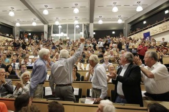

# 今夜无眠

最近事情真的很多很多，但刚刚收到了一条微信，顿时我停下了手里所有的活，我知道如果我想不清楚就真的什么也不可能做下去了，今夜注定无眠。

晚上收到了一位基层镇书记的微信，他问我：“你们寒假调研信访有什么成果吗？”他说基层信访问题困扰着他们，工作开展太难了。看完这条微信，我什么也回复不了，因为在调研之后我们没有再继续做这个。是的，我们在那里麻烦了基层干部提供了资料，耽误了他们的时间跟我们访谈，他们很认真的觉得我们的知识和能力可以为他们提供帮助，可是最后我们只是辜负了他们而已。辜负别人是我这辈子最痛恨的感觉，在别人对你有期望，别人觉得你有知识，别人觉得你有这个能力的时候，其实我只是光环下的一个虚壳而已。这个现实像针一样扎着我的全身，回头想了想这过去的多少年的学生生活，我只是个渣。这个事实再难以接受，我也得接受。作为学生，有多久没有真正的去做好作为学生该做的本分之事了。

当时的寒假调研对我来说是任务，是拿学分，是增添简历内容，甚至只是想去玩。我从来没有想过去实践对当地意味着什么，基层干部眼里的实践是什么。这条微信才让我知道他们是有期望，有期待，有信任。社会上更不知道有多少人对于我这些受最高教育的，享受最好的教育资源的学生们有多深厚的期待。顶着这样的期待，而低头看看我自己的生活，我过的是怎样的生活？

研究生的一年生活，本科的四年生活，充斥在我脑海最多的词汇是上课、写作业、考试、做活动，做社会实践，做社会工作，但每一项都像是在完成任务一样，每一项都是带着抱怨带着不满带着不情不愿地去做。每天想着就是怎样可以偷偷懒，怎样可以最快最方便的写一篇课程论文。我有真的去学过东西吗？学东西也都是为了混混考试，考试混混好了也就是为了成绩好看，成绩好看了经历丰富了也就是为了找个所谓的“好工作”。

我从从来来没有真正的意识到过我读本科、读研究生、学这么多年的习到底是在为什么。我知道的是我眼里有的就是自己那几门课，那几份作业，那几次考试，那几次面试，我不知道的是在社会多少人的眼里，他们坚定地认为我们这些象牙塔里的学生是饱肚诗书、是知识过硬、是能为社会真正做贡献的。我竟然还就这样心安理地享受着国家的各种优待，享受着有补贴的物美价廉的食堂，享受着一年750元住五道口十万一平米的宿舍，却过着还不如猪的生活。更可悲的是做学生这么多年，我却从来没有意识到这一点，我却从来没觉得我的生活有什么不对，我却从来还自以为自己很厉害。

我一直觉得踏踏实实地多看几本政治学原著，多看一些思想史，多看一些好文献没有什么用，我觉得这些时间还不如拿来去考个托福，去考个GRE，去考个银行从业，去考个CPA，去看看招聘网站，去投投简历，这才是对自己未来直接有用的。现在才意识到，自己以为精明地在考证，在实习，在为未来规划，其实都只是眼光太狭隘。

我一直觉得做研究是没什么用的，我一直觉得这是太空的东西。而现在我才知道其实研究根本不空洞，研究也真的可以对基层管理有贡献。空洞的只是我的大脑，空洞的是我的阅读量，空洞的是我狭隘的眼界，空洞的是我短浅的目光，是我辜负了“研究”这两个字。我的眼界里有的只是我要尽快开题，我要两年毕业，我不要读博因为时间太长。我不知道从什么时候开始的，也许一直都是的，很难很难再踏踏实实的看看书、学学习、做做研究、写写东西，目光总是放在校园以外，去寻找有没有什么好的实习，有什么公司福利待遇好，有什么公司能够解决户口，有什么求职经验，又有什么可以增加简历的分量。自己手头该做的事情，作为学生最该尽的责任和义务一件都没有合格地完成过。对不起，我只能汗颜。

自己写的所谓的论文，自己做的所谓的研究，题目听起来那么高端大气上档次，但其实都只是渣，渣，渣。又有哪一次做研究是真的真的想搞清楚这个问题，又有哪一次写东西是踏踏实实的把来龙去脉搞搞清楚，又有哪一次写出来的东西是有那么一点点一点点一点点的价值。每一次都是在搜搜各种其实也掉渣的文献，然后再拼拼凑凑，再靠自己所谓的三寸不烂之舌讲它个天花乱坠。这样混混日子的生活在象牙塔里的我，能拿什么脸去面对校园外对我作为“学生”的各种期望？我只能说对不起。

记得有一次跟导师聊天，导师说他特别不同意学生去做实习，做学生的在学生时代就应该好好读书，踏踏实实地做一些东西，做一些研究，尤其是作为研究生。楚老师也不知道说了几次类似的话。我从来都觉得这是他们老一代的过时思想，我觉得是因为他们不知道就业现在有多难，实习对于找工作又多有帮助，我也觉得他们不同意自己的学生去实习是害了学生的未来。现在我才真的明白了姜还是老的辣。我只能看得到眼前想要的那么一点点，我只能看到做什么有利于未来的半年，我第一次这样深刻地知道自己的目光是有多狭隘。因为我从来没有想清楚这辈子想要什么，想要做什么，不断上学的目的就是找个所谓的好工作，有个所谓的好薪水，然后掉进人堆里，过一个自己现在以为是最好的选择而事实上却只是蝼蚁一样的未来。

我从来没有觉得承担社会责任，为社会做贡献是空话。但我是真的今天才明白什么是责任。我也第一次知道其实如果我能够认真做一些研究，深入的了解一些现实，我是能够做出来一些什么的，是能够对社会有那么一点点一点点一点的帮助的，而不是现在这样只能两眼发呆，而不是面对一条微信，写下的不是对于信访的看法和建议，反而是这样一大堆辜负和自责的话。

混混乱乱写了这么多，我脑子里有太多的东西，可是我又不知道怎么能够清楚的表达出来。辜负，是这个时候最合适我的两个字，我辜负了用在我身上的那么多的资源，辜负了多少人为我创造出来的条件，辜负了多少人对于“研究生”三个字的期望，辜负了应有的责任，辜负了“学生”两个字，辜负了“公共管理专业学生”这个称呼，这个专业的设立是想确确实实为社会做些什么的，为基层做些什么的，是想“明德为公”的，但一年的研究生生活，我又做了什么？真的是一点点一点点一点点一点点都没有。

其实最辜负的是自己，本来想做些什么却到头来每天忙忙碌碌又一事无成，真真的辜负了这无数的机缘巧合，它们在多小多小的概率下才能让我有成为“人”在世界上活一辈子的机会，而我享受着中国最好的教育资源，眼里却只有狭隘和短视，眼睁睁地看着自己掉进十几亿的人堆里。

当然我不是说人活着就一定要轰轰烈烈地干一番大事业，对社会有大影响。我想说的是作为“学生”应该做好本该做好的事情，做好一个学生分内的事情，做好属于自己该做的事，踏踏实实的对待每一份作业，踏踏实实的写好每一篇论文，踏踏实实的读完该读的书，踏踏实实的完成每一次实践和调研，踏踏实实地尽最大的努力做好眼前该做的事，而不是抱着什么“deadline是第一生产力”的口号，心猿意马地消磨掉校园里的时光。而那些校园外的种种是学有余力的选择，而绝不是像现在一样成为了“学生”的主业。

今夜无眠，有的只是想给自己几个嘴巴子。

最后插上今年物理学诺奖得主在宣布“上帝粒子”存在的证据时候的照片，有几个人能像他们一样，在白发苍苍的年纪，问心无愧的说一句：我对得起活这一辈子。

（采编：刘迎，房帅帅；责编：刘迎）

 [【诺奖之思】后来得了诺贝尔奖，好玩不？](/archives/43012)——2013年的诺贝尔物理学奖里，有“我”数年辛苦换来的一份功劳，其间的苦与叹，如今化成了笑与泪。真的，如果你热爱科研，那就去做，去为人类的知识留下一个印记。 

[【诺奖之思·外一则】村上春树为啥获不了奖](/archives/43120)——村上春树再一次与诺贝尔文学奖失之交臂，惋惜哀叹的同时，总不可避免的想要探寻个中缘由，让我们循着作者独特的分析视角一起思考。

[ 【诺奖之思】谈谈Higgs，谈谈诺贝尔奖，谈谈读博士的自己](/archives/43537)——“天哪，你是学核物理的，学了它……有什么用呢？”“哦，They just make sense to me.”
