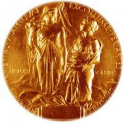

# 后来得了诺贝尔奖，好玩不？

这是我在粒子物理课上问我老板的一个幼稚问题。那天我老板在课上说到她们组1974年的一个发现。她说，发现的过程很好玩，后来发现居然是和丁肇中一起分这个奖，觉得也就那样吧。

后来我又问，真的就那样么？老板说，研究的乐趣在研究本身，等哪天你的研究成果也得诺贝尔奖了，你就明白了。

同学们都笑了。

昨天，2013年诺贝尔物理学奖公布，授予Englert和Higgs，关于他们俩和其他四个老头在50年前的理论。这个理论在2012年被我们组和另外一个组的实验证实。

我们哪真知道在昨天，我们的这群笑了小伙伴们的研究成果真得了诺贝尔奖呢。我想说，感谢组委会。有一种爱因斯坦回顾毕业合影看到同学都是大牛的感动。

诺贝尔奖对我来说从来都是个遥远得梦想，因为我是个地道中国人，而在中国人民心中这个奖是很神圣的。这不，今年的生理奖颁奖之后，本校若干校友会中得一个硬是死乞白赖把得奖人扯上“科大女婿”来贴个金，网友评论，广东外语外贸大学女婿在1957年就得过诺贝尔奖了呢。

倒是我小时候总觉得这位广二外女婿是我老乡让我很光荣，特别是后来他娶了广二外女生那年回合肥看了一下他老家得房子路过我家门口，我妈妈和其他大妈作为老家街坊一起围观，纷纷讨论，这是那个做原子弹诺贝尔奖吧。

在此科普一下，杨振宁不是做原子弹的，各位阿姨。

说回诺贝尔奖。我总有一些伟大的理想，比如也像我老板一样在27岁的时候做出世界级研究成果然后给组里的研究成果弄来个奖什么的。我也有更多幼稚的问题，比如我就问我我老板，那我得怎么做才能像你那样呢。

老板呵呵笑了，说，好好干你也可以的，不着急，来，这本Higgs Hunter拿去好好看看，我们拿Higgs discovery当毕业课题好吧。

之后这本书在我战战兢兢看了一周之后被搁置一边，因为看不懂啊。我和老板说，这是不是说明我资质太低毕业无望了。

老板说，这很正常，这本书太理论了，其实不用都懂，也许Higgs的机制不是这样的呢。不要怕毕业，这才是你博士第一年，三年之后我们LHC开始对撞了，等两年数据差不多就够了。我们先来搞搞计算模型，这是你小朋友强项啊。

我觉得这个场景像极了小沙弥仰望着老禅师。

然后她补了一句，不要担心毕业，除非LHC烧了是吧。

四年后，在LHC的一年延迟后，它迎来了第一次粒子环绕，然后还没对撞就，烧了。

我找到老板说，这是不是说明毕业无望了。老板说，不怕不怕，我去再拉点funding。

你难道不觉得这个场景更像极了小沙弥仰望着老禅师吗。

那是一段很艰难的时候。2008年正好是华尔街崩盘，各方经济都很受影响，外加奥巴马主任刚上台，能源部科研经费走向其实不是很乐观，很多组都在可预见的未来预见不到funding。倒是我老板用了各方神通，我们组还算活的不错，至少我在CERN能有钱租个车开，别的组的孩子都得风雪天走路回家。

不过我后来还是做了除了Higgs diphoton之外的一个题目来毕业。因为那是我老板、其他几位教授和我想出来的一个很新奇的关于寻找一种也可以衰变成双光子的超对称模型的想法，从没有别人想到过。老板很是支持这个想法，找来一切能帮我的资源，我也用了她的面子招揽来好几位教授一起来实现我们的想法。

2010年的时候，Higgs search算是慢慢用对撞的数据正式起来。搞起来之后发现了百倍于当时模拟数据所能估计到的困难，广是估计的QCD photon背景的cross section就几乎让人吓倒了。老板说，还好，还是可以做的，多努力，幸好咱还有别的题目，还好当时没把毕业的赌注都压在Higgs上吧。

10年下半年我和老板说，我都快博士第七年了，现在靠Higgs discovery来毕业可能比较困难吧。老板说，我们那个独立的想法也很好，拿来毕业也是足够份量的，不过Higgs search我们还是得继续做。我还是坚持相信Higgs是存在的，她说。

其实我也相信，特别是我们Higgs diphoton search。我相信的理由是基于它是对现代计算能力的挑战。我们用了很多机器学习和大数据的计算模型和方法来分离背景和信号。

我们的独立想法在以实验组的名义发表之后收到一些报告邀请，反响很好，让我曾经一度忘记Higgs的重要性，期间还遇到了我们实验要寻找的那个模型的提出者，也是一位当上professor不久年轻理论学家，他看到我们的结果很感动。我也在以此为毕业论文题目使劲增加论文页数。老板让我去给大家介绍，从形势越来越不好的funding里抽出机票钱让我到处飞。她说，和大家多见面有助于以后找postdoc，以她的面子，至少能帮我找两轮很好的postdoc，以后当了professor就得看自己造化了。

生活总是有很多困难，比如2011年我花了毕业之前的半年找postdoc位置，毫无音讯。之后的半年老板发了我半年postdoc工资支持我继续找，几个面试之后还是没有消息。2011年到12年，全美各个高校的funding砍的更加严重，没有什么postdoc留给我们刚毕业的新PhD。

可是Higgs search必须继续做。Higgs组的事务越来越复杂和频繁，周一早上七点起床开会三四个小时是常事。之后还要提交测试新的分析代码，写论文。用单机计算时间来说，那段时间我几乎用掉一千多年的CPU计算时间。

“一千年以后，世界早已没有我。“

之后还是没找到postdoc工作。

再后来，老板偶然遗憾的提到过，最后写论文的一年因为funding的事没有让我常驻CERN，浪费了很多争取postdoc职位的机会。我和她说，没找到postdoc的原因应该不是这个，也许我做的还不够好，也许运气也没那么好。也许现在学术道路真没有那么好走吧。

后来我和老板说，我找个工业界工作吧，我手上的技能在工业界还是能混个不错的职位的。既然学术的梦想没有那么顺利完成，换一个梦想也是不错的。

2012年7月4日，CERN的新闻发布会上，我们CMS实验组和ATLAS实验组一同宣布发现了Higgs boson，我们diphoton组的结果是两个重要的发现通道之一。那天网络直播上，Higgs老人家老泪纵横。那篇有我名字的文章在截至到发稿之日已达到1687次引用（http://inspirehep.net/search?p=find+eprint+1207.7235 ），单篇文章一年内超过1000次引用，各位追求发篇SCI能毕业的博士们羡慕不？

那天我正在炎热的天气里躲在空调下修改简历并准备即将到来的若干华尔街死矿工面试。之后面的一家的开发组经理是原来做ATLAS的前物理学家，他问了我关于Higgs发现的一些细节，似乎眼里闪现了一些泪花。华尔街上之后一家都没去那是后话了。

后来的后来，我来了硅谷的一家公司做数据，就是那种“不知道为什么，一听说我是做机器学习的，台上24盏灯就一下都灭了”的做数据的。

最后请老板和其他同组同事吃了顿饭，我请了客吃个大龙虾。这不算违反学校的廉洁规范，因为那时候我已经不算是本校雇员了。

吃饭后，我和老板有一些简单的谈话。

我半开玩笑的说，可能我看不到诺贝尔奖了。老板笑着说，你还年轻，肯定看得到的。我说，我还是觉得如果能得个诺贝尔奖还是挺高兴的。老板说，实现自己的梦想才是最高兴的，奖不奖的就那样吧。我说，不过我得去寻找个新的梦想了。老板说，那是什么呢？我说，我们已经给人类贡献了知识了，那我就努力让人类过的更好一些吧。

昨天看到Higgs等人获奖了，还是觉得获奖确实很好玩；也想到一路的困难，可能几位老人家远比我们后辈经历得多的多。可能我并没有像我老板那样年轻时候就一路各种重要发现地走过来，没有她老人家那样淡定的心情。不过，我倒是可以骄傲的和我的亲人朋友以及未来的子孙说，你看，我就是那个贡献了2013年诺贝尔物理学奖的。这是我给人类的知识留下的一个灰尘大小的贡献，接下来，我可以安心的去努力让人类过的更好一些了。

不过老板你在第一次世界级科学发现的年龄上领先了我三年，你那年27岁，你赢了。

在微博上我粉了一个帐号叫“PETD亚洲善待博士组织”，因为我觉得博士们很苦需要善待。看到转发的一些故事和最近同济博士的一些事情，会觉得有些哀伤。如果科研带给你快乐，那就去做，即使天大的困难也有可能被克服，为人类的知识留下一个印记，希望上面的故事给各位博士带来一些正面的激励作用；如果实际困难让你不得不放弃科研，换一个梦想也很好，不要为了一个梦想付出自己的生命。

在后一个梦想中看到前一个梦想实现了，挺好玩。

（采编：刘迎；责编：刘迎）

原文发表在[http://phunter.lofter.com/post/5e7bb_96d65b](http://phunter.lofter.com/post/5e7bb_96d65b)

[【诺奖之思】谈谈Higgs，谈谈诺贝尔奖，谈谈读博士的自己](/?p=43053)--前年一次聚会中，遇见一位知名人士，他说：“世界上有5%是精英，剩下的95%都是为了那5%的人而做衬托的。”想成为精英是好的，但是如此贬低其他人的价值，我并不认同。先不说他这5%是按什么标准来评价，毕竟能进入这个群体的是少数。当自己意识到有太多的事自己无法完成，太多人自己没有能力去比，那么如何在人群中寻找自己的价值与意义呢？

[【诺奖之思】今夜无眠](/archives/43094)——学生时代究竟应该把主要精力放在哪里？怎样才能不辜负我们所拥有的这一切？在一个不眠之夜，作者写下这份答案——抛弃浮躁，踏踏实实，扛起肩上那份责任，无悔地做自己。

[【诺奖之思·外一则】村上春树为啥获不了奖](/archives/43120)——村上春树再一次与诺贝尔文学奖失之交臂，惋惜哀叹的同时，总不可避免的想要探寻个中缘由，让我们循着作者独特的分析视角一起思考。
