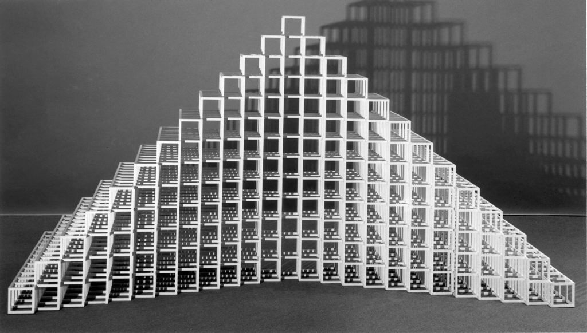

# 千年曲艺

当我终于见到K博士的时候，屋外的大雪已经下了整整五天了。我在一个书店里闲逛时碰到了一场小型的书展，展出的书籍大多是艰深宏伟的学术著作。我虽然兴趣不大，却也被一种奇妙的氛围催动着随手翻阅起来。这些著作涉及的领域我完全未曾涉及，只是某些关于表象和存在的段落会吸引我的目光，让我忍不住会遐思万千。正当我在烦恼着逐渐拥挤的读者因而打算离开时，一句印在某本书腰封上的话将我定住：所有混乱都不可解释，尽管它们存在的目的是为了指向唯一清晰的真相。嗡嗡的机器声在日光灯下把其余的一切景物抽滤干净，我被这如同经文般的语句拖向自己的旅程。

在出版社前台，当我说明来意之后，接待的小姐递给我一张写有K博士地址的纸条。我在谢过她的同时对她临别时的笑容感到一丝疑惑。博士住在另一个城市里，因此我登上了一列火车。天色将明，列车似在鱼腹中穿行，缓慢无风。我不善言辞，周围的人看来也没有与人交谈的兴致，只能讷讷地坐着。江水流动的声音隐隐传来，雾气似乎正在散去，泛白的城镇如同轻纸被稀疏的灯光划破，食物的气味充满了车厢，忽而是丛林中奔跑的群猴，整齐地掠过树丛。我从梦中醒转，眼前光芒大盛，白亮却感不到温暖。车厢里已经空无一人，干净得让人心悸。座椅整齐地排列着，猛然看去似乎毫无区别。耳边传来空洞的回声，咔嗒作响，仿佛来自记忆的穹顶，但又不那么真切。我不知道列车是否还在前行，丝毫感觉不到身体的晃动，但又出于恐惧不敢向窗外探头求证，就这么愣在原地，直到被人谈话的声音惊动。我回头看见几名乘客坐在位置上，双眼疲惫没有水光，说着陌生的方言，惊讶之下再转身向空旷的车厢望去，却发现已是满满的一车人，与我上车时的所见几乎毫无二致。铁轨的声音再次响起，列车再次回到粘稠寒冷的凌晨中，此刻的道路上空无一人，我这样想着。

黎明并没有将太阳推上天空，依然是阴冷的一天。零碎又庞然的声音们把一切都隔绝在外，我渐渐感到自己越来越飘忽，仿佛立刻要离开自己。列车停靠在站台上，人流卷起风潮，漫过不真切的眼前崭新又残旧的景物。我开始深深怀疑起自己此行的目的，恍惚如同一片树叶穿落水潭。k博士的地址看来非常偏远，我在街上询问多方均无答案，每个人的表情都很平静，他们不知道，似乎也并不在意我是个外乡人。这里的人们习惯沉默，我四处走动也未曾听到过诱人的乐曲或歌声。然而当我与他们目光相遇，他们那轻微摇曳漫射清光的眼神，在短暂的交会间总会令我有莫名地被洞见的感觉。

头顶的阴霾如同一方镇纸，压在泛黄卷边的城市上。有人向我指了一条路，“那边，也许没错。你从屋檐有羊毛笔标记的大屋拐过去，也许要走出城才行。”我遵从建议，走进被异常高耸的建筑拱卫的街巷里。这些房屋都是民居，门拱很高，并且都修建了高出街面的台阶。路上有些潮湿，虽然这个地方据说从来不下雨。我看到一座屋子门楣上挂着木刻的圆板，不甚精细的飞马；另一座屋子的檐角底下逆光处突出一个祈祷者的半身像；之后我又碰到了各种奇妙的装饰，类似皇冠的对称五角形，没有指针的钟表，平顶的方尖碑，角状的酒杯，精致的斧头，刻有文字的烟斗和样式独特的打字机等等。很有意思，我原本以为这些古老的建筑属于不同的家族，门拱上的徽记是类似旗帜一般的象征，可是越往深处走去我看到的徽记越来越有现代的气息。巷子里空无一人，我也找不到能供我了解一下这里的历史的搭话对象，只好闷着头不断往前走。

天色渐渐晦暗，转眼间黑夜降临。我早已看不到小巷的入口，路旁的建筑除了少数的窗口透出的微弱光线，还有门牌号在闪烁发光，宛如深海的磷虾。当我抬头望向那些窗户，才猛然发现我下午时看不太清楚的窗花原来是一幅幅玻璃彩画，色彩丰富，但是人物形象似乎并不真实，有些题材仿佛是宫廷中的谋杀，有些则是描绘劳动的场景，隐约之间我只能看个大概。不知道走了多久，天际的云层逐渐融化，月亮升起，显得孤独又冰凉。

k博士似乎对我的拜访早有预料，他穿着深蓝色的外套，站在一块突出的岩石上，正好在山路转弯的地方，不知道在眺望什么。他把我请进他的小屋，为我泡上了一杯热茶。长时间的沉默里我一直找不到话头，他也只是端着杯子在窗前静静站着向外看。窗外大雪纷扬，我估计我已经找不到下山的道路，而这并没有引起我的恐慌，相反地我似乎认为长久地呆在这里也不失为一个好主意。这些巨大得可怕的书架和狭窄的房间，把人簇拥其中的书和笔记，还有随手可及的旧报纸与杂志，让我感到仿佛置身风暴中心的安然角落。雪花拍打着窗户，风如同一位青面红手的邪神，推搡着小屋几近倾倒。我又是一阵恍惚，觉得k博士已经化作雕像，哪怕整个屋子被席卷而去也仍然岿然不动。他突然转过头来，对我说：跟我来。真正让我惊讶的是他说话时脸上的表情，混杂了刻意隐藏的欣喜和激动，却让我感觉到一种无法描绘的悲悯。我木然地站起身，随着他走出了小屋。扑面而来的大雪让我几乎睁不开眼睛。k博士低着头走在前面，我勉强才能跟上他的步伐。风雪弥漫之中我渐渐迷失方向，只觉得整个天地间再没有一处温暖的所在，连夏日的海滩在我脑中都显得只是一幅毫无真实感、取自外星风景的贴画而已。突然我听到有人在我身后呼唤我的名字，回头望去只隐约看到一个深蓝色的身影。我被风雪摧残得迟钝的心里慢慢涌起一阵惊惶，再向前看时k博士的背影已经无迹可寻。我转身向那个深蓝色的剪影跑去，仿佛溺水的人用尽力气却收效甚微，只能眼睁睁看着k博士像一面风筝迅速飘走。

山路忽然变得笔直又光滑，两旁的山峦在地面猛然升高的作用下向我的头顶合来。风雪依旧，我却能听到人群谈话的声音，还有自然世界里繁乱的各种声响。我还来不及疑惑，就看到即将化作穹顶的山峦在头顶的远处出现了清晰可辨的城市景观，我曾行走其中的那条小巷尤其显眼。尽管我身处眩目的白昼大雪中，那些街市依然夜幕笼罩，而门牌号发出的光芒益发强烈，成为我第一眼就注意到的事物。我还看到了来时的车站，列车像挂在云朵里的裙带，被高处的太阳照出红光。我耳中似乎万籁俱寂，双眼仰视万物又心中漠然。书本阖上了星光，尘土终将落下。

(采编：朱燚；责编：刘铮)