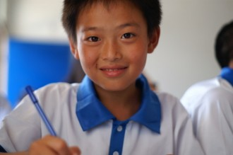
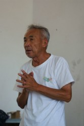

# 一次伪支教后的反思

7月9日，我们暑期社会实践小组在我的家乡——安徽省泾县孤峰王直助教中心完成了一天的支教活动。主要内容是进行了计算机方面入门知识的讲解及相关活动的开展。结合上一次在南京翠屏山小学的相似活动，对于农村留守儿童的教育现状我们有一些想法。

： 

1、城乡儿童性格差异很大

城市小孩大多白白胖胖干干净净，上课纪律很好，听课认真，参加活动积极性高，知识面广泛。但是性格方面戒心比较大。而相比之下，留守儿童黑瘦得多，在助教中心他们只能穿着统一的制服，很厚，不舒服，也不好看，纪律性较差，上课较为混乱，对新知识的兴趣远不如对数码产品高，信息闭塞，但是性格淳朴，会发自内心地喜欢你。

2、农村教育现状确实很差

王直助教中心自从创办募集捐款以来已有13年。如今主体建筑是一栋宿教一体的小楼，操场就是水泥地，有少量体育设施。宿舍闷热，山区蚊虫很多，让我们第一晚吃尽苦头难以入眠。相比同年人，比如我的弟弟整天呆在空调房看电视玩电脑，这里孩子的课余活动少得可怜。机房只有几台电脑，长期紧锁，会议室的钢琴贴着“谁都不准动”的纸条。小图书室每周日才开放。学生不许拥有任何数码设备，没有电视，几乎没有娱乐活动，也很难和外界交换信息。午休时间，一群男生对用电蚊拍打虫子十分热衷，这就算是娱乐了吧。每天九点睡觉，六点起床。孤峰每年能够考上泾县中学远程班的孩子只有个位数，而高考时远程班那些学生中只有一半左右能够考上一本学校，真正走出深山。

3、伪支教都是失败的

在我们之前还有一个美国YBB团队。我们翻看他们留在教室里的教学资料，发现其中大量的专业知识甚至超过了我们的英语水平。很难相信孩子们能够完全理解他们所教授的知识。据了解，助教中心每个假期将会接待超过300名大学生。相比参加夏令营的几十个孩子，这真是一个可笑的数字。每一组支教活动大约5到7天左右。单从我们自身的活动来说就很失败，听不懂是首要问题，农村孩子教育基础本来就比较薄弱，上课时听课的孩子寥寥无几，课后被孩子评价“催眠曲”让我们也很尴尬。作为计算机专业的学生，其实很多知识我们自己都不是完全理解，对这些几乎没有基础的孩子讲清楚计算机根本是不可能的事情。没有理由认为我们会比老师更会讲课。支教学生几天一换，讲什么不是由孩子定，今天讲讲这个，明天讲讲那个，孩子能学到什么？想象一下，即使是我们自己上这种前后没有衔接的课也不会愿意听的吧。

平心而论，每个去支教的人，决不能把自己想象成伟大的救世主。其实我们更像是学生，去学习怎么教孩子。从这点上来说，我认为我们是可耻的。我们的目的说白了不过是想给实践证明盖一个章而已，完成学院的任务，讲课只是一个形式。学计算机的讲计算机，学经济的讲经济，学什么讲什么......每个人都为自己成功运用了自己所学知识而骄傲，结果是孩子熬了一个暑假，听一堆乱七八糟什么都不会。我们究竟有没有真正为孩子们想过？本来这是孩子们的假期时间，学校给我们少放假我们还会不满到处吐槽，那这种封闭式的夏令营对他们来说是不是更是折磨？！为什么？

因为我们的傲慢，我们骨子里的傲慢。我们根本不是站在孩子们的角度，我们根本不知道孩子们真正需要的是什么。与其讲一堆根本没人听得懂的废话，不如和他们痛痛快快一起玩一天。因此最后王直校长在学生面前多次向我们表示感谢时，我内心非常愧疚。从言辞中可以听得出，王直老人非常在意孩子们的学习，他清楚地知道只有读书才能走出这茫茫大山。然而也许他也并不知道这些孩子需要的究竟是什么。其实次数多了，于他也可能只不过是一套相同的说辞。支教学生图完成活动，他图免费的老师和名气，双赢。苦的只是无辜的孩子，大暑假还必须被关在教室听着不懂的课。

前车之鉴，望后来者深思。

4、或许不一定的爱心绑架

活动过程中，一些支教背后的问题引起了我们的注意。首先是孩子们其实并没有想象中那么喜欢助教中心和他们口中的“王爷爷”。在他们看来“王爷爷”其实是一个很表里不一的人，而这里全封闭式的教育环境极大地限制了他们。确实，对于青少年来说，他们的自制力比较差，需要加强管理，然而这样监狱式的环境就一定合理么？

由于无人照顾，他们不得不来到这里，我们想不到的是，这样一个以爱心为主题的助教中心，孩子们还要承担不便宜的学费以及食宿费，一学期3800元左右，暑期夏令营还需要另外交纳1500元。最令人意外的是有孩子表示，如果不参加夏令营，那么他们就不能拿到对应资助人的资助金。如果这些资助金确实是以王直助教中心的名义统一争取来的，那么似我们也无法阻止。毕竟大家都知道在中国维持一个慈善机构的正常运作还需要不菲的费用。然而之后王直老人一句不经意的总结发言却值得我们玩味：“我们这个夏令营已经办了13届了，即使（他没有说），以后也不能不办下去。”如果真的是这样的目的，我实在是看不到这样的爱心感恩夏令营的意义所在。另外，7月8日我们第一批同学到达助教中心并住了一晚，对应每人收取了30元食宿费，第二天我和另一名同学赶到助教中心，参加完活动之后和孩子们一起吃了个午饭，校方立刻加收我们30元伙食费，这着实令我倍感诧异。两点钟我们离校时，正是最炎热的时候，口干舌燥的我们去校方财务负责人开的小店结算时取冰水喝，每人收了1元水费.......种种这些，让我们在这个随处可见“爱心，感恩，温暖”的校园不禁感到一丝凉意。

最后，还是想写一些人。

助教中心创始人王直老人已经八十多岁了，管理这些留守儿童是一件非常非常耗心费力的工作。印象中的王直老人始终是一副严肃，心事重重的模样。穿着朴素甚至略显破旧，和城市里的校长简直天壤之别。我们做不到的，他一个人做到了。再者说，80多岁的老人还有多少时间了呢？我相信即使那些都是真的，他这么做也不是为了钱，我们也应该尊敬他，作为一名老人，作为一名校长。

CC是一个很美丽的女孩子，CC的梦想是去海南和去美国。她喜欢坐在窗边写日记一样的文字，不肯示人，我们私下里都称呼她窗边的女孩。CC成绩很好，上课很认真。临走之前我又回到教室，远远发现只有她一个人还坐在窗边写作业。这样我才有机会和她聊起来。她的姐姐刚刚高中毕业，高考成绩不是很理想，由于家人转而对她的期望，她觉得自己的压力更大了。CC说起她的资助人写信给她，信中资助人女儿丰富多彩世界的她简直闻所未闻。听着不能不让人心酸，那些天天叫喊着“和谐公平社会”的人你们真的有发言权么？

才才是一个很鬼马让人很难忘记的女孩。一开始摸她的蘑菇头，她追着打我，之后她又对我说“伸手！”，我乖乖伸手，她居然替我编了一根细细的花绳。才才比较调皮，但是也很可爱，小小个子经常跑来跑去。中午就牵着我让我带着她到处去玩。下楼还故意撒娇说自己走不动路让我抱她回去。其实天真如她背后也有辛酸的家庭故事。只是她还小，还没有担起CC那般沉重的心理负担。临走前，才才很失落的牵着我的手问我什么时候会回来，看着她的小蘑菇头，我想我一定会回去，哪怕只是看看她。

右手腕紧紧缠绕的三色细线，总能让我回忆起那些天真可爱的孩子和那短暂的一天。他们或许确实并不富有，并不出众，但是他们是那么的纯真善良。我的相册里有另一组支教照片，那是八年前读初中的我被一群南京大学的大学生支教时拍的照片。对比着看，分外感慨。有些事情看着别人做和自己亲自做的差别是巨大的，过去我只是经历者，现在我也是参与者了。一天的支教经历带给我很多，让我们在成人世界的冰冷坚硬与淳朴童真的善良温暖之中艰难转身，一不小心撞到了头，一不小心闪到了腰。而究竟是我们帮助了他们，还是他们改变了我们？

（采编：刘迎；责编：佛冉）

[【路】五道口盘踞着名叫青春的怪物](/archives/40285)——五道口在不同人眼中，有着不同的意义。它是很难考的研究院，是各色人群的交流平台，是林立的酒吧，是嘈杂、或是孤寂。在作者眼中，五道口是一个庞大的怪物，吞噬着无数人的青春

[【路】一条路](/archives/40203)——"残疾老人八十岁，无儿无女"，寥寥数语，便道出了一位乞讨者的全部。他的一句“谢谢”，却久久萦绕在作者心头，成为羊坊店路上忘不掉的风景。
