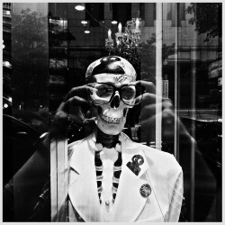

# 五道口盘踞着名叫青春的怪物

五道口盘踞着一只怪物，她就是五道口本身。她是黑色永夜中的灯光，是生锈的铁梯子和爵士乐，是小女孩看你的眼神，是她所吞噬的无数人的青春。

如果你常来五道口，你大概会提起那几家有名的酒吧，有老的也有新的。吵吵闹闹，人挨人人挤人，在闷热的，狭小的地下舞厅里跳舞，跳累了就上楼喝味道不对的酒，环境刚好够人们互相动手动脚，抱着不松手。我不喜欢那里，除了那里很吵很挤很黑很乱之外，我还看不起那里遍地都是的外国屌丝和喜欢免费送外国屌丝的、喜欢抽坤烟的中国妹子。我猜那些妹子也看不起我，因为我长得不像外国人。我们就像站在两个世界，互相看不起对方。

来的次数多了，你大概能说出来其他几家能够让你安静呆着的地方，有间咖啡馆兼职酒吧，老板最讨厌的就是人们点鸡尾酒，他在菜单上有一页写了一个“随便”——我猜他最喜欢客人指着这个跟他说，随便调吧，老子今天不爽/刚分手/吃得有点多。

那时你应该会明白破破烂烂的五道口宾馆和电影院的意义所在——电影院是唯一一处可以一个人消磨时光的地方，怀念过去的爱人，怀念逝去的梦想，或者你只是想一个人呆呆；而五道口宾馆，是所有城铁13号线以东的人在街上找不到厕所时的天堂。

究竟有多少人在第一次就找到了厕所怎么走呢？在那老旧的，活像迷宫一样的宾馆里，带有《寻羊冒险记》里的海豚宾馆的各种特征，面容奇怪的服务人员，破旧的地毯和昏暗的灯光和奇怪的楼层结构——啊我告诉你吧，厕所在二楼南边西拐的尽头处，南边是一家脏乱的，似乎从来就没有开张过的语言培训学校，就像是哈利波特的故事里通向魔法部的那家服装店。不要走北侧的那个门，那个门就直接出去了，你会看到暗巷中南边的粉丝店和北边黑暗的，居然一点灯光都没有的居民区。

对了，男生不要用中间那个小便池，每次都坏，左边那个从来都没有坏过。

北边是棒子们的街区和IT人士的地盘，中间尴尬地夹着万年酱油西郊宾馆，再往北就是东王庄小区和北京林业大学，那是另外一个故事了。

华联东边的路是世界上最荒凉的路，在这世界上最荒凉的路上居然有个新东方教学点，我还在这个前不着村后不着店的地方上过课。

13号线西边的华清嘉园估计是世界上地租最贵和最混乱的楼盘了。你能在这里找到知识分子，成功人士，中二少年，间谍，大妈和冷艳的长腿美女。也许你知道穿过荒凉车库和看着就让人心里打鼓的洗脚会所之后会找到一个仿佛不再在地球上的，摆满了原版日本漫画的小屋子，里面有一个和蔼可亲的妹子会告诉你在这家店里呆着需要的很贵的价钱；也许你知道这里有一间顶楼常有文艺少年的沙龙，充满了有理想的少年；不过我向你推荐另一个地方，那是一家桌游店，不过那是五道口地区唯一一个提供筹码的地方，可以算牌算得很准的大神们在这里神出鬼没，在里面可以尽情地打德州扑克，只可惜牌友印东大神不喜欢打。

“你究竟是谁？”

“我是那种力的一部分，

总是想作恶，

结果却总是行善。”

——《浮士德》

五道口的道路曲里拐弯，五道口的建筑复杂而变化无常。她俯卧在13号线的两端，化身为布尔加科夫的《大师和玛格丽特》中心如热火的魔后，主持的那场盛大的宴会中，宾客是那些历史上最著名的杀人犯、叛国者、荒淫无度的暴君、赌棍、刽子手、告密者、暗探、奸污幼女犯、伪币制造者、弑婴者。

整个建筑群本身，清华是天际线，13号线是脊梁，东升乡和东王庄是手和脚，华联是她的心脏。她疯狂地喊着：“我身无形！我身无形。”玛格丽特为了拯救被关入疯人院的大师魔鬼沃尔德，接受了魔鬼的条件，成了一名魔女。

在北京，除了五道口，你还能在哪里找到那些暗巷、哭泣、青春、学术、理想、爱情、背叛和女神？

我这两天在赶文件，我这两天睡觉不好，喜欢在深夜的五道口闲逛。

（采编：刘迎；责编：佛冉）

[【路】一次伪支教后的反思](/archives/40123)——在一天的“伪支教”后，作者反思到，城乡儿童的教育质量差距巨大，但短期支教的方式难以给他们带来改善，反而容易成为孩子们的负担及某些机构盈利的手段。

[【路】一条路](/archives/40203)——"残疾老人八十岁，无儿无女"，寥寥数语，便道出了一位乞讨者的全部。他的一句“谢谢”，却久久萦绕在作者心头，成为羊坊店路上忘不掉的风景。
