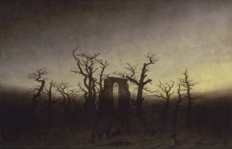
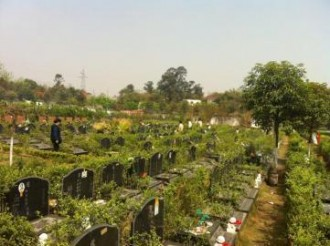

# 扫墓记

清明扫墓,在广州近郊的一座墓园里,一日之内祭拜了五座坟头,六位亲人。

记得小时候只是来这里拜祭我出生前就已经死掉的阿爷,后来上小学的时候是姥爷姥姥,念高中的时候是寄宿,和父亲那边的亲戚又几乎没来往,所以伯爷与大堂哥相继病故的消息我是大约一年多以后才知道的。再后来,去年,妈妈也葬在这里。

步入这种地方,几乎必然会想到死亡。死对每个人来说都是平等的吗?我不知道,我只知道墓园是分三六九等的。人活着的时候不平等,死了还是不一样。

阿爷死的时候,没有什么钱,当然现在也没有,当时葬在外租的墓区,为期二十五年,大约是几百块钱。父亲有五个兄弟姐妹,他是老三,去年租期届满,要续交三千多块钱,结果除了我爸谁都不愿意出。正如当年阿爷查出肺癌以后,说自己一辈子也没去过花园酒店的旋转餐厅喝早茶,那时候广州最好的五星级酒店,于是父亲攒了一个月的薪水,带阿爷和姑妈,阿爷最疼爱的大女儿,到旋转餐厅喝了一顿早茶。听阿嫲说,阿爷是在家里走的,因为没钱打止痛针,活活蹬着脚疼死的。

穷人活着不舒坦,死得痛苦,葬了我看还是挺难受。那爿墓区密密麻麻全是墓碑,低矮的,全是便宜的花岗岩或者麻石材质,墓位特别狭窄,站不下他的满堂儿孙。碑上的字因为涂的是普通红漆,每年都要自己带上一小罐油漆和毛笔来细细描红,旁的许多碑上的红漆早就剥落了,一派门庭荒芜。地上到处都是甘蔗渣子,各种垃圾。烧纸钱和各种物什的烟气格外浓郁,大约是葬在这里的穷人子女总不愿亲人在地下再受穷困之苦。

妈妈和父亲吵架吵了一辈子,大多是因为他的家庭。也难怪,她在广州最好的医院出生,一落地就享受高干子女待遇,发了什么一斤红豆一斤红糖各种物资好些。可惜姥爷故去得早,她才七岁,家道就开始败落,然而那份骄傲却伴随了她终生,大概也因为再没什么可骄傲的了。往常她对我一开口总是,你姥爷当年从日本留学回来,双学位,和李四光一个学校,你姥姥从东北女子大学毕业,张学良给她发的毕业证。所以她这一生恐怕都是不快乐的。

姥爷和姥姥葬的墓区背山面湖,初夏的时候就会逐渐开满荷花。墓碑是高大的黑色云石,铭文涂了一两千块钱的金漆,十二年来都没掉过颜色。姨妈带来大捧百合和玫瑰,很美,相形之下,阿爷墓前那些蔫蔫的小朵黄白色菊花俗气,不好看。可见美往往是要用钱砌起来的, 这之间的区别大约就是十几倍的价格。

这里大约算是墓园里的中产阶级区域吧,十几年前买下这墓位要五万块,去年为妈妈买了只隔几行的一个墓位,已经要两倍的价钱。墓行间疏落不少,有许多的花式墓碑。印象最深的有几个。有的人的墓碑上写满故事。

有一方墓很矮,四方的黑云石上有张大照片,一个中年男人撑着伞在微笑,背景像是江南镇子的小桥流水,下面写着四个大字:人在旅途,旁边是名字,生卒年月日,四十多岁。最早看见是在高中吧,心里很震惊,想着原来一个人可以这样处理自己的死亡,仿佛生死不过是旅途的接续,挥挥衣袖就继续上路了。

再走过几排有座墓碑造得很大,上面有个长发姑娘的面容,塑成一本摊开的书的模样。里面葬的是个姑娘,二十五岁,车祸身故,独女。墓碑上简略写了一生,聪明乖巧,华南理工大学毕业,在外企工作,照片里的她面容恬静,相当好看,正有着花一样的年纪和前程。下面有父母的赋诗,坦白说并不很高明,但读之令人心碎。生死的无常面前,爱的深挚与无力,都写在这里了。

还有一个中年女子的墓,大幅照片,卷发大耳环,风情万种,像八十年代的台湾女星。不到 四十岁,奇怪的是名字前没有任何称谓,立墓人写的是XXX,看名字是个男人。墓前未设香炉,只有花瓶,放了一大束的白玫瑰。若要细究,又是一段情缘吧。

到了给妈妈扫墓的时候,父亲那边的一大帮亲戚也顺便过来上香。按习俗我第一个上香,本来打定主意要忍住眼泪,实在很讨厌被一大群人看着自己掉泪的模样。但只是听见姨妈的抽噎声,眼泪一下子就涌了出来。上完香转身,发现姨妈,表哥和表姐都在流泪,父亲那边的亲戚在各自说笑。亲戚或余悲,他人亦已歌,大约就是这样吧。死去何所道,托体同山阿。死又有什么值得说的呢?为何还是这样的悲伤,明明不过必然之事。但想起我与她之间只有二十二年不到的缘分,心里总是痛悔和不甘。

常聊自安慰,妈妈和姥姥现在挨得这样近,若真有鬼魂的话,她们怕都是快乐的吧,只有我不快乐。妈妈去世后,我把她收在银行保险柜里姥姥的玉镯拿出来,和她的梅花牌手表一起放在一个锦盒里。有时候实在想得难受,就把玉镯和手表都套到手上,坐在地上嚎啕大哭。这两个在此世上最爱我的人,除了偶尔想想,痴儿般地痛哭一场,竟已别无他法。

之后是到骨灰楼,伯爷和堂哥紧挨着,各自一个格子,骨灰盒被密封在柜子里,只能在下面打开折叠桌,放一个香炉,上香拜祭。若要烧纸钱之类,则必须要用纸包密封好,拿到楼下的大香炉去烧,纸包外面还贴着引路条,写着他们的名字。我乍一看,觉得好像快递包裹,大概如果真有地下,他们就像去取淘宝快递一样吧。堂哥的儿子才四五岁,捧着比自己还大的纸包欢快地蹦跶下楼去烧了,一旁的堂嫂抹着眼泪,但终究也是前年已改嫁了的人了。再过一些年,不知道还会不会有人为他流泪。

我的阿嫲不识字,但精通各种神鬼习俗,今年八十有三,满头乌发,精神好得出奇。她很喜欢讲述死亡,谈到我的伯爷,她的二儿子弥留的时候,她说,突然他就说要喝汽水,我让他 们去买,他们刚转身准备出去,他脖子上的肿瘤就爆开来,血几乎冲到天花板那么高,才几 秒钟,他们再转过身来,就已经断气了。他们都没看到他死,只有我看到,太惨了,全身都是血,给多少钱护工也不愿意给他擦身,还不是我拿条毛巾给他慢慢擦。他们问我怎么不怕, 我说,我生的,怕什么。

阿嫲给我讲这些的时候我很震惊。因为她根本一点悲伤也没有,平静得令人惊异。生死由命嘛,也是没办法的咯,她这么总结道。有时我觉得其实没文化的阿嫲在这方面是多少有点大智慧的意味的。勘破生死大概也不外如是而已。

至于我的堂哥,直到十几岁我才第一次见他,此前听说他因为贩毒下狱十年。妈妈一直不准我和他多说话。还记得他从前有个染着黄头发的女朋友,化浓妆,讲普通话,阿嫲一直很讨厌,后来他终于还是娶了个本地乡下的女孩子,有点胖,没有之前的外省女朋友好看,但看着老实,阿嫲很喜欢。也生了个白胖儿子,本分地打点散工,然后忽然就得了胰腺癌,只半年就去了,三十五岁。

有次听姑妈绘声绘色地讲起堂哥的死。那是下午,他突然想吃杨梅,没买到,买了些枇杷,他说不甜,后来晚些把他一岁的儿子抱来让他见了,他似乎还认得人,一直叫唤着,他妈离婚十几年,头一遭从美国飞回来,掐着他手哭得没了声音,我看他眼白都是浊黄的了,医生说早该不行了,硬是熬了好几日,后来他开始猛烈挣扎,可能是不甘心,到后半夜才去了。最后,姑妈补充道,幸好去得快,并没治许多钱。 

我听得心里一沉,想起从前听说他十岁那年父母离婚,他妈带了他妹妹去美国,这一别就是 十几年没再回来。后来妹妹在美国读大学,而他父亲,也就是我的大伯另外娶妻生子,他兀自在街头晃荡最后把自己晃进了监狱。很多时候,当人下定决心想要重新选择自己的生活时, 已经没有机会了。

也许因为对死的态度不同,我始终觉得与父亲一家包括他本人很隔阂。就像我写妈妈,写父亲,这当中是有区别的。对我来说,死是悲伤的永诀,像一扇撞不开的门。但我与姥姥和妈妈之间隔的距离,虽是生死,大约还没有我和他们之间的那样远。

离开墓园时,雨仍是细碎地下,和来时一样。这雨和生死一般,也是不以人的意志为转移的。 既已如此,对死抱以什么态度又有什么差别呢。只是,在这个我们都将要死去的世界里,如果还没有爱的话,那该有多无趣。

(采编：张山骁；责编：王卜玄)

[【身后事】肉香](/archives/39962)——爷仨被烟呛的眯着眼，使劲盯着罐子，不住的抽动鼻子，咽着口水，等着肉炖熟，炖烂，好在门窗都关的严严的，这满屋的香气，都是他爷仨的，都是他一家人的，谁也抢不走，谁也抢不到。 [【身后事】当我谈起自杀的时候，我在说什么](/archives/39930)——那是个春天，四月，阳光明媚，草长莺飞。我在院子里，躺在刚刚去世的爷爷的藤椅上。我眯着眼睛望着天空上缓缓移动着的白云，心想，今天真是一个适合自杀的好天气。 [【身后事】死亡的隐退](/archives/40034)——就像电灯的发明驱逐了黑夜，使现代城市变成了不夜之城，医学和仪式的变迁也驱逐了死亡，使大城市恍若变成不死之城。
