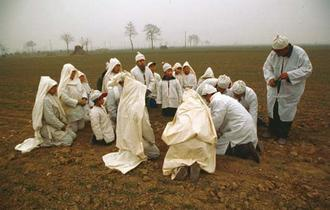

# 死亡的隐退

我第一次见到外婆是在她的葬礼上。那年我十岁，和母亲一路疲惫地赶到上海，在东安新村的那个小房间里，看到一切平静如常。追悼会上人们也很克制，致词和默哀之后，两桌亲友在饭店里聚餐了一下，这事就算是结束了。

对我而言，这是十足的文化震撼。我自小在乡下经历的葬礼绝不是这样的。按崇明风俗，人死之后要“搁三朝”（停尸三日），有时为了便于外地亲友赶回或猝死不及准备后事，还须“搁五朝”。在这三五日内，尸体就躺在铺以稻草的门板或床板上，搁在堂屋中，身边必须随时有亲人陪着，半夜也不例外，谓之“看死人”（“看”字阴平），因为旧俗怕死尸亡魂夜间逃走。丧家还须四处报丧、服孝、立幡竿、搭凉棚、挂帷帐、扎纸轿纸马，更不必说筹办白席、向邻居借用桌椅碗筷，此外得聘请丧乐队，三五天里不断地吹吹打打，直至出殡下葬；而尤为重要的，是女性亲属日间要跪在灵前哭唱死者的生平。

这并不仅是丧家私下的纪念，而是社区里最重要的公众仪式之一。从记事起的十多年里，我几乎每年总要亲历几次这样的葬礼。除了父母双方盘根错节的亲戚谱系（不少远亲死者我根本不认识，以至于葬礼有时成了亲友聚会的几乎惟一场合）外，还有邻居，因为乡下的葬礼连办三天，有时每顿操办二三十桌，没有哪户人家会常备那么多桌椅碗筷，因此往往一人身死，全村的桌椅碗筷都被借去，邻人也会送白礼（“邻舍人情”）并上门帮着操持白席。更有些时候，母亲还会带着我去邻村去看别人家的葬礼——虽然有时连她都未必认识死者，但在寂静的乡下，高亢凄清的哀乐一起，几乎五六里地内都会知道哪里出事了。男人们或许端坐不动，女人们则常常拉着孩子，去丧家“看死人”（此处“看”读上声）——实际上倒不是为了看穿戴好寿衣的死者，而往往是为了在烟熏缭绕的堂屋里看丧家的女辈是怎么哭死者的。

崇明的《哭丧经》现在据说也算是非物质文化遗产了，但对于少年时的我来说，那更像是某种清唱的曲调，丧家 的女辈按一定的调子将死者的生平哭着唱出来，有时竟长达两三个小时。尽管人人皆知最会哭唱的未必是最孝顺的女儿媳妇，但能将死者平淡而凄苦的一生哭唱得婉转动人的，还是能让贴着墙在外围观看的邻人无不潸然泪下。许多来观看的邻居或亲友，还会对丧家女辈“会不会哭”、酒水如何、办的礼节是否到位，私下评议良久。事实上，人们就是在这一个又一个既是私事又是公众仪式的葬礼上学会如何做人、如何遵循风俗礼仪、乃至如何哭唱的——因为《哭丧经》这类虽然也需要技巧，但显然不可能事先反复练习，也不会没事唱着玩，女人们之所以到亲人辞世时能自然而然唱出来，是因为她们早已目睹了无数次类似的场景。

在这个迅速变迁的年代，葬礼是乡下抵制变迁最顽强的一种礼俗。相比起已极大地“现代化”了的婚礼，葬礼的变化要微弱得多。当然，年轻一代的女性越来越不会哭丧了（她们现在大多只会啜泣或号啕大哭，在老辈看来是“弗会哭”），有些丧家也开始在镇上酒店宴请，而不再是自己操办了，甚至冥币也出现了新内容（诸如“地府银行信用卡”和“冥府机动车驾驶证”），但最重要的还是火化后不再捧回家里供在堂屋或埋入村里地头，而是在殡仪馆举办追悼会后直接埋入公墓。这使得人们不再像我小时候一样，有时还会在田间的土墩上看到露出地面的骨殖瓮或墓牌，或在家族的堂屋里看到列在两边的祖先照片。

在城市社会，一如我二十多年前所初次感受到的那样，“死亡”的仪式大不一样。事实上，你能隐约地感受到“死亡”在现代社会中逐渐隐退。不仅医药技术的发展提高了预期寿命，更值得注意的是：现代城市人的视野里已很少会有“死亡”出现。和我幼年时在乡下不时会观看或参与葬礼不同，在现在的城市社会，大部分人多年也难得参加一次。这不只是因为人的亲属网络崩解萎缩了（因而远亲的葬礼你恐怕不用参加了，少子化又使得远亲数目本身也减少了），还因为“死亡”本身已被逐渐隐蔽起来了。

除了自杀或交通事故这类戏剧性的非正常死亡，城市里的绝大部分死亡都发生医院的密闭空间里，死后通常也毫无例外地包裹好推进太平间，之后悄悄送往殡仪馆，火化后遗体就此消失。死亡已成为工业化的流水线作业。像乡下那样在厅堂里“搁三朝”，在城市环境下是不可想像的——试想如果有人将亲人遗体放在自家公寓客厅里三天供人凭吊，即便自己不觉得恐怖，邻居们也会疑惑这家人是不是有问题。在城市环境下，死亡已从多数公众视线中消失。我在一个小区居住了十一年，迄今为止从未见过小区里有人死亡或哪家办葬礼的情形，不像婚礼还会容易关注到。一位从小在湘西小城长大的朋友曾回忆，他小时住父亲单位宿舍，那时邻居就是同事，有葬礼常常是单位操办，停尸在单位礼堂，但这些年也渐渐改变，现在葬礼渐渐很少在单位举行了，倒是婚礼还常有。如今，在各地城市老的公房新村或许还有丧葬，新的小区大约也因住户较年轻，更加看不到死亡；在城市里邻居之间常常都不相识，更不必说参加他们的葬礼了。死亡和葬礼，在这里逐渐隐退，变成仅仅与死者最亲近人群相关的私密事件。

正如我当年在外婆葬礼上所感受的，令人震惊的一点是：丧家的居处在外表看上去平静如常。以往或许还有白花和丧联，但如今许多人家这一外表迹象也没有，从外面根本无法得知这户人家所发生的不幸。这与乡下竖幡竿、丧乐队、以及丧家披麻戴孝一路爱哭那种远远就能感受到的气氛截然不同。多年前在陕西宜川县城，我还曾见到一次盛大的出殡，然而这样的场面，在大城市里基本也是见不到的。如果说在乡下和小城镇，死亡和葬礼仍是一种所有人都能围观的公众仪式和景观，甚至有时类似于一种节日气氛，那么在大城市里它已只与死者最密切的亲友有关，变成一种私密的悼念，只有偶一得见的国葬这种特殊的葬礼才具备公众仪式的特点。此外，在乡下的土话中，“死”是经常出现的词汇，骂词中尤为常见，而在都市中，连与死亡相关的词汇也渐渐退出了人们的常用词行列。

我们就这样见证了一个互逆的过程：在现代化的变迁中，原本开放的（垃圾、阴沟、不文明举止、妓院）被遮蔽，而原本遮蔽的（房屋、内闱、缠足、欲望）则获得了解放。死亡只不过是其中一端。现代的城市空间是生者的空间，无论城市规划还是建筑设计，都没有为死者留出与生者密切接触的空间——和村寨不同，你不会在城市小区外围的树下看到一排排墓碑，就像黔东南许多地方的人，据说搬入城里公寓后，也无处安置“天地君亲师”或“历代宗亲”之位，人们最多只是把死者的照片搁在某个墙角，正如公墓陵园也都在城市边缘之外，好使生者与死者在空间上隔开，彼此不相打扰。相比起以往，现代城市空间和房屋，都强调明亮和开放，宛如窗明几净而透光的医院，在设计上就未曾给死者留出空间。在这样的环境中，感受不到与死者之间存在的连续性，是再正常不过的事。

就像电灯的发明驱逐了黑夜，使现代城市变成了不夜之城，医学和仪式的变迁也驱逐了死亡，使大城市恍若变成不死之城。在这里你只看到人来人往而看不到死亡，人们已将死亡隐蔽化、私密化，乃至私有化了——它只属于越来越少的一群人。死亡、悲痛和伤痕，确实越来越少被公开展示，但它们并不是真正没有了，只是不那么容易见到了。就像每一座车水马龙的都市，都掩藏着无数伤痕。

（采编：张山骁；责编：王卜玄；）

[【身后事】扫墓记](/archives/40007)——步入这种地方,几乎必然会想到死亡。死对每个人来说都是平等的吗?我不知道,我只知道墓园是分三六九等的。人活着的时候不平等,死了还是不一样。

[【身后事】当我谈起自杀的时候，我在说什么](/archives/39930)——那是个春天，四月，阳光明媚，草长莺飞。我在院子里，躺在刚刚去世的爷爷的藤椅上。我眯着眼睛望着天空上缓缓移动着的白云，心想，今天真是一个适合自杀的好天气。

[【身后事】肉香](/archives/39962)——爷仨被烟呛的眯着眼，使劲盯着罐子，不住的抽动鼻子，咽着口水，等着肉炖熟，炖烂，好在门窗都关的严严的，这满屋的香气，都是他爷仨的，都是他一家人的，谁也抢不走，谁也抢不到。
